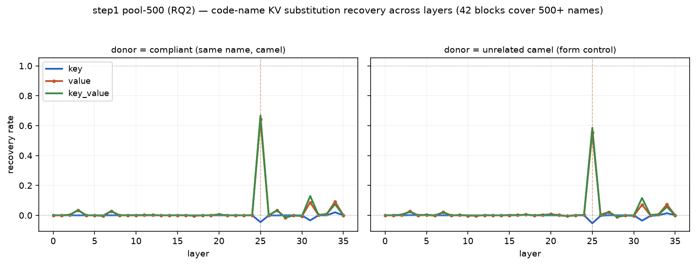
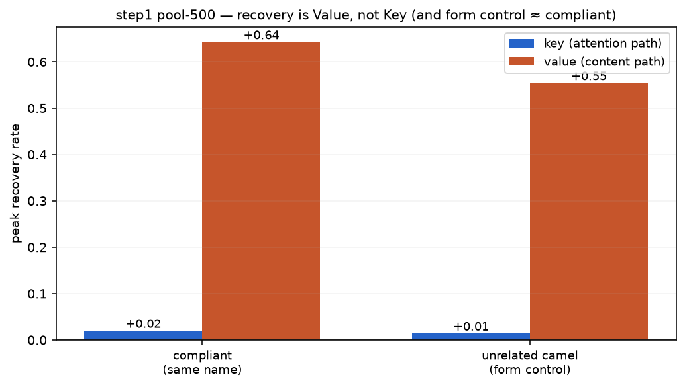
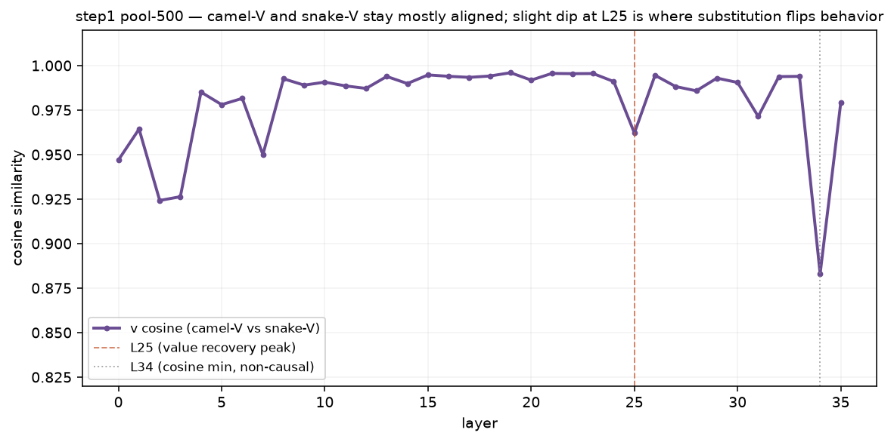

# step 1 결과 — pool-500 (RQ2: 코드 신호는 Value·L25, 형태 통제도 재현)

**대응:** RQ2 (층 스윕 + K/V 분해). **설계:** `docs/step1/scaleup-500.md`. **파일럿:** `docs/step1/results.md`.
**원자료(불변, §6):** `results/step1_scaleup500_results/` (126개 json).
**모델:** Qwen2.5-Coder-3B-Instruct (36층). **커버리지:** 42블록 × seed 1 → 이름 풀 504개 중복 없이 커버.
조건: 개입 스윕 2 donor(compliant / unrelated_camel) + v 코사인 관측, 각 42블록.

---

## 한 줄 결론

파일럿(80 이름 랜덤 표집)의 RQ2 결론이 **500 이름 전부에서 재현**된다:
**코드 위반 이름의 Value를 L25에서 바꾸면 준수 선호가 회복(0.64)되고, Key는 무력(~0).**
게다가 **아무 상관없는 camel 이름의 Value(형태 통제)도 거의 같은 회복(0.55)** — V가 나르는 건
그 이름의 정체성이 아니라 **"camel이라는 형태"**다.

---

## 결과 1 — 회복은 **Value 경로 · 단일 층 L25**

두 donor 모두 Value 곡선(주황)이 **전 층에서 0이다가 L25에서만 수직으로 튀고**, Key 곡선(파랑)은
바닥에 붙어 있다. 표기 형태를 결정하는 인과 처리 단계가 **후반 단일 층(L25, 상대 위치 0.69)** 에
응축돼 있다는 파일럿 관측이 500 스케일에서 그대로 유지된다.

---

## 결과 2 — Key ≠ Value, **형태 통제(unrelated) ≈ compliant**

| donor | S_base | S_clean | 레버 틈 | **Value 피크(L25)** | **Key 피크** |
|---|---:|---:|---:|---:|---:|
| **compliant** (같은 이름 준수판) | −2.37 | +3.72 | +6.08 | **+0.64** | +0.02 (L34) |
| **unrelated_camel** (형태 통제) | −2.37 | +3.72 | +6.08 | **+0.55** | +0.01 (L34) |

- **Value 0.55–0.64 vs Key ≈0.** 두 경로는 같지 않다 — Value 혼자 회복시킨다. `key_value ≈ value`.
- **형태 통제가 핵심.** donor를 "같은 이름의 camel판"이 아니라 **선행에 없던 무관한 camel 이름**으로
  줘도 회복이 0.55(주효과의 86%)다. → V가 옮기는 정보는 **이름 내용이 아니라 표기 형태(camel-ness)**.
  "내용이 아니라 형태" 결론이 500 이름에서 재확인.
- 레버 틈(gap) +6.08로 크다(위반 선행이 준수 선호를 −6 넘게 떨어뜨림). 회복을 잴 바탕 충분.

---

## 결과 3 — v 코사인은 대부분 높음 (파일럿 서술 정정)

같은 이름의 **camel판 V**와 **snake판 V**의 방향 유사도(코사인):

- **대부분 층에서 0.88–1.0으로 높다** = 두 V의 방향이 크게 다르지 않다.
- **L25에서 살짝 딥(0.96)** — 바로 Value 회복이 터지는 층. 관측(작은 방향차)과 인과(회복)가 **같은 층**.
- **최저 딥은 L34(0.88)인데 그 층 회복률은 0.** → "코사인 낮은 층 = 인과 층"이 **아니다.** 인과 층은
  코사인이 아니라 **회복률(L25)**이 정한다.

> **§4 정직 정정:** 파일럿 서술의 "camel-V와 snake-V의 **방향이 크게 갈린다**"는 500 스케일에서
> 지지되지 않는다. 실제로는 **두 V가 크기(‖v‖ 비율 ~1)도 방향(코사인 0.88–1.0)도 대부분 비슷**하며,
> **표기를 가르는 차이는 L25에 응축된 작은 성분**이다. 그 작은 성분을 Value 치환으로 바꾸면 행동이
> 넘어간다. "방향이 확 갈린다"는 그림은 철회하고 "작지만 L25에 국소화된 성분"으로 대체한다.

---

## 해석 — RQ2 답(500 스케일 확정)

- **형태 신호는 Value에, 후반 단일 층(L25)에 실린다.** Key(어텐션)는 증상일 뿐 레버가 아니다.
- 신호의 causal 내용은 **이름 정체성이 아니라 표기 형태** (형태 통제 = 주효과).
- 이 결론이 80 이름 표집을 넘어 **504 이름 전부**에서 유지 → 특정 단어의 우연이 아님을 확정.

## 연결

RQ2(코드 = Value, L25) → **step4(지침 = Value, L27)** 와 같은 Value 경로. 둘이 모이므로
**방법론 step5 = Value 경로 선택적 스티어링** (어텐션/Key 증폭이 아니라). Spotlight 반대 방향.
