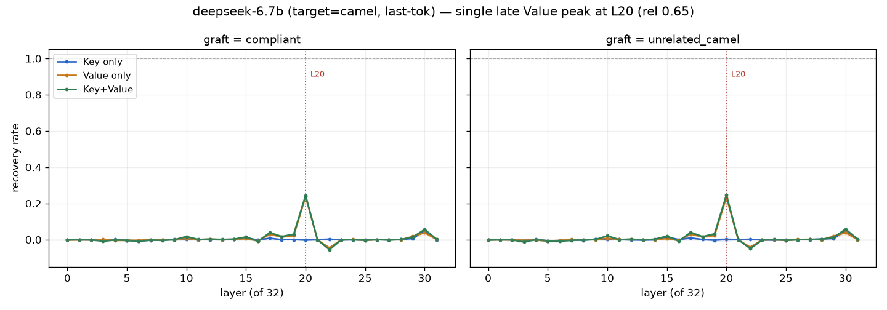
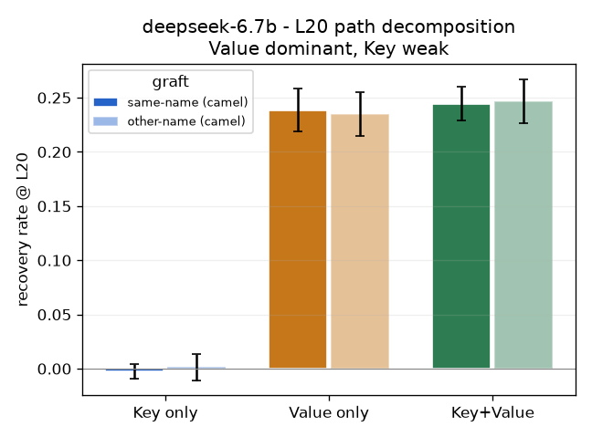

# step 2 결과 — deepseek-coder-6.7b-instruct (RQ2 모델 다양성) — **재현(positive)**

**대응 RQ:** RQ2 — step1 결론(후반 단일 층 · Value 경로 · 형태)이 다른 패밀리에서도 성립하나.

**설정.** `deepseek-ai/deepseek-coder-6.7b-instruct` (fp16, **32층**). 데이터셋·조건 step1과 동일(POOL n=0, pos-camel-weak, seed 0–9), **token_unit='last'**(옵션 B — 토크나이저가 camel/snake를 다른 토큰 수로 쪼개 마지막 토큰만 1:1 치환). 결과 = `results/step2_deepseek/`. 폐기된 all-token 1차 = `results/step2_deepseek_dispose/`.

> **한 줄:** step1(Qwen)의 3대 결론 — **후반 단일 층 국소화 · Value 우세 · 형태(내용 무관)** — 이 deepseek에서 그대로 재현된다. 회복 크기만 last-token 탓에 작다.

**sanity.** `S_깨끗 +4.02 > S_위반 −1.31`. 위반 선행이 준수 선호를 뒤집는다. 정렬 12/스킵 0(마지막 토큰 정렬 정상). ✓

---

## 1. 결과

### 1a. 국소화 — L20 단일 피크

Value/Key+Value 회복률이 **L20(rel 0.65) 단일 피크**, 나머지 층 ≈0.

- L20이 Qwen L25(rel 0.71)와 같은 **후반부 단일 층**. deepseek도 표기 결정이 출력 가까운 단계에서 굳는다.

### 1b. K/V 분해 — Value 우세, Key 약함

L20 경로별 회복률(10 seed 평균):

| kind | 같은이름-camel | 다른이름-camel |
|---|---|---|
| **Value 단독** | **+0.239** | +0.235 |
| Key+Value | +0.244 | +0.247 |
| **Key 단독** (피크 L30) | +0.050 | +0.049 |

- **Value가 회복을 진다**(0.239). Key 단독은 약함(0.05, 피크도 L30로 분산). Key+Value(0.244) ≈ Value → Key의 추가 기여 거의 없음. **step1(Qwen)의 "Value 경로, Key 무반응"과 동일 구조.**

### 1c. 형태 vs 의미 — 이식값 통제 통과

**같은이름-camel**(0.239)과 **다른이름-camel**(0.235)이 사실상 동일. 의미가 다른 이름을 이식해도 회복이 같다 → 회복을 내는 실효 성분은 **camel 형태**지 이름의 의미가 아니다. step1과 동일.

### 1d. v 코사인 (관측, last-token)

last-token v 코사인은 L0=0.72에서 상승해 후반 0.97 수준. **회복 피크(L20)에서 뚜렷한 국소 딥은 없음**(L20 cos 0.967) — Qwen에서 보인 "피크 층 코사인 딥" 공-국소화는 deepseek(및 stable)에선 깨끗하게 재현되지 않는다. 인과(개입) 결과는 재현되나, 방향 관측 지표는 모델마다 양상이 다르다(2차 지표, 종합 때 정리).

---

## 2. 해석 — RQ2 일반화

deepseek는 step1(Qwen)의 **핵심 인과 결론을 재현**한다:

| 질문 | Qwen(step1) | deepseek | 재현? |
|---|---|---|---|
| 어느 층 | L25 (rel 0.71) 단일 | **L20 (rel 0.65) 단일** | ✅ 후반 단일 |
| 어느 경로 | Value (Key 무반응) | **Value 0.24 / Key 0.05** | ✅ Value 우세 |
| 의미 vs 형태 | 형태 | **형태**(이식값 무관) | ✅ |
| 회복 크기 | 0.65 | 0.24 | 부분(caveat) |

→ **패밀리가 다른 코드 instruct 모델에서도 "표기 형태 신호 = 후반 단일 층 Value 경로"가 성립.** GQA(Qwen)와 다른 아키텍처에서도 보존되므로 GQA 특이성이 아니다.

---

## 3. 한계

- **회복 크기 0.24로 모달**(Qwen 0.65 대비 작음). 원인은 **옵션 B(last-token)**: deepseek는 snake를 `[word][_][word]` 3토큰으로 쪼개는데 B는 마지막 토큰만 치환해 `_` 마커가 잔존 → 부분 회복. 절대 크기가 아니라 **패턴(국소·Value·형태)의 재현**이 요지다.
- **v 코사인 공-국소화 미재현**: 인과(개입)는 재현되나 방향(코사인) 관측 지표는 Qwen과 양상이 다르다. last-token 코사인의 해석은 종합 단계에서 다룬다.
- 6.7B라 크기가 3B 아님 — 다만 계획서상 크기 통일은 필수 아니고, 오히려 크기 강건성 논점을 더한다.

**산출물은 `results/step2_deepseek/`에 불변 저장(§6).**
