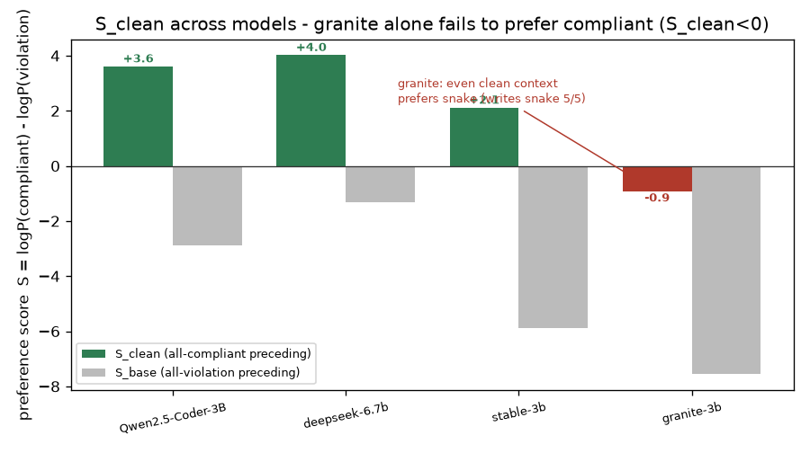
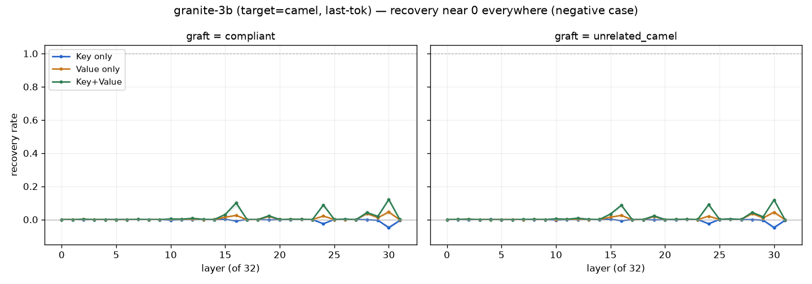
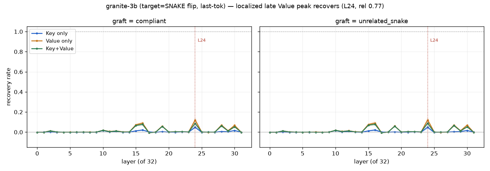

# step 2 결과 — granite-3b-code-instruct (RQ2 모델 다양성) — **negative 케이스**

**대응 RQ:** RQ2 — step1 결론(단일 층 · Value 경로 · 형태 · 방향)이 다른 패밀리에서도 성립하나.

**설정.** `ibm-granite/granite-3b-code-instruct-2k` (fp16, **32층**, config는 셀 4 sanity 참조). 데이터셋·조건 step1과 동일(POOL n=0, pos-**camel**-weak, seed 0–9), **token_unit='last'**(옵션 B). 결과 = `results/step2_granite/`(tok-last). 폐기된 all-token 1차 결과는 `results/step2_granite_dispose/`.

> **한 줄:** granite는 **camelCase 지침을 따르지 않는다**(snake_case 프라이어 지배). 그래서 "위반→준수 회복"을 잴 천장 자체가 없어 **기제를 관측할 수 없다.** 방법 결함이 아니라 **모델이 표기를 옮길 수 있는 대상이 아니기 때문**. 있는 그대로 기록한다(CLAUDE.md §4).

---

## 1. 이상 신호 (다른 3모델과 불일치)

| 지표 | granite | Qwen(step1) | deepseek | stable |
|---|---|---|---|---|
| **S_깨끗** | **−0.94** | +3.61 | +4.02 | +2.11 |
| S_위반 | −7.56 | −2.87 | −1.31 | −5.87 |
| Value 피크 (rel) | L30 (0.97) | L25 (0.71) | L20 (0.65) | L18 (0.58) |
| Value 피크 회복 | **0.046** | 0.648 | 0.239 | 0.145 |
| Key+Value 피크 회복 | 0.121 | 0.667 | 0.244 | 0.170 |
| **Value 우세?** | **아니오** (KV 0.12 > V 0.05, Key 기여) | 예 | 예 | 예 |
| 형태(compliant≈unrelated) | 예 (0.046≈0.044) | 예 | 예 | 예 |

**핵심 이상: `S_깨끗`가 음수(−0.94).** 다른 셋은 clean(선행 전부 camel + camel 지침)에서 준수 후보를 강하게 선호(+2~+4)한다. granite는 그 가장 쉬운 조건에서도 준수를 선호하지 않는다(≈0, 살짝 위반 쪽). → 100% 회복해도 도달점이 −0.94(여전히 위반 선호)라 **개입 여지가 없다.** 회복이 약하고(0.12), Value 우세가 깨지고(Key+Value > Value), 피크가 사실상 **마지막 층(L30/31, rel 0.97)**에 붙는 것은 모두 이 "천장 없음"의 파생 증상이다.



*4모델 중 granite만 S_clean이 음수 — clean 문맥에서도 준수(camel)를 선호하지 않는다. 이것이 granite negative의 뿌리다.*



*granite 회복률은 전 층에서 ≈0, 마지막 층에서만 미미하게 올라온다(Value 0.05, Key+Value 0.12). Qwen/deepseek/stable의 뚜렷한 후반 단일 스파이크(0.15~0.65)와 대조된다.*

---

## 2. 원인 진단 — H1 확정, H2 기각

`notebooks/step2_granite-diagnose.ipynb`로 두 가설을 갈랐다.

**H2 (B의 마지막 토큰이 형태 토큰이 아님) — 기각.** granite 토크나이저는 이름을 이렇게 쪼갠다:
```
snake  parse_header → [parse][_][header]   (3토큰)
camel  parseHeader  → [parse][Header]      (2토큰)
```
마지막 이름 토큰이 **8/8 쌍 모두 다르다**(`header`↔`Header`). B의 마지막-토큰 치환은 형태 차이 토큰을 정확히 겨냥한다 → 방법은 정상. (다만 snake의 독립 `_` 토큰은 B가 안 건드려 남는다 → 회복이 약한 **부차** 원인.)

**H1 (granite가 지침을 약하게 따름) — 확정, 결정적.** clean 조건(선행 전부 camel + "camelCase로 써라", **가장 쉬운 상황**)에서 granite가 생성한 첫 함수 이름:
```
seed0~4:  remove_duplicates  (snake)  — 5/5
```
**전부 snake_case.** 지침도 문맥(전부 camel)도 무시하고 Python 관습(snake)을 쓴다. `S_깨끗<0`(치환과 무관하게 측정)이 이 생성 결과와 정확히 일치한다.

- 채점 후보 토큰화: `removeDuplicates→[remove][Duplicates]`, `remove_duplicates→[remove][_][duplicates]` (정상, 측정 오류 아님).

---

## 3. 해석 — RQ2에 어떻게 들어가나

granite-3b-**code**는 Python 코드로 집중 학습돼 **snake_case 프라이어가 지침·문맥을 압도**한다. 우리 실험은 "선행 코드의 표기 신호가 결정을 옮기는가"를 재는데, granite는 **학습 프라이어에 고정**돼 선행·지침 조작의 레버가 거의 없다. 따라서 기제(후반 단일 층 Value 신호)를 **잴 수 없다** — 관측 실패가 아니라 **관측 대상 부재.**

- **RQ2 일반화는 3모델(Qwen·deepseek·stable)로 이미 성립**한다(국소화·Value 우세·형태 재현). granite는 그 일반화를 **무너뜨리지 않는다** — 전제(모델이 표기를 추적함)를 granite가 만족하지 않을 뿐.
- 오히려 **논문 논지("표층 형태가 지배")의 극단 사례**다: granite에서는 *학습 프라이어라는 형태 신호*가 지침·문맥을 이긴다. RQ1의 "형태 신호 누적" 이야기와 결이 같다.

---

## 4. 한계와 후속

- 이 결과는 **target=camel 고정 설계에 한정**된 negative다. granite가 기제 자체를 안 갖는지, 아니면 **자기 선호 방향(snake)으로는** 같은 기제를 보이는지는 미해결.
- **후속(옵션 B, 방향 뒤집기):** 지침=**snake** / 선행=camel(위반)로 돌려, granite가 *선호 방향*에서 "위반→준수(snake) 회복"의 국소·Value 기제를 보이는지 확인한다. 보이면 "granite도 기제는 동일, 방향만 프라이어를 따름"이라는 강한 결론이 된다. (튜닝이 아니라 별개 조건 — `docs/step2/granite/` 후속 기록.)

---

## 5. 후속 — 방향 뒤집기(target=snake): 기제 재현

§4 예고대로 **지침=snake / 선행=camel(위반)**으로 돌려 재실행했다(`notebooks/step2_granite-3b-snake.ipynb`, 결과 `results/step2_granite_snake/`, token_unit='last', seed 0–9). 코사인은 target 무관이라 생략.

**결과 (20 스윕, 정렬 12/스킵 0):**

| 지표 | 값 |
|---|---|
| S_깨끗(snake) | **+7.59** (granite가 snake를 강하게 선호) |
| S_위반(camel 선행) | **+1.06** (camel 선행이 +7.6→+1.1로 약화시키나, **뒤집진 못함**) |
| Value 피크 (rel) | **L24 (0.77)** = **+0.120** |
| Key 피크 | L24 = +0.048 |
| Key+Value 피크 | L24 = +0.086 |
| 형태(compliant≈unrelated_snake) | 예 (0.120 ≈ 0.121) |



**해석 — granite도 기제는 있다(선호 방향 한정).**
- **국소화 재현**: Value 피크가 **L24(rel 0.77)** 단일 — Qwen(0.71)과 같은 후반. 나머지 층 ≈0.
- **Value 우세 재현**: Value 0.120 > Key 0.048 (Value가 Key 압도).
- **형태 재현**: compliant ≈ unrelated_snake.
- → **"granite는 기제가 없는 게 아니라, snake 프라이어가 너무 강한 모델"**이 확정된다. camel-target에선 프라이어가 target을 이겨 잴 여지가 없었고(§1~3), **프라이어와 정렬된 snake-target에선 후반 단일 층 Value 기제가 드러난다.**

**caveat (정직하게):**
- 회복 크기 **0.12로 모달**(Qwen 0.65 ≫ granite; stable 0.17급). last-token + snake 3토큰의 `_` 잔존.
- **Key+Value(0.086) < Value(0.120)** — Key를 더하면 오히려 줄어드는 이상 상호작용(다른 모델의 Value≈Key+Value와 다름). Value 우세 자체는 분명하나 이 상호작용은 미해결 caveat.
- S_위반이 **양수 유지(+1.06)** — camel 선행이 granite를 camel으로 완전히 뒤집진 못한다(약화만). 프라이어의 강도를 보여준다.

**종합 위치.** 4모델의 Value 피크 상대 위치: Qwen 0.71 / deepseek 0.65 / stable 0.58 / **granite(snake) 0.77** — 전부 후반부(0.58–0.77) 단일 층. granite를 선호 방향으로 보면 **4모델 전부 "후반 단일 층 Value 경로 · 형태 신호"**로 RQ2 일반화가 성립한다. (단 granite는 camel-target negative + snake-flip positive의 **비대칭**을 caveat로 명시.)

---

**산출물은 `results/step2_granite/`(camel-target)·`results/step2_granite_snake/`(snake-flip)에 불변 저장(§6). 진단은 `notebooks/step2_granite-diagnose.ipynb`.**
