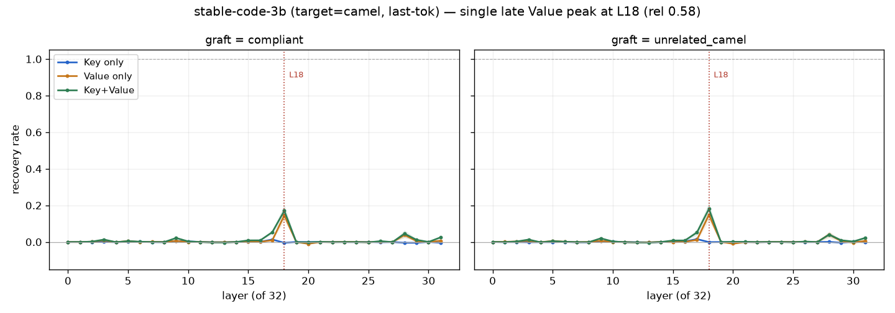
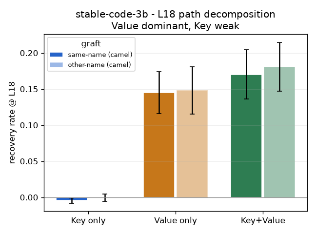

# step 2 결과 — stable-code-instruct-3b (RQ2 모델 다양성) — **재현(positive)**

**대응 RQ:** RQ2 — step1 결론(후반 단일 층 · Value 경로 · 형태)이 다른 패밀리에서도 성립하나.

**설정.** `stabilityai/stable-code-instruct-3b` (fp16, **32층**). 데이터셋·조건 step1과 동일(POOL n=0, pos-camel-weak, seed 0–9), **token_unit='last'**(옵션 B). 결과 = `results/step2_stable_results/`. 폐기된 all-token 1차 = `results/step2_stable_dispose/`.

> **한 줄:** step1(Qwen)의 3대 결론 — **후반 단일 층 국소화 · Value 우세 · 형태(내용 무관)** — 이 stable에서 그대로 재현된다. 회복 크기만 last-token 탓에 작다.

**sanity.** `S_깨끗 +2.11 > S_위반 −5.87`. 위반 선행이 준수 선호를 뒤집는다. 정렬 12/스킵 0. ✓

---

## 1. 결과

### 1a. 국소화 — L18 단일 피크

Value/Key+Value 회복률이 **L18(rel 0.58) 단일 피크**, 나머지 층 ≈0.

- Qwen L25(rel 0.71)·deepseek L20(rel 0.65)과 같은 **후반부 단일 층**(stable은 0.58로 약간 앞).

### 1b. K/V 분해 — Value 우세, Key 약함

L18 경로별 회복률(10 seed 평균):

| kind | 같은이름-camel | 다른이름-camel |
|---|---|---|
| **Value 단독** | **+0.145** | +0.148 |
| Key+Value | +0.170 | +0.181 |
| **Key 단독** (피크 L17) | +0.014 | +0.016 |

- **Value가 회복을 진다**(0.145). Key 단독은 거의 0(0.014). Key+Value(0.170)가 Value보다 약간 크나 주력은 Value. **step1(Qwen)의 "Value 경로, Key 무반응"과 동일 구조.**

### 1c. 형태 vs 의미 — 이식값 통제 통과

**같은이름-camel**(0.145)과 **다른이름-camel**(0.148)이 사실상 동일. 의미가 다른 이름을 이식해도 회복이 같다 → 실효 성분은 **camel 형태**지 이름 의미가 아니다. step1과 동일.

### 1d. v 코사인 (관측, last-token)

last-token v 코사인은 L0=0.563에서 상승해 후반 0.95 수준(L18=0.948). **회복 피크(L18)에서 국소 딥 없음** — Qwen의 "피크 층 코사인 딥" 공-국소화는 stable에서도 깨끗하게 재현되지 않는다(deepseek와 동일). 인과(개입)는 재현되나 방향 관측 지표는 모델별 상이(2차 지표).

---

## 2. 해석 — RQ2 일반화

| 질문 | Qwen(step1) | stable | 재현 |
|---|---|---|---|
| 어느 층 | L25 (rel 0.71) 단일 | **L18 (rel 0.58) 단일** | ✅ 후반 단일 |
| 어느 경로 | Value (Key 무반응) | **Value 0.145 / Key 0.014** | ✅ Value 우세 |
| 의미 vs 형태 | 형태 | **형태**(이식값 무관) | ✅ |
| 회복 크기 | 0.65 | 0.145 | 부분(caveat) |

→ **또 다른 패밀리에서도 "표기 형태 = 후반 단일 층 Value 경로" 성립.**

---

## 3. 한계

- **회복 크기 0.145로 모달**(3모델 중 가장 작음). 옵션 B(last-token) + snake `_` 마커 잔존. 절대 크기가 아니라 **패턴 재현**이 요지.
- **v 코사인 공-국소화 미재현**(deepseek와 동일). 방향 관측 지표는 종합 단계에서 다룬다.

**산출물은 `results/step2_stable_results/`에 불변 저장(§6).**
