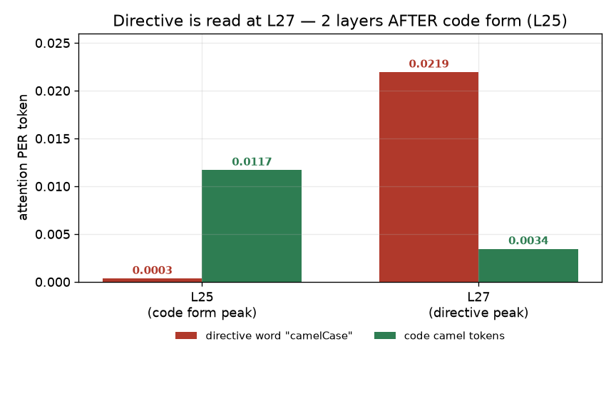
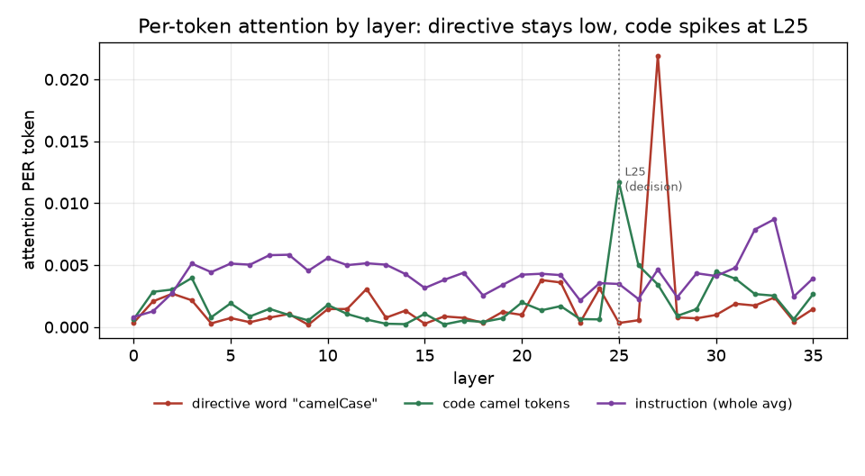

# step B 결과 — directive-token (지침 속 "camelCase" 토큰을 보나?)

**대응 RQ:** RQ3 관측 (지침 쪽). RQ2가 코드 쪽이면, 이건 지침 쪽 어텐션을 stepB 방법으로 본 것 — RQ3의 관측 입구(인과는 step4). "지침 어텐션 평탄"이 문장 통째 기준이라, 그 안의 지시어 토큰('camelCase')을 실제로 보는지 직접 측정.

**설정.** Qwen2.5-Coder-3B (36층, eager). **70 조건 = 7 spec × 10 block.** 기준 관측 = 지침=camel·균형 6/6(View1). per-token 어텐션 = span 어텐션 합 / span 토큰수.

---

## 결론 (한 줄)

**모델은 "camelCase" 지시어를 확실히 본다 — 단, 코드 형태(L25)보다 2층 늦은 L27에서 가장 세게 본다.**
→ "지침을 안 본다"가 아니라 **읽는 층 순서가 코드 형태 뒤**라는 게 진짜 그림.

---

## ① 핵심 — 지시어는 L27에서 피크 (코드는 L25)

per-token 피크 층:
| span | 피크 층 | per-token |
|---|---|---|
| code_camel / code_snake (코드 형태) | **L25** | 0.0117 / 0.0110 |
| **instr_target_word ("camelCase" 지시어)** | **L27** | **0.0219** ← 전 span 중 **최고** |
| instr_viol_word ("snake_case") | L27 | 0.0065 |
| instruction (전체 평균) | L33 | 0.0087 |

L25/L27 값:
| 층 | 지시어 camelCase | code_camel |
|---|---|---|
| L25 (코드 피크) | 0.0003 (바닥) | 0.0117 |
| **L27** | **0.0219** (최고) | 0.0034 |

→ **코드 형태는 L25에서, 지시어는 L27에서** 각자 튄다. 지시어 스파이크는 10조건 전부 견고(0.020~0.028).

---

## ② 정정 — "L25에서 지시어를 안 본다"는 오해였다 (§4)

처음 L25 한 층만 보고 "지시어가 코드보다 36배 낮다 → 모델이 지시어를 스킵"이라 읽었는데, **틀렸다.** L25는 하필 코드의 피크이자 **지시어의 골**이었을 뿐, 지시어는 **바로 다음 L27에서 전 span 중 최고로 튄다.** 한 층 스냅샷의 함정 — **궤적이 진짜 답**이다. (조건 안 바꾸고 그대로 기록.)

---

## ③ 무엇을 뜻하나 — "미주목"이 아니라 "층 순서"

- 지시어는 **미주목(under-attended)이 아니다.** 오히려 자기 피크(L27)에선 코드·지침 전체보다 세게 읽힌다.
- 대신 **처리 순서에 구조가 있다: 코드 형태(L25) → 지시어(L27).** 경쟁 신호(코드 형태)가 지시어보다 **2층 먼저** 소비된다.
- stepC가 회복 인과를 확인한 층이 **L25**(형태가 결정에 실리는 곳)임을 떠올리면, **형태는 L25에서 굳고 지시어는 그 뒤 L27에서 읽히는** 시퀀스 — "지시어가 늦게 온다"는 가설이 선다. (인과 아님, 관측 가설.)

---

## ④ Spotlight 함의 (정직하게, 앞선 결론 수정)

내가 앞서 "지시어 미주목이면 Spotlight 여지 있음"이라 했는데, 이 데이터는 그쪽이 **아니다.**
- **Spotlight 전제(지침 어텐션 부족)는 크기 축에선 성립 안 함** — 지시어는 L27에서 강하게 읽힌다.
- 그래서 **어텐션 '크기'를 키우는 건 헛다리에 가깝다**(이미 충분히 봄).
- 새 후보 문제는 **크기가 아니라 타이밍/순서** — 형태가 L25에서 굳은 **뒤에** 지시어가 L27에서 읽힘. Spotlight(크기 증폭)는 이 순서 문제를 못 건드림.

| 축 | 관측 | Spotlight |
|---|---|---|
| 어텐션 **크기** (지시어 주목?) | L27에서 최고로 봄 | 전제 실패 → 크기 증폭 무의미 |
| **층 순서** (형태 L25 → 지시어 L27) | 형태가 먼저 | Spotlight 범위 밖 → 새 문제 |

---

## ⑤ 남는 질문 (→ step4/후속)

- 이 **L27 지시어 읽기가 인과적으로 결정에 기여하나**, 아니면 L25에서 이미 굳어 **늦은 헛읽기**인가? → **지시어 Key/Value 인과 분해(step4)** + 층 순서 개입으로 검증.
- 만약 "L25에서 형태가 굳고 L27 지시어는 too late"이면 → 방법론은 **어텐션 증폭이 아니라 L25 Value 개입**(우리 step5)이 맞다는 근거가 더 강해진다.

---

## 정직하게 남긴 caveat (§4)
- **L25-only 스냅샷은 오해를 유발** — 지시어는 L27 피크. 반드시 궤적으로 봐야 함.
- **"코드 형태 L25 → 지시어 L27" 순서는 관측**이지 인과가 아니다. "지시어가 늦어서 진다"는 가설이며 step4가 검증.
- 블록 10개(70조건) 기준 — 지침 고정이라 지시어 궤적은 안정적이나, 원하면 42블록으로 확장 가능.
