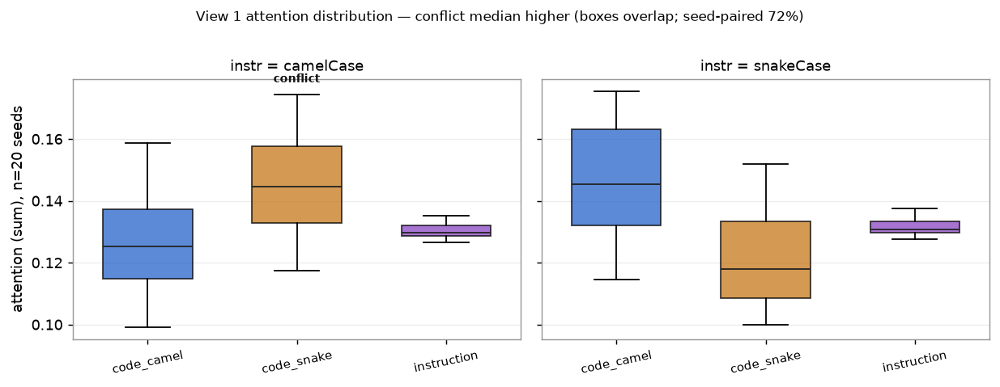
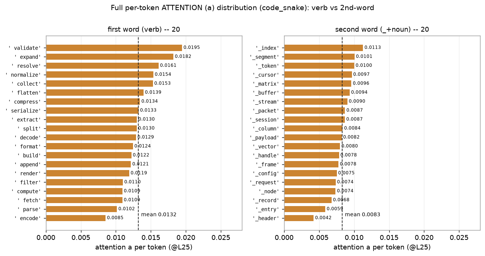
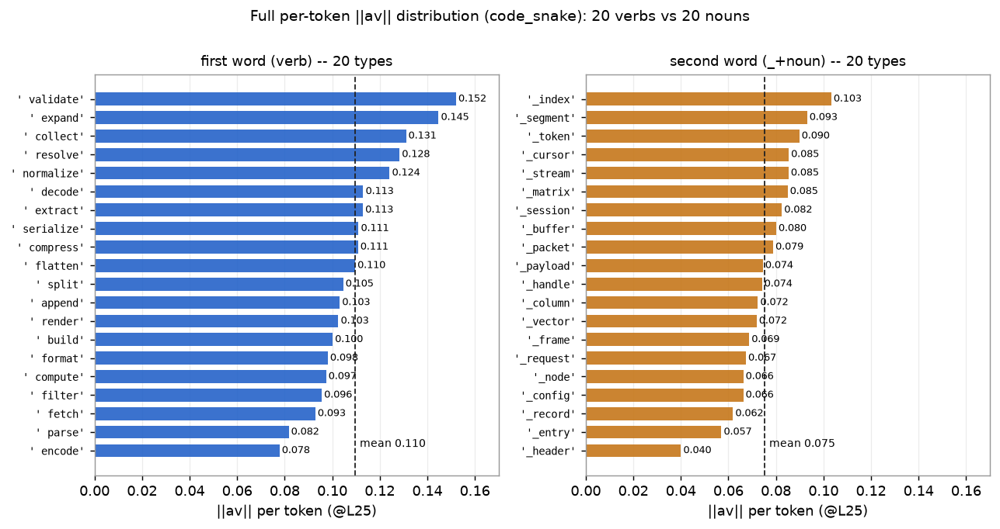
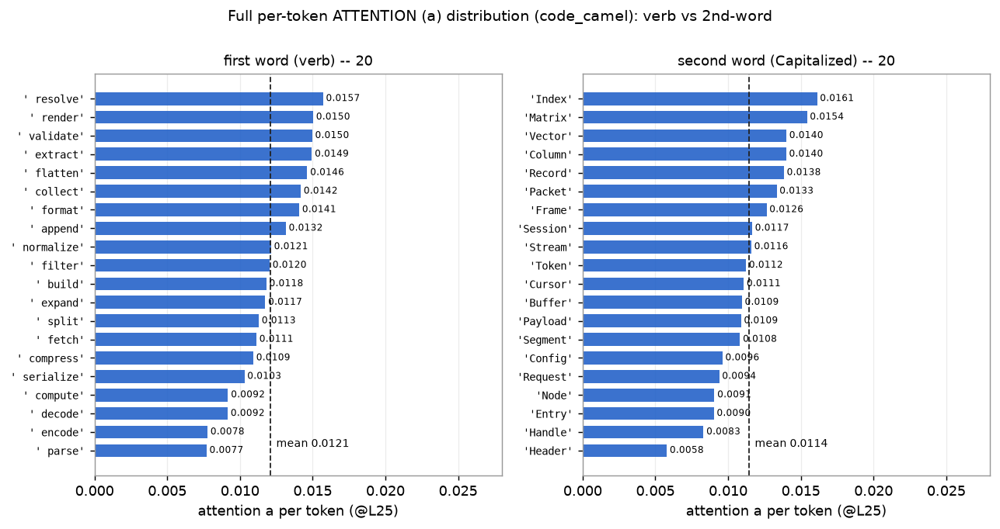
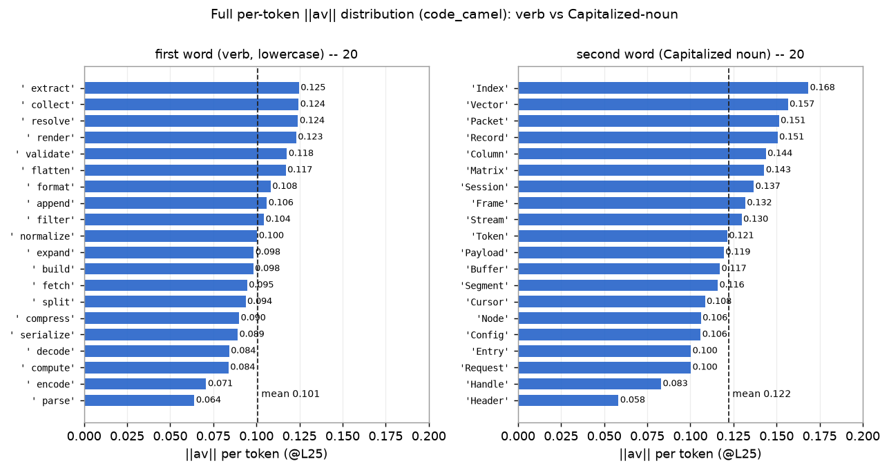

# step B 결과 — RQ2 관측 (A2 생성, 1차 실행)

**대응 RQ:** RQ2 — 준수 실패를 매개하는 신호가 코드의 **형태**인가, 어느 층에 있는가(관측). 인과는 step C.

**설정.** `Qwen/Qwen2.5-Coder-3B-Instruct` (fp16, 36층, GQA 16 Q / 2 KV / group 8, eager). 140 조건 = 7 spec × 20 seed. 기준 층 **L25**(≈ 36의 70%).

---

## 0. 무엇을 어디서 재는가 — 구간(그룹) 정의

측정 시점은 새 함수 **이름을 예측하는 디코딩 query 한 행**(`def ` teacher-forcing 직후). 그 query가 **세 구간**을 각각 얼마나·무엇으로 보는지 잰다. 구간은 다음과 같이 **정확히** 정한다.

```
[system] In this project we generally write function names in camelCase.       ┐
         Every function name uses one of two styles only: camelCase or          │ = instruction 구간
         snake_case.                                                            ┘ (문장 전체. 이 안의
                                                                                    "camelCase"·"snake_case"
[user]   def formatMatrix(value):  return value      ← 이름 formatMatrix ┐          단어도 여기 포함, 분리 안 함)
         def validate_stream(value): return value    ← 이름 validate_stream
         ... (선행 12개: camel 6 + snake 6)
         Add a function that removes duplicate items ...
                          def ▮   ← 이 query에서 관측
```

| 구간 | 정확히 무엇 | 예 |
|---|---|---|
| `instruction` | **지침 문장 전체**의 토큰. 문장 안의 `camelCase`/`snake_case` 단어도 이 구간에 통째로 들어가며 **따로 떼지 않는다.** | "In this project … snake_case." 전부 |
| `code_camel` | **선행 코드의 camel 함수 6개의 이름 토큰** (`def`와 `(` 사이). `def`·괄호·본문·공백 제외. | `formatMatrix`, `validateCursor`, … |
| `code_snake` | **선행 코드의 snake 함수 6개의 이름 토큰** | `validate_stream`, `decode_node`, … |

**중요:** `code_camel`은 **지침 안의 camelCase 단어가 아니라 선행 코드의 camel 이름**이다. 그 이름은 다시 **하위 토큰**으로 쪼개진다 — `formatMatrix → [' format', 'Matrix']`, `validate_stream → [' validate', '_stream']`. 어느 글자에 어텐션이 가는지는 §4 per-token에서 토큰 단위로 볼 수 있다.

### 표본 — 이름 풀과 추출

- **풀 80쌍:** 동사 20개 × 명사 20개. 동사 `v[i]`를 명사 `n[(i+shift)%20]`과 짝지어(shift 0·1·2·3) → **20 × 4 = 80** 고유 (동사,명사) 쌍. 전 항목 본문 동일(`return value`)이라 변하는 건 이름 표기뿐.
- **조건당 추출:** `random.Random(seed).sample(80, 12)`로 **서로 다른 12쌍**을 뽑아 6 camel + 6 snake로 배치. seed마다 다른 12쌍.
- **커버리지:** 조건 140 × 12 = 1680 배치. 고유 동사 20종·명사 20종이 **전부** 등장하며, 토큰마다 등장 횟수(아래 표의 `n`)는 37~96회로 다르다(shift·sample 무작위성 때문).

### 집계 규칙 (합인가 평균인가)

한 토큰 `j`의 값(단일 조건):

- `a_j` = **16개 query head 평균** of 어텐션 `a[h,j]`
- `av_j` = **16개 head 평균** of `a[h,j] · ‖v[h÷8, j]‖`  (GQA 방법 A: query head를 KV head에 매핑)
- `v_j` = **2개 KV head 평균** of `‖v[kv, j]‖`

한 구간의 값(단일 조건):

- **어텐션 = Σ_j a_j** (구간 토큰 **합** — 그 query가 구간에 준 총 어텐션 질량, 0~1)
- **‖av‖ = Σ_j av_j** (구간 토큰 **합** — 구간이 잔차에 기여한 총량)
- **‖v‖ = mean_j v_j** (구간 토큰 **평균** — 크기 지표라 합이 아니라 토큰당 평균)

아래 표의 최종 숫자 = 위 구간 값을 해당 조건군의 **seed(및 6/6 조건) 평균**낸 값.

---

## 1. 측정값 전체 — 세 지표 × 세 구간 (View 1, 선행 6/6 @L25)

| 지침 | 구간 | 어텐션(Σ) | ‖av‖(Σ) | ‖v‖(mean) |
|---|---|---|---|---|
| **camelCase** | `code_camel` (준수) | 0.1263 | 1.185 | 9.398 |
| | `code_snake` **(충돌)** | **0.1442** | **1.240** | 8.956 |
| | `instruction` | 0.1302 | 0.2085 | 9.133 |
| **snakeCase** | `code_camel` **(충돌)** | **0.1454** | **1.277** | 9.086 |
| | `code_snake` (준수) | 0.1210 | 1.110 | 9.256 |
| | `instruction` | 0.1316 | 0.2086 | 9.162 |


- **어텐션·‖av‖는 충돌 쪽으로 뒤집힌다(▼).** 우세가 지침 따라 뒤집히므로 신호는 "snake라는 글자"(prior)가 아니라 **지침 위반 형태**.
- **‖v‖는 평탄, 오히려 준수 쪽이 미세하게 크다** (camel 지침에서 camel_v 9.40 > snake_v 8.96). `‖av‖=어텐션×‖v‖`인데 av가 충돌로 기운 건 **순전히 어텐션 때문**(축 A). 신호가 크기(축 B)가 아님을 직접 보여준다.
- **지침 구간은 두 조건 거의 동일** (어텐션 0.130 vs 0.132, ‖av‖ 0.2085 vs 0.2086). 실패가 "지침을 덜 봐서"가 아니다.

✓ **예측대로** — 충돌 우세 + 지침 평탄 + ‖v‖ 평탄.

### 분포 (n = 20 seed, @L25)

평균만이 아니라 **분포 전체**. (위 §1 표는 아래 `mean` 열이다.)

| 지침 | 구간 | 지표 | mean | std | min | median | max |
|---|---|---|---|---|---|---|---|
| camel | code_camel | attn | 0.1263 | 0.0162 | 0.0991 | 0.1251 | 0.1588 |
| camel | code_snake **(충돌)** | attn | 0.1442 | 0.0165 | 0.1175 | 0.1445 | 0.1743 |
| camel | instruction | attn | 0.1302 | **0.0025** | 0.1266 | 0.1296 | 0.1352 |
| camel | code_camel | av | 1.185 | 0.120 | 0.964 | 1.190 | 1.428 |
| camel | code_snake **(충돌)** | av | 1.240 | 0.113 | 1.058 | 1.223 | 1.472 |
| camel | code_camel | v | 9.398 | 0.285 | 8.814 | 9.342 | 10.107 |
| camel | code_snake | v | 8.956 | 0.323 | 8.598 | 8.864 | 9.944 |
| camel | instruction | v | 9.133 | **0.000** | — | 9.133 | — |
| snake | code_camel **(충돌)** | attn | 0.1454 | 0.0182 | 0.1145 | 0.1454 | 0.1754 |
| snake | code_snake | attn | 0.1210 | 0.0155 | 0.1000 | 0.1181 | 0.1518 |
| snake | instruction | attn | 0.1316 | **0.0027** | 0.1275 | 0.1308 | 0.1376 |
| snake | code_camel **(충돌)** | av | 1.277 | 0.124 | 1.075 | 1.263 | 1.491 |
| snake | code_snake | av | 1.110 | 0.113 | 0.964 | 1.092 | 1.348 |
| snake | instruction | v | 9.162 | **0.000** | — | 9.162 | — |



- **지침 구간은 std가 아주 작다**(attn 0.0025, v **정확히 0**). 지침 문장이 모든 조건에서 동일하니 당연하며, 관측 경로가 정상 작동한다는 sanity check도 된다.
- **code 그룹은 std가 크고(~0.016) 분포가 겹친다** — 충돌 우세는 분포가 갈라진 게 아니라 **중앙값이 밀린** 것. 그래서 seed‑paired 비교(72%)가 판정 근거다.

---

## 2. 어느 층인가 — L25 상세


충돌 우세(충돌−준수 어텐션)를 전 36층에서. 대부분 ±0.005인데 **L25 한 층만 +0.0212로 급등**.

| 층 | L23 | L24 | **L25** | L26 | L27 |
|---|---|---|---|---|---|
| 충돌 우세 | +0.0016 | +0.0003 | **+0.0212** | +0.0034 | −0.0029 |

L24 대비 **약 70배**, 그다음 큰 층의 4배. **단일 층에 국소화.**

1. **위치의 의미.** L25 = 전체 36층의 **약 70%(후반부)**. 계획서 §2.5 — 초기=어휘, 중간=구문, **후반=출력 결정** — 에서 L25는 **출력 결정 단계**. 해석: **표기 형태 선택이 출력 직전에 굳는다**(step 6 로짓 렌즈로 실증 예정).
2. **국소화가 방법론 근거.** 특정 층에 뭉쳐 있어야 방법론이 **전 층이 아니라 L25만** 개입한다는 설계가 정당화(계획서 §4).
3. **강건성.** L25에서 충돌>준수 seed **29/40 = 72%**. 예비(A2)의 L25와 일치.

**한계:** 이 관측만으론 L25가 *인과*라 못 함(→ step C KV 치환). 왜 25층·K/V 어느 경로인지 미결(→ step 1 스윕·분해). 모델마다 같은 층인지 미확인(→ step 2).

---

## 3. View 2 — 위반이 쌓여도 지침을 덜 보나 (스윕, 지침=camel @L25)

| n_compliant | 지침 어텐션(Σ) | snake 어텐션(Σ) | snake 토큰당(Σ/n) | snake ‖av‖(Σ) | snake 토큰수 |
|---|---|---|---|---|---|
| 6 | 0.1302 | 0.1442 | 0.01202 | 1.240 | 12 |
| 4 | 0.1306 | 0.1764 | 0.01103 | 1.506 | 16 |
| 3 | 0.1308 | 0.1927 | 0.01070 | 1.642 | 18 |
| 2 | 0.1313 | 0.2131 | 0.01065 | 1.806 | 20 |
| 1 | 0.1317 | 0.2325 | 0.01057 | 1.966 | 22 |
| 0 | 0.1327 | 0.2598 | 0.01082 | 2.196 | 24 |


- **지침 어텐션 완전 평탄**(0.130→0.133). 위반 최대여도 지침을 덜 보지 않음 → **실패는 "지침 결핍"이 아니다** (균질 증폭 기법 전제와 충돌).

**"충돌 어텐션 합은 늘지만 토큰당은 평탄"이 무슨 뜻인가 (자세히).**

표에서 `snake 어텐션(Σ)`은 위반 6→0으로 갈수록 **0.14 → 0.26으로 커진다.** 얼핏 "위반이 늘수록 모델이 위반을 더 본다"로 읽힌다. 하지만 이건 착시다.

- snake 함수가 6개→12개로 늘면 snake **토큰 수도 12→24개로** 는다. 어텐션 합(Σ)은 토큰마다의 어텐션을 다 **더한 값**이라, 토큰이 많아지면 자동으로 커진다.
- 그래서 **토큰당**(합÷토큰수) 열을 보면 **0.012 → 0.011로 거의 안 변한다.** 즉 **개별 위반 토큰을 더 세게 보는 게 아니라, 위반 토큰이 그냥 더 많아진 것**이다.

**→ 이게 stepA 절벽의 기제다.** 준수 예시가 사라지고 위반 이름이 쌓일수록, 지침 어텐션은 그대로(평탄)인데 잔차에 실리는 **위반 형태의 총 질량**만 개수에 비례해 커진다. 그 누적 질량이 (평탄한) 지침을 압도하는 순간 준수가 무너진다. 즉 붕괴는 "지침이 약해져서"가 아니라 "위반 형태가 물량으로 쌓여서"다.

---

## 4. per-token — 이름을 어떻게 재고, 어느 글자를 보나

### 4.1 한 이름(`validate_stream`)을 어떻게 재는가

이름은 토크나이저가 **하위 토큰**으로 쪼갠다: `validate_stream → [' validate', '_stream']`. **토큰마다 세 값이 다 나온다** — a(얼마나 보나), av(잔차 기여), v(실은 크기). 아래는 seed0·지침=camel 조건의 실제 값(@L25):

| `validate_stream`의 토큰 | a | av | v |
|---|---|---|---|
| `' validate'` (앞 동사) | 0.0255 | 0.190 | 7.80 |
| `'_stream'` (뒤 명사) | 0.0145 | 0.154 | 10.11 |
| **이 이름의 기여** | **0.040** (합) | **0.344** (합) | 8.95 (평균) |

그다음 **구간(그룹) 값으로 합치는 방식이 지표마다 다르다:**

- **어텐션·‖av‖ = 구간 토큰 전부의 합(Σ)** — "이 구간에 얼마나 갔나"라 질량처럼 더한다.
- **‖v‖ = 구간 토큰의 평균(mean)** — "토큰 하나가 든 표현 크기"라 개수와 무관한 평균.

그래서 `code_snake` 구간(= snake 이름 6개 = 12토큰)은: **어텐션 = 12토큰 a의 합, ‖av‖ = 12토큰 av의 합, ‖v‖ = 12토큰 v의 평균.** "snake를 더 본다"는 곧 **snake 12토큰 어텐션 합 vs camel 12토큰 합**의 비교다(§1 표의 그 숫자).

아래는 그 seed0 조건의 12토큰 전부(발췌 3이름) → 그룹 값:

**`code_snake` (지침=camel이라 이쪽이 충돌):**

| 이름 | 토큰 | a | av | v |
|---|---|---|---|---|
| validate_stream | `' validate'` | 0.02545 | 0.1904 | 7.80 |
| | `'_stream'` | 0.01447 | 0.1539 | 10.11 |
| decode_node | `' decode'` | 0.01544 | 0.1214 | 7.94 |
| | `'_node'` | 0.00736 | 0.0636 | 8.64 |
| split_session | `' split'` | 0.01086 | 0.0918 | 8.43 |
| | `'_session'` | 0.00909 | 0.0996 | 11.00 |
| … (6개 이름 = 12토큰) | | | | |
| **그룹** | Σ a=**0.1244** | | Σ av=**1.097** | mean v=**9.11** |

### 4.2 위치·표기별 per-token 평균 — 세 지표, camel·snake 둘 다 (전 조건 @L25)

이름은 `[앞 동사 · 뒤 명사]` 구조다. 두 그룹 × 두 위치 × 세 지표를 모두 보면:

| 그룹 | 위치 | 어텐션 a | ‖av‖ | ‖v‖ | 토큰수 |
|---|---|---|---|---|---|
| `code_camel` | 앞 동사 `' format'` | 0.01215 | 0.101 | 8.64 | 440 |
| `code_camel` | 뒤 대문자 `'Matrix'` | 0.01165 | 0.126 | **10.43** | 440 |
| `code_snake` | 앞 동사 `' format'` | **0.01333** | 0.110 | 8.62 | 1240 |
| `code_snake` | 뒤 밑줄 `'_matrix'` | 0.00827 | 0.075 | 9.21 | 1240 |

**읽는 법 (여기서 신호의 정체가 갈린다):**

- **어텐션(a)은 두 그룹 다 앞 동사가 더 높다** (camel 0.0121 vs 0.0117, snake 0.0133 vs 0.0083). 즉 query는 이름의 **앞 동사 토큰**을 더 본다 — 이게 가장 깨끗한 신호.
- **‖av‖는 뒤죽박죽인데, `av = a × v`라 v에 휘둘리기 때문이다.** camel의 뒤 토큰 `'Matrix'`는 a는 낮아도 **v가 유독 크다(10.43)** → av가 오히려 크다(0.126). snake의 뒤 토큰 `'_matrix'`는 v가 조금만 커서(9.21) av가 낮다(0.075). **그래서 "마커(대문자/밑줄) 토큰이 더 세다"가 camel↔snake에서 방향이 반대로 나온다**(§4.4).
- 결론: 형태 신호는 **‖av‖가 아니라 어텐션(a)에서 더 깨끗**하고, 위치로는 **앞 동사** 쪽이다.

### 4.3 전체 per-token 분포 — 20종씩, attention·av 둘 다

**`code_snake` — 토큰별 어텐션(a)·‖av‖, 20 동사 · 20 명사 전부 (전 140조건, @L25):**

어텐션(a) 분포:



‖av‖ 분포:



| 첫 단어(동사) | n | **a** | av | | 둘째 단어(_명사) | n | **a** | av |
|---|---|---|---|---|---|---|---|---|
| `' validate'` | 80 | 0.01946 | 0.1521 | | `'_index'` | 51 | 0.01128 | 0.1033 |
| `' expand'` | 63 | 0.01823 | 0.1447 | | `'_segment'` | 29 | 0.01006 | 0.0931 |
| `' resolve'` | 70 | 0.01611 | 0.1283 | | `'_token'` | 54 | 0.01001 | 0.0898 |
| `' normalize'` | 53 | 0.01536 | 0.1242 | | `'_cursor'` | 60 | 0.00967 | 0.0854 |
| `' collect'` | 69 | 0.01529 | 0.1310 | | `'_matrix'` | 58 | 0.00961 | 0.0849 |
| `' flatten'` | 82 | 0.01395 | 0.1096 | | `'_buffer'` | 59 | 0.00937 | 0.0801 |
| `' compress'` | 73 | 0.01345 | 0.1108 | | `'_stream'` | 61 | 0.00904 | 0.0853 |
| `' serialize'` | 50 | 0.01325 | 0.1111 | | `'_packet'` | 86 | 0.00870 | 0.0788 |
| `' extract'` | 50 | 0.01301 | 0.1129 | | `'_session'` | 71 | 0.00868 | 0.0825 |
| `' split'` | 96 | 0.01298 | 0.1046 | | `'_column'` | 53 | 0.00837 | 0.0724 |
| `' decode'` | 52 | 0.01289 | 0.1130 | | `'_payload'` | 91 | 0.00823 | 0.0745 |
| `' format'` | 64 | 0.01244 | 0.0981 | | `'_vector'` | 65 | 0.00799 | 0.0719 |
| `' build'` | 66 | 0.01222 | 0.1002 | | `'_handle'` | 71 | 0.00784 | 0.0741 |
| `' append'` | 23 | 0.01215 | 0.1032 | | `'_frame'` | 55 | 0.00777 | 0.0687 |
| `' render'` | 37 | 0.01191 | 0.1026 | | `'_config'` | 67 | 0.00752 | 0.0662 |
| `' filter'` | 47 | 0.01100 | 0.0956 | | `'_request'` | 83 | 0.00736 | 0.0673 |
| `' compute'` | 49 | 0.01094 | 0.0974 | | `'_node'` | 59 | 0.00735 | 0.0662 |
| `' fetch'` | 54 | 0.01093 | 0.0929 | | `'_record'` | 87 | 0.00678 | 0.0619 |
| `' parse'` | 79 | 0.01016 | 0.0817 | | `'_entry'` | 43 | 0.00588 | 0.0570 |
| `' encode'` | 83 | 0.00853 | 0.0778 | | `'_header'` | 37 | 0.00422 | 0.0400 |
| **동사 평균** | | **0.0132** | 0.110 | | **명사 평균** | | **0.0083** | 0.075 |

- **어텐션(a)으로 보면 신호가 깨끗하다: 20 동사 전부가 20 명사보다 a가 높다** (동사 평균 0.0132 vs 명사 0.0083, 겹침 거의 없음). query는 이름의 **앞 동사 토큰**을 더 본다.
- av도 대체로 같은 순서지만 명사 쪽 v가 커서 살짝 뒤섞인다(그래서 §4.4의 마커 해석이 상충).

**`code_camel` — 20 동사 · 20 대문자명사 전부:**

어텐션(a) 분포:



‖av‖ 분포:



camel도 **어텐션(a)은 앞 동사가 더 높다**(snake와 같은 방향, 깨끗). 다만 **av**는 뒤 대문자 명사(`Cursor`, `Record` …)가 더 큰데, 이는 그 자리 명사의 **v가 커서**(§4.2)지 대문자라서가 아니다 — snake의 av 방향과 반대라 "마커가 신호"는 성립하지 않는다.

### 4.4 밑줄이 형태 신호인가 — 판정 보류

원래 snake의 `_`가 어근보다 av가 큰지 보려 했으나:

- **Qwen 토크나이저가 `_`를 다음 단어에 붙인다**: `validate_stream → [' validate', '_stream']`. **독립 `_` 토큰이 0개.**
- 그래서 "밑줄 토큰"이 곧 "둘째 단어(명사)"이고, 위에서 보듯 **둘째 단어는 원래 av가 낮다.** 즉 "밑줄 vs 어근"이 "명사 vs 동사"·"둘째 vs 첫째 단어" 효과와 뒤엉켜 **밑줄 자체를 격리할 수 없다.** (camel은 반대로 대문자=둘째 단어가 약간 큼 → 방향 상충.)
- **한계로 기록.** 밑줄이 신호인지는 경계 토큰 격리 또는 step 6 로짓 렌즈로 이관.

---

## 5. 예측 대비

| 예측 | 결과 |
|---|---|
| 충돌 표기 토큰을 더 봄 (flip) | **맞음** (L25에서 뚜렷, 72% seed) |
| 지침 어텐션 평탄 | **맞음** (flip·스윕 양쪽) |
| ‖v‖ 평탄 | **맞음** — 오히려 준수 v 미세 우위(신호=순수 어텐션) |
| (암묵) 충돌 토큰을 토큰당 더 봄 | **아님** — per-token 평탄, 총량은 개수 효과 |
| (설계) 밑줄이 형태 신호 | **판정 불가** — `_`가 둘째 단어에 융합, 위치 효과와 뒤엉킴 |

---

## 6. 결과 해석 — 이를 통해 무엇을 알 수 있나

이 관측 하나로 **RQ2의 세 조각**이 구체적 숫자와 함께 답해진다.

### (1) 준수 실패의 경쟁 신호는 "내용"이 아니라 **표층 형태**다

지침=camel일 때 snake 토큰을 더 보고(0.144 &gt; 0.126), 지침=snake일 때 camel 토큰을 더 본다(0.145 &gt; 0.121). **더 보는 쪽이 지침 따라 뒤집힌다.**

- 만약 신호가 코드의 **의미(내용)**거나 모델의 **snake 선호(prior)**였다면, 지침을 뒤집어도 같은 쪽을 봐야 한다. 그런데 뒤집혔다. → 모델이 읽는 건 "이 함수가 무슨 일을 하나"가 아니라 **"이 이름이 지금 지침과 표기가 어긋나나"**라는 **형태 충돌 신호**다.
- 이것이 계획서 §0의 핵심 주장("모델은 표기 규약을 논리 제약이 아니라 표층 형태 신호로 처리한다")을 **선행 코드 쪽에서 내부적으로 확인**한 것이다.

### (2) 실패의 원인은 "지침을 덜 봐서"가 **아니다**

지침 구간 어텐션은 (a) 두 지침 조건에서 거의 같고(0.130 vs 0.132), (b) 위반을 6→0으로 최대까지 늘려도 평탄하다(0.130→0.133, std≈0).

- 즉 **지침은 끝까지 멀쩡히 보고 있다.** 실패는 지침이 컨텍스트에서 희미해져서가 아니다.
- **함의(방법론의 존재 이유):** "지침을 더 보게 하자"는 기존 완화 기법(어텐션 균질 증폭·Spotlight)은 **있지도 않은 결핍을 채우려는 것**이라 구조적으로 한계가 있다. 우리 방법론은 여기서 갈라진다 — 지침을 키우는 게 아니라 **경쟁 신호(형태)를 다뤄야** 한다.

### (3) 붕괴의 기제 = 위반 형태의 **물량 누적**

위반이 늘수록 충돌 어텐션 **합**은 커지지만(0.14→0.26), **토큰당**은 평탄하다(~0.011). 즉 개별 위반 토큰을 더 세게 보는 게 아니라 **위반 토큰이 그냥 많아진다.**

- 지침은 평탄한데 잔차에 실리는 **위반 형태의 총 질량**만 개수에 비례해 커진다. 그 질량이 지침을 압도하는 순간이 **stepA에서 본 준수 절벽**이다. → RQ1(행동)의 절벽을 RQ2(내부)가 물량 논리로 설명한다.

### (4) 신호는 "크기"가 아니라 "어텐션"에 있고, **L25 한 층**에 뭉쳐 있다

- ‖v‖(표현 크기)는 충돌을 편들지 않는다(오히려 준수 쪽이 미세하게 큼). av가 충돌로 기운 건 **순전히 어텐션(축 A)** 때문. → 개입은 "표현 크기"가 아니라 **어텐션/표현 경로**를 겨냥해야 한다.
- 충돌 우세가 **L25 한 층에서만** +0.0212로 솟는다(이웃의 ~5배, 36층의 70%=출력 결정 단계). → 방법론이 **전 층이 아니라 특정 층만** 개입한다는 설계가 정당화된다.

### (5) 아직 알 수 없는 것 (이 관측의 한계)

- **인과는 아니다.** "L25에서 형태를 더 본다"는 상관이지, 그게 표기 결정을 *유발*하는지는 미확인 → **step C**(KV 치환으로 준수 회복되는지).
- **왜 L25인지, Key냐 Value냐**는 단일 층 관측으로 모름 → **step 1**(전 층 스윕·K/V 분해·v 코사인).
- **다른 모델도 같은가**는 미확인 → **step 2**.
- **밑줄 자체가 신호인지**는 토큰화가 `_`를 명사에 붙여 격리 불가 → **step 6**(로짓 렌즈).

### 한 문장

> **모델은 지침을 끝까지 보고 있지만, 선행 코드에 쌓인 "지침과 어긋난 표기 형태"를 L25에서 어텐션으로 더 강하게 읽어들이고, 위반이 물량으로 쌓이면 그 형태 신호가 지침을 압도한다.**

---

**다음 단계:** step C(인과 개입) → step 1(층 스윕·K/V 분해) → step 2(모델 다양성).

*(그래프 원본: `docs/stepB/figs/`. 원자료: `results/stepB/` 140건.)*
