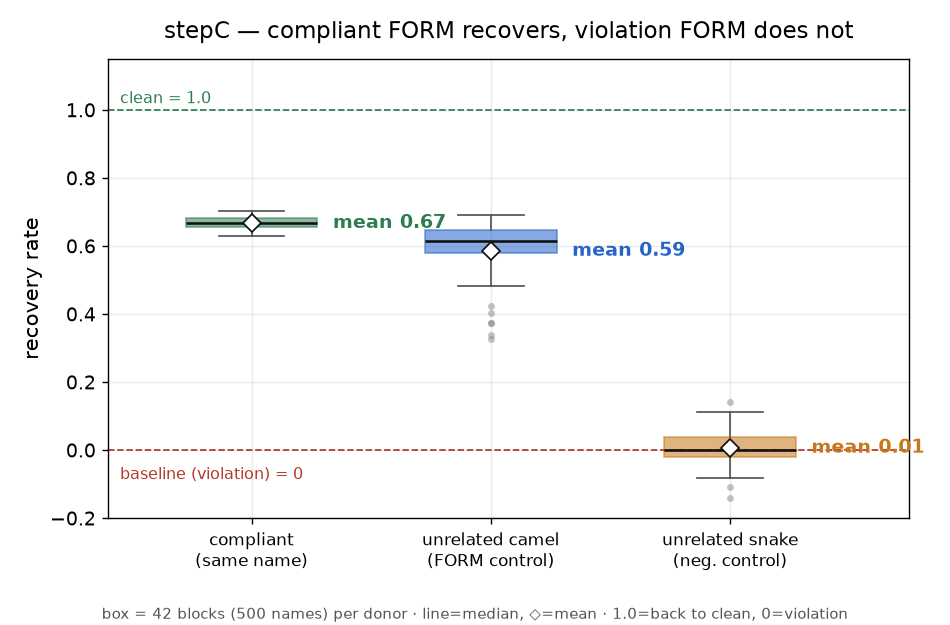
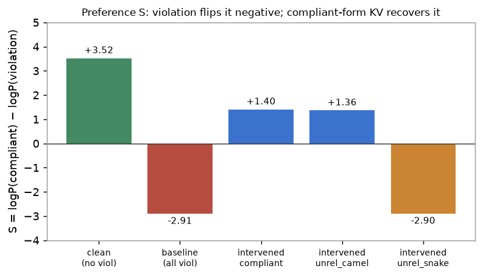
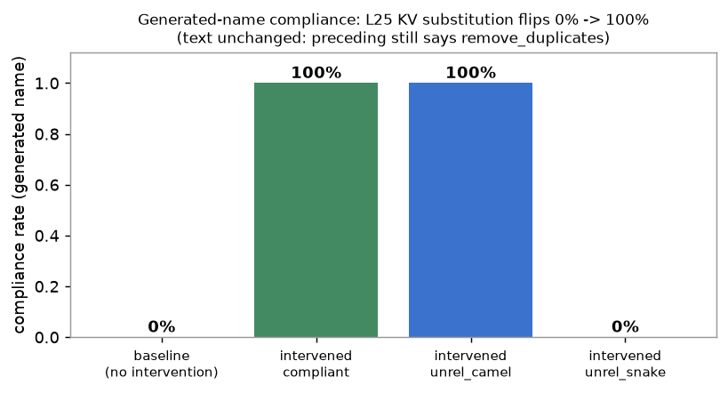

# step C 결과 — RQ2 개입 (KV 치환 인과, A2 생성, 1차 실행)

**대응 RQ:** RQ2 — 매개 신호가 형태인가, 그리고 그것이 **인과**인가.

**설정.** `Qwen/Qwen2.5-Coder-3B-Instruct` (fp16, 36층, GQA group 8). 60 조건 = donor 3종 × 20 seed. 지침=camel, 선행 = **전부 위반**(POOL n=0, snake 12개), 개입 = **L25 Key+Value 치환**(방법 B). 측정 = 준수 선호 점수 `S = logP(준수) − logP(위반)`, 세 상태(clean/baseline/intervened)와 **회복률**(정의: `docs/stepC/plan.md`).

> **실행 전 예측:** compliant 치환 시 준수 선호 회복(≈A2 79%). unrelated_camel(무관 준수형)도 회복하면 신호는 내용 아닌 형태. unrelated_snake(위반형)는 회복 안 됨.

---

## 1. 결과

**sanity — 위반이 준수 선호를 실제로 떨어뜨리는가:** `S_깨끗 = +3.52` → `S_위반 = −2.91`. 위반투성이 선행이 선호를 **준수(+)에서 위반(−)으로 뒤집는다.** 관측 경로·채점이 정상 작동. ✓

| donor (치환값) | S_깨끗 | S_위반 | S_개입 | **회복률** | std | 양수 seed |
|---|---|---|---|---|---|---|
| **compliant** (같은 이름 준수판) | +3.52 | −2.91 | +1.40 | **0.670** | 0.022 | 100% |
| **unrelated_camel** (무관 준수형) | +3.52 | −2.91 | +1.36 | **0.664** | 0.026 | 100% |
| **unrelated_snake** (무관 위반형) | +3.52 | −2.91 | −2.90 | **0.000** | 0.047 | 15% |

- 치환 토큰 **24개(12이름×2토큰) 전부 정렬**, 제외 0 (풀이 camel·snake 모두 이름당 2토큰이라 위치가 어긋나지 않음).
- `compliant − unrelated_camel` 회복률 차 = **+0.006** (사실상 0).





---

## 1b. 생성 기반 재확인 — 실제로 준수 표기를 쓰는가

선호 점수는 "얼마나 선호하나"라 간접적이다. **같은 60조건에서 측정만 바꿔**, 치환 후 `def ` 다음을 **실제로 그리디 생성**시켜 나온 첫 함수 이름의 표기를 분류했다(`results/stepC_gen/`).

| donor | 치환 전(baseline) | 치환 후 |
|---|---|---|
| **compliant** | 0% (20/20 snake) | **100%** (20/20 camel) |
| **unrelated_camel** | 0% | **100%** (20/20 camel) |
| **unrelated_snake** | 0% | **0%** (20/20 snake) |



실제 생성된 이름 — **텍스트엔 `remove_duplicates`가 선행에 그대로 있는데:**
```
치환 전:  remove_duplicates   (위반, snake)
치환 후:  removeDuplicates    (준수, camel)   ← compliant·unrelated_camel 20/20 전부
```

- **0% → 100% 완전 플립.** 선호 점수는 67% "부분" 회복이었지만, 선호가 `−2.91 → +1.40`으로 **0을 넘어 준수 쪽으로 넘어갔기** 때문에 그리디 생성은 그 넘어간 선호를 이산 출력으로 **완전히** 반영한다. 두 측정이 **일관**된다(부분 회복이 결정 경계를 넘김 → 출력 전면 전환).
- 형태 통제(무관 준수형)도 20/20 플립, 음성 통제(위반형)는 20/20 그대로 → 선호 점수와 **같은 패턴, 더 극적**.
- seed 20개 전부 동일 결과 = **결정적**. 텍스트 불변, L25 KV만 바꿔 모델이 실제로 camelCase를 쓴다.

---

## 2. 해석 — 세 가지가 동시에 성립

### (1) 인과 확정

텍스트는 `format_matrix`(위반) 그대로 둔 채 **L25의 KV만 준수 값으로 바꿨더니**, 준수 선호가 `−2.91 → +1.40`으로 **67% 회복**했다. → step B의 관측("L25에서 위반 형태를 더 본다")이 표기 결정의 **원인**임이 확정. **상관 → 인과.**

### (2) 내용이 아니라 형태

**무관한** 준수 코드(전혀 다른 단어들)의 L25 값으로 치환해도 **거의 똑같이 회복**(66.4% vs 67.0%, 차이 +0.006). → 회복을 만든 건 "이 함수가 무슨 일을 하나(내용)"가 아니라 **준수 표기 형태** 그 자체다. step B의 "형태 신호" 결론이 인과적으로 맞물린다.

### (3) 음성 통제 통과

무관 **위반형**(snake)으로 치환하면 **회복 0%**(20 seed 중 15%만 미미하게 양수, 평균 0). → 아무 값이나 넣어서 회복되는 게 아니라 **"준수 형태"여야** 회복한다. 개입이 우연이 아니라 **그 형태 신호를 정확히 건드렸다**는 증거.

### + A2 재현

67% 회복은 예비 A2의 약 79%와 **같은 규모**로, 이 하네스에서 재현됐다.

---

## 3. 예측 대비

| 예측 | 결과 |
|---|---|
| compliant 치환 시 회복 (≈79%) | **맞음** — 67% (std 0.02, 100% seed) |
| 무관 준수형도 회복 (형태) | **맞음** — 66% (차이 +0.006) |
| 무관 위반형은 회복 안 됨 | **맞음** — 0% (음성 통제) |

---

## 4. 이를 통해 무엇을 알 수 있나

- **RQ2가 완결된다.** 매개 신호 = **형태**(내용 아님), 위치 = **L25**(step B), 그리고 **인과**(step C). 관측(B) → 개입(C)로 상관이 인과로 확정.
- **방법론 설계 근거(계획서 §4).** 개입은 **L25의 형태 표현**을 겨냥해야 효과가 난다 — 어텐션 균질 증폭이 아니라. step B(지침 어텐션 평탄)와 합쳐, 기존 "지침 증폭" 기법의 한계와 제안 방법의 개입 지점이 **데이터로 뒷받침**된다.

## 5. 한계와 다음

- **Key/Value 분해 안 함.** 이번엔 Key+Value 동시라 회복이 어느 경로(주목 유발 Key / 정보 전달 Value)에서 왔는지 미분리 → **step 1**.
- **단일 층(L25)·단일 모델.** 왜 L25인지(전 층 스윕)·다른 모델도 같은지 → **step 1·2**.
- **선호 점수(간접) → 생성으로 보강 완료.** §1b에서 실제 생성이 0%→100%로 플립함을 확인했다(선호 점수와 일관).

**다음:** step 1(전 층 스윕 + Key/Value 분해 + v 코사인) → step 2(모델 다양성) → step 5(방법론).

*(그래프 원본: `docs/stepC/figs/`. 원자료: 선호 점수 `results/stepC/`, 생성 `results/stepC_gen/` 각 60건.)*
