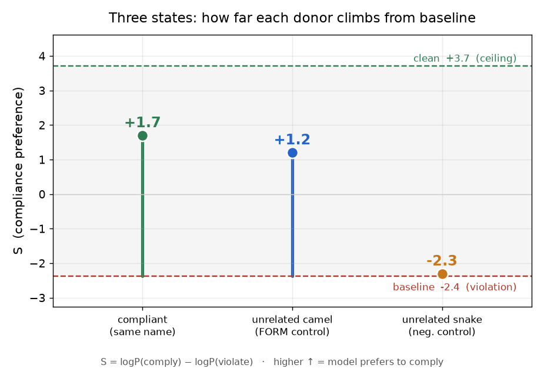

# step C 결과 — pool-500 (RQ2 인과, KV 치환, 500 이름)

**대응 RQ:** RQ2 — 형태 신호가 표기 결정의 **원인**인가. (관측은 stepB.)

**설정.** `Qwen/Qwen2.5-Coder-3B-Instruct` (fp16, 36층, GQA group 8). **126 조건 = 3 donor × 42 block × 1 seed.** 개입: 선행 위반 이름이 **L25에서 갖는 KV(Key+Value)를 준수판 값으로 치환**, 텍스트 불변. 선행 전부 위반(POOL n=0). 파일럿(80풀·seed 20)의 확대판 — 서로 다른 위반 이름 500+개를 블록으로 커버. 파일럿은 `results/stepC/` 불변 보존(§6).

**지표.** 준수 선호 점수 `S = logP(준수 후보) − logP(위반 후보)`. 회복률 `= (S_int − S_base)/(S_clean − S_base)`.

---

## 요약 (한눈에)

| donor | 뜻 | 회복률 | S_int |
|---|---|---|---|
| **compliant** | 같은 이름 준수판 (주효과) | **0.668 ± 0.020** | +1.70 |
| **unrelated_camel** | 무관한 **준수형** 이름 (형태 통제) | **0.586 ± 0.096** | +1.20 |
| **unrelated_snake** | 무관한 **위반형** 이름 (음성 통제) | **0.007 ± 0.056** | −2.31 |

**한 줄:** 위반 이름의 L25 표현을 **어떤 준수-형태로든 바꾸면 회복되고(compliant≈unrelated_camel), 위반-형태로 바꾸면 회복 안 됨(unrelated_snake≈0).** → **매개 신호는 이름의 *의미*가 아니라 *표기 형태*이며, 그 형태 표현이 표기 결정의 인과다.** 500개 이름에서 재현.

---

## ① Sanity — 위반이 준수 선호를 실제로 무너뜨린다

| 상태 | S | 뜻 |
|---|---|---|
| **S_clean** | **+3.72** | 위반 없을 때: 강하게 준수 선호 |
| **S_base** | **−2.37** | 위반 포함: 선호가 위반 쪽으로 뒤집힘 (실패) |

준수(+3.72) → 위반(−2.37)으로 **약 6점 하락**, 부호까지 뒤집힌다. RQ1 절벽의 내부 대응물이 확인됨. 개입은 이 −2.37에서 얼마나 되돌리는지를 잰다.

---

## ② 인과 — 준수 형태로 치환하면 회복 (compliant 0.668)

같은 이름의 준수판 L25 값으로 치환하면 회복률 **0.668**(위반→준수 간격의 67%를 메움). **std 0.020, 42블록 전부 >0.5** — 500개 이름에서 거의 편차 없이 일관. 텍스트는 그대로 두고 L25 내부표현만 바꿨는데 선호가 준수로 돌아온다 → **그 L25 형태 표현이 표기 결정의 원인**(관측→인과).

---

## ③ 내용이 아니라 형태 — 무관한 준수형도 회복 (unrelated_camel 0.586)

**무관한** 준수형 이름(예: 위반 `format_matrix`를, 전혀 다른 `buildPayload`의 준수판 값으로)으로 치환해도 **0.586 회복**. 이름의 의미·정체가 달라도 회복된다 → **신호는 이름의 내용이 아니라 표기 형태(camel)다.**

---

## ④ 아무 치환이 아니다 — 위반형은 회복 0 (unrelated_snake 0.007)

무관한 **위반형**(snake) 값으로 치환하면 회복 **0.007**(사실상 0, 42블록 중 >0.5 **0개**). S_int −2.31 로 baseline(−2.37)에서 거의 안 움직임.

**결정적 통제.** `unrelated_camel`과 `unrelated_snake`는 **치환 메커니즘이 완전히 동일**하다 — 둘 다 조건당 ~18토큰 치환, ~3이름 스킵(토큰 길이 불일치). **다른 건 오직 donor의 표기 형태(camel vs snake)뿐.** 그런데 camel만 0.586 회복, snake는 0. → 회복은 "무언가를 치환해서"가 아니라 **준수 *형태*를 넣어서**다. 형태 신호가 인과임이 깨끗하게 격리된다.

---

## 종합 — RQ2 인과의 답, 어디로 이어지나

- **stepB(상관)** → **stepC(인과)**: stepB는 "위반 형태가 L25에 실린다"를 관측했고, stepC는 그 L25 표현을 **준수 형태로 바꾸면 선호가 회복**됨을 보여 **인과**를 확정.
- **내용 vs 형태 = 형태**: 무관 준수형(0.586)은 회복, 무관 위반형(0.007)은 불회복. 동일 메커니즘·형태만 다름 → 이름의 의미가 아니라 **표기 형태**.
- **일반성**: 500개 서로 다른 위반 이름에서 재현(compliant std 0.020) → 특정 단어 아님.
- **→ 다음(step1):** 이 인과가 **어느 층에서 피크**인지(전 층 스윕), **Key인지 Value인지**(경로 분해)를 가른다. stepC는 L25에서 **Key+Value를 함께** 치환했으므로, 경로 분해는 step1이 답한다. 회복 피크 층 = v 코사인 급락 층이면 **Value 경로** 확정 → step5(Value 스티어링) 근거.

---

## 정직하게 남긴 caveat (§4)

- **회복은 부분(0.67)** — 100% 천장까지는 아니다. 주장은 **절대 크기가 아니라 패턴**(compliant≈unrelated_camel ≫ unrelated_snake)으로 스코프. (progress.md의 last-token 모달 caveat과 동일 선상.)
- **unrelated_camel이 compliant보다 약간 낮고(0.586 vs 0.668) 분산 큼(0.096 vs 0.020)** — 같은 이름이 더 깨끗한 반사실이고, 무관 donor는 ~3이름 스킵·노이즈가 더 큼. 그래도 음성통제(0.007) 대비 압도적. 이 스킵은 camel/snake 통제에 **동일하게** 걸리므로 ③④ 결론엔 영향 없음.
- **stepC는 Key+Value 합산 치환** — Key 단독/Value 단독 분해는 step1. "Value 경로" 결론은 stepC 단독이 아니라 step1의 경로 분해에서 확정된다.
