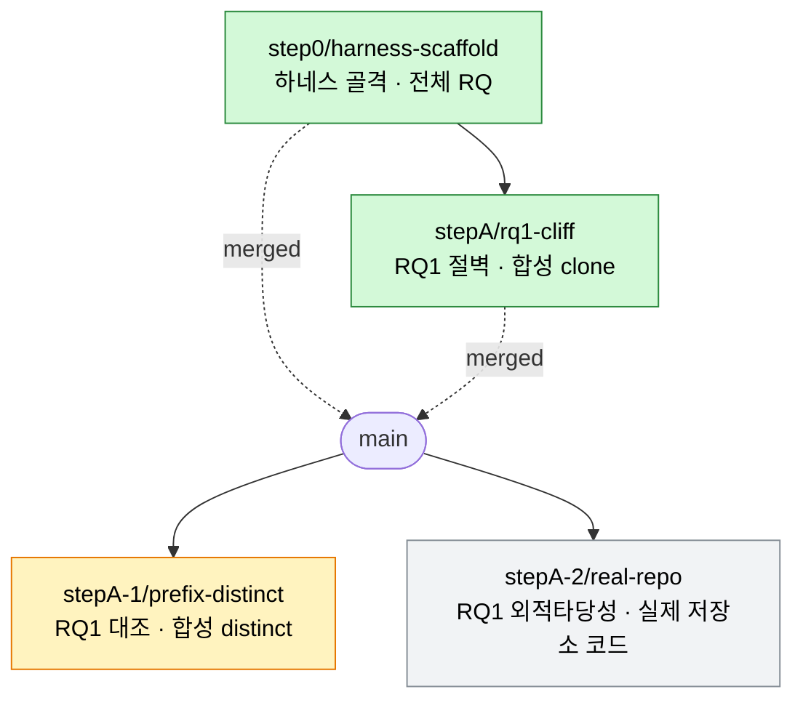

# 브랜치 지도 (branch map)

각 브랜치가 **어떤 실험**을 하는지 한눈에. 상태 바뀔 때마다 갱신한다.

## 실험 트리

범례: 🟢 머지 완료 · 🟡 진행 중 · ⚪ 예정

## 상태표

| 브랜치 | 실험 | RQ | 상태 | PR | 노트북 |
|---|---|---|---|---|---|
| `step0/harness-scaffold` | 하네스 골격 (조건 스키마·단일 진입점) | 전체 | 🟢 머지 | #1 | — |
| `stepA/rq1-cliff` | 절벽 재현 (합성 clone) | RQ1 | 🟢 머지 | #2 | `stepA_rq1-cliff` |
| `stepA-1/prefix-distinct` | 대조: 선행 distinct (데모 오버라이드 방어) | RQ1 | 🟡 실행 중 | — | `stepA-1_prefix-distinct` |
| `stepA-2/real-repo` | 대조: 실제 저장소 코드 (언어 관습 2×2) | RQ1 | ⚪ 착수 전 | — | — |
| `docs/branch-map` | 이 지도 문서 | — | 🟡 | — | — |

## 다음 예정 (임계 경로)

`stepA` 계열(RQ1) 다음은 RQ2·RQ3·방법론. 브랜치는 착수할 때 판다.

| 예정 브랜치 | 실험 | RQ |
|---|---|---|
| `stepB/…` | RQ2 기반 관측 (지침 2×2 어텐션) | RQ2 |
| `stepC/…` | RQ2 개입 (KV 치환 회복) | RQ2 |
| `step1/layer-sweep-kv-split` | 층 스윕 + K/V 분해 | RQ2 |
| `step2/…` | 모델 다양성 | RQ2 |
| `step5/negation-2x2x2` | 부정형 지침 행동 | RQ3 |
| `step6/…` | 부정형 지침 내부 관측 | RQ3 |
| `step7/…` | 형태 인식 선택적 스티어링 | 방법론 |

임계 경로: `step0 → stepA → stepB → stepC → step1 → step2 → step5 → step6 → step7`
(stepA-1·A-2는 RQ1 대조로 병렬)
