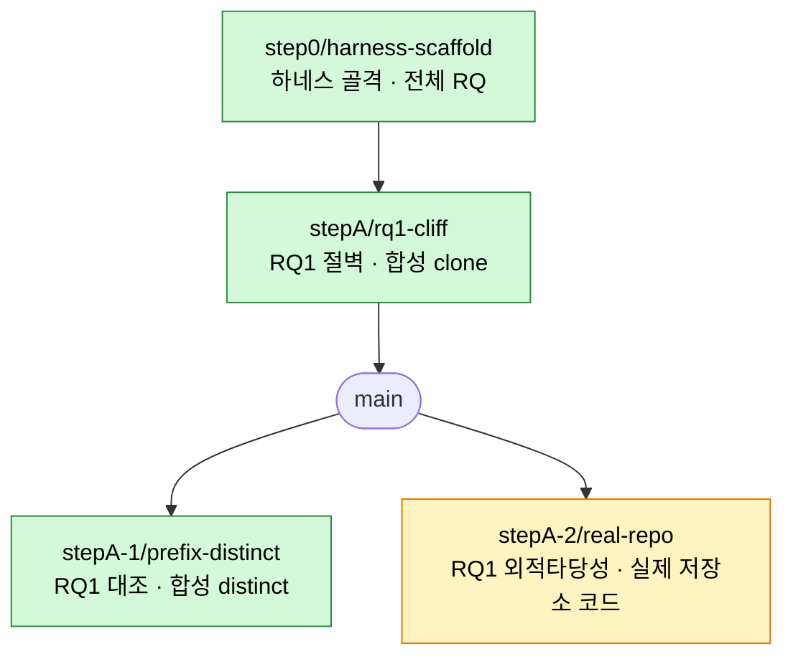

# 브랜치 지도 (branch map)

각 브랜치가 **어떤 실험**을 하는지 한눈에. 상태 바뀔 때마다 갱신한다.

## 실험 트리

범례: 🟢 머지 · 🟡 리뷰/진행 · ⚪ 예정

## 상태표

| 브랜치 | 실험 | RQ | 상태 | PR |
|---|---|---|---|---|
| `step0/harness-scaffold` | 하네스 골격 | 전체 | 🟢 머지 | #1 |
| `stepA/rq1-cliff` | 절벽 재현 (합성 clone) | RQ1 | 🟢 머지 | #2 |
| `stepA-1/prefix-distinct` | 대조: 선행 distinct | RQ1 | 🟢 머지 | #4 |
| `stepA-2/real-repo` | 대조: 실제 저장소 코드 (언어 관습 2×2) | RQ1 | 🟡 리뷰 | — |

## RQ1 결과 요약 (A·A-1·A-2)

> 모델은 함수 이름을 **주변 코드의 표기 관습에 맞추고, 지침(논리 제약)은 거의 불활성**이다.
> A(clone) 바닥 · A-1(distinct) camel 0 · A-2(실코드) 지침 바꿔도 출력 불변.
> RQ1 행동 축 마무리 → 다음은 RQ2(내부 기제).

## 다음 예정 (임계 경로)

| 예정 브랜치 | 실험 | RQ |
|---|---|---|
| `stepB/…` | RQ2 기반 관측 (지침 2×2 어텐션·‖v‖) | RQ2 |
| `stepC/…` | RQ2 개입 (KV 치환 회복) | RQ2 |
| `step1/layer-sweep-kv-split` | 층 스윕 + K/V 분해 | RQ2 |
| `step2/…` | 모델 다양성 | RQ2 |
| `step5/negation-2x2x2` | 부정형 지침 행동 | RQ3 |
| `step6/…` | 부정형 지침 내부 관측 | RQ3 |
| `step7/…` | 형태 인식 선택적 스티어링 | 방법론 |

임계 경로: `step0 → stepA → stepB → stepC → step1 → step2 → step5 → step6 → step7`
(stepA-1·A-2는 RQ1 대조로 병렬 완료)
