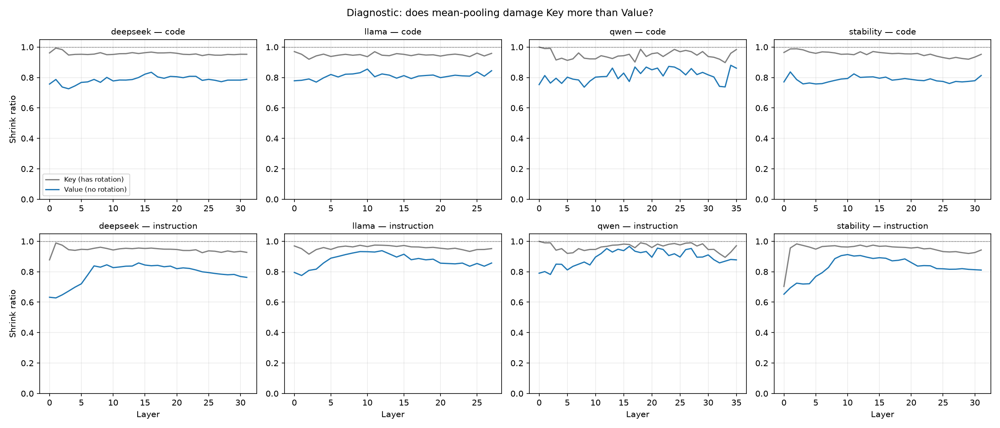

# 진단 결과 — 평균 덮어쓰기는 어텐션 쪽을 망가뜨리지 않았다

> **성격:** 실험 A(방법 점검). 새 주장을 만드는 실험이 아니라 **기존 방법이 고장났는지 확인**한 것.
> **대상:** step3(코드 인과)·step5(지침 인과)가 공유하는 KV 치환 로직.
> **실행:** 4모델 × 6묶음 × 3갈래 = 72조건, Tesla T4, 모델당 몇 분.
> **재현:** `python scripts/diag_kv_phase_summary.py results/diag_kv-phase --figs docs/diag/figures`

---

## 1. 결과 JSON 읽는 법

> 파일 하나 = **조건 하나**(모델 × 이름 묶음 × 치환 대상). 경로는
> `results/diag_kv-phase/<슬러그>.json`.
> 공통 뼈대(`step`·`rq`·`condition`·`meta`)는 [`../코드_하네스공통.md`](../코드_하네스공통.md) §5~6,
> 이 값을 만드는 코드는 [`code.md`](code.md) §6.
> **점수를 매기지 않는 진단**이라 회복률이 없다 — 대신 "덮어넣은 값이 얼마나 쪼그라들었나"만 본다.

### 1-1. 먼저 — 각 필드가 무엇을 말하는가

**밑바탕 개념**

| 말 | 정의 |
|---|---|
| **조각(piece)** | 한 이름이 토크나이저에서 쪼개진 토큰들(`split_config` → `split`·`_`·`config`) |
| **평균 덮어쓰기** | 공여 쪽 조각들의 KV를 **평균 내어 한 벡터**로 만든 뒤, 덮을 이름의 **모든 조각 자리**에 그대로 넣는 방식 |
| **줄어듦(shrink)** | `‖조각들의 평균‖ ÷ 조각 노름들의 평균`. **1이면 평균 내도 크기 손해가 없다**(조각들이 같은 방향). 작을수록 서로 지워졌다는 뜻 |
| **왜 Key만 재면 안 되나** | 서로 다른 조각을 평균 내면 회전(RoPE)이 없어도 조금은 줄어든다. 그래서 **회전이 안 박힌 Value의 같은 값을 기준선**으로 나란히 잰다 |

**per_layer** — 키는 층 번호(문자열)

| 필드 | 무슨 값인가 |
|---|---|
| `key_shrink` | **Key의 줄어듦.** 위치 회전이 박혀 있는 쪽 |
| `value_shrink` | **Value의 줄어듦.** 회전이 없는 **기준선** |
| `key_minus_value` | 둘의 차이 ← **핵심 값.** **양수 = Key가 오히려 덜 줄었다 = 노름 붕괴 우려 기각.** 음수가 크면 Key만 손해를 본 것 |
| `key_piece_cosine` | Key 조각들끼리의 평균 코사인 = **방향이 얼마나 모여 있나**(1이면 완전히 같은 방향) |
| `value_piece_cosine` | Value 조각들의 같은 값 |

**extra**

| 필드 | 무슨 값인가 |
|---|---|
| `mode` | `"kv_diagnose"` — 점수를 안 매기는 진단 경로 |
| `intervention_target` | 어느 치환을 진단했나. `"code"`(step3) / `"instruction"`(step5) |
| `donor` | 그 치환의 공여(`compliant` / `opposite_instruction`) — **진단 대상 실험과 같은 설정**이라는 확인용 |
| `position_offsets` | 이름별 **(덮을 자리 평균) − (공여 자리 평균)**. 위치가 어긋난 칸 수 |
| `position_offset_abs_mean` | 그 절댓값 평균. **위상(회전) 어긋남의 유일한 대리 지표**다 — 위치가 멀수록 회전 위상도 벌어진다 |
| `donor_piece_counts` | 이름별 **공여 조각 수** |
| `target_piece_counts` | 이름별 **덮을 자리 조각 수**. 두 수가 다른 것이 평균 덮어쓰기를 쓰는 이유다(1:1로 못 짝지어진다) |
| `n_substituted_tokens` | 실제로 덮은 자리 수 |
| `skipped_names` | 자리를 못 찾아 빠진 이름 번호 |
| `viol_names` · `donor_names` | 덮인 이름 / 덮어넣은 이름 |
| `S_clean` · `S_base` · `gap` · `undecidable` | 진단 대상 조건이 **애초에 판정 가능한 조건이었는지** 확인용(뜻은 [`../step3/results.md`](../step3/results.md) §1-1과 같다). 이 진단에서는 점수를 쓰지 않는다 |

### 1-2. 실제 파일 모양

```jsonc
"metrics": {
  "per_layer": {
    "17": {
      "key_shrink":         0.9512,   // Key 줄어듦   (1이면 손해 없음)
      "value_shrink":       0.8417,   // Value 줄어듦 (회전 없는 기준선)
      "key_minus_value":    0.1095,   // ← ★ 음수가 크면 Key만 손해
      "key_piece_cosine":   0.83,     // 조각들 방향이 얼마나 모여 있나
      "value_piece_cosine": 0.61
    }, …
  },
  "extra": {
    "mode": "kv_diagnose",
    "intervention_target": "code",              // 또는 instruction
    "donor": "compliant",
    "position_offsets": [-3.5, 12.0, …],        // 덮을 자리 − 공여 자리
    "position_offset_abs_mean": 8.4,            // 평균 위치 어긋남
    "donor_piece_counts": [2, 2, 3, …],         // 공여 조각 수
    "target_piece_counts": [3, 3, 2, …],        // 덮을 자리 수
    "n_substituted_tokens": 31,
    "S_clean": …, "S_base": …, "gap": …, "undecidable": false
  }
}
```

### 1-3. 읽는 순서

1. `intervention_target`·`donor`로 **어느 실험의 치환을 진단한 파일인지** 확인한다.
2. `key_minus_value`를 층별로 본다. **양수면 노름 붕괴 가설 기각**(Key가 더 망가지지 않았다).
3. **`position_offset_abs_mean`을 반드시 함께 본다.** 위치가 거의 안 어긋난 조건에서만
   양수가 나온 것이라면 근거가 약해진다. 실제로는 어긋남이 큰 모델에서도 같은 결론이 나왔다(→ §3).
4. 집계: `python scripts/diag_kv_phase_summary.py results/diag_kv-phase --figs docs/diag/figures`

---

## 2. 무엇이 걱정이었나

캐시에 저장된 **Key에는 그 조각이 문장 몇 번째에 있었는지가 회전 형태로 박혀 있다**(RoPE).
Value에는 그런 것이 없다. 그런데 우리는 여러 조각을 **평균 내어** 덮어쓴다.
회전 방향이 엇갈린 벡터를 평균하면 서로 지워져 **원래보다 짧은 벡터**가 된다.

→ 그러면 "어텐션을 바꿔도 안 돌아온다"가 **어텐션 경로의 성질**인지
**우리가 Key를 망가뜨린 탓**인지 구분할 수 없다. 편향의 방향이 우리 결론과 같아
독립적인 감사 문서 세 편이 모두 이 지점을 지적했다
(`docs/구조적_결함.md` A3 · `docs/step3/구조적_결함.md` A2 · `docs/결함검증_재실험판정.md` §3-1).

**재는 값**

```
줄어듦 = ‖조각들의 평균‖ ÷ 조각 노름들의 평균      (1이면 손해 없음)
```

Key만 재면 판단할 수 없다 — 서로 다른 조각을 평균 내면 회전이 없어도 조금은 줄어든다.
그래서 **Value의 같은 값을 기준선**으로 함께 쟀다.

---

## 3. 결과 — 우려는 기각된다



**회색(어텐션)이 파랑(내용)보다 위에 있다. 전 층·전 모델·양쪽 대상에서.**

| 모델 | 대상 | 어텐션 줄어듦 | 내용 줄어듦 | 차이(K−V) |
|---|---|---|---|---|
| Qwen | 코드 | 0.948±0.004 | 0.814±0.006 | **+0.134** |
| | 지침 | 0.963±0.002 | 0.892±0.005 | **+0.071** |
| DeepSeek | 코드 | 0.957±0.001 | 0.785±0.003 | **+0.172** |
| | 지침 | 0.944±0.002 | 0.788±0.007 | **+0.156** |
| Llama | 코드 | 0.948±0.002 | 0.810±0.003 | **+0.138** |
| | 지침 | 0.957±0.001 | 0.874±0.005 | **+0.083** |
| StableCode | 코드 | 0.955±0.002 | 0.785±0.003 | **+0.170** |
| | 지침 | 0.948±0.007 | 0.829±0.008 | **+0.119** |

**Key는 0.94~0.96으로 거의 안 줄어든다.** 오히려 Value가 0.79~0.89로 **더** 줄어든다.
차이는 8개 비교 전부 **양수**이고 신뢰구간이 매우 좁다.

### 왜 이런가 — 조각들이 어느 쪽을 보고 있나

| 모델 | 대상 | 어텐션 조각 코사인 | 내용 조각 코사인 |
|---|---|---|---|
| Qwen | 코드 | **0.799** | 0.329 |
| | 지침 | **0.855** | 0.594 |
| DeepSeek | 코드 | **0.846** | 0.303 |
| | 지침 | **0.849** | 0.472 |
| Llama | 코드 | **0.800** | 0.317 |
| | 지침 | **0.833** | 0.530 |
| StableCode | 코드 | **0.830** | 0.263 |
| | 지침 | **0.841** | 0.476 |

Key 조각들은 서로 **같은 방향**(코사인 0.80~0.86)을 본다. Value 조각들이 오히려 제각각이다(0.26~0.59).

이유는 단순하다. 우리가 평균 내는 조각들은 **한 단어 안의 이웃한 조각 2~3개**다.
회전은 위치 차이에 비례하는데 **2~3칸 차이로는 위상이 거의 안 벌어진다.**
반면 Value는 조각마다 담긴 내용이 실제로 달라서(`split` vs `_` vs `config`) 방향이 흩어진다.

### 위치는 얼마나 어긋나 있었나

| 모델 | 코드 대상 | 지침 대상 |
|---|---|---|
| Qwen | **0.0칸** | **0.0칸** |
| Llama | **0.0칸** | **0.0칸** |
| DeepSeek | 3.2칸 | 0.5칸 |
| StableCode | 3.0칸 | 0.5칸 |

Qwen·Llama는 **위치가 정확히 일치**한다(camel/snake 토큰 수가 같아 뒤가 안 밀린다).
어긋남이 있는 DeepSeek·StableCode도 3칸 수준이고, 그 두 모델에서 Key 줄어듦이 더 나쁘지도 않다.

---

## 4. 그래서 무엇이 확정되나

**① "어텐션 경로는 표기 정보를 나르지 않는다"를 그대로 주장할 수 있다.**
step3 재집계에서 Key의 표기 순효과는 −0.005~0.021(내용의 2~11%)이었다.
그 값이 **우리 방법이 Key를 망가뜨려서 나온 것이 아님**이 확인됐다.
리뷰어가 가장 먼저 찌를 지점이 막혔다.

**② "어텐션을 얹으면 신호가 깎인다"도 방법의 산물이 아니다 — 진짜 현상이다.**
step3 재집계에서 K+V 순효과(0.117)가 V 단독(0.253)의 절반 이하였다.
이것이 Key 왜곡 탓이라고 의심했는데, **Qwen은 위치 어긋남이 0칸이고 Key 줄어듦도 0.948로 멀쩡한데
같은 현상이 나타난다.** 방법 탓으로 돌릴 수 없다.

→ 해석: 공여의 Key를 넣으면 모델이 **그 자리를 얼마나 볼지가 바뀌고**, 그 결과 제대로 넣어둔
Value 내용이 덜 읽힌다. **어텐션과 내용이 상호작용한다**는 뜻이며, "어텐션은 잉여"라는 옛 서술보다
정확하고 흥미로운 이야기다.

**③ 재실험 C(위상 보정 Key 재측정)는 하지 않는다.** 보정할 왜곡이 없다.

---

## 5. 남은 것

**B(step5 통제)는 여전히 필요하다.** 이 진단은 "Key가 망가졌나"만 답한다.
step5 전이율(0.42~0.89)에 **거품이 얼마나 꼈는지**는 통제 조건이 있어야 알 수 있다.

---

## 6. 기록해 둘 것 — 실행 환경

이번 실행부터 `meta`가 자동으로 남는다.

```
git_sha 04363ce (dirty=false) · torch 2.11.0+cu128 · transformers 5.13.1
accelerate 1.14.0 · Tesla T4 · python 3.12.13
```

> **주의.** `requirements.txt`는 `transformers==4.46.3`으로 고정했는데 실제로는 **5.13.1**이 쓰였다.
> Colab에 미리 깔린 버전이 유지된 것으로 보인다. KV 캐시 레이아웃이 버전마다 갈리므로
> (`model._cache_kv`가 세 갈래를 분기 처리한다) **B를 돌리기 전에 설치 셀이 실제로 고정 버전을
> 설치하는지 확인**하거나, 고정 버전을 5.13.1로 바꿔 맞춰야 한다.
> 다행히 이번 진단의 결론은 버전에 민감한 종류가 아니다(비율만 본다).
