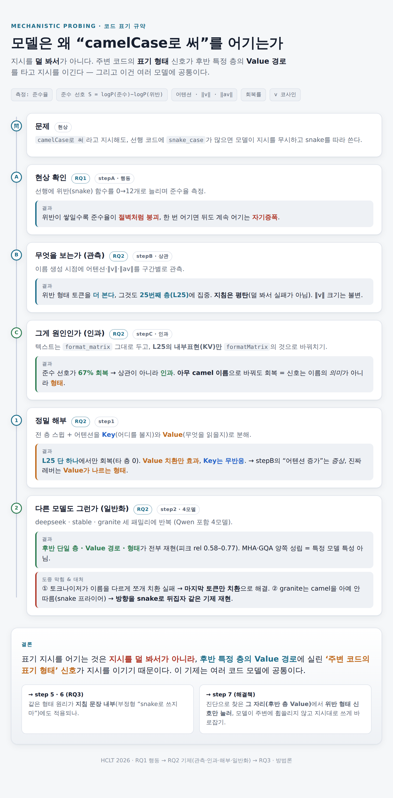
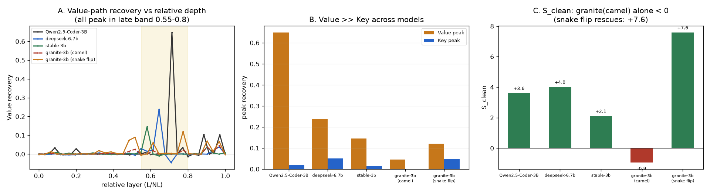

# 중간 정리본 — 어디까지 왔나 (2026-08-10)

> **한 줄 현황:** 논문의 두 핵심 축인 **RQ1(행동)·RQ2(기제)를 완료**했다. 남은 것은 RQ3(지침 일반화)·방법론(해결책)·부록, 그리고 **정식 원고 집필**. **논문 완성까지 약 40% 지점.**

---

## 1. 지금까지 한 것 (한눈에)

| 질문 | 무엇을 밝혔나 | 상태 |
|---|---|---|
| **RQ1** 위반 코드가 준수율을 낮추는가 | 위반이 쌓이면 준수율 **절벽 붕괴 + 자기증폭** | ✅ 완료 (stepA) |
| **RQ2** 매개 신호가 무엇/어디/어느 경로인가 | **후반 단일 층(L25류)의 Value 경로에 실린 형태 신호** — 관측→인과→해부→4모델 일반화 | ✅ 완료 (stepB·C·1·2) |
| **RQ3** 같은 원리가 지침 문장에도 적용되나 | — | ⬜ 미착수 (step5·6) |
| **방법론** 진단을 이용한 해결책 | — | ⬜ 미착수 (step7) |

**핵심 결과(확보):**
- 텍스트는 그대로 두고 **후반 층 내부표현(Value)만** 준수판으로 바꾸면 준수 선호가 회복된다 → 형태 신호가 **인과**.
- **Value 경로만 효과, Key(어텐션 라우팅)는 무반응** → 관측된 "어텐션 증가"는 증상, 레버는 Value.
- **아무 준수-형태**로 바꿔도 회복 → 신호는 이름의 *의미*가 아니라 **표기 형태**.
- **4개 코드 모델 패밀리(Qwen·deepseek·stable·granite)에서 재현** (후반 단일 층·Value·형태). MHA·GQA 양쪽 성립.

---

## 2. 실험 단계 진척 (계획서 §0 기준)

| step | 내용 | 상태 |
|---|---|---|
| step 0 | 하네스 골격(조건 스키마·단일 진입점) | ✅ |
| step A | RQ1 절벽 재현 | ✅ |
| step B | RQ2 관측(어텐션·‖v‖·‖av‖) | ✅ |
| step C | RQ2 인과(KV 치환 회복) | ✅ |
| step 1 | 층 스윕 + K/V 분해 + 코사인 | ✅ |
| step 2 | 모델 다양성 (4모델) | ✅ (PR #12 검토 중) |
| step 3 | 선행 구성 ablation | ⬜ 병렬 가능 |
| step 4 | 실제 저장소 코드 | ⬜ 병렬 가능 |
| **step 5** | 부정형 지침 행동 (RQ3) | ⬜ **다음 임계경로** |
| **step 6** | 부정형 지침 내부 (RQ3) | ⬜ |
| **step 7** | 방법론 구현·평가 | ⬜ |
| step 8 | 로짓 렌즈 | ⬜ 후순위 |
| step 9 | 문헌·데이터셋 | ⬜ 후순위 |

임계 경로: `step0→A→B→C→1→2` **(여기까지 완료)** `→ 5→6→7`.

---

## 3. 논문 완성도 — 섹션별

| 논문 섹션 | 재료(결과·그림) | 정식 원고 | 대략 완성도 |
|---|---|---|---|
| 서론·문제 정의 | 있음 | 미작성 | ~15% |
| 관련 연구(문헌) | step9 미착수 | 미작성 | ~5% |
| 방법(하네스·조건 스키마) | 코드 완성 | 서술 미작성 | ~40% |
| RQ1 결과 | 확보 | md만 | ~70% |
| RQ2 결과 (관측·인과·해부·일반화) | **확보(4모델)** | md·그림 | ~75% |
| RQ3 결과 | 미착수 | — | 0% |
| 방법론(해결책) | 미착수 | — | 0% |
| 논의·한계 | 일부(caveat 기록됨) | 미작성 | ~20% |
| 부록(로짓 렌즈 등) | 미착수 | — | 0% |

**종합 추정:**
- **실험/결과 트랙: ~50%** — 논문의 두 축(RQ1·RQ2) 완료. RQ3·방법론·부록 남음(계획서 §6이 말한 "신규 축").
- **원고 집필 트랙: ~10%** — `results.md`·그림은 초안 재료로 확보, 정식 논문 원고는 미착수.
- **→ 논문 완성까지 약 40% 지점.**

> 참고: 계획서 §6은 "RQ1·RQ2는 이미 결과가 확보된 축, RQ3과 방법론이 신규 축"이라 배분했다. 지금은 **확보 축을 끝내고 신규 축의 입구**에 서 있다.

---

## 4. 정직하게 남겨둔 caveat (논문 한계 절 재료)

- **회복 크기 모달(last-token):** step2에서 토크나이저 문제로 마지막 토큰만 치환 → 회복 절대값이 작다. 주장은 **절대값이 아니라 패턴(국소·Value·형태) 재현**으로 스코프.
- **v 코사인 공-국소화 미재현:** 인과(개입)는 4모델 재현되나 방향 관측 지표는 모델별 상이 → 2차 지표.
- **granite 비대칭:** camel 지침 미준수(snake 프라이어) → 정방향 negative, snake 방향 뒤집기에서 기제 재현. 방법론(step7)의 적용 경계.
- **후속:** ① Qwen last-token 재실행으로 크기 잣대 통일, ② stepB 관측(어텐션·지침 평탄)의 모델 일반화, ③ v 코사인 관측 재정의.

---

## 5. 다음 단계

1. **step 5·6 (RQ3):** 같은 형태-신호 원리가 **지침 문장 내부**, 특히 부정형("snake로 쓰지 마")에도 적용되는지. → 방법론(step7)의 마지막 근거.
2. **step 7:** 진단(후반 층·Value·형태)을 이용해 위반 형태 신호를 눌러 지시대로 쓰게 바로잡는 해결책 구현·평가.
3. (병렬) step 3·4, (후순위) step 8·9.

*문서: 모델별 상세 `docs/step2/<model>/results.md`, 종합 `docs/step2/results.md`. 결과 원자료 `results/`(불변).*
