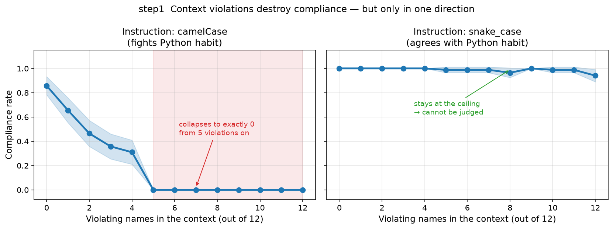

# step1 결과 — 문맥 위반과 준수율 (RQ1)

> **스텝:** step1 · **RQ:** RQ1 (문맥의 규약 위반이 준수율을 떨어뜨리는가)
> **결과:** `results/step1_cliff/` 2184개 · **재현:** `python scripts/step1_reaggregate.py results/step1_cliff`

---

## 1. 결과 JSON 읽는 법

> 파일 하나 = **조건 하나**(모델 × 위반 개수 × 지침 방향 × 이름 묶음). 경로는
> `results/step1_cliff/<슬러그>.json`이고, 파일명만으로 조건이 복원된다.
> 공통 뼈대(`step`·`rq`·`condition`·`meta`)는 [`../코드_하네스공통.md`](../코드_하네스공통.md) §5~6,
> 이 값을 만드는 코드는 [`code.md`](code.md) §6.

### 1-1. 먼저 — 각 필드가 무엇을 말하는가

**밑바탕 개념**

| 말 | 정의 |
|---|---|
| **표기(notation)** | 함수 이름의 형태. `camel`(`removeDuplicates`) · `snake`(`remove_duplicates`) · `other`(둘 다 아님 — `RemoveDuplicates`, 한 단어 이름 등) |
| **목표 표기(target)** | 그 조건의 **지침이 요구한** 표기. 이것과 같으면 준수, 다르면 위반 |
| **턴(turn)** | 모델에게 함수를 써 달라고 한 횟수. **저장된 2184개는 전부 1턴**이라 아래 배열은 길이가 1이다 |

**metrics 최상위** — 여섯 칸은 전 스텝 공용이라 이 스텝이 안 채우는 칸은 `null`이다.

| 필드 | 무슨 값인가 |
|---|---|
| `compliance_rate` | **준수율.** 모델이 새로 쓴 첫 함수 이름의 표기가 목표 표기와 같으면 `1.0`, 아니면 `0.0`. 파일 하나는 생성 1회이므로 0 아니면 1이고, 표에 실린 값은 **이름 묶음 42개 평균** |
| `compliance_preference` | `null` — 개입 스텝(step3·5·6)의 자리 |
| `attention_weight` · `v_norm` · `av_norm` · `v_cosine` | `null` — 관측 스텝(step2·4)의 자리. **step1은 모델 내부를 보지 않는다** |
| `per_layer` | `{}` — 층별 값이 없다(생성만 한다) |

**extra** — 이 스텝이 실제로 채우는 곳

| 필드 | 무슨 값인가 |
|---|---|
| `target` | 지침이 요구한 표기(`"camel"` / `"snake"`). 준수 판정의 기준 |
| `turn_names` | 모델이 실제로 쓴 함수 이름. **판정의 근거** |
| `turn_notations` | 그 이름을 정규식으로 판정한 표기(`camel`/`snake`/`other`) |
| `turn_texts` | 생성 원문 전체. 판정이 미심쩍으면 눈으로 검증한다 |
| `first_compliant` | 첫 함수가 목표 표기였나 (= `compliance_rate == 1.0`) |
| `first_violated` | 첫 함수가 목표를 어겼나 |
| `subsequent_violation_rate` | **2번째 턴부터의 위반 비율**(자기증폭 지표. "첫 함수가 위반일 때"라는 조건부는 집계 단계에서 건다). 1턴만 돌아서 **전부 `null`** — 즉 이 데이터로 자기증폭은 판정할 수 없다(→ §5) |

### 1-2. 실제 파일 모양

```jsonc
"metrics": {
  "compliance_rate": 0.0,              // 첫 함수가 목표 표기면 1.0
  "extra": {
    "target": "camel",                 // 지침이 요구한 표기
    "turn_notations": ["snake"],       // 턴별 판정. 길이 1 = 1턴만 돌았다
    "turn_names": ["remove_duplicates"],// 모델이 실제로 쓴 이름 ← 판정의 근거
    "turn_texts": ["def remove_dup…"], // 생성 원문. 눈으로 검증할 수 있다
    "first_compliant": false,
    "first_violated": true,
    "subsequent_violation_rate": null  // 1턴이라 항상 null
  }
}
```

### 1-3. 읽는 순서

1. `extra.target`을 본다 — 무엇을 요구한 조건인가.
2. `compliance_rate`를 본다 — 지켰나.
3. **0이면 반드시 `turn_names`를 함께 본다.** 0인 이유가 "snake를 썼다"인지
   "이름을 못 뽑았다(`other`)"인지는 여기서만 갈린다. `turn_notations`가 `"other"`면
   후자이고, 그 조건은 표기 위반이 아니라 **판정 실패**에 가깝다.
4. 조건별로 묶어 평균 내는 것은 `python scripts/step1_reaggregate.py results/step1_cliff`.

---

## 2. 무엇을 어떻게 쟀나

앞선 코드 12개 함수 중 **규약을 지킨 개수**를 0~12로 바꿔 가며, 모델이 새로 쓰는 **첫 함수 이름의
표기가 지침을 따르는 비율**을 잰다.

- 모델 2개(Qwen2.5-Coder-3B · StableCode-3B), 이름 묶음 42개, 지침 방향 2종, 시드 42.
- 모든 값은 **42묶음 평균 ± 95% 신뢰구간**.
- 언어는 파이썬.

---

## 3. 결과

### 한눈에 보기



왼쪽(camel 지침)만 무너진다. 오른쪽(snake 지침)은 천장에 붙어 있어 조작이 통하지 않는다.

### 논문용 그림


**지침이 camelCase일 때** (파이썬 관습과 반대 방향)

| 문맥의 위반 개수 | Qwen | StableCode |
|---|---|---|
| 0 | 1.000±0.000 | 0.714±0.138 |
| 1 | 0.976±0.047 | 0.333±0.144 |
| 2 | 0.762±0.130 | 0.167±0.114 |
| 3 | 0.643±0.147 | 0.071±0.079 |
| 4 | 0.548±0.152 | 0.071±0.079 |
| **5 이상** | **0.000±0.000** | **0.000±0.000** |

**지침이 snake_case일 때** (파이썬 관습과 같은 방향)

문맥이 전부 camel이어도(위반 12개) 준수율이 Qwen 1.000, StableCode 0.881이다.
**모든 위반 수준에서 0.88~1.00으로 천장에 붙어 있어 문맥 조작이 통하지 않는다.**

---

## 4. 해석

**(1) 문맥의 위반은 준수율을 떨어뜨린다 — 단, 지침이 모델의 사전 선호와 어긋날 때만.**
파이썬에서 snake_case는 모델의 기본값이다. 지침이 snake면 문맥이 무엇이든 모델은 지침을 지킨다.
지침이 camel일 때만 문맥이 힘을 발휘한다. **RQ1은 방향 조건부로 성립한다.**

**(2) 완만한 하락이 아니라 임계다.**
위반 4개까지는 부분적으로 버티지만, **위반 5개(12개 중 약 40%)에서 준수율이 정확히 0으로 무너지고
그 아래로는 회복하지 않는다.** 42묶음 중 단 한 번도 지침을 지키지 않는다.

**(3) 지침을 듣는 힘과 무너지는 지점은 별개다.**
위반이 없을 때 준수율은 Qwen 1.00 vs StableCode 0.71로 크게 다르다. 그런데 **무너지는 지점은
두 모델이 같다(위반 5개).** 모델을 키워 지침 순응도를 높여도 임계 자체는 같은 자리에 남을 수 있다.

---

## 5. 이 스텝이 다루지 않는 것

- **파이썬만.** 다른 언어에서 방향을 뒤집어 확인하지 않았다.
- **첫 함수만.** 조건마다 한 번 생성했으므로, 위반이 뒤따르는 함수로 번지는지(자기증폭)는
  이 데이터로 판정할 수 없다.
- 모델 2개(코드 특화 2종). step2~5의 4모델 중 절반이다.
