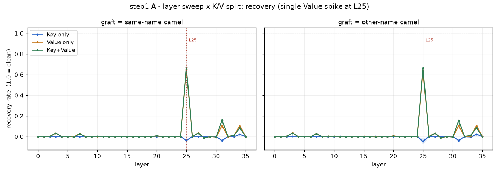
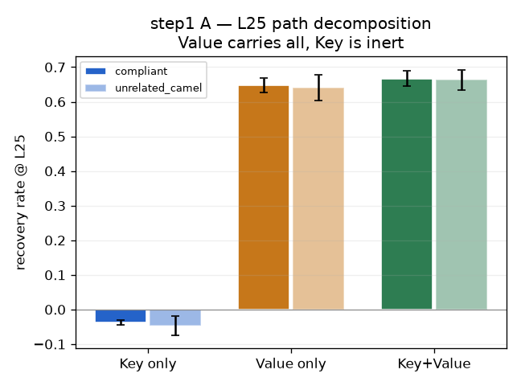
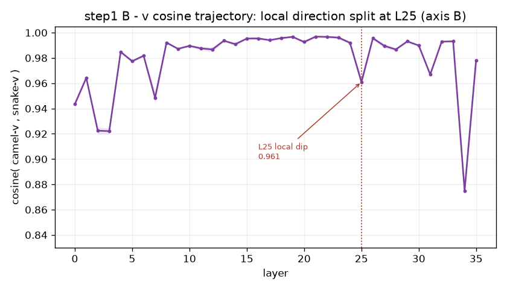

# step 1 결과 — RQ2 층 스윕 + K/V 분해 (1차 실행)

**대응 RQ:** RQ2 — 표기 형태를 매개하는 신호가 **어느 층**인가, **어느 경로(Key/Value)**인가, 그리고 그것이 **의미인가 형태인가·크기인가 방향인가**.

**설정.** `Qwen/Qwen2.5-Coder-3B-Instruct` (fp16, **36층**, GQA `num_attention_heads=16 / num_key_value_heads=2 / head_dim=128`, group 8). 지침=positive·camel·weak, 선행 = **전부 위반**(POOL n=0, snake 12개). L25 상대 위치 = 25/35 = **0.714**(후반).

- **개입(A):** 30개 결과 중 스윕 20개 = **이식값 2종** × 10 seed. 각 조건이 **전 36층 × {Key만/Value만/Key+Value}**에서 세 상태 S와 회복률.
  - **이식값**(graft) = L25에서 위반 이름의 Value를 *무엇으로* 덮어쓰느냐, 그 재료. 두 종류:
    - `compliant` = **같은이름-camel** (위반 `format_matrix`의 같은 단어 camel판 `formatMatrix`)
    - `unrelated_camel` = **다른이름-camel** (위반과 무관한 단어의 camel판, 예 `parseHeader`)
- **관측(B):** 코사인 10개 = 10 seed. 같은 이름의 camel판 v와 snake판 v의 층별 코사인.

> **실행 전 예측:** 회복률 피크는 후반부(≈L25, 상대 0.6~0.75)에 국소화. compliant와 unrelated_camel 곡선은 전 층에서 겹침(형태 결론 유지). Value 단독 회복이 유의하면 축 B 성립. v 코사인은 피크 층 부근에서 하락 → Value 회복률 피크와 같은 층이면 축 B 확정.

**sanity.** `S_깨끗 = +3.61` → `S_위반 = −2.87`. 위반 선행이 준수 선호를 준수(+)에서 위반(−)으로 뒤집는다. 측정 경로 정상. ✓

---

## 1. 결과

### 1a. 층 국소화 — L25 단일 스파이크

회복률이 **오직 L25에서만** 튀고 나머지 전 층은 ≈0.00이다. (이식값=같은이름-camel, 대표 층)

| kind | L20 | L24 | **L25** | L26 | L30 | L35 |
|---|---|---|---|---|---|---|
| Value | +0.01 | +0.00 | **+0.648** | +0.00 | −0.01 | +0.00 |
| Key+Value | +0.01 | +0.00 | **+0.667** | −0.00 | −0.01 | +0.00 |
| Key | −0.00 | −0.00 | **−0.038** | −0.00 | −0.00 | −0.00 |

stepC가 고른 L25가 우연이 아니었다. **전 층 스윕이 L25를 유일 피크로 확정**한다. 리뷰어의 "왜 25층?"에 곡선으로 답한다. 피크가 후반부(0.71)라는 것은 "표기 형태 결정이 출력에 가까운 단계에서 굳는다"는 해석과 맞물린다(계획서 §2.5 → step 8 로짓 렌즈).

### 1b. K/V 분해 — Value가 전부, Key는 무반응 (핵심)

L25에서 경로별 회복률(10 seed 평균 ± std):

| kind | 같은이름-camel | 다른이름-camel |
|---|---|---|
| **Value 단독** | **+0.648** ± 0.021 | +0.640 ± 0.02 |
| Key+Value | +0.667 ± 0.022 | +0.663 ± 0.02 |
| **Key 단독** | **−0.038** ± 0.007 | −0.046 ± 0.01 |

- 회복은 **전부 Value가 진다.** Key+Value가 Value 단독보다 겨우 **+0.019** 크다 → Key의 추가 기여는 사실상 없다.
- **Key 단독은 무반응** — 전 층에서 0에 붙어 있고(피크조차 L34 +0.02), L25에서는 오히려 미세 음수(−0.04).
- → 표기 형태 신호는 **Value 경로**(토큰이 실어 나르는 내용)에 있다. 어텐션 라우팅(Key)이 아니다.

### 1c. 형태 vs 의미 — 이식값 통제 통과

**같은이름-camel**(`formatMatrix`)과 **다른이름-camel**(`parseHeader` 등, 의미가 전혀 다름) 두 곡선이 **사실상 동일**하다: Key+Value 곡선의 **평균 절대차 0.001, 최대 0.005**. 의미가 완전히 틀린 이름을 이식해도 회복이 같다 → 회복을 내는 실효 성분은 이름의 **의미가 아니라 camel 형태 그 자체**다. 이 결론이 L25만이 아니라 전 층에서 유지된다.

### 1d. v 코사인 궤적 — L25 국소 딥 (축 B 방향)

| L | 0 | 20 | 24 | **25** | 26 | 30 | 35 |
|---|---|---|---|---|---|---|---|
| cos(camel-v, snake-v) | 0.943 | 0.993 | 0.992 | **0.961** | 0.996 | 0.990 | 0.978 |

코사인이 전반적으로 높지만(~0.99), **정확히 L25에서 국소 최소(0.961)**로 떨어졌다가 L26에서 즉시 회복(0.996)한다. **Value 회복률 피크와 같은 층에서 방향이 갈린다** → 축 B(Value·방향) 확정.

단 절대값이 0.96로 크게 안 떨어진다. camel/snake의 v는 **대부분 같고(식별자 의미 공유) + L25에서 작지만 결정적인 방향 성분**만 다르다. ‖v‖(크기)는 stepB에서 이미 불변(배율 1.002). 즉 **형태 신호 = Value 안의 미세한(≈4%) 방향 성분**. (전체 최소 L34=0.875는 회복 0인 층 → 출력부 일반 드리프트로, 표기와 무관.)

---

## 2. Q/K/V — Key와 Value는 무엇이 다른가

이 실험의 핵심이 "Key는 무반응, Value가 전부"이므로, 세 벡터의 역할을 짚어둔다.

어텐션 층에서 각 토큰은 세 벡터를 만든다. 지금 **이름을 생성하려는 위치**(query 토큰)가 **선행 코드의 위반 이름 토큰들**(key/value를 가진 토큰)을 참조하는 상황이다.

| | 무엇인가 | 비유 | 이 실험에서의 역할 |
|---|---|---|---|
| **Q (Query)** | 지금 토큰이 **무엇을 찾는지**의 질의 | 검색창에 친 검색어 | 생성 위치가 "다음 함수 이름 표기를 어떻게?"를 묻는 질의 (개입 대상 아님) |
| **K (Key)** | 각 참조 토큰이 **자신을 어떻게 광고하는지**의 색인 | 책들의 색인표 | Q·K 내적이 **어텐션 가중치**를 정한다 = "어느 토큰을 볼지" (**라우팅**) |
| **V (Value)** | 각 참조 토큰이 **실제로 실어 나르는 내용** | 색인이 가리키는 책의 본문 | 어텐션 가중치로 가중합돼 잔차 스트림에 더해진다 = "무엇을 읽을지" (**내용**) |

핵심 공식(개념): `출력 = Σ_j softmax(Q·K_j) · V_j`. **K는 얼마나 볼지(가중치)를, V는 무엇을 읽을지(운반물)를** 결정한다.

> **용어 주의 — "내용"이 두 뜻으로 쓰인다(혼동 지점).** 축을 분리한다.
> - **축 1 (신호가 *무엇*인가):** 이름의 **의미(semantics)** vs **표기 형태(notation)**. → §1c가 답: **형태**.
> - **축 2 (신호가 *어느 통로*인가):** **Key**(라우팅) vs **Value**(운반물). → §1b가 답: **Value**.
>
> "Value = 내용"의 '내용'은 **축 2의 "어텐션이 나르는 운반물"**이지, 축 1의 "코드 의미"가 아니다. 두 결론("신호는 형태다" + "그 신호는 Value 통로로 흐른다")은 층위가 달라 충돌하지 않는다. Value 벡터 안엔 의미·형태가 같이 실리지만(코사인 96% 공유=의미, 4% 차=형태), **표기 결정이 읽어가는 실효 성분은 형태뿐**이다(§1c의 이식값 통제가 증명 — 의미 틀린 이름을 이식해도 회복 동일).

**그래서 이 실험의 치환이 무엇을 검증하나:**

- **Key만 치환** = 위반 이름의 **색인(K)**을 준수판 색인으로 바꾼다. 어텐션 라우팅은 준수판처럼 재조정되지만, 정작 읽히는 **운반물(V)은 위반 그대로**. → 회복 안 됨(−0.04). "어디를 볼지"를 바꿔도 결정은 안 바뀐다.
- **Value만 치환** = 색인(K)은 위반 그대로 두어 어텐션 라우팅은 안 건드리고, **읽히는 운반물(V)만** 준수판으로 바꾼다. → 회복(+0.65). "무엇을 읽을지"를 바꾸면 결정이 바뀐다.

**stepB와의 관계 — 증상과 원인의 분리.** stepB는 "생성 위치가 위반 형태 토큰을 **더 본다**"(어텐션 가중치 1.18배 = 축 A, K 쪽 현상)를 관측했다. 그런데 step1은 그 **K를 준수판으로 바꿔도 결정은 안 바뀌고**, **V(운반물)를 바꿔야 바뀐다**고 말한다. 즉 stepB가 본 어텐션 증가는 **증상(correlate)**이고, 표기를 실제로 뒤집는 **인과 레버는 Value가 실어 나르는 형태 성분**이다. 관측(축 A) → 인과(축 B)로 초점이 정확히 이동했다. 이 dissociation이 step1의 가장 중요한 기여다.

> **주의(하네스 §3 GQA):** 이 모델은 KV head가 2개뿐이고 query head 16개가 8개씩 공유한다. 치환은 반드시 **KV group 단위**로 수행했다(캐시 `[B, n_kv=2, seq, d]`를 직접 편집). group을 무시하면 치환 정밀도가 깨진다.

---

## 3. 해석 — RQ2의 답과 다음으로

| 질문 | 답 | 근거 |
|---|---|---|
| 어느 층인가 | **L25 단일**, 후반(0.71), 날카로운 스파이크 | 1a — 타 층 전부 ≈0 |
| 어느 경로인가 | **Value**. Key는 무반응 | 1b — Value 0.65 / Key −0.04 |
| 의미인가 형태인가 | **형태** | 1c — 이식값 곡선 차 0.001 |
| 크기인가 방향인가 | **방향** (미세 성분) | 1d — L25 코사인 국소 딥 0.961 |

**이 답들이 방법론(step 7) 설계를 못 박는다:**

- 개입 지점 = **후반 단일 층(이 모델은 L25) × Value 경로**. Key 개입·어텐션 증폭은 불필요(효과 0).
- 이식값은 **아무 camel 형태면 충분**(정확한 이름 불필요) → 스티어링 벡터를 형태만으로 구성 가능.
- 형태 신호가 **미세 방향 성분**이라는 점은 스티어링이 정밀해야 함을 뜻한다 → 크게 밀 필요 없이 그 성분만 조준.

**다음 step:**
- **step 2 (모델 다양성):** 이 (후반 단일 층 + Value 우세 + 형태) 패턴이 다른 패밀리에서도 보존되는가. 피크 층 위치는 달라도 "국소화·Value 우세"가 공통이면 일반 원리.
- **step 8 (로짓 렌즈):** 피크가 후반 + 형태 신호가 미세 방향 성분 → 표기 토큰 확률이 L25 부근에서 확정되는지 직접 확인할 강한 동기.
- **step 3·4·5 (RQ3):** 같은 회로(후반 층 Value 성격)가 **자기 출력의 되먹임**에도 적용되는지 — 자기증폭이 이 회로를 타는가.

---

## 4. 한계

- **단일 모델·단일 표기 방향(camel target).** 일반화는 step 2에서 검증. snake target 방향은 미측정.
- **부분 회복(≈0.67).** stepC와 동일하게 완전 회복(1.0)은 아니다. 결정 경계를 넘겨 그리디 생성은 뒤집히지만(stepC 1b), 선호 점수상 잔여 위반 신호가 남는다 — 다른 층·경로에 분산된 소수 신호 가능성. step 2·8에서 재확인.
- **코사인 절대값 해석.** L25 딥이 국소적임은 분명하나(0.99→0.96→0.99), 그 "미세 방향 성분"의 실체는 코사인만으로 다 규명되지 않는다. 차이 벡터의 방향·로짓 기여를 step 8에서 분해할 필요.

**산출물은 `results/step1/`에 불변 저장(§6). 예측은 위 §설정에 결과와 함께 보존.**
