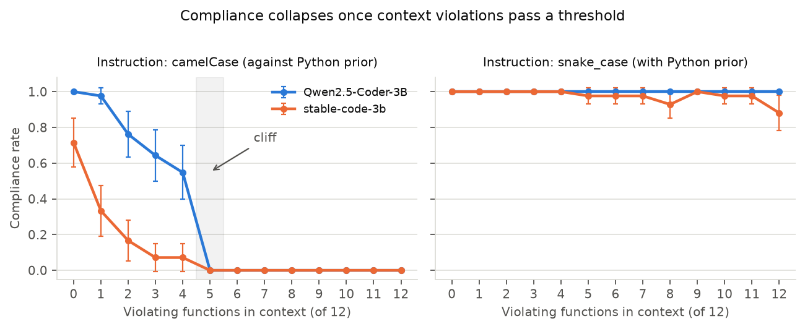
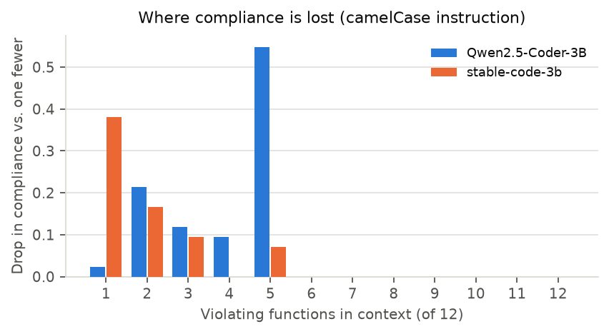

# step1 결과 — 준수율 절벽 (RQ1)

**질문(RQ1).** 앞선 코드가 표기 규약을 어기고 있으면, 모델의 지침 준수율이 떨어지는가.

---

## 1. 설정

| 축 | 값 |
|---|---|
| 모델 | `Qwen/Qwen2.5-Coder-3B-Instruct`, `stabilityai/stable-code-instruct-3b` |
| 지침 | 긍정형·약한 어조. "In this project we generally write function names in *X*." + 후보를 camelCase/snake_case 두 개로 닫음 |
| 지침 방향 | camel 목표 / snake 목표 2종 |
| 선행 코드 | 함수 12개. 그중 **위반 개수 0~12** (13단계). 나머지는 지침대로 |
| 이름 | 504개 풀을 12개씩 42묶음으로 **중복 없이** 전부 커버 |
| 측정 | 모델이 새로 쓴 함수 1개의 이름 표기가 지침과 같으면 준수 |
| 표본 | 조건당 42묶음 = 모델당 13×2×42 = **1,092회**, 총 2,184회 |
| 기타 | 파이썬, seed 42, 개입 없음 |

집계표: `summary.csv` · 재현: `python scripts/step1_cliff_report.py`

---

## 2. 결과

준수율(%), 위반 개수 0→12:

| 모델 · 지침 | 0 | 1 | 2 | 3 | 4 | **5** | 6 | 7 | 8 | 9 | 10 | 11 | 12 |
|---|---|---|---|---|---|---|---|---|---|---|---|---|---|
| Qwen · camel | 100 | 98 | 76 | 64 | 55 | **0** | 0 | 0 | 0 | 0 | 0 | 0 | 0 |
| stable · camel | 71 | 33 | 17 | 7 | 7 | **0** | 0 | 0 | 0 | 0 | 0 | 0 | 0 |
| Qwen · snake | 100 | 100 | 100 | 100 | 100 | 100 | 100 | 100 | 100 | 100 | 100 | 100 | 100 |
| stable · snake | 100 | 100 | 100 | 100 | 100 | 98 | 98 | 98 | 93 | 100 | 98 | 98 | 88 |

---

## 3. 해석

**(1) RQ1은 "그렇다". 다만 완만한 하락이 아니라 절벽이다.**
camel 지침에서 위반이 4개일 때까지는 준수가 남아 있다가(Qwen 55%), **5개째에서 두 모델 모두 정확히 0%**가 된다. 그 뒤 12개까지 한 번도 0을 벗어나지 않는다. 42묶음 전부에서 예외가 없다.

**(2) 임계점은 두 모델이 같고, 다른 것은 출발점이다.**
위반이 없을 때 준수율은 Qwen 100% vs stable 71%로 크게 다르다. 지침을 듣는 힘 자체는 모델마다 다르다는 뜻이다. 그런데 **무너지는 지점(12개 중 5개, 약 40%)은 동일하다.** 지침 강도와 문맥 임계점이 분리된 축이라는 신호다. 모델을 키워 지침을 더 잘 듣게 만들어도 절벽 자체는 같은 자리에 남을 수 있다.

**(3) 절벽은 "지침과 언어 관습이 부딪히는 방향"에서만 보인다.**
snake 지침(파이썬 관습과 같은 방향)은 위반이 12개여도 준수율이 거의 100%다. 즉 위반 문맥이 모델을 아무 방향으로나 흔드는 게 아니라, **관습 쪽으로 되돌리는 힘**으로 작동한다. 실제로 준수 실패는 전부 snake 출력이었다(무의미한 이름이나 제3의 표기는 0건). 문맥 위반과 파이썬 사전지식이 같은 방향으로 합쳐질 때만 지침이 진다.

> snake 방향은 처음부터 100%라 내려갈 여지가 없다 — 이 방향은 **RQ1 판정 불가**로 분리한다(§CLAUDE.md §4). 위 결론은 camel 방향에서만 성립한다. 동시에 이 방향은 대조군 역할을 한다: 모델이 지침을 전반적으로 무시하는 게 아님을 보여준다.

**(4) 감소가 몰리는 자리는 모델마다 다르다.**
stable은 위반 1개에서 이미 38%p가 빠지고 이후 완만하게 0으로 간다. Qwen은 1~4개를 버티다 5개째에 55%p를 한 번에 잃는다. 절벽의 **위치는 같지만 모양은 다르다** — stable은 문맥에 즉각 반응하고, Qwen은 버티다가 무너진다.

---

## 4. 다음 스텝에 주는 제약

- **기제 실험(step2~5)의 조건은 위반 5개 이상 구간에서 잡는다.** 그 구간은 준수율이 완전히 0이라 개입 효과(되돌림 정도)를 잡음 없이 잴 수 있다.
- **0~4개 구간은 쓰지 않는다.** 준수율이 중간값이라 개입 없이도 흔들려 인과 판정이 흐려진다.
- **지침 방향은 camel로 고정한다.** snake 방향은 영향력을 잴 여지가 없다.
- 두 모델의 출발점 차이(100% vs 71%)는 step4·5(지침 영향력)에서 **모델별 지침 영향력 차이**로 다시 나올 값이다. 미리 기록해 둔다.

---

## 5. 한계

- 생성 함수는 조건당 1개다. 연속 생성에서 위반이 누적되며 어떻게 변하는지는 안 봤다.
- 모델 2개(계획서 4개 중). deepseek-coder-6.7b·Llama-3.2-3B는 미실행.
- 파이썬만. JS는 미실행 — "관습과 부딪히는 방향에서만 절벽"이라는 (3)의 주장은 관습이 camel인 언어에서 방향을 뒤집어 확인해야 완성된다.
- 위반 개수만 조작했고 **위반의 위치**(생성 지점에 가까운지)는 고정하지 않았다. 임계점이 개수 때문인지 근접성 때문인지는 미분리.

산출물은 `results/step1_cliff_results_*/`에 불변 저장(§6).
