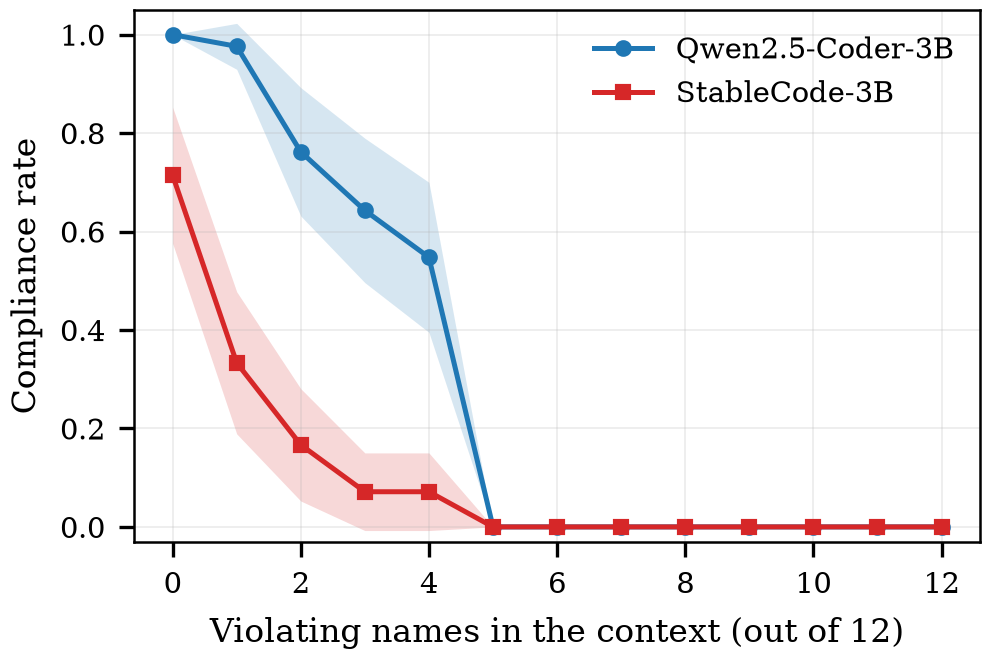

# step1 결과 — 문맥 위반과 준수율 (RQ1)

> **스텝:** step1 · **RQ:** RQ1 (문맥의 규약 위반이 준수율을 떨어뜨리는가)
> **결과:** `results/step1_cliff/` 2184개 · **재현:** `python scripts/step1_reaggregate.py results/step1_cliff`

---

## 1. 무엇을 어떻게 쟀나

앞선 코드 12개 함수 중 **규약을 지킨 개수**를 0~12로 바꿔 가며, 모델이 새로 쓰는 **첫 함수 이름의
표기가 지침을 따르는 비율**을 잰다.

- 모델 2개(Qwen2.5-Coder-3B · StableCode-3B), 이름 묶음 42개, 지침 방향 2종, 시드 42.
- 모든 값은 **42묶음 평균 ± 95% 신뢰구간**.
- 언어는 파이썬.

---

## 2. 결과

**지침이 camelCase일 때** (파이썬 관습과 반대 방향)

| 문맥의 위반 개수 | Qwen | StableCode |
|---|---|---|
| 0 | 1.000±0.000 | 0.714±0.138 |
| 1 | 0.976±0.047 | 0.333±0.144 |
| 2 | 0.762±0.130 | 0.167±0.114 |
| 3 | 0.643±0.147 | 0.071±0.079 |
| 4 | 0.548±0.152 | 0.071±0.079 |
| **5 이상** | **0.000±0.000** | **0.000±0.000** |

**지침이 snake_case일 때** (파이썬 관습과 같은 방향)

문맥이 전부 camel이어도(위반 12개) 준수율이 Qwen 1.000, StableCode 0.881이다.
**모든 위반 수준에서 0.88~1.00으로 천장에 붙어 있어 문맥 조작이 통하지 않는다.**

---

## 3. 해석

**(1) 문맥의 위반은 준수율을 떨어뜨린다 — 단, 지침이 모델의 사전 선호와 어긋날 때만.**
파이썬에서 snake_case는 모델의 기본값이다. 지침이 snake면 문맥이 무엇이든 모델은 지침을 지킨다.
지침이 camel일 때만 문맥이 힘을 발휘한다. **RQ1은 방향 조건부로 성립한다.**

**(2) 완만한 하락이 아니라 임계다.**
위반 4개까지는 부분적으로 버티지만, **위반 5개(12개 중 약 40%)에서 준수율이 정확히 0으로 무너지고
그 아래로는 회복하지 않는다.** 42묶음 중 단 한 번도 지침을 지키지 않는다.

**(3) 지침을 듣는 힘과 무너지는 지점은 별개다.**
위반이 없을 때 준수율은 Qwen 1.00 vs StableCode 0.71로 크게 다르다. 그런데 **무너지는 지점은
두 모델이 같다(위반 5개).** 모델을 키워 지침 순응도를 높여도 임계 자체는 같은 자리에 남을 수 있다.

---

## 4. 이 스텝이 다루지 않는 것

- **파이썬만.** 다른 언어에서 방향을 뒤집어 확인하지 않았다.
- **첫 함수만.** 조건마다 한 번 생성했으므로, 위반이 뒤따르는 함수로 번지는지(자기증폭)는
  이 데이터로 판정할 수 없다.
- 모델 2개(코드 특화 2종). step2~5의 4모델 중 절반이다.
