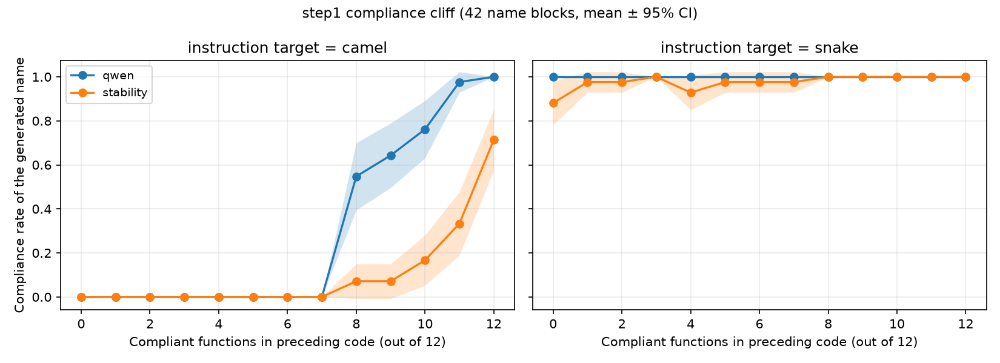

# step1 재집계 — 절벽은 한쪽 방향에만 있다 (RQ1, 준수율)

> **스텝:** step1(준수율 절벽) · **RQ:** RQ1 · **성격:** **재실험 아님. 기존 결과 2184개의 재집계.**
> **재현:** `python scripts/step1_reaggregate.py results/step1_cliff --figs docs/step1/figs`
> **결과 파일은 건드리지 않았다**(§6 불변).

---

## 1. 준수율 절벽 — 방향별로 나눠 보면

앞선 코드 12개 중 규약을 지킨 함수가 몇 개냐(0~12)에 따라, 모델이 새로 쓰는 첫 함수가
지침대로인 비율. 42묶음 평균 ± 95% 신뢰구간.

### 지침 목표 = camelCase

| 준수 개수 | Qwen2.5-Coder-3B | StableCode-3B |
|---|---|---|
| 0 ~ 7 | **0.000** (8개 수준 전부) | **0.000** (7 이하 전부) |
| 8 | 0.548±0.152 | 0.071±0.079 |
| 9 | 0.643±0.147 | 0.071±0.079 |
| 10 | 0.762±0.130 | 0.167±0.114 |
| 11 | 0.976±0.047 | 0.333±0.144 |
| 12 | 1.000±0.000 | 0.714±0.138 |

### 지침 목표 = snake_case

| 준수 개수 | Qwen | StableCode |
|---|---|---|
| 0 | 1.000±0.000 | 0.881±0.099 |
| 1 ~ 11 | **1.000** (전부) | 0.929 ~ 1.000 |
| 12 | 1.000±0.000 | 1.000±0.000 |



---

## 2. 해석 — RQ1 주장을 좁혀야 한다

### (가) snake 방향에는 절벽이 없다. 천장에 붙어 있다

지침이 snake일 때는 **앞선 코드가 전부 camel이어도(준수 개수 0) 준수율이 1.000이다.**
문맥이 아무 영향을 주지 않는다. 조작이 통하지 않는 조건이므로 **RQ1의 근거가 될 수 없다.**

이유는 명백하다 — **파이썬에서 snake_case가 모델의 기본값**이다. 지침과 모델의 사전 선호가
같은 방향이라 문맥이 끼어들 여지가 없다.

### (나) camel 방향은 절벽이 아니라 **계단**이다

준수 개수 0~7에서 준수율이 **정확히 0.000**이다. 7개가 camel이어도 모델은 **한 번도** camel을
쓰지 않는다. 8개째부터 갑자기 올라온다.

이건 "위반이 늘수록 준수율이 서서히 떨어진다"가 아니라
**"문맥의 과반(8/12 이상)이 camel이 되기 전까지는 지침이 전혀 먹히지 않는다"** 이다.

### (다) 그래서 RQ1은 이렇게 써야 한다

| 지금 서술 | 고쳐야 할 서술 |
|---|---|
| "문맥의 규약 위반이 준수율을 떨어뜨린다" | **"모델의 사전 선호와 지침이 어긋날 때(파이썬+camelCase), 문맥의 과반이 지침 편이 되기 전까지 지침은 전혀 먹히지 않는다"** |
| 양 방향을 함께 제시 | **snake 방향은 천장 효과로 판정 불가**임을 명시하고 분리 |
| "절벽" | 0~7이 전부 0인 **계단(임계) 형태**임을 그대로 기술 |

> 이 방향 비대칭은 step5에서 StableCode가 보인 방향 비대칭(camel 0.45 / snake 1.32,
> `docs/step5/결과_재집계.md`)과 같은 뿌리다. **모델의 사전 선호가 어느 쪽이냐가 모든 스텝에서
> 결과를 가른다.** 논문 전체에서 방향을 합쳐 보고하면 안 된다.

---

## 3. 측정되지 않은 지표 — 자기증폭

`subsequent_violation_rate`(첫 함수가 위반이면 뒤 함수도 위반하는가)는
**2184개 조건 전부 비어 있다(null).**

원인은 주석과 구현의 불일치가 아니라 더 단순하다 — **step1은 조건마다 1턴만 생성했다.**

```
생성 턴 수 분포 : {1: 2184}
```

뒤따르는 함수가 아예 없으므로 **뒤 함수의 위반율이라는 값 자체가 존재하지 않는다.**
`turn_notations`에도 이름이 하나씩만 들어 있다.

**따라서 자기증폭은 재계산으로 못 살린다.** 둘 중 하나를 택해야 한다.

1. **주장에서 뺀다** — 논문에서 자기증폭을 언급하지 않는다 (권장: RQ1의 본체는 절벽이다).
2. **다시 돌린다** — 3턴 생성으로 step1을 재실행. 2모델 × 26조건 × 42묶음 = 2184회 생성.

> `runner._run_generation`은 `GENERATION_TASKS`(3개)를 전부 도는 구조인데 결과가 1턴이다.
> 노트북이 과제를 1개만 넘겼거나 `max_new_tokens`에서 끊긴 것으로 보인다.
> 다시 돌린다면 **먼저 그 원인을 확인**해야 같은 일이 반복되지 않는다.

또한 구현 자체의 문제도 남아 있다 — 주석은 "첫 함수가 위반일 때"라는 **조건부**를 말하는데
구현은 **무조건부**다. 재실행 전에 집계 방식을 정하고 주석·필드명을 맞춰야 한다.
