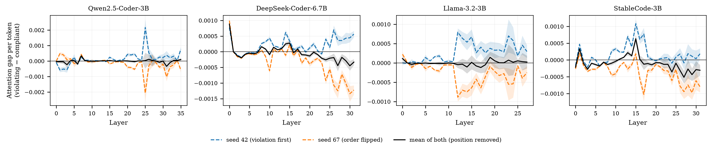
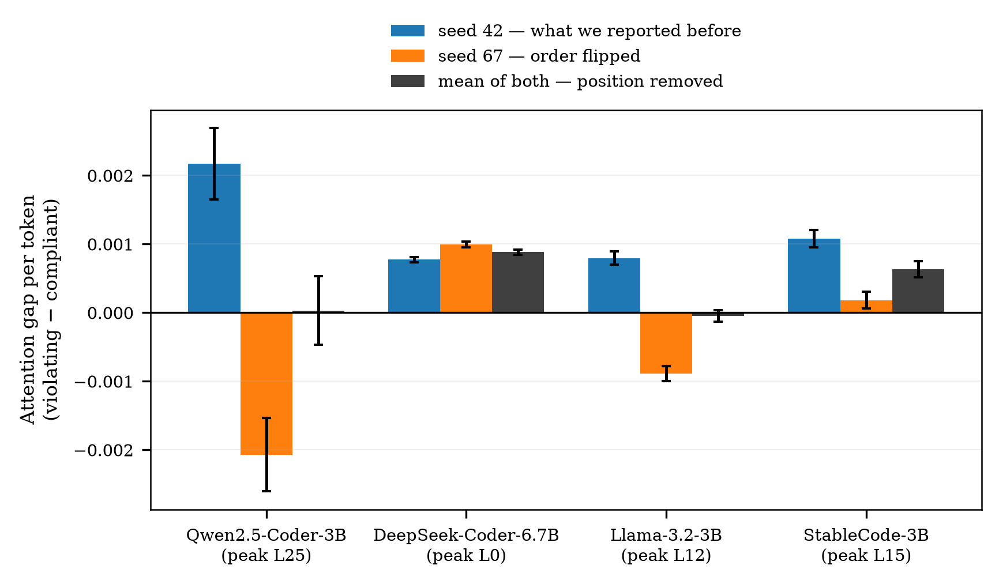

# step2 결과 — 코드 신호의 위치와 층 (RQ2 관측)

> **스텝:** step2 · **RQ:** RQ2 (코드의 표기 신호가 어디에, 어느 층에 있는가 — 관측)
> **결과:** `results/step2_code-observe/` 168개
> **재현:** `python scripts/observe_per_token.py results/step2_code-observe` (표) · `python scripts/step2_figures.py` (그림)

---

## 1. 결과 JSON 읽는 법

> 파일 하나 = **조건 하나**(모델 × 이름 묶음). 경로는 `results/step2_code-observe/<슬러그>.json`.
> 공통 뼈대(`step`·`rq`·`condition`·`meta`)는 [`../코드_하네스공통.md`](../코드_하네스공통.md) §5~6,
> 이 값을 만드는 코드는 [`code.md`](code.md) §6.

### 1-1. 먼저 — 각 필드가 무엇을 말하는가

**밑바탕 개념** (모르면 [`../개념_트랜스포머와_개입.md`](../개념_트랜스포머와_개입.md) §2-1~2-4)

| 말 | 정의 |
|---|---|
| **관측 시점** | 프롬프트 끝에 `"def "`를 붙여 만든 **새 이름 자리**. 어텐션 행렬의 **마지막 한 줄**(그 자리의 query)만 쓴다 → §2-2 |
| **구간(span)** | 그 한 줄에서 **어느 열(토큰 자리)들을 합칠지**. `code_camel`·`code_snake`·`instruction`·`instr_target_word`·`instr_viol_word` 5종 → §2-3 |
| **a (어텐션)** | 그 자리에서 어떤 토큰을 얼마나 보는가. 한 줄의 합이 1이므로 구간 값은 곧 **비중** |
| **v (Value)** | 그 토큰이 실어 나르는 **내용 벡터**. 어텐션이 "얼마나 보나"라면 v는 "무엇을 실어 오나" |
| **‖v‖** | 그 내용의 **크기** |
| **‖a·v‖** | 어텐션 × 내용 크기. 그 구간이 이번 자리에 기여할 수 있는 **크기의 상한 대리치** |
| **층(layer)** | `per_layer`의 키. 문자열 `"0"`~`"L−1"`이다(JSON 제약). 층마다 따로 재서 "어느 층에서 격차가 벌어지나"를 본다 |

**per_layer** — 키는 `<구간>__<지표>` 로 납작하게 펴져 있다.

| 필드 | 무슨 값인가 | 합인가 평균인가 |
|---|---|---|
| `<구간>__attention_weight` | 그 구간 토큰들에 준 어텐션. query head 평균 후 **구간 합**. 0~1의 질량 | **합** |
| `<구간>__av_norm` | Σ_j (a_j · ‖v_j‖). 기여 상한 대리치. 벡터 상쇄를 무시하고 출력 사영(W_O) **이전** 값이라 실제 기여량이 아니다 | **합** |
| `<구간>__v_norm` | 구간 토큰 ‖v‖의 **토큰당 평균**(KV head 평균). 크기 지표라 합이 아니라 평균이 맞다 | **평균** |

> ⚠️ **앞의 둘은 합, 마지막 하나는 평균이다.** 그래서 `attention_weight`·`av_norm`은
> 구간이 길수록 커진다 — 반드시 `span_token_counts`로 나눠서 비교한다(→ §1-3).

**extra**

| 필드 | 무슨 값인가 |
|---|---|
| `mode` | `"observe"` — 관측만 했다는 표시. 개입은 없다 |
| `target` | 지침이 요구한 표기. step2는 **전부 `"camel"`** 이다(→ §5) |
| `instruction_form` | 지침 형태(`"positive"` = "…라고 쓴다"는 긍정 서술) |
| `span_token_counts` | **구간별 토큰 수.** 합 지표를 토큰당으로 환산하는 분모 — 이것 없이는 구간끼리 비교할 수 없다 |
| `group_names` | 각 코드 구간에 실제로 들어간 함수 이름 목록. 구간이 의도한 이름을 잡았는지 검증용 |
| `gqa` | `num_attention_heads`(query head 수 Hq) · `num_key_value_heads`(KV head 수 Hkv) · `group_size`(= Hq÷Hkv, 한 KV를 공유하는 query head 수). a는 query head별, v는 KV head별이라 곱하려면 이 매핑이 필요하다 |
| `seq_len` | 프롬프트 전체 토큰 수 |
| `token_detail` | 코드 두 구간(`code_camel`·`code_snake`)의 **토큰 하나하나** 값. `tokens`는 `{t: 토큰 번호, text: 그 글자}`, `per_layer["<층>"]`은 그 토큰들의 `a`·`av`·`v` 배열(순서가 `tokens`와 같다). 밑줄 조각 등 사후 분석용 |

### 1-2. 실제 파일 모양

```jsonc
"metrics": {
  "per_layer": {
    "27": {
      "code_camel__attention_weight": 0.0184,   // 구간 합 (헤드 평균)
      "code_camel__av_norm":          0.412,    // 구간 합
      "code_camel__v_norm":           22.4,     // 토큰당 평균
      "code_snake__attention_weight": 0.0231,
      "instruction__attention_weight":0.0092,
      …
    }, …
  },
  "extra": {
    "mode": "observe", "target": "camel", "instruction_form": "positive",
    "span_token_counts": {"code_camel": 12, "code_snake": 15, "instruction": 37,
                          "instr_target_word": 4, "instr_viol_word": 2},   // ★ 정규화용
    "group_names": {"code_camel": ["parseHeader", …], "code_snake": ["build_token", …]},
    "gqa": {"num_attention_heads": 16, "num_key_value_heads": 2, "group_size": 8},
    "seq_len": 512,
    "token_detail": {"code_camel": {"tokens": [{"t": 74, "text": " dec"}, …],
                                    "per_layer": {"0": {"a": […], "av": […], "v": […]}, …}}, …}
  }
}
```

### 1-3. 읽는 순서

1. **`span_token_counts`를 먼저 본다.** 토큰 수가 다르면 `attention_weight`·`av_norm`의
   합끼리 비교하지 않는다. 밑줄을 독립 토큰으로 떼는 토크나이저에서 snake 구간이 40%가량
   길어(예: DeepSeek 22.45 vs 16.21) 합으로 보면 긴 쪽이 그냥 유리하다.
2. **토큰당 평균으로 환산해 비교한다** — `attention_weight ÷ span_token_counts`.
   `v_norm`은 이미 토큰당이라 나누지 않는다.
3. `instr_target_word`·`instr_viol_word` 두 선은 **그대로 비교하면 안 된다.** 요구어는
   지침에 2회, 반대어는 1회 등장해 역할이 섞여 있다. 역할을 나눈 키(`instr_rule_word`)는
   **step4에만 있다** → 지침에 대한 판단은 [`../step4/results.md`](../step4/results.md)에서 한다.
4. 표·그림 재생성: `python scripts/observe_per_token.py results/step2_code-observe` (합 vs 토큰당) ·
   `python scripts/step2_figures.py` (그림).

---

## 2. 무엇을 어떻게 쟀나

### 2-1. 어떤 프롬프트인가

모델에게 **함수 12개짜리 모듈**을 보여주고 함수를 하나 더 써 달라고 한다.
12개 중 6개는 지침대로 camel, 6개는 지침을 어긴 snake다(균형 배치).

```
[system]  You are helping extend an existing Python module.
          In this project we generally write function names in camelCase.
          Every function name uses one of two styles only: camelCase or snake_case.

[user]    Here is the current module:

          ```python
          def split_config(value):        ← snake (위반)
              return value

          def decodeNode(value):          ← camel (준수)
              return value

          def fetchToken(value):          ← camel
              return value
          … 12개까지 …
          ```

          Add a function that removes duplicate items from a list, preserving order.
```

블록 0의 실제 이름 12개:

| 무리 | 이름 |
|---|---|
| **camel 6개** | `decodeNode` `fetchToken` `renderBuffer` `encodeRecord` `parseHeader` `buildPayload` |
| **snake 6개** | `split_config` `filter_session` `format_request` `expand_entry` `compute_matrix` `resolve_packet` |

**함수 본문은 12개가 전부 같다**(`return value`). 달라지는 것은 **이름 표기뿐**이다.

> **어텐션·행·헤드가 무엇인지 모르겠다면** 먼저
> [`../개념_트랜스포머와_개입.md`](../개념_트랜스포머와_개입.md) §2-1~2-4를 읽는다.
> "한 줄은 합이 1이라 구간 값이 곧 비중"이라는 것이 아래를 읽는 열쇠다.

### 2-2. 누가 보는가 — 관측 시점 하나

프롬프트 끝에 **`"def "` 를 강제로 붙인다.** 그러면 다음에 올 자리가 **새 함수의 이름 자리**가 된다.

```
… Add a function that removes duplicate items …<|im_end|>
<|im_start|>assistant
def ▮        ← 이 자리(마지막 위치)의 query 한 줄만 관측한다
```

어텐션 행렬은 `[모든 위치 × 모든 위치]`지만, 우리가 쓰는 것은 **마지막 한 줄**이다 —
"이름을 쓰려는 그 순간, 모델이 앞의 어디를 보고 있나".

### 2-3. 무엇을 보는가 — 구간 5종

그 한 줄에서 **어느 열(토큰 자리)** 을 합칠지가 구간이다.

| 구간 | 프롬프트의 어디 | 정확히 어느 토큰 | 토큰 수(Qwen, 42묶음 평균) |
|---|---|---|---|
| `code_camel` | 선행 코드 | camel 이름 **6개의 이름 부분만** | 12.60 |
| `code_snake` | 선행 코드 | snake 이름 **6개의 이름 부분만** | 12.74 |
| `instruction` | system | 지침 **문장 전체** | 37 |
| `instr_target_word` | system | 지침 안의 `camelCase`(2회 등장) | 4 |
| `instr_viol_word` | system | 지침 안의 `snake_case`(1회) | 2 |

> Qwen은 두 구간의 토큰 수가 거의 같다(블록 0은 12 대 12). 크게 갈리는 것은 밑줄을
> 독립 토큰으로 떼는 **DeepSeek(16.21 대 22.45)·StableCode(14.21 대 20.40)** 다 → §2-5.

**"이름 부분만"이 중요하다.** `def split_config(value):` 에서 `def`·`(`·`value`·본문은
전부 제외하고 **`split_config` 만** 잡는다. `def <이름>(` 패턴으로 찾아 앞 4자와 뒤 1자를 깎는다.

```
def split_config(value):
    └┬┘└─────┬────┘
   제외    ← 이것만 (조각 3개: " split", "_", "config")
```

이름이 조각 몇 개로 쪼개지든 **전부** 잡는다 — 그래서 camel 12조각 / snake 15조각처럼
구간 길이가 달라지고, 이것이 §2-5의 정규화 문제를 만든다.

### 2-4. 어떻게 꺼냈나 — forward 1회

```
① 프롬프트 + "def " 를 문자열로 만든다
② 토큰화하면서 offset(각 토큰이 원문의 몇 번째 글자인지)을 함께 받는다
③ 이름·지침의 글자 위치를 offset으로 토큰 번호로 바꾼다   ← 구간 확정
④ 모델을 한 번 통과시킨다 (output_attentions=True, use_cache=True)
⑤ 층마다: 어텐션의 마지막 줄 [헤드 × 전체위치] + KV 캐시의 ‖v‖ [헤드 × 전체위치]
⑥ 구간에 속한 열만 골라 합/평균
```

**층마다 따로** 낸다. 그래서 "어느 층에서 격차가 벌어지나"를 볼 수 있다.
헤드는 평균 낸다(헤드별 분해는 이 스텝의 범위가 아니다).

개입은 없다 — **관측만** 한다. 인과는 step3.

### 2-5. 재는 값 세 가지

- 모델 4개, 이름 묶음 42개(504개 이름 전체 커버), 시드 42.
- 지표
  - **어텐션** — 그 구간에 준 주의의 양
  - **‖a·v‖** — 어텐션과 내용 크기의 곱. 그 구간이 기여할 수 있는 **크기의 상한**
    (방향 상쇄를 무시한 값이며 출력 사영 이전이다)
  - **‖v‖** — 내용 자체의 크기
- **토큰 수로 나눈 값을 쓴다.** 밑줄을 독립 토큰으로 떼는 토크나이저에서 snake 구간이 훨씬 길어
  (DeepSeek 22.45 vs 16.21, StableCode 20.40 vs 14.21) 합끼리 비교하면 긴 쪽이 유리하다.

---

## 3. 결과

### 3-0. 그림이 여섯 묶음이다 — 어느 그림이 무엇인가

앞의 다섯 묶음은 같은 관측 하나(시드 42, 168개 파일)를 **다섯 가지로 잘라 그린 것**이다.
새 실험이 아니다. **가로축은 전부 "몇 번째 층인가"**이고, 다른 것은 **세로축과 그리는 선**뿐이다.

여섯 번째 `position_control`만 **다른 실험**이다 — 표기 배치를 뒤집은 시드 67을 새로 돌려
앞의 다섯 묶음이 본 격차가 **표기 때문인지 자리 때문인지** 가른다(§3-6).

| 그림 묶음 | 몇 장 | 쓴 실행분 | 세로축 | 그리는 선 | 답하는 질문 |
|---|---|---|---|---|---|
| `spans_<모델>` | 4 | 시드 42 | 토큰당 어텐션 | **구간 5종 전부** | 프롬프트의 **어디**를 보나 |
| `attention_<모델>` | 4 | 시드 42 | 토큰당 어텐션 | 코드 camel · snake · 지침(참고) | 코드 두 무리 중 **어느 쪽**을 더 보나 |
| `av_<모델>` | 4 | 시드 42 | 토큰당 ‖a·v‖ | 코드 camel · snake | 어느 쪽이 **더 크게 기여할 수 있나** |
| `vnorm_<모델>` | 4 | 시드 42 | 토큰당 ‖v‖ | 코드 camel · snake | 내용 **자체의 크기**가 다른가 |
| `gap_<모델>` | 4 | 시드 42 | snake − camel **차이** | 토큰당(실선) · 합(점선) | **정규화가 결론을 바꾸나** |
| **`position_control`** | **1(4판)** | **시드 42 + 67** | **snake − camel 차이** | **시드42 · 시드67 · 두 시드 평균** | **격차가 표기 때문인가 자리 때문인가** |

> ⚠️ **앞의 다섯 묶음은 시드 42 하나로만 그렸다.** §3-6이 보이듯 그 격차의 상당 부분(Qwen·Llama는
> 사실상 전부)이 **자리에서 온 것**이다. 다섯 묶음의 격차 수치는 **자리를 포함한 상한**으로 읽어야 한다.

**세 지표의 관계**(→ §2-5 · [`방법론.md`](방법론.md) §3):

| 지표 | 무엇 | 음수가 되나 |
|---|---|---|
| 어텐션 | 그 구간에 준 **주의의 양**. 한 줄 전체가 1이라 곧 **비중**이다 | 안 됨 |
| ‖a·v‖ | 주의 × 내용 크기 = 그 구간이 기여할 수 있는 **크기의 상한** | 안 됨 |
| ‖v‖ | **내용 자체의 크기**(주의와 무관) | 안 됨 |
| `gap` | 위 값들의 **snake − camel** | **됨** (음수 = camel을 더 봄) |

---

### 3-1. 프롬프트의 어디를 보나 — `spans_<모델>` 4장

| 항목 | 이 그림에서 |
|---|---|
| **무엇을 재나** | 새 이름을 쓰려는 순간, 모델의 주의가 프롬프트의 **어느 부분**에 가 있나 |
| **가로축** | **몇 번째 층인가** (0 = 첫 층) |
| **세로축** | **토큰당 어텐션** — 구간이 받은 주의를 그 구간 토큰 수로 나눈 값. "토큰 하나가 받은 몫" |
| **파란 실선** `code: camel names` | 선행 코드의 **camel 이름 6개**(지침을 지킨 쪽) |
| **빨간 실선** `code: snake names` | 선행 코드의 **snake 이름 6개**(지침을 어긴 쪽) |
| **회색 점선** `instruction (whole)` | 지침 **문장 전체** |
| **초록 파선** `instr: camelCase (rule+list)` | 지침 안의 `camelCase` — **참고선**(아래 경고) |
| **보라 파선** `instr: snake_case (list only)` | 지침 안의 `snake_case` — **참고선** |
| **음영** | 42묶음 95% 신뢰구간 |
| **결과** | 빨강이 파랑보다 위에 있고, **코드가 솟는 층과 지시어가 솟는 층이 다르다** |
| **뜻** | 위반 이름을 더 본다. 그리고 코드를 보는 층과 지침을 보는 층은 **별개**다 |

step2는 구간을 **5개** 저장했다. 한 장에 모두 그리면 "이름을 쓰려는 순간 모델이
프롬프트의 어디에 주의를 두는가"가 한눈에 보인다.

| Qwen2.5-Coder-3B | DeepSeek-Coder-6.7B |
|---|---|
|  |  |
| **Llama-3.2-3B (범용)** | **StableCode-3B** |
|  |  |

**코드가 솟는 층과 지시어가 솟는 층이 다르다.**

| 모델 | 코드 봉우리 | 지시어 봉우리 | 그 층에서 지시어÷코드 |
|---|---|---|---|
| Qwen | L25 | **L27** | 5.9배 |
| DeepSeek | L30 | **L17** | 6.9배 |
| StableCode | L0 | **L19** | 12.7배 |
| Llama (범용) | L14 | L13 | 1.4배 |

Qwen의 **L27**, DeepSeek의 **L17**, StableCode의 **L19** — 세 층 모두
**step4의 관측 봉우리이자 step5의 인과 봉우리와 같다.** step2 그림에서 이미 그 층이
드러나 있었는데, 지금까지 코드 두 선만 그려 놓아 보이지 않았다.

> ⚠️ **지침 표기어 두 선은 그대로 비교하면 안 된다.** 초판 키라 역할이 섞여 있다.
>
> ```
> instr_target_word = instr_rule_word + 후보열거 쪽    ← camelCase는 2회 등장
> instr_viol_word   = 후보열거 쪽만                     ← snake_case는 1회
> ```
>
> 8개 조건 전부에서 토큰 수로 검산했다(예: Qwen 4 = 2 + 2, viol 2 = 2).
>
> **토큰당 정규화는 이 문제를 고치지 못한다.** 정규화가 상쇄하는 것은 토큰 수 차이(4 vs 2)뿐이고,
> "요구어 = 규칙문과 후보열거의 **평균** / 반대어 = 후보열거 **하나**"라는 역할 혼합은 남는다.
> 요구어 선이 높게 나와도 그것이 "규칙문을 더 본다"인지 "등장이 잦다"인지 **가를 수 없다.**
>
> 역할을 나눈 `instr_rule_word`는 **step4에만 있다**(step2 결과 파일에는 없다).
> 여기서는 **참고선**으로만 보고, 지침에 대한 판단은 [`../step4/results.md`](../step4/results.md)에서 한다.

---

### 3-2. 어느 쪽을 더 보나 — `attention_<모델>` 4장

| 항목 | 이 그림에서 |
|---|---|
| **무엇을 재나** | 위 그림에서 **참고선 두 개를 뺀 것.** 코드 두 무리의 비교에만 집중한다 |
| **가로축 · 세로축** | 층 / **토큰당 어텐션** (위와 같다) |
| **파란 선 / 빨간 선** | 코드 **camel**(준수) / **snake**(위반) 이름 |
| **회색 점선** | 지침 문장 전체 — **참고용 눈금**이지 비교 대상이 아니다 |
| **음영** | 42묶음 95% 신뢰구간 |
| **읽는 법** | **빨강이 파랑보다 위인가**만 본다. 두 선의 간격이 곧 §3-4의 `gap` |
| **결과** | 네 모델 모두 빨강이 위. 간격은 **중후반 층에서 벌어진다** |
| **⚠️ 뜻** | **"위반을 더 본다"로 읽으면 안 된다.** 이 그림은 시드 42 하나로 그렸고, 그 배치에서 위반 이름이 앞자리에 몰려 있다. 배치를 뒤집으면 **부호가 뒤집힌다**(Qwen·Llama) → **§3-6** |

| Qwen2.5-Coder-3B | DeepSeek-Coder-6.7B |
|---|---|
|  |  |
| **Llama-3.2-3B (범용)** | **StableCode-3B** |
|  |  |

---

### 3-3. 기여할 수 있는 크기 — `av_<모델>` 4장

| 항목 | 이 그림에서 |
|---|---|
| **무엇을 재나** | 주의만이 아니라 **주의 × 내용 크기**. "많이 보는데 실어오는 게 없다"를 가르려는 것 |
| **가로축** | 층 |
| **세로축** | **토큰당 ‖a·v‖** = Σ(어텐션 × 그 자리 값의 길이) ÷ 토큰 수 |
| **파란 선 / 빨간 선** | 코드 camel / snake |
| **음영** | 42묶음 95% 신뢰구간 |
| **⚠️ 주의** | 이건 **상한이지 실제 기여량이 아니다.** 방향이 서로 상쇄되는 것을 무시했고 출력 사영 전이다(→ [`방법론.md`](방법론.md) §3) |
| **결과** | 어텐션과 같은 방향(빨강이 위)이고, **봉우리가 어텐션보다 더 뒤쪽 층**에 온다 |
| **⚠️ 뜻** | **이 묶음도 철회됐다.** ‖a·v‖는 어텐션을 곱하므로 §3-2와 같은 자리 교란을 받는다. 자리를 지우면 Qwen 11%·Llama 3%만 남고 **DeepSeek은 음수로 뒤집힌다** → **§3-6** |

| Qwen2.5-Coder-3B | DeepSeek-Coder-6.7B |
|---|---|
|  |  |
| **Llama-3.2-3B (범용)** | **StableCode-3B** |
|  |  |

---

### 3-4. 정규화가 결론을 바꾸나 — `gap_<모델>` 4장 (이 묶음이 핵심이다)

| 항목 | 이 그림에서 |
|---|---|
| **무엇을 재나** | 두 구간의 **차이 하나**를, **토큰 수로 나눈 값**과 **나누지 않은 값** 두 방식으로 |
| **가로축** | 층 |
| **왼쪽 세로축** (빨강) | `snake − camel`, **토큰당** ← 우리가 쓰는 값 |
| **오른쪽 세로축** (회색) | `snake − camel`, **구간 합** ← 나누지 않은 값. **눈금이 다르다** |
| **빨간 실선** `per token (used)` | 토큰당 격차 |
| **회색 파선** `span sum` | 합 격차 |
| **가로 0선** | 두 축의 0을 **같은 높이로 맞춰** 놓았다(`_align_zero`). 안 맞추면 부호를 잘못 읽는다 |
| **읽는 법** | **양수 = snake를 더 본다 · 음수 = camel을 더 본다.** 두 선의 **부호가 갈리는 층**이 있는지 본다 |
| **결과** | Qwen·Llama는 두 선이 겹친다(토큰 수가 같으니 당연). **DeepSeek·StableCode는 초반 층에서 부호가 갈린다** |
| **뜻** | 밑줄을 독립 토큰으로 떼는 모델에서 **합으로 보면 "snake를 더 본다"가 길이 때문에 부풀려진다.** 그래서 토큰당을 쓴다 |

| Qwen2.5-Coder-3B | DeepSeek-Coder-6.7B |
|---|---|
|  |  |
| **Llama-3.2-3B (범용)** | **StableCode-3B** |
|  |  |

---

### 3-5. 내용 자체의 크기 — `vnorm_<모델>` 4장

| 항목 | 이 그림에서 |
|---|---|
| **무엇을 재나** | 주의를 **빼고**, 그 자리에 저장된 값의 크기만 |
| **가로축 · 세로축** | 층 / **토큰당 ‖v‖** |
| **파란 선 / 빨간 선** | 코드 camel / snake |
| **읽는 법** | 이 값은 **이미 토큰당 평균이라 다시 나누지 않는다**(`step2_figures.py`의 `v_norm` 예외) |
| **결과** | **두 선이 겹쳐서 파란 선이 안 보인다** (Qwen L25에서 9.145 대 8.988) |
| **뜻** | **두 무리의 차이는 "내용이 크다"에서 오지 않는다.** ‖a·v‖의 격차는 대부분 **어텐션 쪽**에서 온 것이다 |

> 후반 층(Qwen L33 등)에서 두 선이 **함께** 크게 솟는데, 이는 표기와 무관하다 —
> 층이 깊어지면 잔차 크기 자체가 커지는 일반 현상이라 **두 무리에 똑같이** 나타난다.
> 이 그림에서 읽을 것은 높이가 아니라 **두 선이 갈라지느냐**이고, 갈라지지 않는다.

| Qwen2.5-Coder-3B | DeepSeek-Coder-6.7B |
|---|---|
|  |  |
| **Llama-3.2-3B (범용)** | **StableCode-3B** |
|  |  |

---

### 3-6. 격차가 표기 때문인가 자리 때문인가 — `position_control` (이 절이 §4를 뒤집는다)

#### 무엇이 문제였나

선행 코드 12개의 표기 배치는 **묶음이 아니라 시드**가 정한다(`prompt.py:151`의 seeded shuffle).
그래서 **42묶음 전부 배치가 똑같다.**

```
시드 42 :  S C C S S S S C C C C S      ← 42묶음 전부 동일. 1번이 위반(snake)
```

그런데 어텐션은 **프롬프트에 나온 순서를 따라 떨어진다.** `scripts/step2_token_bars.py`가
1번 자리가 나머지 평균의 2.5배를 받는 것을 보였고, **1번 자리만 빼면 격차가 사라졌다**:

| 모델 | 전체 위반 | 전체 준수 | 차이 | │ 1번 뺀 위반 | 준수 | **차이** |
|---|---|---|---|---|---|---|
| qwen | 0.1549 | 0.1259 | +0.0290 | │ 0.0207 | 0.0210 | **−0.0003** |
| deepseek | 0.0459 | 0.0262 | +0.0197 | │ 0.0039 | 0.0044 | **−0.0005** |
| llama | 0.0639 | 0.0565 | +0.0075 | │ 0.0094 | 0.0094 | **−0.0001** |
| stability | 0.0878 | 0.0634 | +0.0244 | │ 0.0147 | 0.0106 | **+0.0042** |

"위반을 더 본다"와 "앞자리를 더 본다"가 100% 겹쳐 있어 **관측만으로는 못 가른다.**

#### 어떻게 갈랐나

시드 67이 시드 42의 **정확한 반대 배치**를 만든다.

```
시드 42 :  S C C S S S S C C C C S
시드 67 :  C S S C C C C S S S S C      ← 모든 자리가 뒤집힌다
```

**12자리 중 같은 자리가 0개다 — 완전한 여집합이다.**
(확인: `Condition`의 `seed`만 67로 바꿔 `build_preceding_code`를 돌리면 12/12가 뒤집힌다.)

두 시드를 **같은 묶음끼리 짝지어 평균**하면 모든 자리에서 위반이 정확히 절반이 되어
**자리가 소거된다.** 어텐션을 `자리효과 f(자리) + 표기효과 g(표기)`로 쪼개 보면:

```
시드42 격차 = Σ_{위반이 앉은 자리} f  −  Σ_{준수가 앉은 자리} f  +  6·g
시드67 격차 = Σ_{준수가 앉은 자리} f  −  Σ_{위반이 앉은 자리} f  +  6·g   ← 자리 항의 부호만 반대
────────────────────────────────────────────────────────────────
두 시드 평균 =                    0                          +  6·g
```

**표본을 늘려 노이즈를 줄인 것이 아니라 교란항이 식에서 빠진다** — 통계적 상쇄가 아니라
대수적 상쇄다. 42묶음만으로 신뢰구간이 ±0.0005까지 좁은 이유가 이것이다.

| 시나리오 | 두 시드 평균이 나오는 값 |
|---|---|
| 자리 효과만 있다 | **0** |
| 진짜 표기 효과 g가 있다 | **6·g가 그대로 남는다** |

같은 프롬프트·같은 코드로 4모델 × 42묶음 = 168조건을 새로 돌렸다(2개는 실행 사고로 유실 → 166개).
프롬프트 본문은 시드42 실행분 이후 바뀌지 않았다(`prompt.py`는 상수 하나 추가와 docstring 수정뿐,
`code_camel`/`code_snake` 추출 코드는 시드42 결과가 커밋된 `8c2b22f` 이후 무변경).

#### 그림 읽는 법

| 항목 | 이 그림에서 |
|---|---|
| **판** | 왼쪽부터 Qwen · DeepSeek · Llama · StableCode |
| **가로축** | 층 |
| **세로축** | **토큰당 어텐션 격차 = 위반(snake) − 준수(camel)** |
| **파란 파선** `seed 42` | 원래 배치 — **§3-1~3-5가 그린 바로 그 값** |
| **주황 파선** `seed 67` | 배치를 뒤집은 것 |
| **검은 실선** `mean of both` | **두 시드 평균 = 자리를 지운 값. 이게 답이다** |
| **음영** | 42묶음 95% 신뢰구간 |
| **읽는 법** | **검은 선이 0선에 붙어 있으면 격차는 자리에서 온 것**이다. 0에서 떨어져 있어야 표기 효과가 있다 |



**파란 선과 주황 선이 거의 완벽한 거울상이다.** 검은 선은 Qwen·Llama에서 0에 붙어 있다.

#### 결과

봉우리 층(시드 42 기준)에서:

| 모델 | 봉우리층 | 시드 42 | 시드 67 | **두 시드 평균** | 0을 무나 | 남은 비율 |
|---|---|---|---|---|---|---|
| **qwen** | L25 | +0.00217±0.00052 | **−0.00207**±0.00054 | **+0.00003**±0.00050 | **예** | **1%** |
| **llama** | L12 | +0.00079±0.00010 | **−0.00089**±0.00011 | **−0.00005**±0.00009 | **예** | **−6%** |
| deepseek | L0 | +0.00077±0.00004 | +0.00099±0.00004 | +0.00088±0.00004 | 아니오 | 114% |
| stability | L15 | +0.00108±0.00013 | +0.00018±0.00013 | +0.00063±0.00012 | 아니오 | 58% |

봉우리 층 하나만 보면 **시드 42로 층을 고른 편향**이 남는다. 전 층을 세어도 결론은 같다:

| 모델 | 층수 | 유의하게 + | 유의하게 − | 0 포함 | 두 시드 평균 최대 층 |
|---|---|---|---|---|---|
| qwen | 36 | 4 | 4 | **28** | L7 +0.00034±0.00009 |
| deepseek | 32 | 9 | **20** | 3 | L0 +0.00088±0.00004 |
| llama | 28 | 2 | 1 | **25** | L19 +0.00014±0.00015 |
| stability | 32 | 5 | **21** | 6 | L15 +0.00063±0.00012 |

#### 그 층들이 어디에 있나 — **후반이 아니라 앞~중간이다**

원래 §3-2는 "격차가 **후반 층에서** 벌어진다"고 했다. 자리를 지우면 **방향이 정반대다.**

| 모델 | 유의하게 + 인 층 | 앞/뒤 | 유의하게 − 인 층(앞부분만) | 앞/뒤 |
|---|---|---|---|---|
| qwen | `7, 13, 34, 35` | 앞2/뒤2 | `0, 3, 6, 31` | 앞3/뒤1 |
| llama | `0, 25` | 앞1/뒤1 | `6` | 앞1/뒤0 |
| deepseek | `0, 8, 9, 11, 12, 13, 14, 15, 17` | **앞8/뒤1** | `2~7, 10, 18, 19, 20, 22, 23, …`(20층) | **앞7/뒤13** |
| stability | `1, 12, 13, 14, 15` | **앞5/뒤0** | `0, 2~9, 18, 19, 20, …`(21층) | **앞9/뒤12** |

- **Qwen·Llama** — 유의한 층이 4층·2층뿐이고 앞뒤로 흩어져 있으며 음수 층 수와 맞먹는다. **층 구조가 없다.**
- **DeepSeek·StableCode** — 남은 격차는 **전부 앞~중간 층**(L0~L17)이고, **후반 층은 오히려 음수**다.
  후반에서 모델은 **준수 쪽을 더 본다.**

→ **"격차가 후반 층에서 커진다"는 §3-2의 서술은 자리 효과였고, 자리를 지우면 부호가 뒤집힌다.**



#### 세 지표를 나란히 — 교란이 **어텐션 경로로** 들어온다

세 지표 중 **‖v‖만 어텐션을 곱하지 않는다.** 그러므로 자리 교란이 어텐션에서 온 것이라면
**어텐션·‖a·v‖는 무너지고 ‖v‖는 그대로여야 한다.** 실제로 그렇다 — ‖v‖가 **음성 통제** 노릇을 한다.

| 지표 | 어텐션 곱함 | 모델 | 봉우리층 | 시드42 | 시드67 | 두 시드 평균 | 0을 무나 | **남은 비율** |
|---|---|---|---|---|---|---|---|---|
| 어텐션 | ○ | qwen | L25 | +0.00217 | −0.00207 | +0.00003±0.00050 | **예** | **1%** |
| 어텐션 | ○ | llama | L12 | +0.00079 | −0.00089 | −0.00005±0.00009 | **예** | **−6%** |
| 어텐션 | ○ | deepseek | L0 | +0.00077 | +0.00099 | +0.00088±0.00004 | 아니오 | 114% |
| 어텐션 | ○ | stability | L15 | +0.00108 | +0.00018 | +0.00063±0.00012 | 아니오 | 58% |
| **‖a·v‖** | ○ | qwen | L33 | +0.01902 | −0.01480 | +0.00200±0.01299 | **예** | **11%** |
| **‖a·v‖** | ○ | llama | L24 | +0.00552 | −0.00520 | +0.00016±0.00343 | **예** | **3%** |
| **‖a·v‖** | ○ | deepseek | L26 | +0.00926 | −0.01754 | **−0.00414**±0.00225 | 아니오 | **−45%** |
| **‖a·v‖** | ○ | stability | L15 | +0.00795 | +0.00162 | +0.00479±0.00091 | 아니오 | 60% |
| **‖v‖** | **✕** | qwen | L35 | +0.20709 | −0.01636 | +0.09298±0.25071 | 예 | 45% |
| **‖v‖** | **✕** | llama | L25 | +0.01492 | +0.01413 | +0.01452±0.02842 | 예 | **97%** |
| **‖v‖** | **✕** | deepseek | L8 | −0.05267 | −0.04500 | −0.04883±0.02478 | 아니오 | **93%** |
| **‖v‖** | **✕** | stability | L14 | +0.04073 | +0.04549 | +0.04481±0.02697 | 아니오 | **110%** |

- **‖a·v‖도 똑같이 무너진다.** Qwen 11%·Llama 3%만 남고, **DeepSeek은 유의하게 음수로 뒤집힌다**(−45%).
  §3-3에서 "‖a·v‖의 봉우리가 더 뒤쪽 층에 온다"고 했던 것도 자리 효과다.
- **‖v‖는 시드를 바꿔도 거의 그대로다**(Llama 97%·DeepSeek 93%·StableCode 110%).
  어텐션을 곱하지 않으니 배치를 바꿔도 값이 안 변하는 것이 맞다 — **장치가 제대로 작동한다는 확인**이다.
  (Qwen 45%는 신뢰구간이 ±0.25로 값보다 커서 애초에 유의하지 않았던 칸이다.)

→ **격차는 어텐션에서 왔고, 그 어텐션 격차는 자리에서 왔다.**

---

#### 거울상이 나왔다는 것 자체가 결과다

파란 선과 주황 선이 **크기가 거의 같고 부호만 반대**로 나온 것은 우연이 아니라 네 가지를 말한다.

| | 시사하는 바 |
|---|---|
| **①** | **상쇄가 대수적이다.** 12자리 전부 뒤집혔으므로 자리 항이 식에서 빠진다(위 유도). 표본을 늘려 노이즈를 줄인 게 아니다 |
| **②** | **거울상 = 표기 효과 0.** 표기 효과 g가 있었다면 두 시드가 대칭이 아니라 **g만큼 어긋난 채** 뒤집혔을 것이다. 어긋난 정도가 곧 g다 |
| **③** | **측정이 살아 있다는 증거(positive control)다.** 시드67이 그냥 0이었다면 "장치가 죽은 건지 효과가 없는 건지" 못 가른다. 크게·반대로 나왔다는 건 장치가 민감하다는 뜻이고, **그 장치로 재도 0**이라는 것 — "못 재서 0"이 아니라 **"재 봤더니 0"** 이다 |
| **④** | **자리 효과의 크기를 얻는다.** 원래 "표기 효과"라 보고한 그 값(+0.00217)이 사실 **자리 효과의 크기**다. 예시 12개 중 1번 자리가 나머지 평균의 **2.5배**를 받는다(§token_bars) |

②의 어긋난 정도:

| 모델 | 시드42 | 시드67 | **어긋난 정도 = g** | 원래 크기 대비 |
|---|---|---|---|---|
| qwen | +0.00217 | −0.00207 | **+0.00010** | **1/20** |
| llama | +0.00079 | −0.00089 | **−0.00010** | **−1/8** |

#### 무슨 뜻인가

**(가) Qwen과 Llama는 격차가 통째로 사라진다.** 배치를 뒤집자 **부호까지 뒤집혔고**
크기도 거의 같다(+0.00217 → −0.00207). 남은 값은 0의 신뢰구간 안이다.
전 층에서도 유의한 층이 36층 중 4층, 28층 중 2층뿐이고 음수 층 수와 맞먹는다.
→ **이 두 모델에서 "위반을 더 본다"는 관측은 전부 자리 효과였다.**

**(나) DeepSeek·StableCode는 남지만 층 부호가 뒤섞인다.** 두 시드 평균이 0을 물지 않는 건
맞는데, **유의하게 음수인 층이 양수인 층보다 두 배 넘게 많다**(20 vs 9, 21 vs 5).
"위반을 더 본다"가 모델의 성질이 아니라 **몇 개 층의 국소 현상**이라는 뜻이다.
게다가 DeepSeek의 최대치가 **L0**(임베딩 바로 다음)이라 — 모델이 무언가를 "주목"한 결과가 아니라
`_` 토큰 자체의 분포 특성일 가능성이 크다.

**(다) 그래서 §4-(1)을 철회한다.** 아래 §4를 보라.

#### 무엇이 무너지고 무엇이 남나 — 헷갈리기 쉬운 지점

"후반 특정 층"이라는 이 연구의 핵심 주장은 **step2에서 나온 것이 아니다.** 갈라서 보면:

| 어디서 나온 주장 | 무엇 | 이번 결과 |
|---|---|---|
| **step2 (어텐션 관측)** | "위반을 더 본다, 후반 층에서" | **철회.** 자리 효과였고 방향도 반대 |
| **step3 · step5 (Value 치환, 인과)** | "Value를 후반 특정 층에서 바꾸면 행동이 바뀐다" | **그대로 유효** |
| **step6 (처방)** | "그 층 Value를 밀면 준수가 되살아난다 · Spotlight는 안 된다" | **그대로 유효** |

**치환 실험은 처치와 통제가 같은 자리를 건드린다.** 자리가 설계상 고정이라 이 교란이 원천적으로
생길 수 없다. 이번 실험이 무너뜨린 것은 **관측(step2)뿐**이다.

> **이건 논문에 나쁜 소식이 아니다.** 이 연구의 주장은 "문제는 어텐션이 아니라 Value에 있다"인데,
> 관측 단계의 어텐션 격차마저 자리 교란이었다는 것은 **어텐션 쪽에 신호가 없다**를 더 강하게 만든다.
> RQ2의 답은 step3(인과)의 Value 효과가 준다.
>
> 거꾸로, 이 결과는 **고정 배치 하나로 어텐션을 관측하는 연구 전반**이 같은 함정에 노출돼 있음을
> 뜻한다. 특히 "지침에 어텐션을 더 주게 하자"(Spotlight)류는 어텐션 기반 진단 위에 서 있는데,
> 그 진단이 배치 하나에서만 성립할 수 있다.

---

### 정규화가 어디서 결론을 바꾸나

`gap_*` 그림의 **빨강(토큰당)과 회색 점선(합)** 을 비교하면 보인다.

| 모델 | camel 토큰 | snake 토큰 | 비율 | 부호가 갈리는 층 |
|---|---|---|---|---|
| Qwen | 12.60 | 12.74 | 1.01 | **0 / 36** |
| Llama | 12.60 | 12.74 | 1.01 | **0 / 28** |
| DeepSeek | 16.21 | 22.45 | 1.38 | **7 / 32** (L2~6, 19, 23) |
| StableCode | 14.21 | 20.40 | 1.44 | **9 / 32** (L0, 2, 3, 6~8, 20, 24, 27) |

밑줄 `_`이 독립 토큰으로 떨어지는 DeepSeek·StableCode는 snake 구간이 40%가량 길다.
그 두 모델의 **초반 층에서는 합이 "snake를 더 본다"고 말하지만 토큰당은 반대**다.

**다만 봉우리 층은 네 모델 모두 옮겨가지 않는다**(Qwen L25 · DeepSeek L0 · Llama L12 ·
StableCode L15). 정성 결론은 유지되고, 바뀌는 것은 **초반 층의 부호와 격차의 크기**다.

**snake 구간 − camel 구간 격차가 가장 큰 층과 그 값**(토큰당 평균)

| 모델 | 어텐션 | ‖a·v‖ |
|---|---|---|
| Qwen2.5-Coder-3B | L25 **+0.0022** | L33 **+0.0190** |
| DeepSeek-Coder-6.7B | L0 +0.0008 | L26 **+0.0093** |
| Llama-3.2-3B | L12 +0.0008 | L24 **+0.0055** |
| StableCode-3B | L15 **+0.0011** | L15 **+0.0080** |

전 모델·전 지표에서 **부호가 양수** — 위반(snake) 구간을 더 참조한다.
격차의 봉우리는 **중후반 층**에 몰린다.

### 모델마다 곡선 모양이 왜 다른가

같은 축으로 그려도 네 모델의 그림이 꽤 다르게 보인다. 곡선의 **높이**가 아니라
**지침과 코드의 상대 관계**가 다르기 때문이다(토큰당, 전 층 평균).

| 모델 | 코드 camel | 코드 snake | 지침 | **지침 ÷ 코드** |
|---|---|---|---|---|
| Qwen2.5-Coder-3B | 0.00186 | 0.00202 | 0.00420 | 2.16 |
| **DeepSeek-Coder-6.7B** | 0.00075 | 0.00096 | 0.00788 | **9.21** |
| StableCode-3B | 0.00112 | 0.00128 | 0.00378 | 3.15 |
| **Llama-3.2-3B** (범용) | 0.00169 | 0.00197 | 0.00059 | **0.32** |

- **DeepSeek**은 지침을 코드보다 **9배** 본다. 그래서 회색 점선이 압도적으로 높고
  코드 두 선은 바닥에 깔린다.
- **StableCode**는 3배로 중간이며, 코드 두 선의 격차가 **중반(L15~17)** 에서 벌어진다.
  Qwen처럼 후반에 한 번 솟는 봉우리가 아니라 **중반에 넓게 퍼진** 모양이다.
- **Llama만 지침보다 코드를 더 본다**(0.32배). 범용 모델이 코드 특화 3모델과
  갈리는 지점이며, step4·step5에서도 같은 방향으로 갈린다.

**코드 특화 3모델은 지침을 코드보다 더 보고, 범용 1모델은 그 반대다.**
곡선 모양의 차이는 대부분 이 비율에서 나온다.

---

## 4. 해석

> **(1)은 철회됐다.** 아래는 자리 통제(§3-6) 이후로 다시 쓴 것이다.
> 철회 전 서술은 `git log`에 남아 있다.

**~~(1) 모델은 문맥의 위반 이름을 더 참조한다.~~ → 철회.**
시드 42 하나로 본 격차였고, 표기 배치를 뒤집자 **Qwen·Llama에서 부호가 뒤집혔다**(§3-6).
두 시드를 평균해 자리를 지우면 그 두 모델에서 격차는 0이다. DeepSeek·StableCode는 남지만
**유의하게 음수인 층이 양수인 층의 두 배가 넘어** 모델의 성질로 볼 수 없다.
→ **어텐션 관측으로는 "위반을 더 본다"를 세울 수 없다.**

**(1′) 자리를 지우면 어텐션에는 표기 신호가 사실상 없다.** 이것이 이 스텝의 결론이다.
남은 두 모델의 잔여 격차도 국소적이고(DeepSeek 최대가 L0, 즉 임베딩 직후) 방향이 층마다 갈린다.

**(2) 교란은 어텐션 경로로 들어왔다.** 어텐션을 곱하는 두 지표(어텐션·‖a·v‖)는 자리 통제로
무너지고, 곱하지 않는 ‖v‖는 시드를 바꿔도 90~110% 그대로다(§3-6).
‖v‖가 **음성 통제** 노릇을 해 "장치가 죽어서 0이 나온 것"이 아님을 확인해 준다.
따라서 §3-3의 "‖a·v‖ 봉우리가 더 뒤쪽 층에 온다"도 함께 철회한다.

**(3) 관측만으로는 원인을 못 가른다 — 그리고 이번엔 관측 자체가 무너졌다.**
‖a·v‖는 어텐션과 내용의 곱이라 "더 봐서"인지 "내용이 커서"인지 분리되지 않고,
그 어텐션 성분마저 자리 교란이었다. **판정은 전적으로 step3(인과)의 몫이다.**

**(4) 이 결과는 연구의 주장을 강화한다.** "문제는 어텐션이 아니라 Value에 있다"가 주장인데,
관측 단계에서 어텐션에 신호가 없다는 것은 그 주장과 같은 방향이다.
step3에서 Value 치환이 행동을 바꾸는 것은 그대로 남는다.

---

## 5. 이 스텝이 다루지 않는 것

- **인과가 아니다.** 상관 관측이다.
- **~~자리 교란을 못 가른다~~ → 갈랐다.** 시드 67로 통제했고 결과는 §3-6이다.
  다만 통제한 것은 **코드 구간뿐**이다. 지침 구간은 시드 42 실행분에 규칙어·후보 스팬이
  없어 짝지을 수 없다(그 스팬은 step4 때 하네스에 추가됐다).
  **지침은 프롬프트 맨 앞 고정 위치라 애초에 배치 교란이 없다** — 교란은 코드 예시 12개의
  순서에서만 생긴다.
- **지침 방향이 camel 하나로 고정**돼 있다(두 시드 모두). 그래서 이 스텝에서 "위반 구간"은
  항상 snake다 — **"위반이라서"와 "snake라서"를 가를 수 없다.**
  (step4는 양방향을 돌렸고 두 방향에서 모두 성립한다.)
- ‖a·v‖는 **상한**이지 실제 기여량이 아니다. 실제 기여는 벡터 합의 노름이며 출력 사영을 거친다.
- 합 기준으로 보면 값이 10배가량 커지지만 **부호와 봉우리 층은 유지된다**(StableCode ‖a·v‖만 L17→L15).
