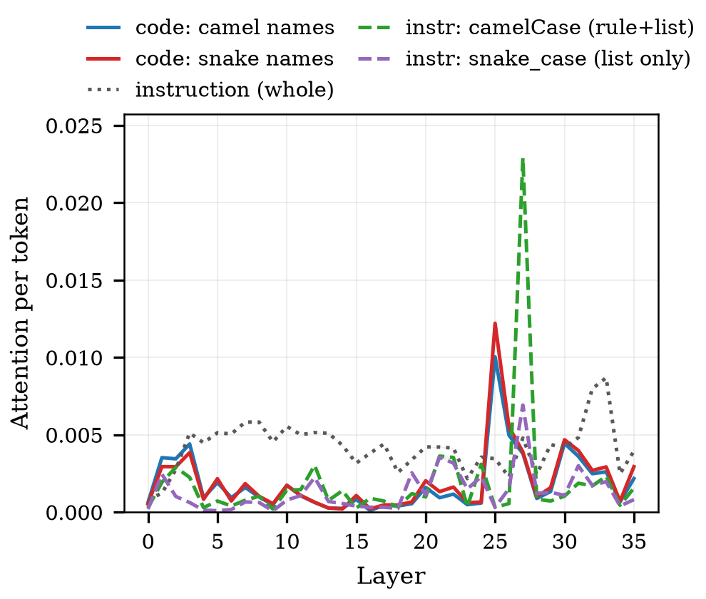
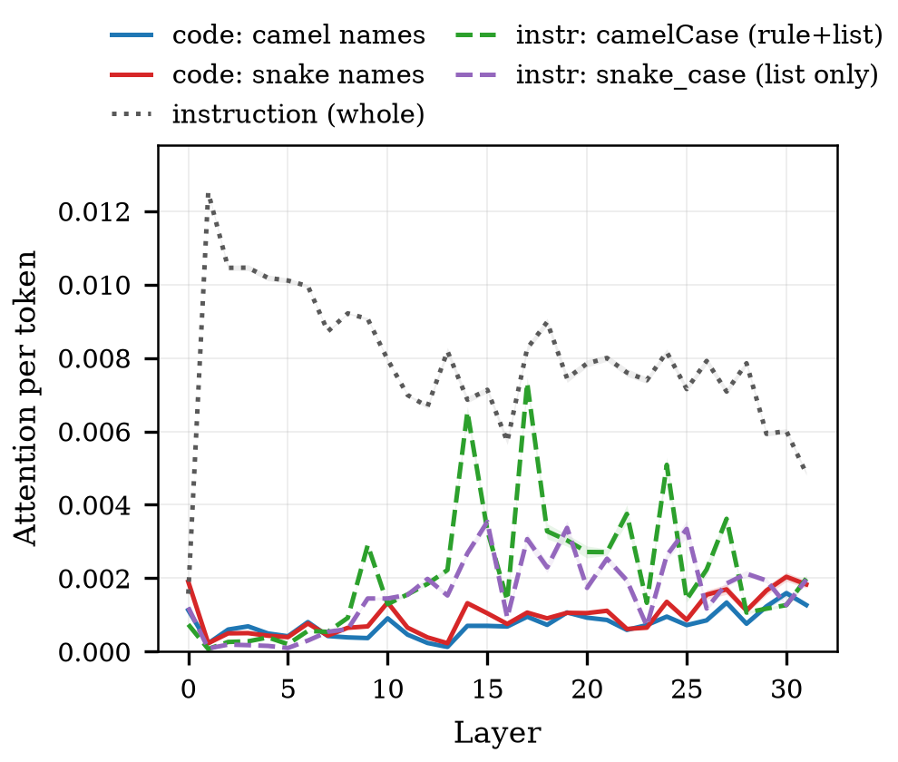
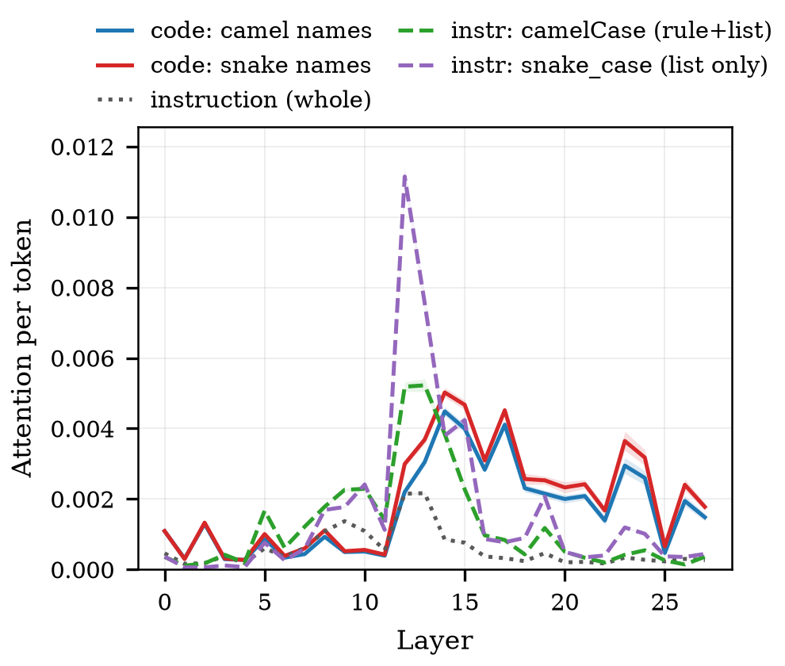
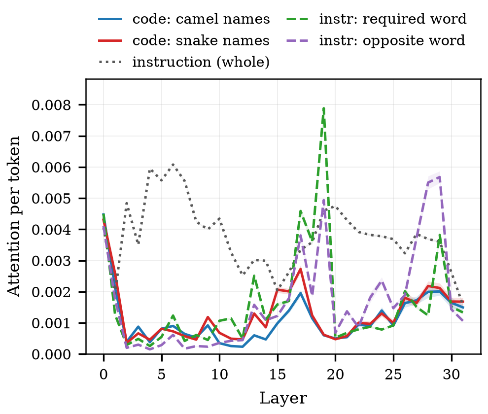
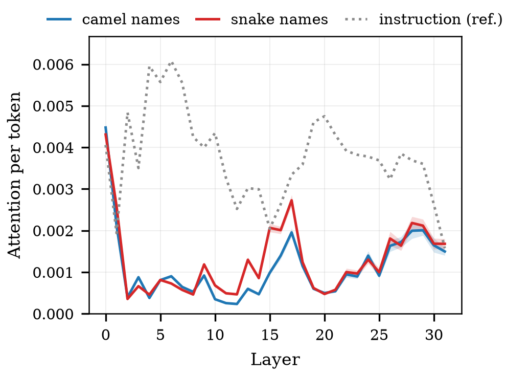
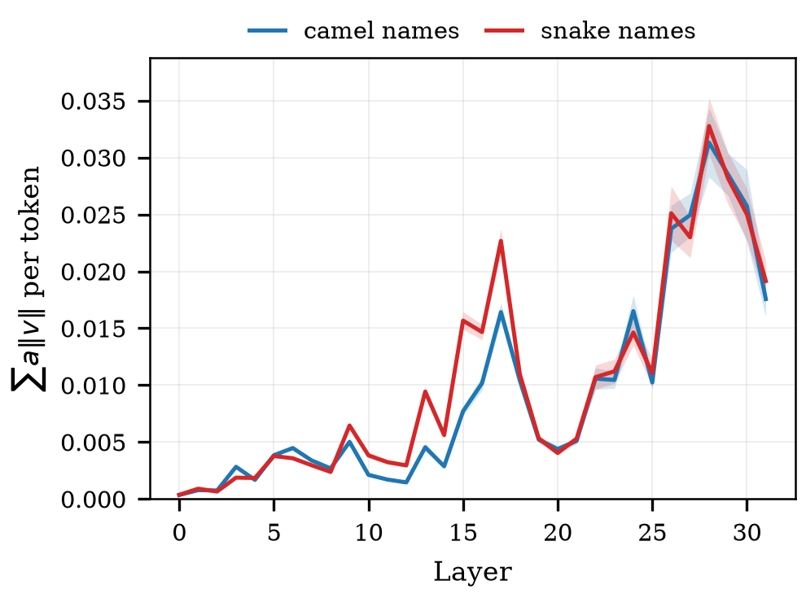
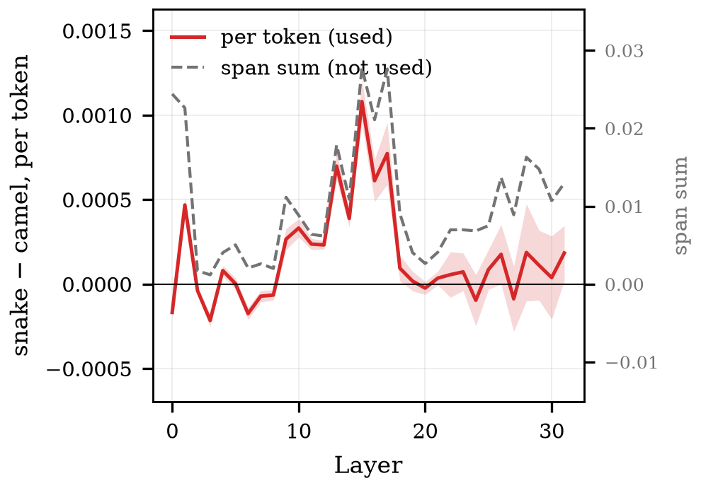
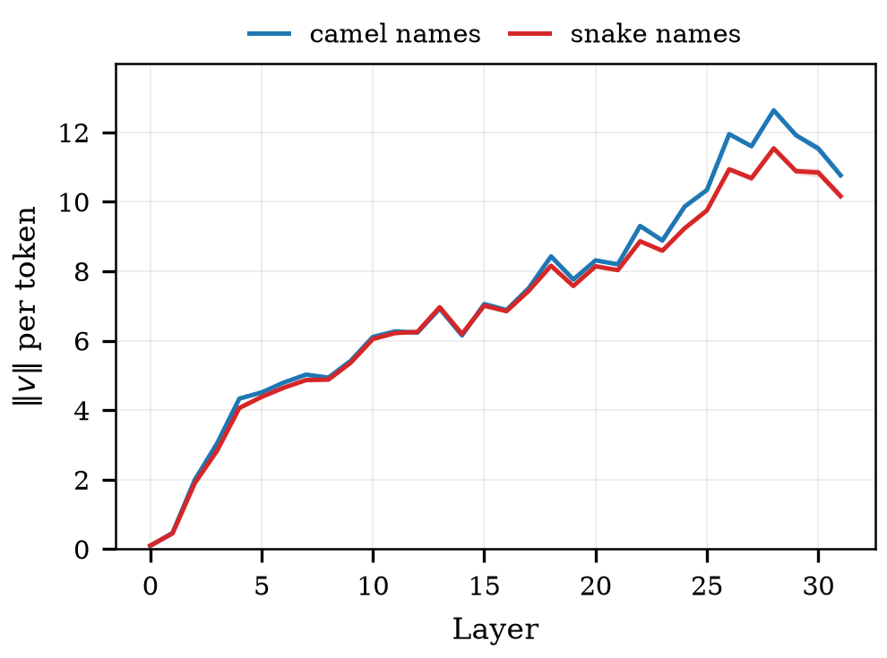

# step2 결과 — 코드 신호의 위치와 층 (RQ2 관측)

> **스텝:** step2 · **RQ:** RQ2 (코드의 표기 신호가 어디에, 어느 층에 있는가 — 관측)
> **결과:** `results/step2_code-observe/` 168개
> **재현:** `python scripts/observe_per_token.py results/step2_code-observe` (표) · `python scripts/step2_figures.py` (그림)

---

## 1. 결과 JSON 읽는 법

> 파일 하나 = **조건 하나**(모델 × 이름 묶음). 경로는 `results/step2_code-observe/<슬러그>.json`.
> 공통 뼈대(`step`·`rq`·`condition`·`meta`)는 [`../코드_하네스공통.md`](../코드_하네스공통.md) §5~6,
> 이 값을 만드는 코드는 [`code.md`](code.md) §6.

### 1-1. 먼저 — 각 필드가 무엇을 말하는가

**밑바탕 개념** (모르면 [`../개념_트랜스포머와_개입.md`](../개념_트랜스포머와_개입.md) §2-1~2-4)

| 말 | 정의 |
|---|---|
| **관측 시점** | 프롬프트 끝에 `"def "`를 붙여 만든 **새 이름 자리**. 어텐션 행렬의 **마지막 한 줄**(그 자리의 query)만 쓴다 → §2-2 |
| **구간(span)** | 그 한 줄에서 **어느 열(토큰 자리)들을 합칠지**. `code_camel`·`code_snake`·`instruction`·`instr_target_word`·`instr_viol_word` 5종 → §2-3 |
| **a (어텐션)** | 그 자리에서 어떤 토큰을 얼마나 보는가. 한 줄의 합이 1이므로 구간 값은 곧 **비중** |
| **v (Value)** | 그 토큰이 실어 나르는 **내용 벡터**. 어텐션이 "얼마나 보나"라면 v는 "무엇을 실어 오나" |
| **‖v‖** | 그 내용의 **크기** |
| **‖a·v‖** | 어텐션 × 내용 크기. 그 구간이 이번 자리에 기여할 수 있는 **크기의 상한 대리치** |
| **층(layer)** | `per_layer`의 키. 문자열 `"0"`~`"L−1"`이다(JSON 제약). 층마다 따로 재서 "어느 층에서 격차가 벌어지나"를 본다 |

**per_layer** — 키는 `<구간>__<지표>` 로 납작하게 펴져 있다.

| 필드 | 무슨 값인가 | 합인가 평균인가 |
|---|---|---|
| `<구간>__attention_weight` | 그 구간 토큰들에 준 어텐션. query head 평균 후 **구간 합**. 0~1의 질량 | **합** |
| `<구간>__av_norm` | Σ_j (a_j · ‖v_j‖). 기여 상한 대리치. 벡터 상쇄를 무시하고 출력 사영(W_O) **이전** 값이라 실제 기여량이 아니다 | **합** |
| `<구간>__v_norm` | 구간 토큰 ‖v‖의 **토큰당 평균**(KV head 평균). 크기 지표라 합이 아니라 평균이 맞다 | **평균** |

> ⚠️ **앞의 둘은 합, 마지막 하나는 평균이다.** 그래서 `attention_weight`·`av_norm`은
> 구간이 길수록 커진다 — 반드시 `span_token_counts`로 나눠서 비교한다(→ §1-3).

**extra**

| 필드 | 무슨 값인가 |
|---|---|
| `mode` | `"observe"` — 관측만 했다는 표시. 개입은 없다 |
| `target` | 지침이 요구한 표기. step2는 **전부 `"camel"`** 이다(→ §5) |
| `instruction_form` | 지침 형태(`"positive"` = "…라고 쓴다"는 긍정 서술) |
| `span_token_counts` | **구간별 토큰 수.** 합 지표를 토큰당으로 환산하는 분모 — 이것 없이는 구간끼리 비교할 수 없다 |
| `group_names` | 각 코드 구간에 실제로 들어간 함수 이름 목록. 구간이 의도한 이름을 잡았는지 검증용 |
| `gqa` | `num_attention_heads`(query head 수 Hq) · `num_key_value_heads`(KV head 수 Hkv) · `group_size`(= Hq÷Hkv, 한 KV를 공유하는 query head 수). a는 query head별, v는 KV head별이라 곱하려면 이 매핑이 필요하다 |
| `seq_len` | 프롬프트 전체 토큰 수 |
| `token_detail` | 코드 두 구간(`code_camel`·`code_snake`)의 **토큰 하나하나** 값. `tokens`는 `{t: 토큰 번호, text: 그 글자}`, `per_layer["<층>"]`은 그 토큰들의 `a`·`av`·`v` 배열(순서가 `tokens`와 같다). 밑줄 조각 등 사후 분석용 |

### 1-2. 실제 파일 모양

```jsonc
"metrics": {
  "per_layer": {
    "27": {
      "code_camel__attention_weight": 0.0184,   // 구간 합 (헤드 평균)
      "code_camel__av_norm":          0.412,    // 구간 합
      "code_camel__v_norm":           22.4,     // 토큰당 평균
      "code_snake__attention_weight": 0.0231,
      "instruction__attention_weight":0.0092,
      …
    }, …
  },
  "extra": {
    "mode": "observe", "target": "camel", "instruction_form": "positive",
    "span_token_counts": {"code_camel": 12, "code_snake": 15, "instruction": 37,
                          "instr_target_word": 4, "instr_viol_word": 2},   // ★ 정규화용
    "group_names": {"code_camel": ["parseHeader", …], "code_snake": ["build_token", …]},
    "gqa": {"num_attention_heads": 16, "num_key_value_heads": 2, "group_size": 8},
    "seq_len": 512,
    "token_detail": {"code_camel": {"tokens": [{"t": 74, "text": " dec"}, …],
                                    "per_layer": {"0": {"a": […], "av": […], "v": […]}, …}}, …}
  }
}
```

### 1-3. 읽는 순서

1. **`span_token_counts`를 먼저 본다.** 토큰 수가 다르면 `attention_weight`·`av_norm`의
   합끼리 비교하지 않는다. 밑줄을 독립 토큰으로 떼는 토크나이저에서 snake 구간이 40%가량
   길어(예: DeepSeek 22.45 vs 16.21) 합으로 보면 긴 쪽이 그냥 유리하다.
2. **토큰당 평균으로 환산해 비교한다** — `attention_weight ÷ span_token_counts`.
   `v_norm`은 이미 토큰당이라 나누지 않는다.
3. `instr_target_word`·`instr_viol_word` 두 선은 **그대로 비교하면 안 된다.** 요구어는
   지침에 2회, 반대어는 1회 등장해 역할이 섞여 있다. 역할을 나눈 키(`instr_rule_word`)는
   **step4에만 있다** → 지침에 대한 판단은 [`../step4/results.md`](../step4/results.md)에서 한다.
4. 표·그림 재생성: `python scripts/observe_per_token.py results/step2_code-observe` (합 vs 토큰당) ·
   `python scripts/step2_figures.py` (그림).

---

## 2. 무엇을 어떻게 쟀나

### 2-1. 어떤 프롬프트인가

모델에게 **함수 12개짜리 모듈**을 보여주고 함수를 하나 더 써 달라고 한다.
12개 중 6개는 지침대로 camel, 6개는 지침을 어긴 snake다(균형 배치).

```
[system]  You are helping extend an existing Python module.
          In this project we generally write function names in camelCase.
          Every function name uses one of two styles only: camelCase or snake_case.

[user]    Here is the current module:

          ```python
          def split_config(value):        ← snake (위반)
              return value

          def decodeNode(value):          ← camel (준수)
              return value

          def fetchToken(value):          ← camel
              return value
          … 12개까지 …
          ```

          Add a function that removes duplicate items from a list, preserving order.
```

블록 0의 실제 이름 12개:

| 무리 | 이름 |
|---|---|
| **camel 6개** | `decodeNode` `fetchToken` `renderBuffer` `encodeRecord` `parseHeader` `buildPayload` |
| **snake 6개** | `split_config` `filter_session` `format_request` `expand_entry` `compute_matrix` `resolve_packet` |

**함수 본문은 12개가 전부 같다**(`return value`). 달라지는 것은 **이름 표기뿐**이다.

> **어텐션·행·헤드가 무엇인지 모르겠다면** 먼저
> [`../개념_트랜스포머와_개입.md`](../개념_트랜스포머와_개입.md) §2-1~2-4를 읽는다.
> "한 줄은 합이 1이라 구간 값이 곧 비중"이라는 것이 아래를 읽는 열쇠다.

### 2-2. 누가 보는가 — 관측 시점 하나

프롬프트 끝에 **`"def "` 를 강제로 붙인다.** 그러면 다음에 올 자리가 **새 함수의 이름 자리**가 된다.

```
… Add a function that removes duplicate items …<|im_end|>
<|im_start|>assistant
def ▮        ← 이 자리(마지막 위치)의 query 한 줄만 관측한다
```

어텐션 행렬은 `[모든 위치 × 모든 위치]`지만, 우리가 쓰는 것은 **마지막 한 줄**이다 —
"이름을 쓰려는 그 순간, 모델이 앞의 어디를 보고 있나".

### 2-3. 무엇을 보는가 — 구간 5종

그 한 줄에서 **어느 열(토큰 자리)** 을 합칠지가 구간이다.

| 구간 | 프롬프트의 어디 | 정확히 어느 토큰 | 토큰 수(Qwen) |
|---|---|---|---|
| `code_camel` | 선행 코드 | camel 이름 **6개의 이름 부분만** | 12 |
| `code_snake` | 선행 코드 | snake 이름 **6개의 이름 부분만** | 15 |
| `instruction` | system | 지침 **문장 전체** | 37 |
| `instr_target_word` | system | 지침 안의 `camelCase`(2회 등장) | 4 |
| `instr_viol_word` | system | 지침 안의 `snake_case`(1회) | 2 |

**"이름 부분만"이 중요하다.** `def split_config(value):` 에서 `def`·`(`·`value`·본문은
전부 제외하고 **`split_config` 만** 잡는다. `def <이름>(` 패턴으로 찾아 앞 4자와 뒤 1자를 깎는다.

```
def split_config(value):
    └┬┘└─────┬────┘
   제외    ← 이것만 (조각 3개: " split", "_", "config")
```

이름이 조각 몇 개로 쪼개지든 **전부** 잡는다 — 그래서 camel 12조각 / snake 15조각처럼
구간 길이가 달라지고, 이것이 §2-5의 정규화 문제를 만든다.

### 2-4. 어떻게 꺼냈나 — forward 1회

```
① 프롬프트 + "def " 를 문자열로 만든다
② 토큰화하면서 offset(각 토큰이 원문의 몇 번째 글자인지)을 함께 받는다
③ 이름·지침의 글자 위치를 offset으로 토큰 번호로 바꾼다   ← 구간 확정
④ 모델을 한 번 통과시킨다 (output_attentions=True, use_cache=True)
⑤ 층마다: 어텐션의 마지막 줄 [헤드 × 전체위치] + KV 캐시의 ‖v‖ [헤드 × 전체위치]
⑥ 구간에 속한 열만 골라 합/평균
```

**층마다 따로** 낸다. 그래서 "어느 층에서 격차가 벌어지나"를 볼 수 있다.
헤드는 평균 낸다(헤드별 분해는 이 스텝의 범위가 아니다).

개입은 없다 — **관측만** 한다. 인과는 step3.

### 2-5. 재는 값 세 가지

- 모델 4개, 이름 묶음 42개(504개 이름 전체 커버), 시드 42.
- 지표
  - **어텐션** — 그 구간에 준 주의의 양
  - **‖a·v‖** — 어텐션과 내용 크기의 곱. 그 구간이 기여할 수 있는 **크기의 상한**
    (방향 상쇄를 무시한 값이며 출력 사영 이전이다)
  - **‖v‖** — 내용 자체의 크기
- **토큰 수로 나눈 값을 쓴다.** 밑줄을 독립 토큰으로 떼는 토크나이저에서 snake 구간이 훨씬 길어
  (DeepSeek 22.45 vs 16.21, StableCode 20.40 vs 14.21) 합끼리 비교하면 긴 쪽이 유리하다.

---

## 3. 결과

### 프롬프트의 어디를 보나 — 구간 5종 전부

step2는 구간을 **5개** 저장했다. 한 장에 모두 그리면 "이름을 쓰려는 순간 모델이
프롬프트의 어디에 주의를 두는가"가 한눈에 보인다.

| Qwen2.5-Coder-3B | DeepSeek-Coder-6.7B |
|---|---|
|  |  |
| **Llama-3.2-3B (범용)** | **StableCode-3B** |
|  |  |

**코드가 솟는 층과 지시어가 솟는 층이 다르다.**

| 모델 | 코드 봉우리 | 지시어 봉우리 | 그 층에서 지시어÷코드 |
|---|---|---|---|
| Qwen | L25 | **L27** | 5.9배 |
| DeepSeek | L30 | **L17** | 6.9배 |
| StableCode | L0 | **L19** | 12.7배 |
| Llama (범용) | L14 | L13 | 1.4배 |

Qwen의 **L27**, DeepSeek의 **L17**, StableCode의 **L19** — 세 층 모두
**step4의 관측 봉우리이자 step5의 인과 봉우리와 같다.** step2 그림에서 이미 그 층이
드러나 있었는데, 지금까지 코드 두 선만 그려 놓아 보이지 않았다.

> ⚠️ **지침 표기어 두 선은 그대로 비교하면 안 된다.** 초판 키라 역할이 섞여 있다.
>
> ```
> instr_target_word = instr_rule_word + 후보열거 쪽    ← camelCase는 2회 등장
> instr_viol_word   = 후보열거 쪽만                     ← snake_case는 1회
> ```
>
> 8개 조건 전부에서 토큰 수로 검산했다(예: Qwen 4 = 2 + 2, viol 2 = 2).
>
> **토큰당 정규화는 이 문제를 고치지 못한다.** 정규화가 상쇄하는 것은 토큰 수 차이(4 vs 2)뿐이고,
> "요구어 = 규칙문과 후보열거의 **평균** / 반대어 = 후보열거 **하나**"라는 역할 혼합은 남는다.
> 요구어 선이 높게 나와도 그것이 "규칙문을 더 본다"인지 "등장이 잦다"인지 **가를 수 없다.**
>
> 역할을 나눈 `instr_rule_word`는 **step4에만 있다**(step2 결과 파일에는 없다).
> 여기서는 **참고선**으로만 보고, 지침에 대한 판단은 [`../step4/results.md`](../step4/results.md)에서 한다.

**어텐션 — 층별 (토큰당 평균)**

| Qwen2.5-Coder-3B | DeepSeek-Coder-6.7B |
|---|---|
|  |  |
| **Llama-3.2-3B (범용)** | **StableCode-3B** |
|  |  |

**기여 상한 ‖a·v‖ — 층별**

| Qwen2.5-Coder-3B | DeepSeek-Coder-6.7B |
|---|---|
|  |  |
| **Llama-3.2-3B (범용)** | **StableCode-3B** |
|  |  |

**snake − camel 격차 (직접 차이)**

| Qwen2.5-Coder-3B | DeepSeek-Coder-6.7B |
|---|---|
|  |  |
| **Llama-3.2-3B (범용)** | **StableCode-3B** |
|  |  |

**‖v‖ — 내용 자체의 크기**

| Qwen2.5-Coder-3B | DeepSeek-Coder-6.7B |
|---|---|
|  |  |
| **Llama-3.2-3B (범용)** | **StableCode-3B** |
|  |  |

### 정규화가 어디서 결론을 바꾸나

`gap_*` 그림의 **빨강(토큰당)과 회색 점선(합)** 을 비교하면 보인다.

| 모델 | camel 토큰 | snake 토큰 | 비율 | 부호가 갈리는 층 |
|---|---|---|---|---|
| Qwen | 12.60 | 12.74 | 1.01 | **0 / 36** |
| Llama | 12.60 | 12.74 | 1.01 | **0 / 28** |
| DeepSeek | 16.21 | 22.45 | 1.38 | **7 / 32** (L2~6, 19, 23) |
| StableCode | 14.21 | 20.40 | 1.44 | **9 / 32** (L0, 2, 3, 6~8, 20, 24, 27) |

밑줄 `_`이 독립 토큰으로 떨어지는 DeepSeek·StableCode는 snake 구간이 40%가량 길다.
그 두 모델의 **초반 층에서는 합이 "snake를 더 본다"고 말하지만 토큰당은 반대**다.

**다만 봉우리 층은 네 모델 모두 옮겨가지 않는다**(Qwen L25 · DeepSeek L0 · Llama L12 ·
StableCode L15). 정성 결론은 유지되고, 바뀌는 것은 **초반 층의 부호와 격차의 크기**다.

**snake 구간 − camel 구간 격차가 가장 큰 층과 그 값**(토큰당 평균)

| 모델 | 어텐션 | ‖a·v‖ |
|---|---|---|
| Qwen2.5-Coder-3B | L25 **+0.0022** | L33 **+0.0190** |
| DeepSeek-Coder-6.7B | L0 +0.0008 | L26 **+0.0093** |
| Llama-3.2-3B | L12 +0.0008 | L24 **+0.0055** |
| StableCode-3B | L15 **+0.0011** | L15 **+0.0080** |

전 모델·전 지표에서 **부호가 양수** — 위반(snake) 구간을 더 참조한다.
격차의 봉우리는 **중후반 층**에 몰린다.

### 모델마다 곡선 모양이 왜 다른가

같은 축으로 그려도 네 모델의 그림이 꽤 다르게 보인다. 곡선의 **높이**가 아니라
**지침과 코드의 상대 관계**가 다르기 때문이다(토큰당, 전 층 평균).

| 모델 | 코드 camel | 코드 snake | 지침 | **지침 ÷ 코드** |
|---|---|---|---|---|
| Qwen2.5-Coder-3B | 0.00186 | 0.00202 | 0.00420 | 2.16 |
| **DeepSeek-Coder-6.7B** | 0.00075 | 0.00096 | 0.00788 | **9.21** |
| StableCode-3B | 0.00112 | 0.00128 | 0.00378 | 3.15 |
| **Llama-3.2-3B** (범용) | 0.00169 | 0.00197 | 0.00059 | **0.32** |

- **DeepSeek**은 지침을 코드보다 **9배** 본다. 그래서 회색 점선이 압도적으로 높고
  코드 두 선은 바닥에 깔린다.
- **StableCode**는 3배로 중간이며, 코드 두 선의 격차가 **중반(L15~17)** 에서 벌어진다.
  Qwen처럼 후반에 한 번 솟는 봉우리가 아니라 **중반에 넓게 퍼진** 모양이다.
- **Llama만 지침보다 코드를 더 본다**(0.32배). 범용 모델이 코드 특화 3모델과
  갈리는 지점이며, step4·step5에서도 같은 방향으로 갈린다.

**코드 특화 3모델은 지침을 코드보다 더 보고, 범용 1모델은 그 반대다.**
곡선 모양의 차이는 대부분 이 비율에서 나온다.

---

## 4. 해석

**(1) 모델은 문맥의 위반 이름을 더 참조한다.** 네 모델 모두, 어텐션과 기여 상한 양쪽에서.

**(2) 그 격차는 후반 층에서 커진다.** 초반 층에서는 두 구간이 거의 대등하고,
깊어질수록 벌어져 중후반에 봉우리를 이룬다.

**(3) 관측만으로는 원인을 못 가른다.** ‖a·v‖는 어텐션과 내용의 곱이라, 격차가
"더 봐서"인지 "내용이 커서"인지 분리되지 않는다. 그 판정은 step3의 몫이다.

---

## 5. 이 스텝이 다루지 않는 것

- **인과가 아니다.** 상관 관측이다.
- **지침 방향이 camel 하나로 고정**돼 있다(168조건 전부). 그래서 이 스텝에서 "위반 구간"은
  항상 snake다 — **"위반이라서 더 보는 것"과 "snake라서 더 보는 것"을 가를 수 없다.**
  (step4는 양방향을 돌렸고 두 방향에서 모두 성립한다.)
- ‖a·v‖는 **상한**이지 실제 기여량이 아니다. 실제 기여는 벡터 합의 노름이며 출력 사영을 거친다.
- 합 기준으로 보면 값이 10배가량 커지지만 **부호와 봉우리 층은 유지된다**(StableCode ‖a·v‖만 L17→L15).
