# step2 결과 — 코드 신호의 위치와 층 (RQ2 관측)

> **스텝:** step2 · **RQ:** RQ2 (코드의 표기 신호가 어디에, 어느 층에 있는가 — 관측)
> **결과:** `results/step2_code-observe/` 168개
> **재현:** `python scripts/observe_per_token.py results/step2_code-observe` (표) · `python scripts/step2_figures.py` (그림)

---

## 1. 무엇을 어떻게 쟀나

### 1-1. 어떤 프롬프트인가

모델에게 **함수 12개짜리 모듈**을 보여주고 함수를 하나 더 써 달라고 한다.
12개 중 6개는 지침대로 camel, 6개는 지침을 어긴 snake다(균형 배치).

```
[system]  You are helping extend an existing Python module.
          In this project we generally write function names in camelCase.
          Every function name uses one of two styles only: camelCase or snake_case.

[user]    Here is the current module:

          ```python
          def split_config(value):        ← snake (위반)
              return value

          def decodeNode(value):          ← camel (준수)
              return value

          def fetchToken(value):          ← camel
              return value
          … 12개까지 …
          ```

          Add a function that removes duplicate items from a list, preserving order.
```

블록 0의 실제 이름 12개:

| 무리 | 이름 |
|---|---|
| **camel 6개** | `decodeNode` `fetchToken` `renderBuffer` `encodeRecord` `parseHeader` `buildPayload` |
| **snake 6개** | `split_config` `filter_session` `format_request` `expand_entry` `compute_matrix` `resolve_packet` |

**함수 본문은 12개가 전부 같다**(`return value`). 달라지는 것은 **이름 표기뿐**이다.

### 1-2. 누가 보는가 — 관측 시점 하나

프롬프트 끝에 **`"def "` 를 강제로 붙인다.** 그러면 다음에 올 자리가 **새 함수의 이름 자리**가 된다.

```
… Add a function that removes duplicate items …<|im_end|>
<|im_start|>assistant
def ▮        ← 이 자리(마지막 위치)의 query 한 줄만 관측한다
```

어텐션 행렬은 `[모든 위치 × 모든 위치]`지만, 우리가 쓰는 것은 **마지막 한 줄**이다 —
"이름을 쓰려는 그 순간, 모델이 앞의 어디를 보고 있나".

### 1-3. 무엇을 보는가 — 구간 5종

그 한 줄에서 **어느 열(토큰 자리)** 을 합칠지가 구간이다.

| 구간 | 프롬프트의 어디 | 정확히 어느 토큰 | 토큰 수(Qwen) |
|---|---|---|---|
| `code_camel` | 선행 코드 | camel 이름 **6개의 이름 부분만** | 12 |
| `code_snake` | 선행 코드 | snake 이름 **6개의 이름 부분만** | 15 |
| `instruction` | system | 지침 **문장 전체** | 37 |
| `instr_target_word` | system | 지침 안의 `camelCase`(2회 등장) | 4 |
| `instr_viol_word` | system | 지침 안의 `snake_case`(1회) | 2 |

**"이름 부분만"이 중요하다.** `def split_config(value):` 에서 `def`·`(`·`value`·본문은
전부 제외하고 **`split_config` 만** 잡는다. `def <이름>(` 패턴으로 찾아 앞 4자와 뒤 1자를 깎는다.

```
def split_config(value):
    └┬┘└─────┬────┘
   제외    ← 이것만 (조각 3개: " split", "_", "config")
```

이름이 조각 몇 개로 쪼개지든 **전부** 잡는다 — 그래서 camel 12조각 / snake 15조각처럼
구간 길이가 달라지고, 이것이 §1-5의 정규화 문제를 만든다.

### 1-4. 어떻게 꺼냈나 — forward 1회

```
① 프롬프트 + "def " 를 문자열로 만든다
② 토큰화하면서 offset(각 토큰이 원문의 몇 번째 글자인지)을 함께 받는다
③ 이름·지침의 글자 위치를 offset으로 토큰 번호로 바꾼다   ← 구간 확정
④ 모델을 한 번 통과시킨다 (output_attentions=True, use_cache=True)
⑤ 층마다: 어텐션의 마지막 줄 [헤드 × 전체위치] + KV 캐시의 ‖v‖ [헤드 × 전체위치]
⑥ 구간에 속한 열만 골라 합/평균
```

**층마다 따로** 낸다. 그래서 "어느 층에서 격차가 벌어지나"를 볼 수 있다.
헤드는 평균 낸다(헤드별 분해는 이 스텝의 범위가 아니다).

개입은 없다 — **관측만** 한다. 인과는 step3.

### 1-5. 재는 값 세 가지

- 모델 4개, 이름 묶음 42개(504개 이름 전체 커버), 시드 42.
- 지표
  - **어텐션** — 그 구간에 준 주의의 양
  - **‖a·v‖** — 어텐션과 내용 크기의 곱. 그 구간이 기여할 수 있는 **크기의 상한**
    (방향 상쇄를 무시한 값이며 출력 사영 이전이다)
  - **‖v‖** — 내용 자체의 크기
- **토큰 수로 나눈 값을 쓴다.** 밑줄을 독립 토큰으로 떼는 토크나이저에서 snake 구간이 훨씬 길어
  (DeepSeek 22.45 vs 16.21, StableCode 20.40 vs 14.21) 합끼리 비교하면 긴 쪽이 유리하다.

---

## 2. 결과

**어텐션 — 층별 (토큰당 평균)**

| Qwen2.5-Coder-3B | DeepSeek-Coder-6.7B |
|---|---|
| 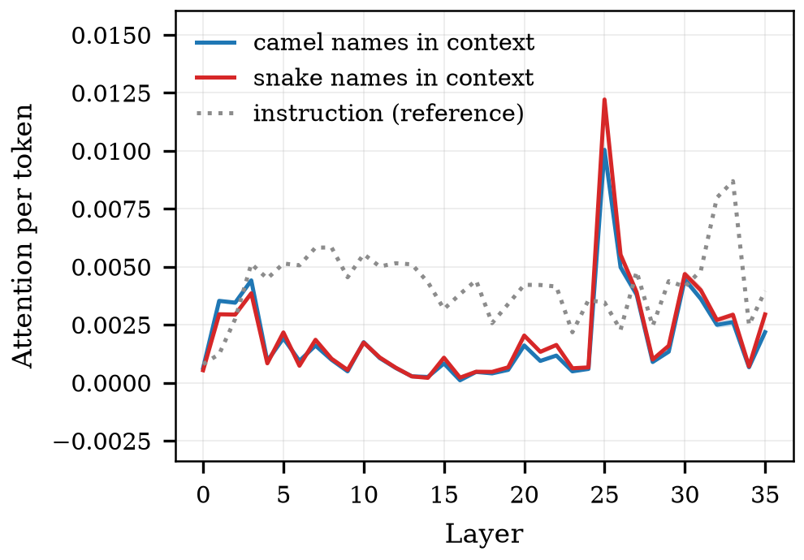 | 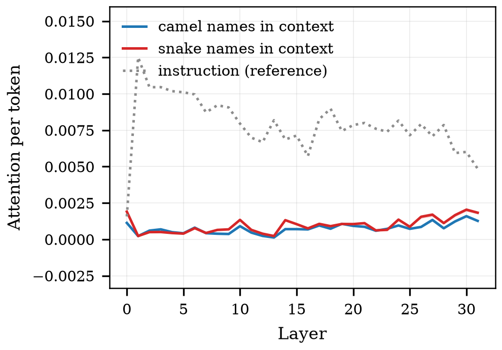 |
| **Llama-3.2-3B (범용)** | **StableCode-3B** |
| 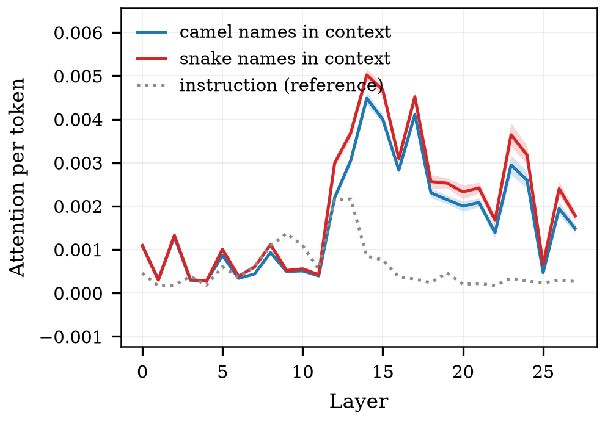 | 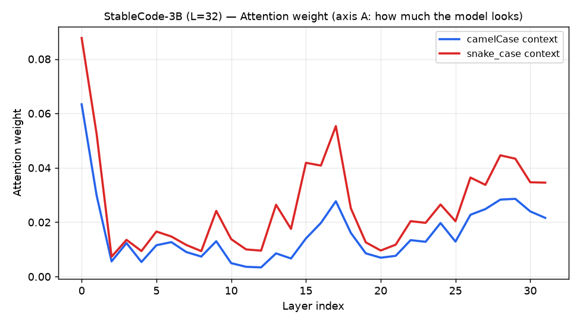 |

**기여 상한 ‖a·v‖ — 층별**

| Qwen2.5-Coder-3B | DeepSeek-Coder-6.7B |
|---|---|
| 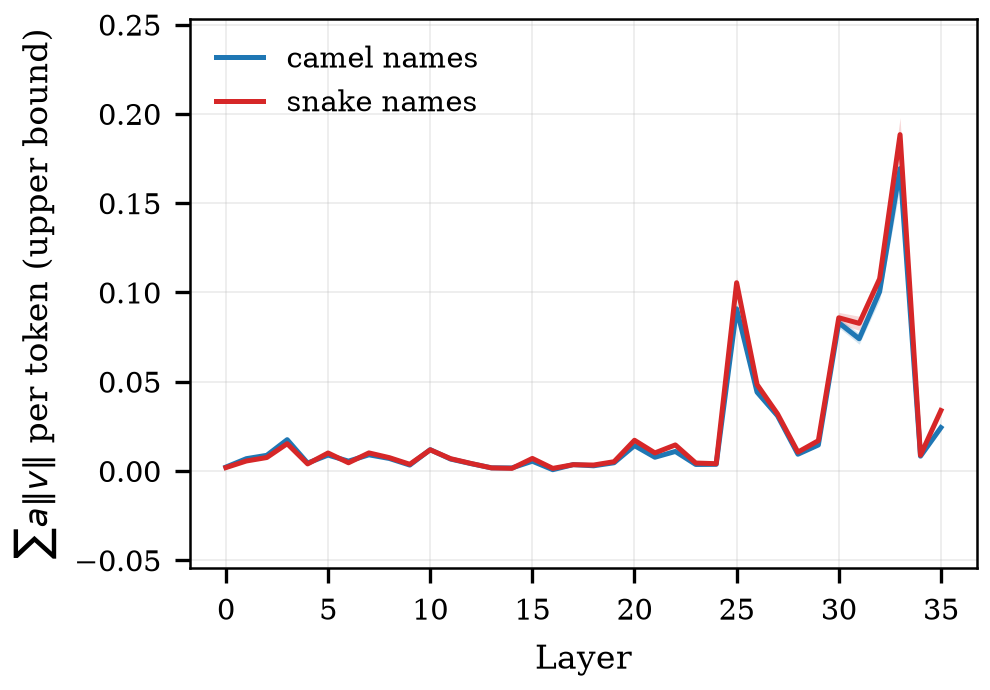 | 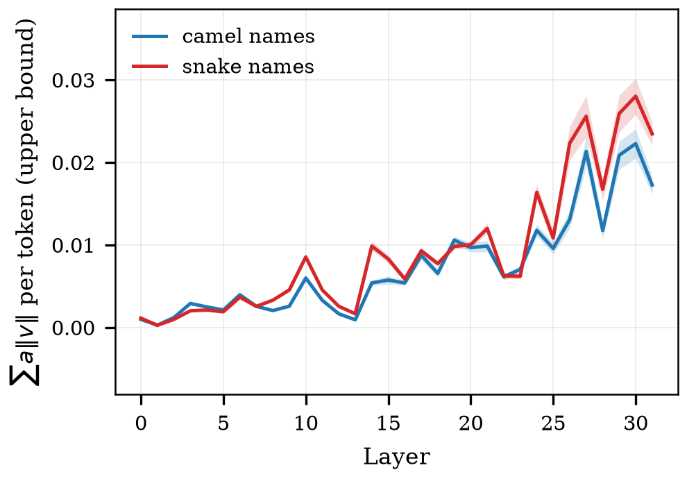 |
| **Llama-3.2-3B (범용)** | **StableCode-3B** |
| 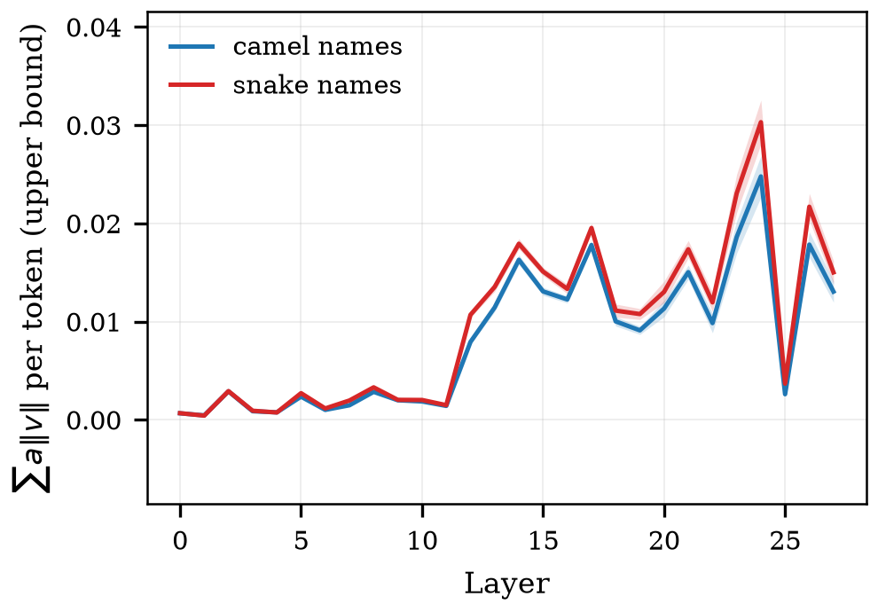 | 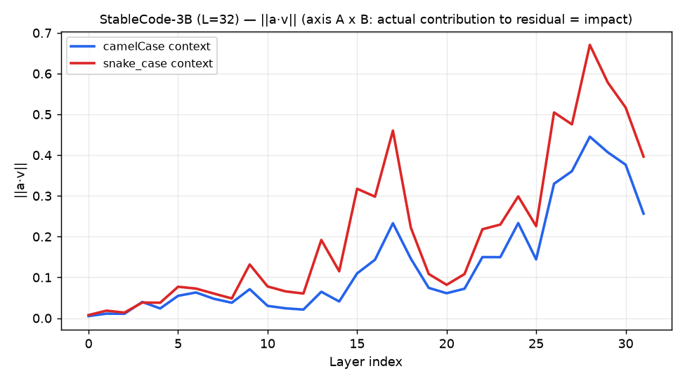 |

**snake − camel 격차 (직접 차이)**

| Qwen2.5-Coder-3B | DeepSeek-Coder-6.7B |
|---|---|
| 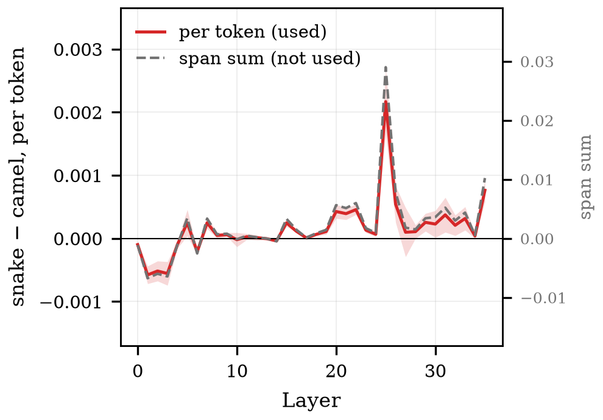 | 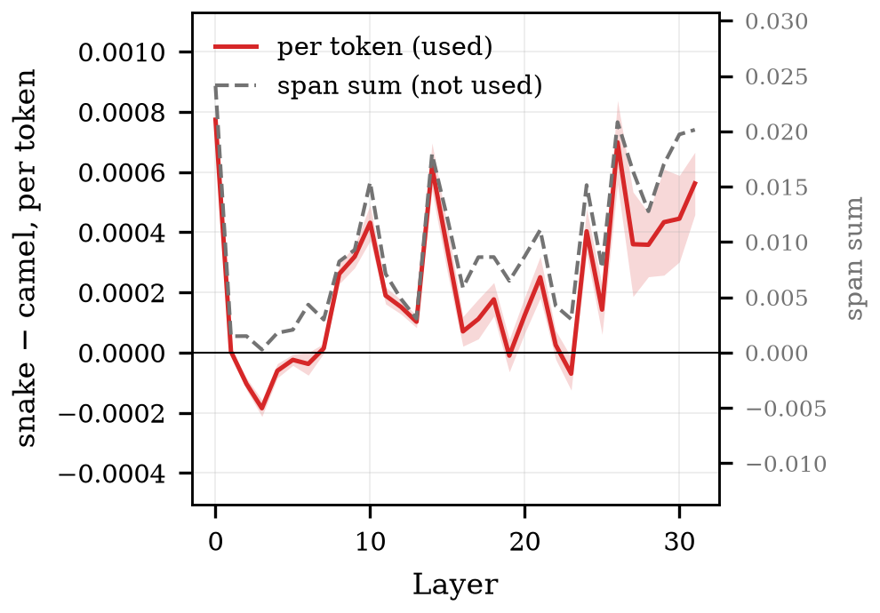 |
| **Llama-3.2-3B (범용)** | **StableCode-3B** |
| 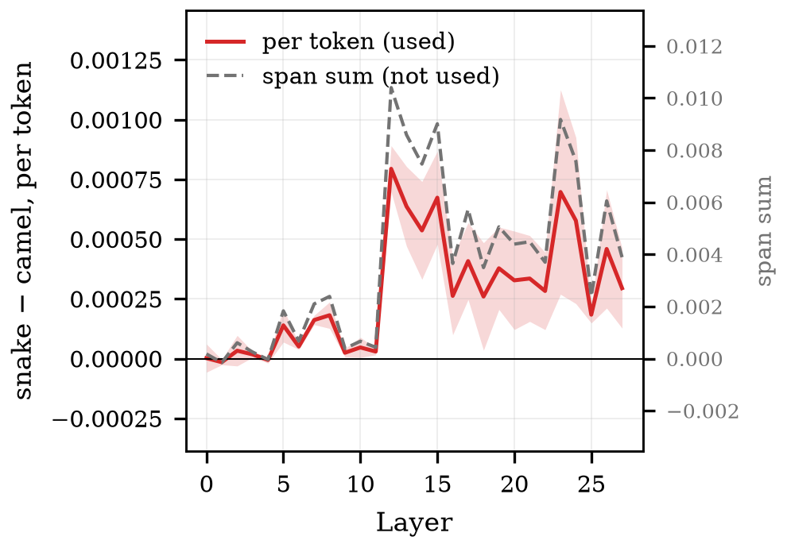 | 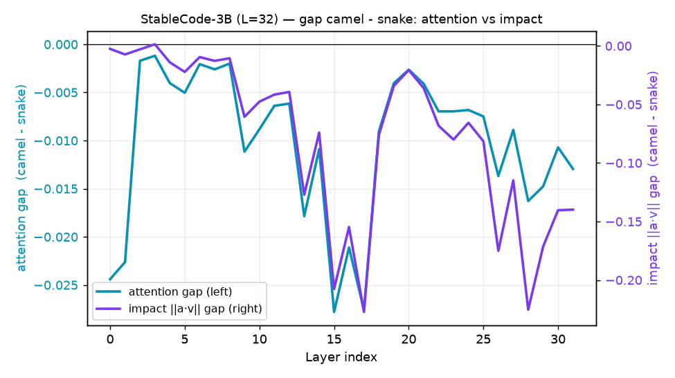 |

**‖v‖ — 내용 자체의 크기**

| Qwen2.5-Coder-3B | DeepSeek-Coder-6.7B |
|---|---|
| 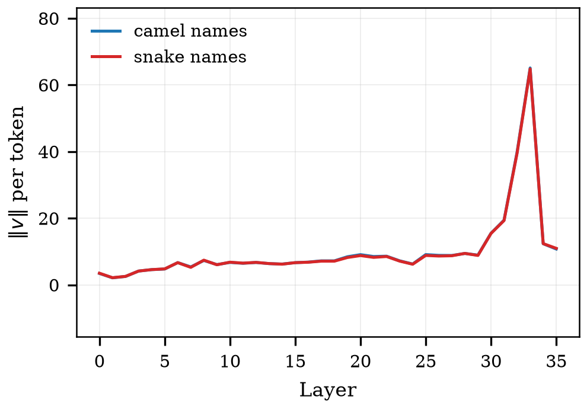 | 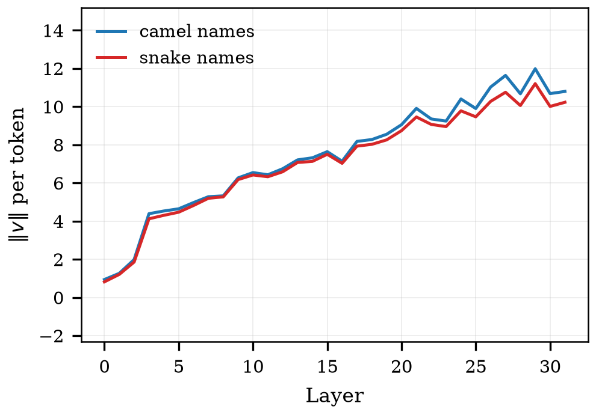 |
| **Llama-3.2-3B (범용)** | **StableCode-3B** |
| 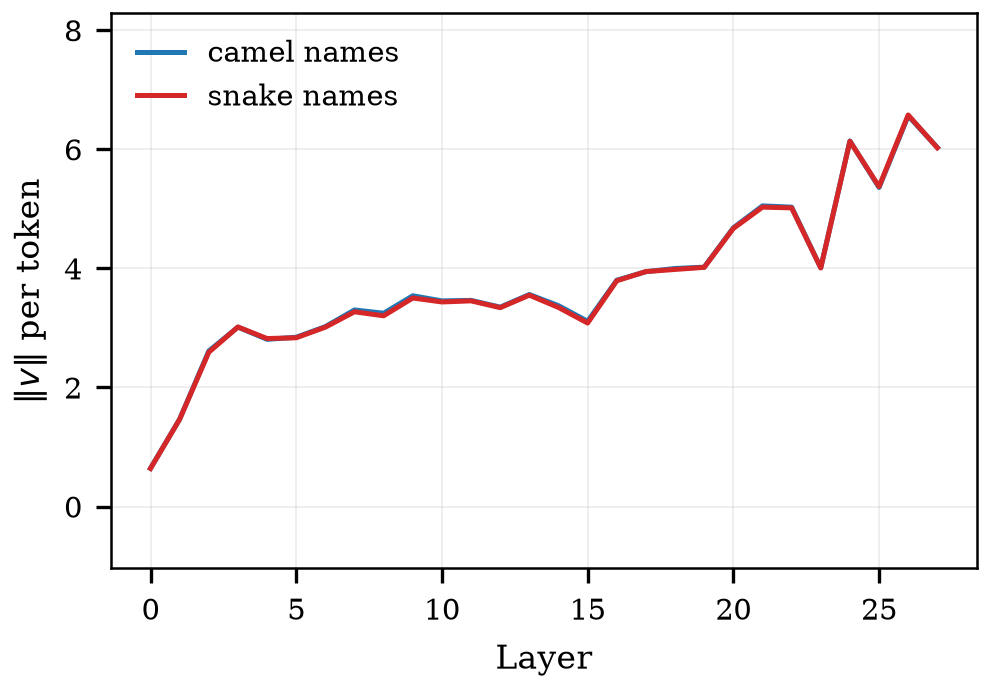 | 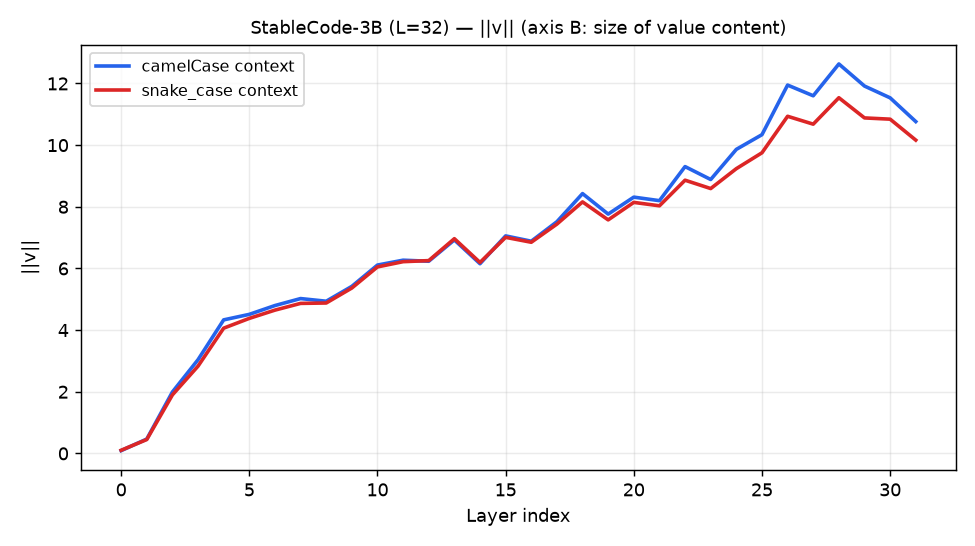 |

### 정규화가 어디서 결론을 바꾸나

`gap_*` 그림의 **빨강(토큰당)과 회색 점선(합)** 을 비교하면 보인다.

| 모델 | camel 토큰 | snake 토큰 | 비율 | 부호가 갈리는 층 |
|---|---|---|---|---|
| Qwen | 12.60 | 12.74 | 1.01 | **0 / 36** |
| Llama | 12.60 | 12.74 | 1.01 | **0 / 28** |
| DeepSeek | 16.21 | 22.45 | 1.38 | **7 / 32** (L2~6, 19, 23) |
| StableCode | 14.21 | 20.40 | 1.44 | **9 / 32** (L0, 2, 3, 6~8, 20, 24, 27) |

밑줄 `_`이 독립 토큰으로 떨어지는 DeepSeek·StableCode는 snake 구간이 40%가량 길다.
그 두 모델의 **초반 층에서는 합이 "snake를 더 본다"고 말하지만 토큰당은 반대**다.

**다만 봉우리 층은 네 모델 모두 옮겨가지 않는다**(Qwen L25 · DeepSeek L0 · Llama L12 ·
StableCode L15). 정성 결론은 유지되고, 바뀌는 것은 **초반 층의 부호와 격차의 크기**다.

**snake 구간 − camel 구간 격차가 가장 큰 층과 그 값**(토큰당 평균)

| 모델 | 어텐션 | ‖a·v‖ |
|---|---|---|
| Qwen2.5-Coder-3B | L25 **+0.0022** | L33 **+0.0190** |
| DeepSeek-Coder-6.7B | L0 +0.0008 | L26 **+0.0093** |
| Llama-3.2-3B | L12 +0.0008 | L24 **+0.0055** |
| StableCode-3B | L15 **+0.0011** | L15 **+0.0080** |

전 모델·전 지표에서 **부호가 양수** — 위반(snake) 구간을 더 참조한다.
격차의 봉우리는 **중후반 층**에 몰린다.

---

## 3. 해석

**(1) 모델은 문맥의 위반 이름을 더 참조한다.** 네 모델 모두, 어텐션과 기여 상한 양쪽에서.

**(2) 그 격차는 후반 층에서 커진다.** 초반 층에서는 두 구간이 거의 대등하고,
깊어질수록 벌어져 중후반에 봉우리를 이룬다.

**(3) 관측만으로는 원인을 못 가른다.** ‖a·v‖는 어텐션과 내용의 곱이라, 격차가
"더 봐서"인지 "내용이 커서"인지 분리되지 않는다. 그 판정은 step3의 몫이다.

---

## 4. 이 스텝이 다루지 않는 것

- **인과가 아니다.** 상관 관측이다.
- **지침 방향이 camel 하나로 고정**돼 있다(168조건 전부). 그래서 이 스텝에서 "위반 구간"은
  항상 snake다 — **"위반이라서 더 보는 것"과 "snake라서 더 보는 것"을 가를 수 없다.**
  (step4는 양방향을 돌렸고 두 방향에서 모두 성립한다.)
- ‖a·v‖는 **상한**이지 실제 기여량이 아니다. 실제 기여는 벡터 합의 노름이며 출력 사영을 거친다.
- 합 기준으로 보면 값이 10배가량 커지지만 **부호와 봉우리 층은 유지된다**(StableCode ‖a·v‖만 L17→L15).
