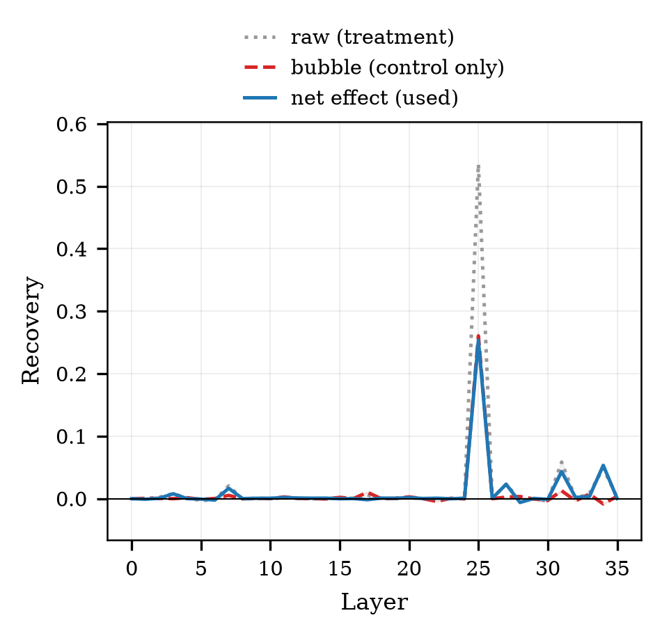
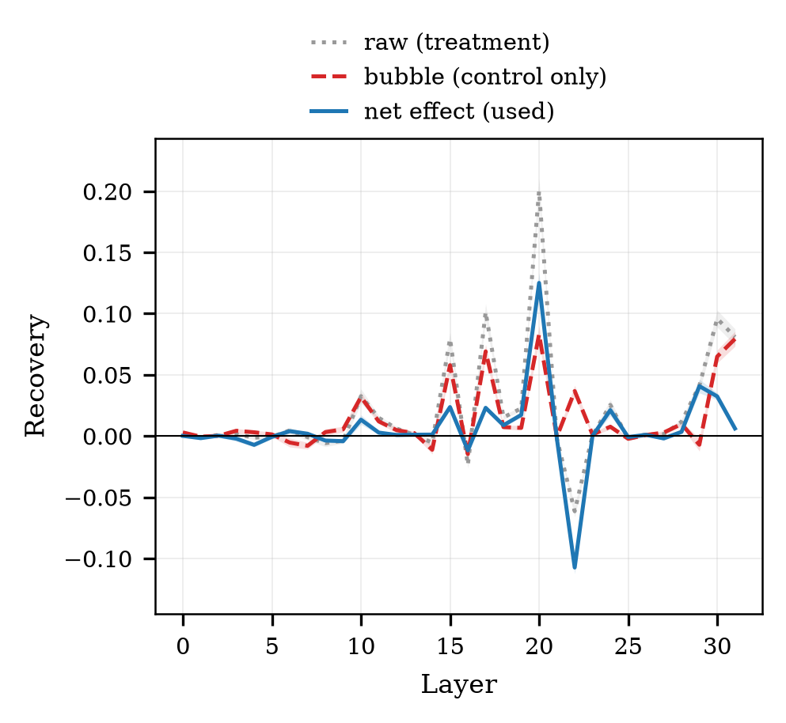
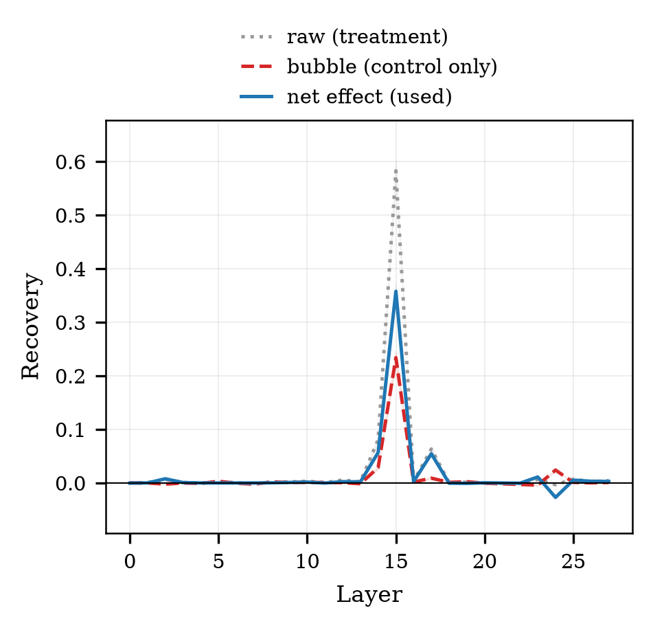
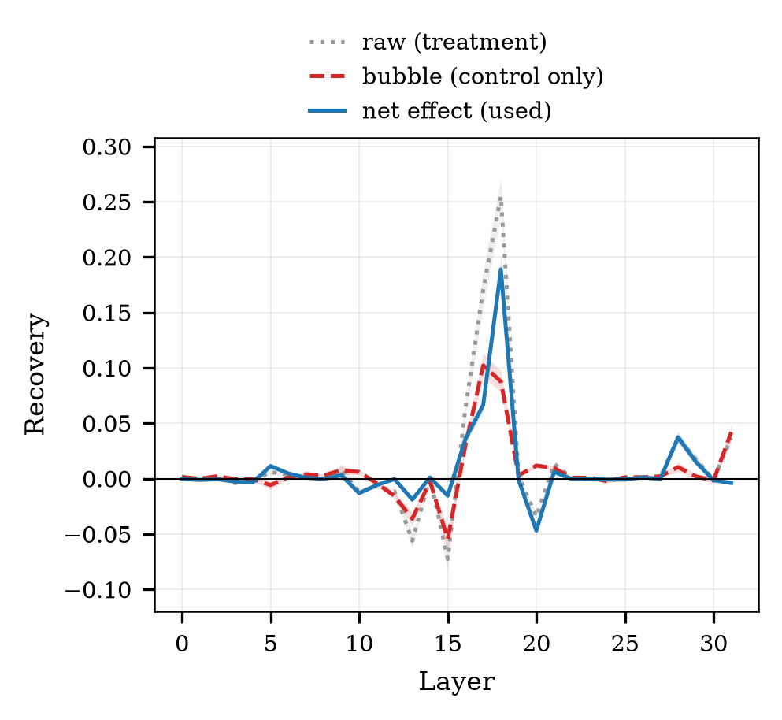
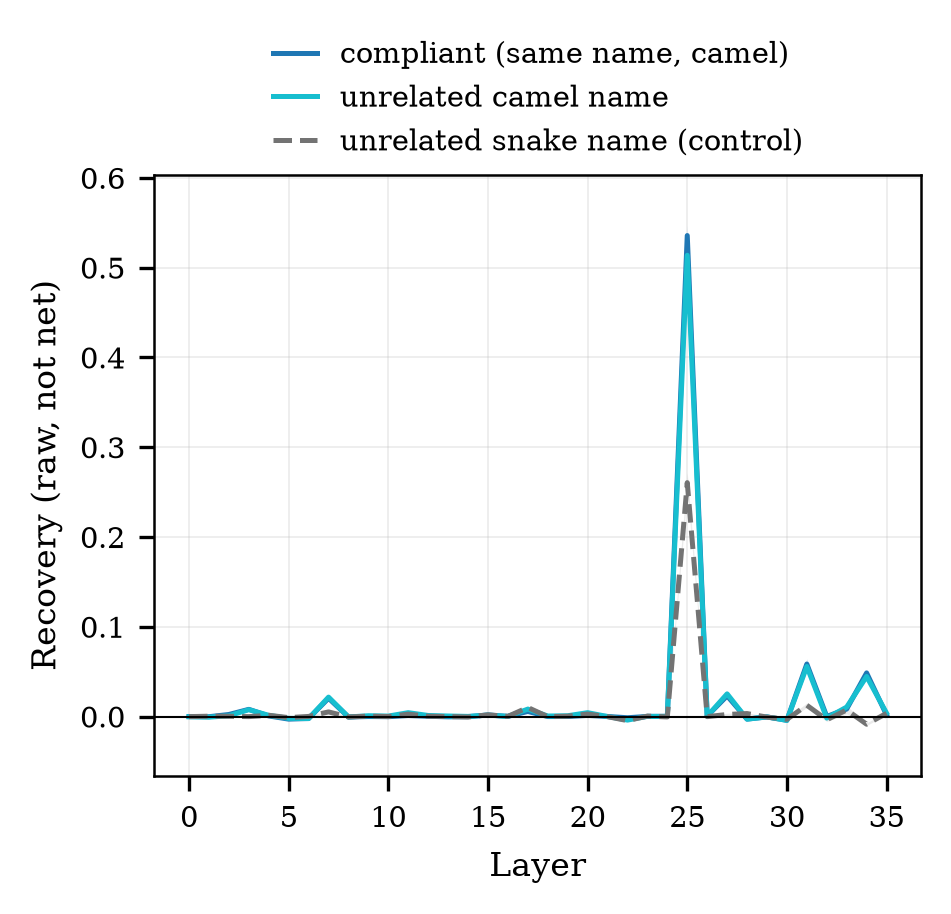
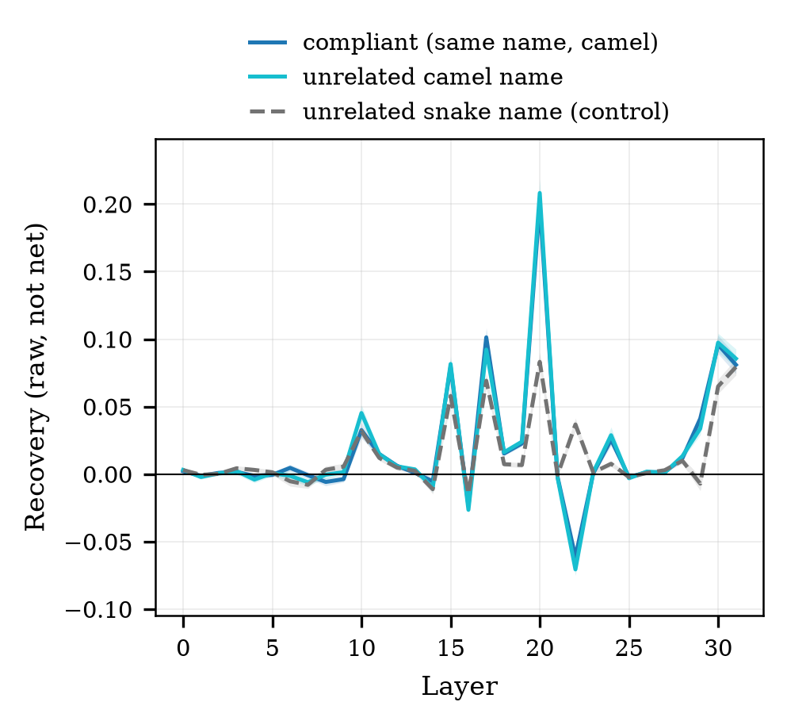
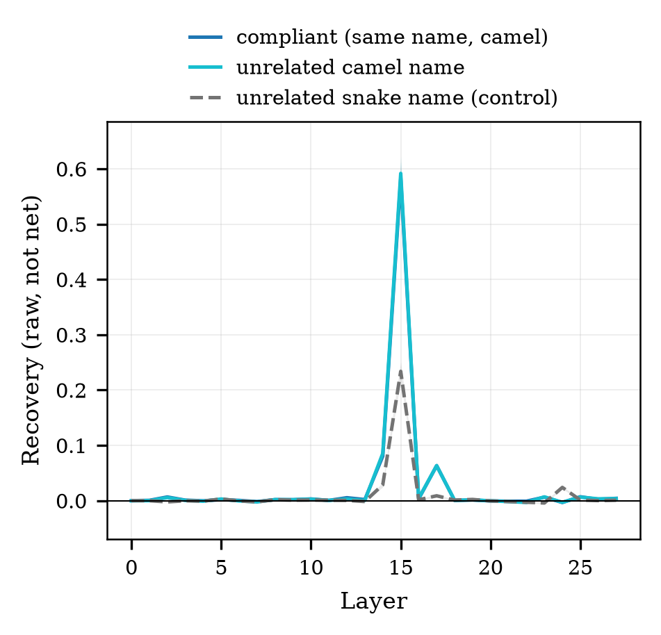
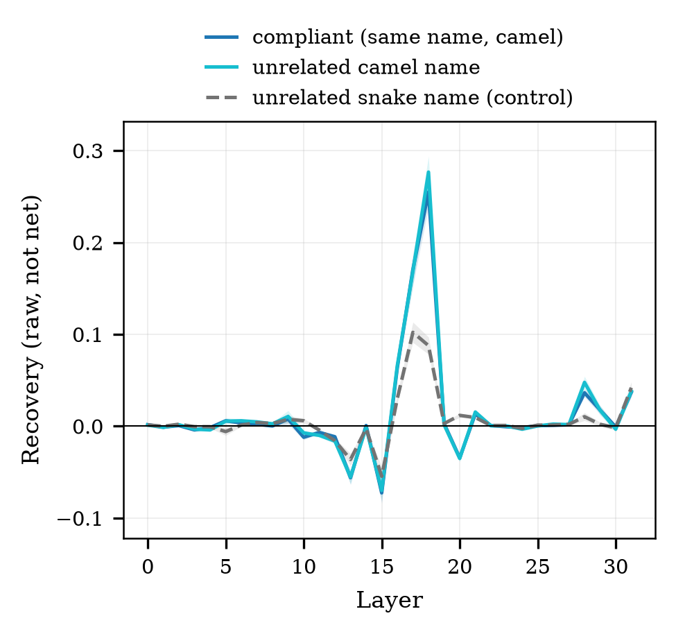

# step3 결과 — 코드 신호는 내용에 실린다 (RQ2 인과)

> **스텝:** step3 · **RQ:** RQ2 (인과) · **결과:** `results/step3_code-cause/` 504개
> **재현:** `python scripts/step3_net_effect.py results/step3_code-cause --figs docs/step3/figures`

---

## 1. 결과 JSON 읽는 법

> 파일 하나 = **조건 하나**(모델 × 이름 묶음 × 공여 3종). 경로는
> `results/step3_code-cause/<슬러그>.json`. 한 파일 안에 **전 층 × 개입 3종**의 값이 들어 있다.
> 공통 뼈대(`step`·`rq`·`condition`·`meta`)는 [`../코드_하네스공통.md`](../코드_하네스공통.md) §5~6,
> 이 값을 만드는 코드는 [`code.md`](code.md) §6.

### 1-1. 먼저 — 각 필드가 무엇을 말하는가

**S가 무엇인가** — 이 스텝의 모든 숫자가 S에서 나온다.

프롬프트 끝에 `"def "`를 강제로 붙여 **이름 자리**를 만들고, 거기에 올 후보 **두 개**의
로그확률을 잰다. 후보는 새로 써 달라고 한 함수의 **같은 이름 두 표기판**이다
(`removeDuplicates` ↔ `remove_duplicates`). 각 후보의 토큰별 로그확률을 더해 후보
문자열의 로그확률을 얻은 뒤,

> **S = logP(준수 표기 후보) − logP(위반 표기 후보)**  (단위: nat)

- **양수** = 지침이 요구한 표기를 더 선호 · **음수** = 위반 표기를 더 선호.
- 생성을 시키지 않고 점수를 재는 이유: 생성은 0/1로만 나와 **얼마나** 움직였는지가 안 보인다
  (→ [`code.md`](code.md) §2-2).

**S의 세 상태** — 같은 조건에서 프롬프트/개입만 달리해 세 번 잰다.

| 필드 | 어떤 상태의 점수인가 | 역할 |
|---|---|---|
| `S_clean` | 선행 코드 12개가 **전부 준수판**인 프롬프트 (위반이 하나도 없다) | **천장** — 문맥 오염이 없을 때 |
| `S_base` | 실제 조건 프롬프트 (위반 6개가 섞여 있다). **개입 전** | **바닥** — 되돌릴 출발점 |
| `<개입종류>__S_int` | `S_base`와 **글자가 똑같은** 프롬프트에서, 위반 이름이 있던 자리의 내부 표현만 다른 값으로 덮은 뒤의 점수 | 덮은 뒤 |

**되돌림(회복률)**

> **`recovery` = (S_int − S_base) / (S_clean − S_base)**

| 값 | 뜻 |
|---|---|
| `0` | 개입해도 바닥 그대로 — 아무것도 안 옮겨졌다 |
| `1` | 천장까지 완전히 되돌아왔다 |
| 0~1 | 부분 회복. 표에 쓰는 값 |
| 음수 | 오히려 반대로 밀렸다 |
| >1 | 천장을 넘겼다(과잉) |

곁들여 보는 값 — **영향력 `gap` = \|S_clean − S_base\|**. 회복률의 **분모 크기**다.
이게 작으면(문맥이 애초에 점수를 못 흔들었으면) 작은 수를 작은 수로 나누는 셈이라
회복률을 믿을 수 없다. 기준은 `gap < 1.0` → **판정 불가**(CLAUDE.md §3).

> ⚠️ **step3의 504개 파일에는 `gap`·`undecidable` 필드가 없다.** 그 필드는 step3을 돌린 뒤에
> 추가됐다(step5 통제분·step6부터 들어 있다). 집계 때 직접 계산한다 — 값은 같다:
> ```python
> gap = abs(extra["S_clean"] - extra["S_base"])
> undecidable = gap < 1.0
> ```
> step3은 **4모델 3공여 모두 판정 불가 0개**다.

**개입 종류(kind)** — `per_layer` 키의 앞부분

| 키 | 무엇을 덮었나 | 무엇을 묻는 조건인가 |
|---|---|---|
| `key__…` | **Key만** | 그 자리를 "얼마나 보는가"(어텐션 경로)만 바꿨을 때 |
| `value__…` | **Value만** | 그 자리가 "무엇을 실어 오는가"(내용)만 바꿨을 때 |
| `key_value__…` | **둘 다** | 두 경로를 함께 바꿨을 때 |

**per_layer** — 키는 층 번호(문자열), 값은 `<개입종류>__<지표>`.

| 필드 | 무슨 값인가 |
|---|---|
| `<종류>__S_int` | 그 층·그 종류로 덮은 뒤의 S |
| `<종류>__recovery` | 위 공식으로 계산한 되돌림 ← **헤드라인 값** |

> 층 효과는 **누적되지 않는다.** 한 층을 덮고 재고 **원상 복구한 뒤** 다음 층으로 간다.
> 따라서 층별 값은 "그 층 하나만 바꿨을 때"이고, 층들을 더해도 전체가 되지 않는다.

**extra**

| 필드 | 무슨 값인가 |
|---|---|
| `mode` | `"intervene_sweep"` — 전 층을 훑었다는 표시 |
| `intervention_target` | `"code"` — 덮은 자리가 **선행 코드의 이름**이라는 뜻(step5는 `"instruction"`) |
| `donor` | **어디서 떠온 값을 덮었나.** `compliant`(같은 이름의 준수판) / `unrelated_camel`(무관한 camel 모듈) / `unrelated_snake`(무관한 snake 모듈 = **표기 정보가 없다**) |
| `target` | 지침이 요구한 표기 |
| `kinds` | 이 파일에 들어 있는 개입 종류 목록 |
| `n_substituted_tokens` | **실제로 덮은 자리 수.** 0이면 실행이 예외로 죽는다(조용한 실패 금지) — 저장된 파일에 0은 없다 |
| `skipped_names` | 자리를 못 찾아 **빠진** 이름의 번호. 비어 있어야 정상 |
| `viol_names` | 덮인 이름들(위반 표기) |
| `donor_names` | 덮어넣은 이름들(공여). 이 둘을 나란히 보면 **어떤 공여 조건인지 즉시 확인된다** — `split_config → splitConfig`면 같은 이름 준수판, `split_config → serialize_stream`이면 무관 모듈 |

### 1-2. 실제 파일 모양

```jsonc
"metrics": {
  "per_layer": {
    "27": {
      "value__S_int":      -1.24,
      "value__recovery":     0.42,   // ← 헤드라인
      "key__S_int":        -3.01,
      "key__recovery":       0.02,
      "key_value__S_int":  -1.10,
      "key_value__recovery": 0.45
    }, …
  },
  "extra": {
    "mode": "intervene_sweep",
    "donor": "compliant",            // 또는 unrelated_camel / unrelated_snake
    "intervention_target": "code",
    "kinds": ["key", "value", "key_value"],
    "S_clean": 1.83, "S_base": -3.21,
    "n_substituted_tokens": 31,      // 실제로 덮은 자리 수 (0이면 예외였다)
    "skipped_names": [],             // 정렬 실패한 이름 인덱스
    "viol_names": ["split_config", …], "donor_names": ["splitConfig", …]
  }
}
```

### 1-3. 읽는 순서

1. `extra.donor`와 `donor_names`를 본다 — **표기 정보를 넣은 조건인가, 정보 없이 덮기만 한
   조건인가.** 이걸 놓치면 그냥 덮어서 생긴 몫이 섞인 값을 결과로 읽게 된다.
2. `S_clean`·`S_base`로 `gap`을 계산해 판정 가능한 조건인지 확인한다(`gap ≥ 1.0`).
3. `per_layer`에서 `<종류>__recovery`를 층별로 훑는다. **`extra`에는 `recovery`도 `layer`도
   없다** — 스윕 결과의 층별 값은 오직 `per_layer` 안에 있다(단일 층 경로에만 `extra["recovery"]`가 있다).
4. **한 파일의 값만으로 결론 내지 않는다.** 보고하는 값은
   **(표기 정보를 넣었을 때) − (정보 없이 덮기만 했을 때)** 이고, 같은 묶음끼리 짝지어 뺀 뒤
   42묶음 평균을 낸다:
   `python scripts/step3_net_effect.py results/step3_code-cause --figs docs/step3/figures`

---

## 2. 무엇을 어떻게 쟀나

### 2-0. 이 문서에서 쓰는 말

먼저 단어부터 고정한다. 아래 표의 오른쪽 칸이 그 말이 실제로 가리키는 것이다.

| 말 | 무엇을 가리키나 |
|---|---|
| **덮어쓰기** | 프롬프트 글자는 그대로 두고, 모델이 그 자리에 대해 내부에 저장해 둔 값만 다른 값으로 바꿔치기하는 것 |
| **덮어넣는 값**(공여) | 바꿔치기할 때 **어디서 떠 온 값**을 넣는가. 세 종류를 쓴다(→ §2-2) |
| **어텐션 쪽 / 내용 쪽** | 저장된 값은 두 갈래다. 어텐션 쪽(Key)은 "그 자리를 얼마나 보는가", 내용 쪽(Value)은 "볼 때 무엇이 실려 오는가" |
| **점수 S** | 이름 자리에 올 두 후보(같은 이름의 camel판·snake판)의 로그확률 차이. 양수면 지침대로 쓰려는 상태 |
| **되돌림** | 덮어쓴 뒤 점수가 위반 문맥(바닥)에서 깨끗한 문맥(천장) 쪽으로 얼마나 갔나. 0=제자리, 1=천장 |
| **그냥 덮어도 나오는 값** | **표기 정보가 전혀 없는 값으로 덮었는데도 나오는 되돌림.** 정보가 옮겨가서가 아니라 "덮는 행위 자체"가 만든 값(→ §2-3) |
| **표기 때문에 생긴 값** | 되돌림에서 위의 값을 뺀 나머지. **논문에 쓰는 값은 항상 이것이다** |
| **묶음** | 함수 이름 12개 한 세트. 42묶음이 있고, 같은 묶음끼리 짝지어 빼야 묶음 난이도가 상쇄된다 |
| **판정 불가** | 문맥이 애초에 점수를 거의 못 흔든 조건(\|천장−바닥\| < 1.0). 되돌림의 분모가 너무 작아 해석하지 않는다. step3은 **0개** |

**그림·코드에 쓰인 영어 이름과의 대응.** 그림 범례와 스크립트는 영어(`raw`·`bubble`·`net effect`)로
적혀 있다. 셋은 **같은 실험의 세 숫자**이고, 아래가 전부다.

| 그림·코드 라벨 | 이 문서에서 부르는 말 | 어떻게 얻나 | 무슨 뜻인가 |
|---|---|---|---|
| **raw** (treatment) | **원래 값** | 표기 정보가 **든** 값으로 덮었을 때의 되돌림. 아무것도 빼지 않았다 | 상한. 정보가 옮겨간 몫과 덮는 행위의 몫이 **섞여 있다** |
| **bubble** (control only) | **그냥 덮어도 나오는 값** | 표기 정보가 **없는** 값(다른 모듈·snake)으로 덮었을 때의 되돌림 | 정보와 무관한 몫. 원래 값에서 이만큼은 **깎아야 한다** |
| **net effect** (used) | **표기 때문에 생긴 값** | (다른 모듈·camel) − (다른 모듈·snake), 같은 묶음끼리 짝지어 뺀 값 | **논문에 쓰는 값.** 표기 정보가 실제로 옮겨간 몫 |

> `bubble`을 "거품"이라 옮기지 않는다. 거품은 부풀려졌다는 어감만 주고 무엇을 잰 값인지
> 알려주지 않는다. 이 문서에서는 항상 **"그냥 덮어도 나오는 값"** 으로 쓴다.

### 2-1. 무엇을 바꿔치기했나

문맥에 섞인 **위반 이름(snake) 6개**가 있다. 이 이름들이 있던 자리에 대해 모델이 내부에
저장해 둔 값을 **다른 값으로 덮고**, 지침대로 쓰려는 성향이 되돌아오는지를 잰다.
**화면의 글자·길이·토큰 수는 하나도 건드리지 않는다.** 바뀌는 것은 내부 값뿐이다.

- 덮는 갈래 3가지: **어텐션 쪽만 / 내용 쪽만 / 둘 다**. 층은 전 층을 하나씩 훑는다.
- 모델 4개 × 묶음 42개 × 덮어넣는 값 3종 = 504개. 시드 42, 평균 덮어쓰기.
- 되돌림 = (덮은 뒤 점수 − 바닥) / (천장 − 바닥).

### 2-2. 덮어넣는 값을 세 종류로 둔 이유

덮어쓰기는 **한 번에 두 가지 일**을 한다.

```
    ① 원래 있던 값을 지운다        ← 위반 쪽으로 끌던 힘이 사라진다
    ② 새 값을 넣는다               ← 이쪽이 우리가 재고 싶은 것
```

①만으로도 점수는 움직인다. 그래서 한 조건만 돌리면 ①과 ②가 섞인 값이 나온다.
가르려면 **②는 없고 ①만 있는 조건**이 필요하다. 그래서 넣는 값을 세 종류로 둔다.

| 덮어넣는 값 | 어디서 떠 오나 | camel 정보 | 이 조건이 답하는 질문 |
|---|---|---|---|
| 같은 이름의 준수판 | `split_config` → `splitConfig` | 있다 | 원래 하려던 개입. 다만 아래 두 조건과 문맥 구성이 달라 짝이 안 맞는다 |
| **다른 모듈 · camel** | 별개 모듈 6함수, 전부 camel | 있다 | ①+② |
| **다른 모듈 · snake** | 별개 모듈 6함수, 전부 snake | **없다** | **①만** |

아래 두 줄은 **문맥 구성이 완전히 같다**(둘 다 별개 모듈 6함수·단일 표기). 차이가 오직
표기에서만 오므로, 둘을 빼면 ①이 정확히 지워진다.

> **표기 때문에 생긴 값 = (다른 모듈·camel) − (다른 모듈·snake)**
> 같은 묶음끼리 먼저 빼고, 그 차이 42개의 평균과 신뢰구간을 낸다.

맨 윗줄(같은 이름의 준수판)은 보조로만 본다. 이쪽은 12함수 문맥에서 떠 온 값이라
아래 두 줄(6함수 문맥)과 문맥 길이가 달라 차이에 표기 말고 다른 것도 섞인다.
두 방식의 값은 신뢰구간 안에서 일치한다(§3 표).

**"다른 모듈"이 무슨 뜻인가.** 말 그대로 **코드 파일을 하나 더 만들어 모델에 따로 한 번
통과시킨 것**이다. 그 파일에는 실험 문맥에 **한 번도 안 나온** 함수 6개가 들어 있고, 전부 한
표기로 통일돼 있다. 그 프롬프트를 돌릴 때 이름 자리에 생긴 내부 값을 떠다가, 원래 문맥의
위반 이름 자리에 덮는다. 실제 데이터에서 뽑은 한 조건:

| | 이름 6개 |
|---|---|
| 문맥에 있던 **위반 이름** (덮을 자리) | `split_config` · `filter_session` · `format_request` · `expand_entry` · `compute_matrix` · `resolve_packet` |
| **다른 모듈 · camel** 에서 떠온 값 | `serializeStream` · `serializeBatch` · `materializeHeader` · `validateHandle` · `normalizeFrame` · `deserializeManifest` |
| **다른 모듈 · snake** 에서 떠온 값 | `serialize_stream` · `serialize_batch` · `materialize_header` · `validate_handle` · `normalize_frame` · `deserialize_manifest` |

아래 두 줄은 **같은 함수 6개를 표기만 바꿔 쓴 것**이다. 함수도 개수도 문맥 길이도 같고
글자 모양만 다르다. 그래서 둘을 빼면 표기 말고는 전부 상쇄된다.
이름을 고르는 코드는 `src/harness/prompt.py:229`(`unrelated_specs` — 이번 문맥에 안 쓰인
이름 중에서 뽑는다), 그 이름들로 별도 프롬프트를 만드는 곳은 `src/harness/runner.py:452`다.
결과 파일의 `viol_names`·`donor_names`를 나란히 보면 어떤 조건인지 바로 확인된다.

### 2-3. "그냥 덮어도 나오는 값"이란 무엇인가

**표기 정보가 하나도 없는 값(다른 모듈·snake)으로 덮었는데도 되돌림이 나온다.**
그게 이 값이다(그림 라벨 `bubble`). 크기는 **원래 값의 34~49%** — 절반 가까이다.

왜 생기나. 위반 이름 자리에 저장돼 있던 값은 "여기 snake_case가 있다"는 정보를 담고
모델을 위반 쪽으로 끌고 있었다. 그 자리를 **무엇으로 덮든 그 힘이 사라진다.** 새 정보가
들어와서가 아니라, 방해하던 것이 없어져서 점수가 올라간다.

여기에 더해 우리가 쓰는 덮어쓰기 방식(조각들을 평균 내 한 값으로 만들어 넣기) 자체가
원래 값의 길이와 방향을 흐트러뜨린다. 이 몫도 여기에 함께 들어 있다.

**빼면 무엇이 달라지나.**

| | 빼기 전 | 빼기 후 |
|---|---|---|
| 내용 쪽 (Qwen L25) | 0.536 | **0.253** |
| 어텐션 쪽 (Qwen L25) | 0.386 | **−0.005** |

내용 쪽은 절반으로 줄지만 **살아남는다.** 어텐션 쪽은 **0으로 무너진다** — 원래 값 0.39가
전부 그냥 덮어서 생긴 값이었다는 뜻이다. 이 스텝의 결론(신호는 내용 쪽에 실린다)은 빼기 전에는
보이지 않는다. 빼기 전 값만 보면 두 갈래가 0.54 대 0.39로 **비슷해 보인다.**

> 이것이 이 연구에서 통제 조건을 반드시 함께 돌리는 이유다(CLAUDE.md §3).
> 통제 없는 값은 **상한**이고, 그 상한만으로는 어느 갈래가 신호를 나르는지 알 수 없다.

### 2-4. 이걸 재는 실험은 따로 있지 않다 — 이 스텝 안에 있다

혼동하기 쉬운 지점이라 분명히 해 둔다.

| 무엇을 묻나 | 어디서 답하나 |
|---|---|
| 그냥 덮어도 나오는 값이 얼마나 되나, 빼면 뭐가 남나 | **step3 자기 자신.** 덮어넣는 값 3종을 같은 조건에서 돌려 뺀다 |
| 덮어쓰기가 **어텐션 쪽을 내용 쪽보다 더 망가뜨리나** | **diag.** 이건 다른 질문이다(아래) |

**diag가 답하는 것.** "어텐션 쪽 되돌림이 0"이라는 결과는, 어텐션 쪽 덮어쓰기가 애초에
더 심하게 망가진 개입이었다면 의미가 없다. diag는 덮어쓴 값이 원래 값에 비해 얼마나
짧아졌는지를 두 갈래에서 각각 재서, **어텐션 쪽이 더 불리하지 않다**는 것을 확인한다
(→ [`../diag/results.md`](../diag/results.md)). 그냥 덮어도 나오는 값의 크기와는 상관이 없다.

### 2-5. step5와 무엇이 다른가

step3은 **그냥 덮어도 나오는 값을 전 층에서 쟀다.** 그래서 층마다 빼기가 가능하고, 층별 곡선이 나온다.

step5(지침 쪽 인과)는 같은 설계인데 **그 값을 봉우리 층 한 곳에서만 쟀다.** 그래서
층별 곡선을 만들 수 없고, 봉우리 층도 "고른 것"이 아니라 "뺄 수 있는 유일한 층"이다
(→ [`../step5/results.md`](../step5/results.md) §3). 그 비대칭을 없애려고 step5 통제를
전 층으로 다시 재는 실행이 예정돼 있다.

이 대조가 중요한 이유: **step3에서는 원래 값의 봉우리 층과 표기 때문에 생긴 값의 봉우리 층이
네 모델 모두 일치한다**(L25·L20·L15·L18). step5가 한 층만 재고도 봉우리를 맞게 짚었다고
보는 근거가 이것이다 — 다만 확인이 아니라 가정이다.

---

## 3. 결과

### 3-0. 그림이 네 묶음이다 — 어느 그림이 무엇인가

같은 실험 하나(504개 파일)를 **네 가지 방식으로 잘라 그린 것**이다. 새 실험이 아니다.

| 그림 묶음 | 몇 장 | 무엇을 보여주나 | 뺐나 | 어느 갈래 | 왜 있나 |
|---|---|---|---|---|---|
| `explain_bubble` | 1장 (4모델 한 장) | 봉우리 층 **한 점**에서, 정보 있는 값으로 덮었을 때 vs 없는 값으로 덮었을 때 | 둘 다 보임 | 내용·어텐션 | **이해용.** 이 스텝의 결론을 한 장으로 |
| `bubble_<모델>` | 4장 | 층별로 **원래 값 · 그냥 덮어도 나오는 값 · 표기 때문에 생긴 값** 세 곡선 | 셋 다 보임 | 내용만 | 논문 그림의 숫자가 **어떻게 깎여 나왔는지**를 보이려고 |
| `donors_<모델>` | 4장 | 층별로 **덮어넣는 값 3종의 원래 값** 곡선 | **안 뺌**(뺄 수 없다 → §3-3) | 내용만 | 세 조건이 각각 어디에 있는지 — 빼기 전 재료 |
| `code_causality_<모델>` + `key_vs_value` | 4+1장 | **표기 때문에 생긴 값만** (내용/어텐션/둘다) | **뺐음** | 셋 다 | **논문용.** 최종 결과 |

**뺐나 = 통제(표기 정보 없는 값으로 덮은 조건)를 뺀 값이냐.** 논문에 인용하는 수치는
**뺀 값뿐이다**(맨 아래 줄). 위 세 묶음은 그 값이 어떻게 나왔는지 보이는 보조 그림이라
빼기 전 값이 함께 그려져 있고, 그림 안에 `raw`라고 표시돼 있다.

세 곡선 묶음(`bubble`·`donors`·`code_causality`)은 **가로축이 전부 "몇 번째 층을 덮었나"**이고,
**세로축이 전부 되돌림(0=바닥 그대로, 1=천장 회복)**이다. 다른 것은 **선이 무엇을 가리키느냐**뿐이다.

---

### 3-1. 한눈에 보기 (이해용) — `explain_bubble`

| 항목 | 이 그림에서 |
|---|---|
| **무엇을 재나** | 봉우리 층 **한 층**에서, 덮어넣는 값에 표기 정보가 **있을 때와 없을 때** 되돌림이 얼마나 달라지나 |
| **가로축** | 모델 4개 (층은 각 모델의 봉우리 층으로 고정) |
| **세로축** | 되돌림 — 0=위반 문맥 그대로, 1=깨끗한 문맥까지 회복 |
| **왼쪽 판 / 오른쪽 판** | 왼쪽 = **내용 쪽(Value)** 을 덮었을 때 · 오른쪽 = **어텐션 쪽(Key)** 을 덮었을 때 |
| **파란 막대** | 표기 정보가 **든** 값(다른 모듈·camel)으로 덮음 = `raw` |
| **회색 막대** | 표기 정보가 **없는** 값(다른 모듈·snake)으로 덮음 = `bubble` |
| **빨간 화살표** | 두 막대의 차이 = `net effect` = **논문에 쓰는 값** |
| **결과** | 왼쪽은 화살표가 길다(0.125~0.358) · 오른쪽은 두 막대가 **같은 높이**(−0.005~0.021) |
| **뜻** | 내용 쪽으로는 표기 정보가 옮겨간다. 어텐션 쪽으로는 **아무것도 옮겨지지 않는다** |


---

### 3-2. 값이 어떻게 깎여 나오나 — `bubble_<모델>` 4장

| 항목 | 이 그림에서 |
|---|---|
| **무엇을 재나** | 논문에 쓰는 값이 나오기까지, 층마다 원래 값이 얼마였고 그중 얼마가 깎였나 |
| **가로축** | **몇 번째 층을 덮었나** (0 = 첫 층). 층 하나 덮고 재고 **원상 복구** 후 다음 층 — 누적이 아니다 |
| **세로축** | 되돌림 (0=바닥, 1=천장) |
| **회색 점선 `raw (treatment)`** | **원래 값** — 같은 이름 준수판으로 덮었을 때. 아직 아무것도 안 뺐다 |
| **빨간 파선 `bubble (control only)`** | **그냥 덮어도 나오는 값** — 표기 정보가 없는 값(다른 모듈·snake)으로 덮었을 때 |
| **파란 실선 `net effect (used)`** | **표기 때문에 생긴 값** — (다른 모듈·camel) − (다른 모듈·snake). 논문에 쓰는 값 |
| **음영** | 42묶음 평균의 95% 신뢰구간 |
| **어느 갈래인가** | 이 4장은 **내용 쪽(Value)만** 그린 것이다 |
| **읽는 법** | 회색 점선 = 상한(빼기 전) · 빨간 파선 = 그중 표기와 무관한 몫 · 파란 실선 = 남는 몫(논문 값). 회색 ≈ 빨강 + 파랑 |
| **결과** | 봉우리 층 한 곳에서만 세 선이 함께 솟고, 빨간 선이 회색 선의 **34~49%** 를 차지한다 |
| **뜻** | 통제를 빼지 않은 값은 **절반 가까이가 표기와 무관한 몫**이다. 그래서 반드시 뺀다 |

| Qwen2.5-Coder-3B | DeepSeek-Coder-6.7B |
|---|---|
|  |  |
| **Llama-3.2-3B (범용)** | **StableCode-3B** |
|  |  |

**봉우리 층에서 그냥 덮어도 나오는 값이 원래 값의 34~49%다.**

| 모델 | 봉우리 층 | 원래 값 (raw) | 그냥 덮어도 나오는 값 (bubble) | 표기 때문에 생긴 값 (net) | 깎인 비중 |
|---|---|---|---|---|---|
| Qwen | L25 | 0.536 | 0.261 | **0.253** | 49% |
| DeepSeek | L20 | 0.200 | 0.083 | **0.125** | 42% |
| Llama | L15 | 0.583 | 0.234 | **0.358** | 40% |
| StableCode | L18 | 0.255 | 0.088 | **0.189** | 34% |

---

### 3-3. 덮어넣는 값 3종을 나란히 — `donors_<모델>` 4장

| 항목 | 이 그림에서 |
|---|---|
| **무엇을 재나** | **덮어넣는 값을 무엇으로 바꾸면 되돌림이 달라지는가.** 세 조건의 raw 값을 그대로 겹쳐 놓았다 |
| **가로축** | 몇 번째 층을 덮었나 |
| **세로축** | 되돌림 — **`raw, not net`**, 즉 아무것도 빼지 않은 값 (왜 그런지는 바로 아래) |
| **`compliant (same name, camel)`** (진한 파랑) | 같은 이름의 준수판을 덮음 (`split_config` → `splitConfig`). 표기 정보 **있음** |
| **`unrelated camel name`** (하늘색) | 상관없는 다른 모듈의 camel 이름을 덮음. 표기 정보 **있음** |
| **`unrelated snake name (control)`** (회색 파선) | 상관없는 다른 모듈의 snake 이름을 덮음. 표기 정보 **없음** ← **통제** |
| **어느 갈래인가** | **내용 쪽(Value)만.** 어텐션 쪽은 그림 대신 표로 본다(→ 아래) |
| **읽는 법** | **하늘색과 회색 파선이 벌어진 폭 = 표기 때문에 생긴 값.** 이 둘은 문맥 구성이 완전히 같아 표기만 다르다 |
| **결과** | 두 camel 선(진한 파랑·하늘색)이 거의 겹치고, 회색 파선만 아래로 내려간다 |
| **뜻** | 옮겨지는 것은 **그 이름 자체가 아니라 표기 형태**다. 이름이 달라도 camel이기만 하면 같은 값이 나온다 |

**왜 이 그림만 빼지 않은 값인가.** 정한 것이 아니라 **뺄 수가 없다.** 표기 때문에 생긴 값은
`(하늘색) − (회색 파선)`, 즉 **이 그림에 있는 두 선의 차이로 정의된다.** 빼고 나면 선 3개가
1개로 합쳐지는데, 그 1개가 바로 다음 절의 논문용 그림이다. 이 그림의 일 자체가
**"빼기 전 재료 3개가 각각 어디에 있었나"** 를 보이는 것이라 빼면 그림이 없어진다.

> CLAUDE.md §3의 "보고는 처치 − 통제로 한다"는 **보고하는 수치**에 대한 규정이다.
> 논문 표·논문 그림은 전부 뺀 값이고(§3-4), 이 그림은 그 값이 어디서 나왔는지 보이는
> 보조 그림이다. 그래서 세로축 이름에 `raw, not net`을 박아 뒀다 — 이 값을 결과로
> 인용하지 말라는 표시다.

**왜 내용 쪽(Value)만 그렸나.** 어텐션 쪽은 **세 선이 전부 겹쳐서** 곡선으로 그릴 것이 없다.
같은 값을 §3-4 끝의 표에 숫자로 실어 뒀다 — Qwen L25에서 0.386 / 0.374 / **0.379**로,
표기 정보가 있든 없든 사실상 같다. "겹친다"는 사실 자체가 이 스텝의 결론(어텐션 쪽으로는
아무것도 옮겨지지 않는다)이므로, 숫자 세 개로 보이는 편이 곡선 세 개를 겹쳐 그리는 것보다 낫다.
`bubble_<모델>`(§3-2)이 내용 쪽만인 이유도 같다.

| Qwen2.5-Coder-3B | DeepSeek-Coder-6.7B |
|---|---|
|  |  |
| **Llama-3.2-3B (범용)** | **StableCode-3B** |
|  |  |

---

### 3-4. 논문용 그림 — `code_causality_<모델>` 4장 + `key_vs_value` 1장

**층별 곡선** (모델마다 세로 눈금 범위가 달라 따로 그린다)

| 항목 | 이 그림에서 |
|---|---|
| **무엇을 재나** | 세 갈래(내용/어텐션/둘다) 중 **어느 갈래를, 어느 층에서** 바꿔야 표기 성향이 되살아나나 |
| **가로축** | 몇 번째 층을 덮었나 |
| **세로축** | `Notation-specific recovery` = **표기 때문에 생긴 값**. 통제를 이미 뺀 값이다(3-2의 파란 실선과 같은 값) |
| **`Value only`** (파랑) | 그 자리가 **무엇을 실어 오는가(내용)** 만 바꿨을 때 |
| **`Key only`** (회색) | 그 자리를 **얼마나 보는가(어텐션)** 만 바꿨을 때 |
| **`Key + Value`** (주황) | 둘 다 바꿨을 때 |
| **음영** | 42묶음 짝지음 95% 신뢰구간 |
| **결과** | 파랑만 **한 층에서** 솟는다 · 회색은 전 층에서 0에 붙어 있다 · 주황은 파랑의 절반 이하 |
| **뜻** | 표기 신호는 **내용 쪽에, 후반 특정 한 층에** 있다. 어텐션 쪽에는 없다 |


**봉우리 층 요약**

| 항목 | 이 그림에서 |
|---|---|
| **무엇을 재나** | 위 4장의 **봉우리 층 값만** 뽑아 4모델을 한 장에 |
| **가로축** | 모델 4개. 아래 `L25`·`L20`·`L15`·`L18`은 그 모델의 **봉우리 층 번호** |
| **세로축** | 표기 때문에 생긴 값 (통제 뺀 값) |
| **파란 막대 / 회색 막대** | 내용만(Value) / 어텐션만(Key) |
| **오차 막대** | 42묶음 짝지음 95% 신뢰구간 |
| **결과** | 네 모델 모두 파랑은 0.13~0.36, 회색은 0에 붙어 있다 |
| **뜻** | 모델·층이 달라도 **같은 결론**이 나온다 — 한 모델의 우연이 아니다 |


**봉우리 층에서의 표기 때문에 생긴 값** (42묶음 짝지음 ±95%)

| 모델 | 봉우리 층 | 깊이 | 내용만(Value) | 어텐션만(Key) | 둘다(K+V) |
|---|---|---|---|---|---|
| Qwen2.5-Coder-3B | L25 | 71% | **0.253±0.008** | **−0.005±0.001** | 0.117±0.006 |
| DeepSeek-Coder-6.7B | L20 | 65% | **0.125±0.008** | **0.004±0.002** | 0.055±0.005 |
| Llama-3.2-3B | L15 | 56% | **0.358±0.018** | **0.003±0.001** | 0.102±0.008 |
| StableCode-3B | L18 | 58% | **0.189±0.012** | **0.021±0.003** | 0.080±0.006 |

**덮어넣는 값별 원래 값**(Qwen L25 기준) — **`donors_*` 그림의 어텐션 쪽 판에 해당한다**(§3-3에서
가리키는 표). 어텐션 쪽은 무엇을 덮든 값이 같아 곡선으로 그리지 않고 숫자로 싣는다.

| 덮은 갈래 | 같은 이름 준수판 | 다른 모듈·camel | 다른 모듈·snake |
|---|---|---|---|
| 내용 쪽 | 0.536 | 0.514 | 0.261 |
| 어텐션 쪽 | 0.386 | 0.374 | **0.379** |

맨 오른쪽 칸이 표기 정보가 없는 조건이다. 내용 쪽은 0.514 대 0.261로 벌어지지만,
어텐션 쪽은 0.374 대 0.379로 **사실상 같다.**

---

## 4. 해석

**(1) 표기 신호를 나르는 것은 내용 쪽(Value)이다.**
내용 쪽만 바꾸면 표기 때문에 생긴 값이 0.13~0.36 나온다. 4모델 모두, 신뢰구간이 0을 넘지 않는다.

**(2) 어텐션 쪽은 표기 정보를 나르지 않는다 — 다만 "0"은 아니다.**
어텐션 쪽만 바꾼 조건은 **camel을 덮든 snake를 덮든 값이 같다**(0.374 vs 0.379).
표기 때문에 생긴 값은 −0.005~0.021로 내용 쪽의 2~11%이며, **전 층 어디에서도 봉우리가 서지 않는다.**
원래 값 0.39는 사실상 전부 그냥 덮어서 생긴 값이었다.
신뢰구간이 0을 물지 않는 모델이 있으므로 "0이다"가 아니라 **"내용 쪽의 2~11%로 실용상
무시할 수준"**이라고 적는다.

**(3) 신호는 한 층에 국소화된다.**
봉우리 값의 절반 이상인 층이 **4모델 모두 정확히 하나**다. 깊이로는 56~71% 지점.
앞 21묶음으로 층을 고르고 뒤 21묶음에서 평가한 분할검증도 네 모델 모두 같은 층을 고른다.

**(4) 옮겨지는 것은 이름이 아니라 표기 형태다.**
같은 이름의 준수판(0.536)과 아무 상관 없는 다른 camel 이름(0.514)이 거의 같은 값을 낸다.
내용에 실린 것은 이름 고유의 정보가 아니라 **옮겨지는 일반 표기 특징**이다.

**(5) 어텐션 쪽을 함께 바꾸면 신호가 오히려 깎인다.**
둘 다(0.117)가 내용 쪽만(0.253)의 절반 이하다. 4모델 모두 같은 방향이고 신뢰구간이 겹치지 않는다.
덮어넣는 값의 어텐션 쪽 표현까지 넣으면 그 자리를 참조하는 정도가 함께 바뀌어, 제대로 넣은 내용이 덜 읽힌다.
**어텐션과 내용은 독립적으로 더해지지 않고 상호작용한다.**

---

## 4-1. 0.13~0.36이면 "회복이 안 된 것" 아닌가

당연히 나오는 의문이라 따로 적어 둔다. **절반은 맞는 말이다.**

**작은 값이 아니라고 보는 근거 — 층 하나만 갈아끼운 값이다.**
Qwen은 층이 36개다. 신호가 층마다 고르게 퍼져 있다면 한 층이 옮길 수 있는 몫은
`1/36 ≈ 0.028`이어야 한다. 실제로는 **한 층에서 0.253이 나오고 나머지 35개 층은 전부 0**이다.
"고르게 퍼진 경우"보다 9배다. nat으로 환산하면 이렇다.

| 모델 | 층 수 | 순효과 | 전체 격차(gap) | 한 층이 옮긴 양 | 확률비 변화 | 고르게 퍼졌다면 |
|---|---|---|---|---|---|---|
| Qwen | 36 | 0.253 | 3.60 nat | 0.91 nat | **2.5배** | 0.028 |
| DeepSeek | 32 | 0.125 | 4.44 | 0.56 | 1.7배 | 0.031 |
| Llama | 28 | 0.358 | 6.76 | **2.42** | **11배** | 0.036 |
| StableCode | 32 | 0.189 | 4.15 | 0.78 | 2.2배 | 0.031 |

**맞는 지적 — 그래도 선호가 뒤집히지는 않는다.**
바닥 점수에 옮긴 양을 더해 보면 부호가 바뀌는 모델은 하나뿐이다.

| 모델 | 바닥 S_base | + 옮긴 양 | 부호가 뒤집히나 |
|---|---|---|---|
| Qwen | +0.08 | **+0.99** | 뒤집힘(원래도 0 근처였다) |
| DeepSeek | −0.56 | −0.01 | 경계선 |
| Llama | −2.46 | −0.04 | 경계선 |
| StableCode | −2.71 | −1.93 | **여전히 위반 선호** |

즉 **한 층을 갈아끼우는 것만으로 모델이 규약을 지키게 되지는 않는다.** 여기에
덮어쓰기 방식(조각 평균) 자체가 정보를 깎아 넣는다는 점, 되돌림의 분모에 단일 층
개입이 애초에 도달할 수 없는 성분이 들어 있다는 점(→ §5)이 더해진다. 그래서 이 값은
**하한**으로 읽어야 한다.

**그런데 그건 이 스텝이 답하는 질문이 아니다.**
step3이 묻는 것은 "고쳤나"가 아니라 **"어디에 실렸나"** 다. 그 증거는 값의 절대 크기가 아니라
**같은 층·같은 조건에서의 대조**다 — 내용 쪽 **0.253** vs 어텐션 쪽 **−0.005**.
값이 그저 작아서 안 나온 것이라면 어텐션 쪽도 작게나마 같은 방향으로 나와야 한다.
실제로는 정확히 0이다. 이 차이는 "얼마나 회복됐나"와 무관하게 성립한다.

**"제대로 밀면 되나"는 step6이 답했고, 3/4 모델에서 된다.**
같은 자리에 방향을 더하는 처방(값 조향)을 세기 1~2로 걸면 **실제로 생성된 이름의 준수율**이
Qwen 1.000 · Llama 1.000 · DeepSeek 0.95까지 오른다. 어텐션을 키우는 Spotlight는 0 근처다
(→ [`../step6/results.md`](../step6/results.md) §3-1·3-3).
다만 **StableCode는 ≤0.143으로 실패**하고, 세기 4 이상에서는 **점수만 오르고 이름이 깨진다**
(`RemoveDuplicates`). 점수 회복과 실제 준수는 같은 것이 아니다.

> 한 줄로: **"회복이 안 되는 수준"이 아니라 "층 하나 갈아끼우기로는 거기까지"** 이고,
> 그 자리를 제대로 밀면 실제 준수가 돌아온다 — 네 모델 중 셋에서.

---

## 5. 이 스텝이 다루지 않는 것

- **층 단위**까지다. 어텐션 head·뉴런 단위 국소화는 주장하지 않는다(KV group 전체를 한꺼번에 바꿨다).
- 문맥 **위반 6/12 한 점**에서의 인과다. 위반 비율 전 구간은 step1이 담당한다.
- **긍정형·약한 어조·camel 방향** 고정. 합성 코드, 파이썬.
- 되돌림 분모에는 단일 층 개입이 도달할 수 없는 성분이 포함된다. 따라서
  **부분 회복이라는 사실만으로 "신호가 여러 층에 분산돼 있다"고 말할 수 없다.**
