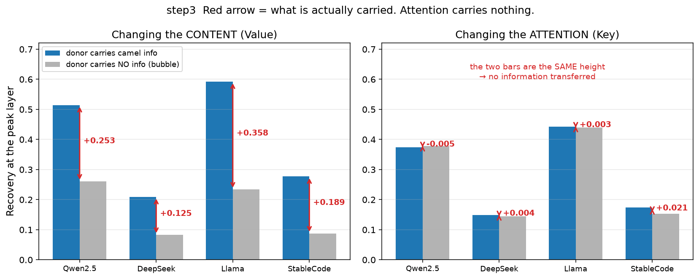
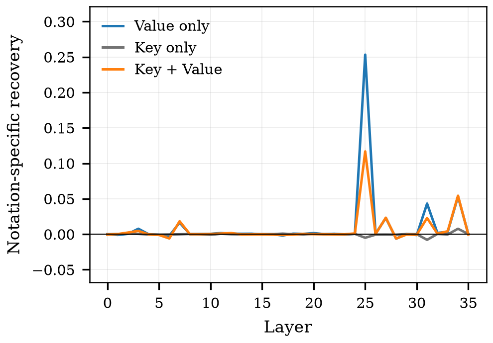
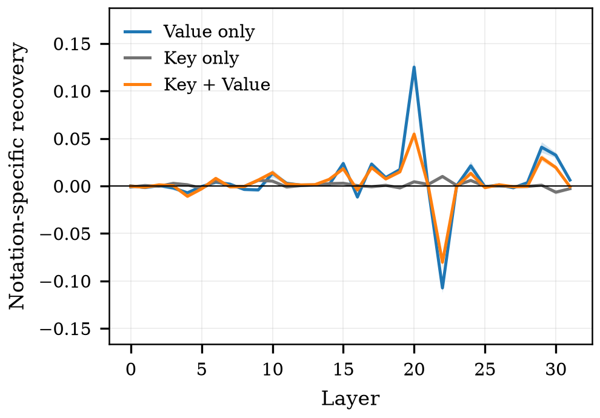
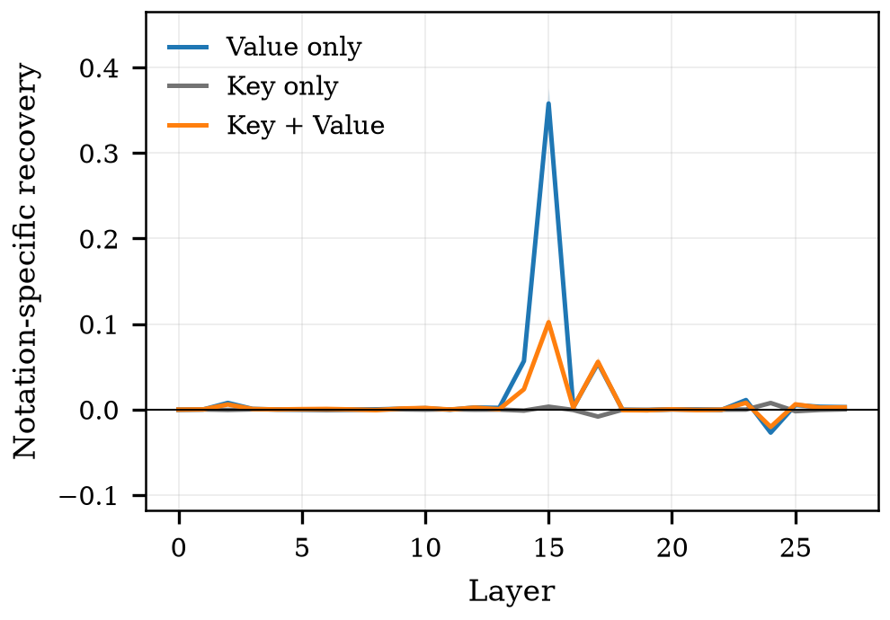
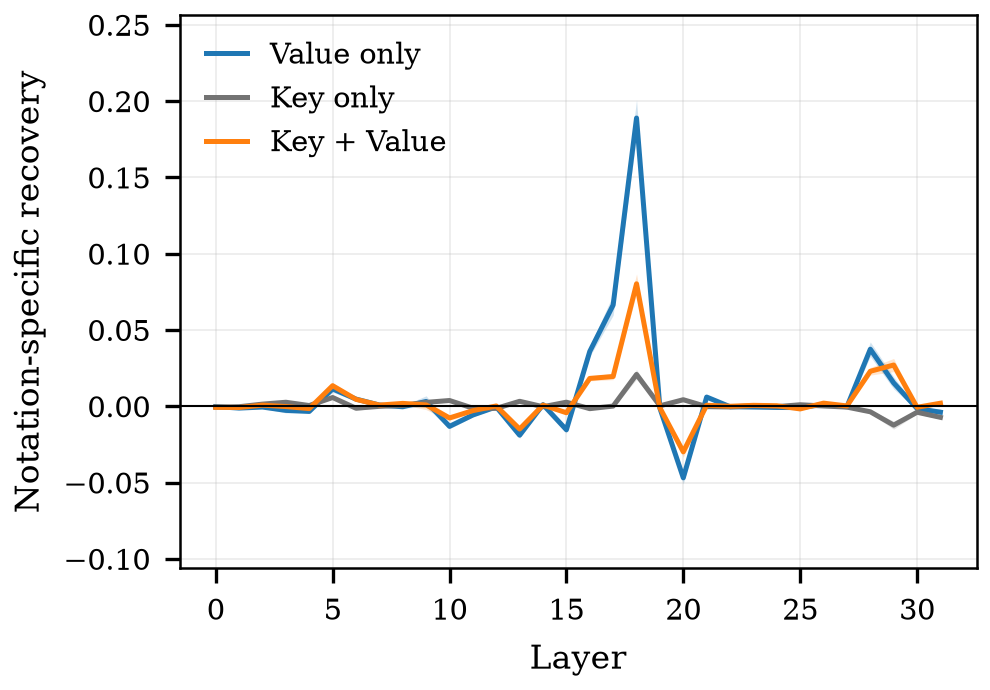
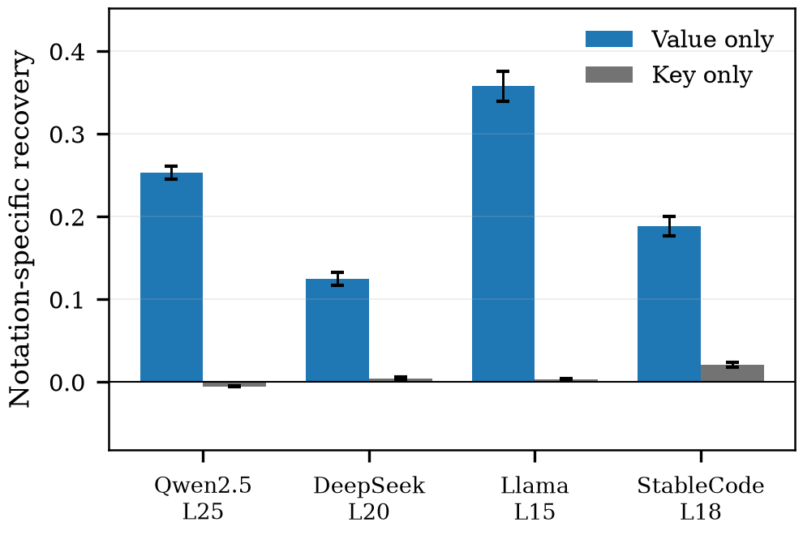

# step3 결과 — 코드 신호는 내용에 실린다 (RQ2 인과)

> **스텝:** step3 · **RQ:** RQ2 (인과) · **결과:** `results/step3_code-cause/` 504개
> **재현:** `python scripts/step3_net_effect.py results/step3_code-cause --figs docs/step3/figures`

---

## 1. 무엇을 어떻게 쟀나

문맥의 **위반 이름(snake) 6개**에 대해 모델이 남긴 내부 표현을 **준수판(camel)의 것으로 바꿔치기**하고,
준수 선호가 되돌아오는지를 잰다. **화면의 글자는 그대로 두고 내부 표현만 바꾼다.**

- **되돌림(회복률) = (S_개입 − S_위반) / (S_깨끗 − S_위반)**, S = logP(준수 이름) − logP(위반 이름).
- 바꾸는 방식 3가지: **어텐션만(Key) / 내용만(Value) / 둘다**. 층은 전 층 스윕.
- 모델 4개 × 묶음 42개 × 공여 3종 = 504개. 시드 42, 평균 덮어쓰기.

### 통제 — 무엇을 덮어넣는가

바꿔치기는 두 가지 일을 동시에 한다: **원래 있던 표현을 지우고**, **새 표현을 넣는다.**
지우기만으로도 위반 쪽으로 끌던 힘이 사라져 점수가 움직인다. 그래서 공여를 3종으로 둔다.

| 공여 | 프롬프트 | 넣는 정보 |
|---|---|---|
| 같은 camel | 같은 이름의 준수판 | camel |
| **다른 camel** | 별도 모듈(6함수·전부 camel) | camel |
| **다른 snake** | 별도 모듈(6함수·전부 snake) | **없음** |

**표기 순효과 = 다른 camel − 다른 snake.** 두 공여는 문맥 구성이 동일해(6함수·단일 표기)
차이가 오직 표기에서만 온다. 같은 묶음끼리 짝지어 차이를 먼저 계산한 뒤 42묶음 평균을 낸다.

판정불가(|S_깨끗 − S_위반| < 1.0)는 **4모델 3공여 모두 0개**다.

---

## 2. 결과

### 한눈에 보기 — 거품을 빼면

파랑 = 표기 정보가 든 값을 덮었을 때, 회색 = 정보가 없는 값을 덮었을 때(거품).
**빨간 화살표가 실제로 옮겨간 몫**이다. 오른쪽(어텐션)은 두 막대가 같은 높이 — 아무것도 안 옮겨졌다.

### 논문용 그림

**층별 표기 순효과** (모델마다 세로 눈금 범위가 달라 따로 그린다)

**봉우리 층 요약**

**봉우리 층에서의 표기 순효과** (42묶음 짝지음 ±95%)

| 모델 | 봉우리 층 | 깊이 | 내용만(Value) | 어텐션만(Key) | 둘다(K+V) |
|---|---|---|---|---|---|
| Qwen2.5-Coder-3B | L25 | 71% | **0.253±0.008** | **−0.005±0.001** | 0.117±0.006 |
| DeepSeek-Coder-6.7B | L20 | 65% | **0.125±0.008** | **0.004±0.002** | 0.055±0.005 |
| Llama-3.2-3B | L15 | 56% | **0.358±0.018** | **0.003±0.001** | 0.102±0.008 |
| StableCode-3B | L18 | 58% | **0.189±0.012** | **0.021±0.003** | 0.080±0.006 |

**공여별 원값**(Qwen L25 기준) — 어텐션 쪽은 무엇을 덮든 값이 같다.

| 개입 | 같은 camel | 다른 camel | 다른 snake |
|---|---|---|---|
| 내용만 | 0.536 | 0.514 | 0.261 |
| 어텐션만 | 0.386 | 0.374 | **0.379** |

---

## 3. 해석

**(1) 표기 신호를 나르는 것은 내용(Value)이다.**
내용만 바꾸면 표기 순효과가 0.13~0.36 나온다. 4모델 모두, 신뢰구간이 0을 넘지 않는다.

**(2) 어텐션 경로는 표기 정보를 나르지 않는다.**
어텐션만 바꾼 조건은 **camel을 덮든 snake를 덮든 값이 같다**(0.374 vs 0.379).
순효과는 −0.005~0.021로 내용의 2~11%이며, **전 층 어디에서도 봉우리가 서지 않는다**
(최댓값 0.008~0.021). 원값 0.39는 전부 "덮어쓰는 행위 자체"의 몫이다.

**(3) 신호는 한 층에 국소화된다.**
봉우리 값의 절반 이상인 층이 **4모델 모두 정확히 하나**다. 깊이로는 56~71% 지점.
앞 21묶음으로 층을 고르고 뒤 21묶음에서 평가한 분할검증도 네 모델 모두 같은 층을 고른다.

**(4) 옮겨지는 것은 이름이 아니라 표기 형태다.**
같은 이름의 준수판(0.536)과 무관한 다른 camel 이름(0.514)이 거의 같은 값을 낸다.
내용에 실린 것은 이름 고유의 정보가 아니라 **옮겨지는 일반 표기 특징**이다.

**(5) 어텐션을 함께 바꾸면 신호가 오히려 깎인다.**
둘다(0.117)가 내용만(0.253)의 절반 이하다. 4모델 모두 같은 방향이고 신뢰구간이 겹치지 않는다.
공여의 어텐션 표현을 넣으면 그 자리를 참조하는 정도가 함께 바뀌어, 제대로 넣은 내용이 덜 읽힌다.
**어텐션과 내용은 독립적으로 더해지지 않고 상호작용한다.**

---

## 4. 이 스텝이 다루지 않는 것

- **층 단위**까지다. 어텐션 head·뉴런 단위 국소화는 주장하지 않는다(KV group 전체를 한꺼번에 바꿨다).
- 문맥 **위반 6/12 한 점**에서의 인과다. 위반 비율 전 구간은 step1이 담당한다.
- **긍정형·약한 어조·camel 방향** 고정. 합성 코드, 파이썬.
- 되돌림 분모에는 단일 층 개입이 도달할 수 없는 성분이 포함된다. 따라서
  **부분 회복이라는 사실만으로 "신호가 여러 층에 분산돼 있다"고 말할 수 없다.**
