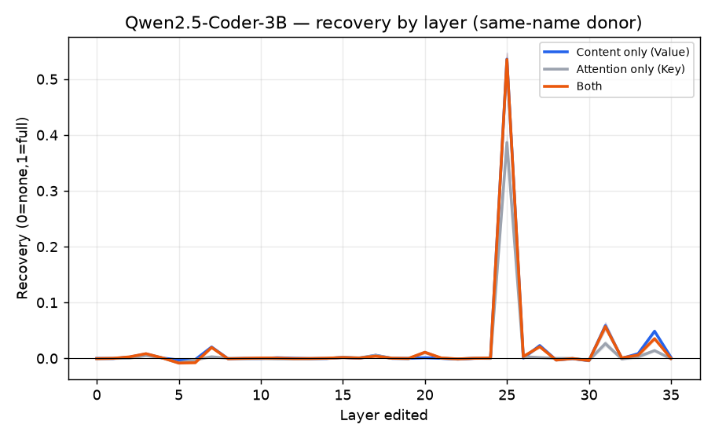
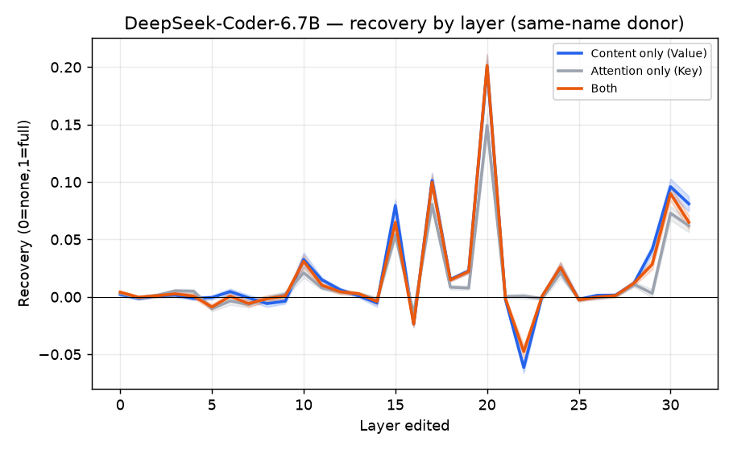
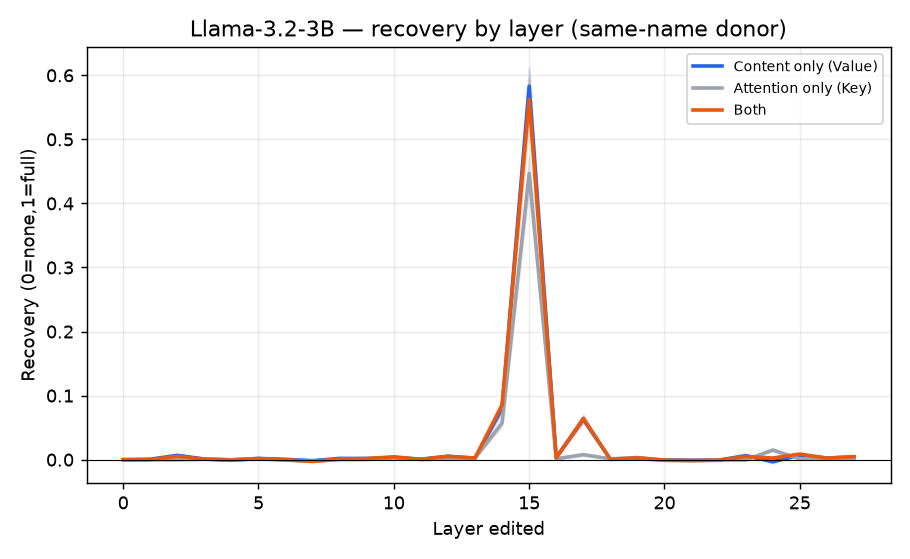
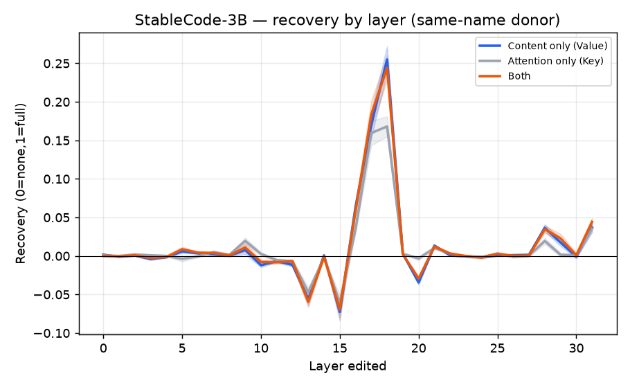
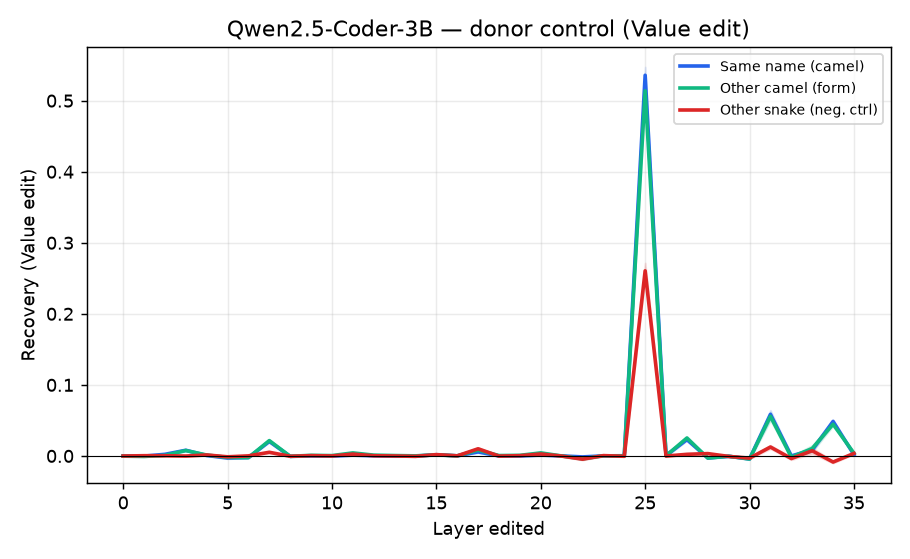
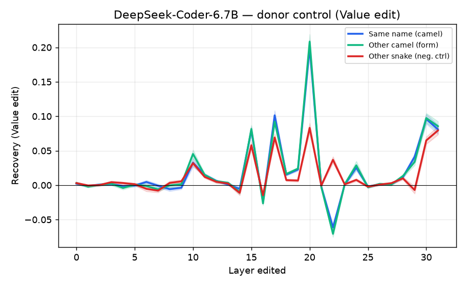
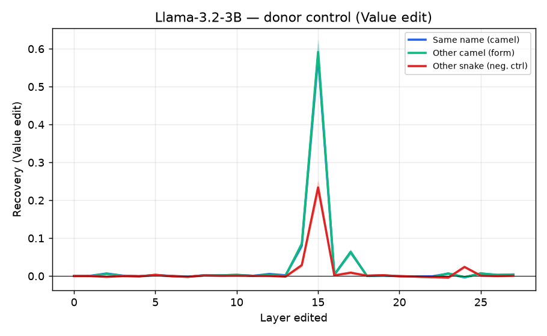
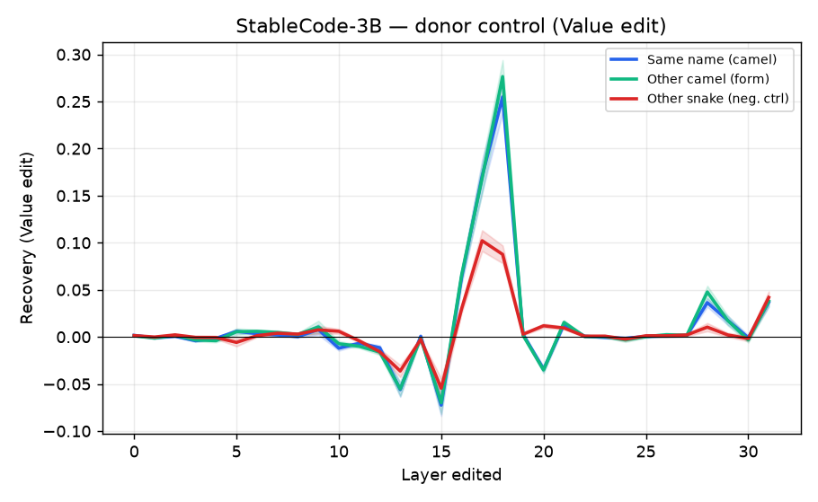

# step3 — 코드 신호 인과 결과 (RQ2, 인과 확정)

> **스텝:** step3 (코드 인과) · **RQ:** RQ2 (인과) · **브랜치:** `step3/code-cause`
> **무엇을 했나:** 문맥의 **위반 이름(snake)** 6개의 모델 속(KV)을 **준수판(camel)**으로 바꿔치기해,
> 준수 선호가 **되돌아오는지**를 **어텐션만(Key) / 내용만(Value) / 둘다**로 나눠 **전 층 스윕**으로 측정.
> step2(관측)가 "어디가 다른지"까지였다면, 여기서 **"어텐션이냐 내용이냐, 어느 층이냐"를 인과로** 가른다.

- 모델 4개 × 묶음 42개 × 바꿔넣는 이름 3종(같은 camel / 다른 camel / 다른 snake) = **파일 504개**(모델당 126개).
- 시드 42, **평균 덮어쓰기(mean-pool)**, 문맥 준수 6 + 위반 6.
- **모든 곡선은 42묶음 평균 ± 95% 신뢰구간**(음영 띠). 깨끗−위반 차 < 1.0인 묶음은 판정불가로 제외 —
  **이번 실험은 4모델·3종 모두 판정불가 0개**(문맥이 선호를 확실히 흔듦, gap이 큼).

---

## 1. 무엇을·어떻게 재는지 (요약)

- **되돌림(회복률) = (S_개입 − S_위반) / (S_깨끗 − S_위반).** 0 = 그대로, 1 = 깨끗 수준 완전 회복.
- **S = logP(준수 이름) − logP(위반 이름)** (다음 이름을 camel로 쓸 상대 선호). **생성 안 하고 후보 두 개를 채점.**
- **텍스트는 안 바꾼다.** snake 글자는 그대로 두고, **그 층의 KV만** 준수판으로 갈아끼운 뒤 출력 S를 잰다.
- 바꾸는 방식: **어텐션만(Key)** / **내용만(Value)** / **둘다**. 층은 **0~마지막 전부** 하나씩.

---

## 2. 결과 그래프

가로축 = **개입한 층**, 세로축 = **되돌림**. 음영 = 95% 신뢰구간.

### 2-1. 어텐션만 vs 내용만 vs 둘다 (같은 이름 바꿔넣기)

> **파랑 = 내용만(Value)**, 회색 = 어텐션만(Key), 주황 = 둘다. **어느 층에서 솟나 + 파랑이 회색 위인가**를 본다.

- **네 모델 모두 특정 중후반 층에서 봉우리** — 나머지 층은 거의 0. 되돌림이 **한 층에 집중**된다.
  - qwen·llama·stable은 **날카로운 단일 봉우리**, deepseek은 **L20 중심으로 더 퍼지고 약함**.
- **내용만(파랑)이 어텐션만(회색)보다 늘 위** — 4모델 모두. 다만 **어텐션만도 0이 아님**(뒤에서 정직하게 다룸).
- **둘다(주황) ≈ 내용만(파랑)** — 어텐션을 내용 위에 더 얹어도 **거의 안 늘어남**.

### 2-2. 형태 통제 · 음성 통제 (내용만 바꿀 때, 바꿔넣는 이름 3종)

> 파랑 = 같은 이름 camel판, 초록 = **다른** camel 이름(형태만 같음), 빨강 = **다른 snake** 이름(음성통제).

- **같은 camel(파랑) ≈ 다른 camel(초록)** — 봉우리에서 거의 겹침. → 되돌린 건 **그 이름 특유가 아니라 "camelCase라는 형태"**. Value가 **옮겨지는 일반 표기 특징**을 실어나른다는 뜻.
- **다른 snake(빨강)는 훨씬 낮음** — 음성통제 통과. → "아무거나 덮으면 돌아오는" **트리비얼이 아님**. camel을 넣어야 돌아오고 snake는 안 됨 = **표기에 특정적**.

### 2-3. 봉우리 층 · 통계 요약 (같은 이름, 봉우리 층 기준, ±95% 신뢰구간)

| 모델 | 봉우리 층 | 깊이 | 내용만(Value) | 어텐션만(Key) | 내용−어텐션(짝지음) | camel공여 − snake공여 |
|---|---|---|---|---|---|---|
| Qwen2.5-Coder-3B | L25 | 71% | 0.54±0.01 | 0.39±0.01 | **+0.15±0.01** | +0.25 |
| DeepSeek-Coder-6.7B | L20 | 65% | 0.20±0.01 | 0.15±0.01 | **+0.05±0.01** | +0.13 |
| Llama-3.2-3B | L15 | 56% | 0.58±0.03 | 0.45±0.03 | **+0.14±0.01** | +0.36 |
| StableCode-3B | L18 | 58% | 0.25±0.02 | 0.17±0.01 | **+0.09±0.01** | +0.19 |

- **내용−어텐션이 4모델 모두 +**, 신뢰구간이 0을 안 물음 → **내용이 어텐션보다 유의하게 더 되돌린다.**
- **camel공여 − snake공여도 4모델 모두 큰 +** → 표기에 특정적(음성통제 통과).

---

## 3. 해석

**확정된 것 (우리 주장 지지):**

1. **표기 신호는 특정 중후반 층에 국소화된다.** 되돌림이 한 층(깊이 56~71%)에 몰리고 나머지는 거의 0.
   step2의 "코드 차이가 후반 층" 관측을 **인과로 재현.**
2. **내용(Value)이 어텐션(Key)보다 유의하게 더 되돌린다** — 4모델 모두, 신뢰구간이 0을 넘지 않음.
   그리고 **어텐션을 내용 위에 더해도 안 늘어남**(둘다 ≈ 내용만) → **내용이 충분(sufficient), 어텐션은 잉여.**
3. **되돌린 건 "camelCase라는 형태"** — 다른 camel 이름으로 바꿔도 똑같이 되돌아옴(형태 통제).
   Value가 **이름별 암기가 아니라 옮겨지는 일반 표기 특징**을 실어나른다.
4. **표기에 특정적** — 다른 snake로 바꾸면 훨씬 안 돌아옴(음성통제 통과). → "텍스트 안 바꾸고 속만 고쳐도
   돌아온다"가 **트리비얼이 아님**을 증명(§2-2).

→ **"코드 표기 신호 = 내용(Value), 후반 특정 층"** 이 인과로 서고, **어텐션을 키우는 접근(Spotlight)이 겨눈 곳이
아님**을 뒷받침한다.

**정직하게 남는 한계 (그대로 기록):**

- **어텐션만(Key)도 0이 아니다.** 봉우리에서 0.15~0.45씩 되돌린다. 내용이 **더** 되돌리는 건 맞지만
  "어텐션은 전혀 무관"은 아니다. 우리 주장은 **"내용 우위·내용 충분"** 이지 "어텐션 0"이 아니다.
- **되돌림이 부분적**(봉우리 0.20~0.58, 1.0 아님). 한 층만 고쳐선 완전 회복 안 됨 → 신호가 **한 층에 봉우리를
  이루되 완전히 그 층만은 아님**(특히 deepseek은 L20 중심으로 퍼지고 약함).
- deepseek은 되돌림 자체가 작고(0.20) 여러 층에 흩어져, 다른 셋보다 국소화가 약하다.

**한 줄 판정:** 완승은 아니고 **"내용 우위 + 후반 단일 층 국소화 + 형태 전이 + 표기 특정성"** 이 4모델에서
일관되게 나온 **뚜렷한 지지**. 어텐션도 일부 작동하지만 내용에 종속적(둘다≈내용만).

---

## 4. 다음 단계

- **step5 (지침 인과):** 지침 지시어 단어의 Value를 반대 지침 것으로 바꿔, **지침도 같은 통로(내용/후반층)인지** 확정.
- **step3 vs step5 봉우리 층 비교** — 앞서 나온 "코드 층 ≠ 지침 층이라 안 따르는 것 아니냐" 가설을
  **여기 봉우리 층(qwen L25 등)과 step5 봉우리 층이 겹치나**로 판정한다.

> 결과물(`results/`)은 불변. 수치·그래프는 위 504개 JSON에서 재생성 가능(`docs/step3/figures/`).
