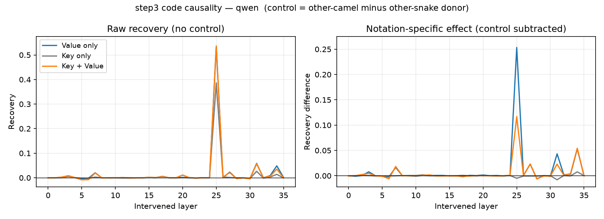
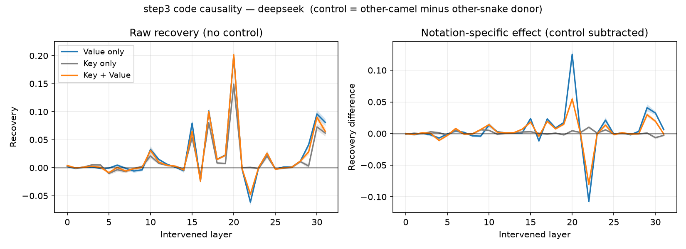
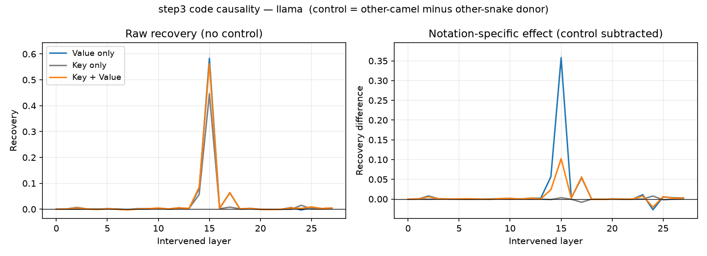
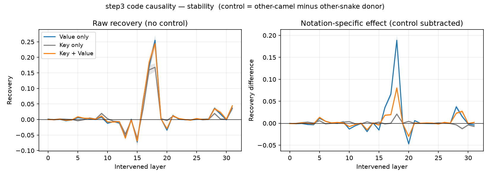

# step3 재집계 — 통제를 뺀 표기 순효과 (RQ2, 코드 인과)

> **스텝:** step3(코드 인과) · **RQ:** RQ2 · **성격:** **재실험 아님. 기존 결과 504개의 재집계.**
> **왜 다시 집계했나:** step3는 공여를 3종으로 두어 통제를 세워 놓고도, 보고는 **통제를 빼지 않은 원값**으로 했다.
> 원값에는 "무엇을 덮든 생기는 교란"이 섞여 있다. 그 교란을 빼고 **표기 때문에 생긴 몫만** 남긴 것이 이 문서다.
> **재현:** `python scripts/step3_net_effect.py <결과루트> --csv <폴더> --figs docs/step3/figures`
> **결과 파일은 건드리지 않았다**(§6 불변).

---

## 1. 무엇을 뺐나

공여(덮어넣는 값)는 세 종류다.

| 공여 | 실제 모습 |
|---|---|
| **같은 camel** (처치) | 본래 조건 프롬프트의 준수판 — 12함수, 전부 camel |
| **다른 camel** (형태 통제) | 별도 모듈 — **6함수, 전부 camel** |
| **다른 snake** (음성 통제) | 별도 모듈 — **6함수, 전부 snake** |

**짝맞춤 순효과 = 다른 camel − 다른 snake.**
두 통제는 **문맥 구성이 완전히 같다**(둘 다 6함수·단일 표기 별도 모듈). 따라서 이 둘의 차이는
**오직 표기(camel/snake)에서만** 온다 — 문맥 길이나 모듈 구성 차이가 소거된 짝맞춤 비교다.

> 보조 기준으로 `같은 camel − 다른 snake`도 함께 낸다. 처치가 본래 조건이라는 장점이 있지만
> 통제와 문맥 구성이 다르다(12함수 vs 6함수). **두 기준의 값이 거의 같아**(아래 표) 이 차이는 무시할 수준이다.

같은 이름 묶음(pool_block)에서 세 공여를 모두 돌렸으므로 **묶음 단위로 짝을 지어** 차이를 먼저 계산한 뒤
42묶음 평균·95% 신뢰구간을 냈다(짝지음 설계, 정규근사). **판정불가(|S_깨끗−S_위반| < 1.0)는 4모델 모두 0개다.**

---

## 2. 결과

### 2-1. 봉우리 층 요약

| 모델 | 봉우리 | 개입 | 원값(같은 camel) | **순효과(짝맞춤)** | 순효과(보조) |
|---|---|---|---|---|---|
| **Qwen2.5-Coder-3B** | L25 | 내용만(Value) | 0.536±0.012 | **0.253±0.008** | 0.275±0.010 |
| | | 어텐션만(Key) | 0.386±0.011 | **−0.005±0.001** | 0.008±0.005 |
| | | 둘다(K+V) | 0.535±0.011 | **0.117±0.006** | 0.131±0.008 |
| **DeepSeek-Coder-6.7B** | L20 | Value | 0.200±0.010 | **0.125±0.008** | 0.117±0.008 |
| | | Key | 0.149±0.010 | **0.004±0.002** | 0.005±0.004 |
| | | K+V | 0.201±0.010 | **0.055±0.005** | 0.055±0.004 |
| **Llama-3.2-3B** | L15 | Value | 0.583±0.030 | **0.358±0.018** | 0.349±0.017 |
| | | Key | 0.447±0.027 | **0.003±0.001** | 0.008±0.007 |
| | | K+V | 0.562±0.034 | **0.102±0.008** | 0.106±0.009 |
| **StableCode-3B** | L18 | Value | 0.255±0.017 | **0.189±0.012** | 0.167±0.011 |
| | | Key | 0.168±0.013 | **0.021±0.003** | 0.015±0.006 |
| | | K+V | 0.244±0.016 | **0.080±0.006** | 0.076±0.006 |

**봉우리 층은 순효과 곡선에서 새로 골랐고, 4모델 모두 원값 봉우리와 같다**(L25/L20/L15/L18).
분할검증(앞 21묶음으로 층 선택 → 뒤 21묶음에서 평가)도 4모델 모두 같은 층을 고르고 값도 거의 같다
(qwen 0.261 vs 0.253, deepseek 0.139 vs 0.125, llama 0.365 vs 0.358, stable 0.193 vs 0.189).
→ **봉우리 층 선택에 편향이 없다.**

### 2-2. 층별 곡선

왼쪽이 지금까지 보고한 원값, 오른쪽이 통제를 뺀 순효과다.






**왼쪽에서는 회색(어텐션만)이 파랑(내용만)을 거의 따라간다. 오른쪽에서는 회색이 0선에 붙어 납작해진다.**

---

## 3. 해석

### (가) 어텐션 경로가 나른 표기 정보는 **사실상 0이다** — 주장이 강해진다

Key 치환의 원값 0.39는 **무엇을 덮든 똑같이 나온다**(qwen: 다른 camel 0.374 / 다른 snake 0.379).
즉 Key 회복은 공여의 **내용**이 아니라 **덮어쓰는 행위 자체의 교란**이다.
통제를 빼면 Key 순효과는 **−0.005 ~ 0.021**, Value 봉우리의 **2~11%** 수준이다.

- 전 층을 훑어도 Key 순효과의 최댓값은 qwen L34 0.008 · llama L24 0.008 · deepseek L22 0.010 ·
  stable L18 0.021로, **어느 층에서도 봉우리가 서지 않는다.**
- 신뢰구간이 좁아 **통계적으로는 0이 아니다**(qwen은 오히려 유의하게 **음수**). 그러나 크기가
  Value의 1/10 이하이므로 **"통계적으로 0"이 아니라 "실질적으로 0"** 으로 써야 정확하다.
  qwen의 음수는 "camel key를 넣는 것이 snake key를 넣는 것보다 오히려 약간 나쁘다"는 뜻으로,
  Key 치환이 정보를 나르기는커녕 **잡음을 넣고 있음**을 시사한다(§4 참조).

→ 지금까지의 서술 "내용−어텐션 = +0.15"는 **말할 수 있는 것보다 훨씬 약하다.**
정확한 서술은 **"표기 정보를 나르는 것은 Value뿐이고, Key 경로의 기여는 실질적으로 0"** 이다.

### (나) 신호의 층 국소화가 **더 날카로워진다**

순효과 곡선에서 봉우리 값의 **절반 이상인 층은 4모델 모두 정확히 1개**(봉우리 층 그 자체)다.
원값 곡선에서는 봉우리 주변과 후반부에 잔여 융기가 보이는데, 그것들이 통제를 빼면 사라진다.
→ **"표기 결정은 한 층에서 굳는다"**는 주장이 재집계로 오히려 선명해진다.

### (다) 그런데 "충분성(어텐션은 잉여)" 주장은 **통제 후 무너진다** — 서술을 고쳐야 한다

현재 결과 문서의 결론 중 *"둘다 ≈ 내용만 → 내용이 충분하고 어텐션은 잉여"* 는 **원값에서만 성립한다**
(qwen 0.535 vs 0.536).

순효과로는 **K+V가 Value의 절반 이하**다 — qwen 0.117 vs 0.253, llama 0.102 vs 0.358,
deepseek 0.055 vs 0.125, stable 0.080 vs 0.189. **4모델 모두 같은 방향이고 신뢰구간이 겹치지 않는다.**

즉 **Key를 함께 넣으면 표기 특정 효과가 절반 이하로 깎인다.** 이건 "어텐션이 잉여"가 아니라
**"Key 치환이 신호를 훼손한다"** 는 뜻이다. 현재 데이터로 충분성을 주장하면 안 된다.

---

## 4. 이 재집계가 남긴 숙제

(다)의 "Key를 얹으면 깎인다"는 **`docs/구조적_결함.md` A3 · `docs/step3/구조적결함.md` A2**가 지적한
**Key 위상 왜곡(RoPE)의 예상 지문과 정확히 일치한다.**

- KV 캐시의 Key는 **RoPE가 이미 적용된** 상태로 저장된다(Value에는 위치 정보가 없다).
- 우리는 위치가 다른 공여 Key를 가져오고, 서로 다른 위치의 Key 여러 개를 평균낸다
  → 회전 위상이 상쇄되어 **어느 위치의 Key도 아닌 값**이 들어간다.

따라서 현재 데이터로 확정할 수 있는 것과 없는 것을 나눠야 한다.

| 확정 (재집계로 확정됨) | 미확정 (진단이 필요) |
|---|---|
| 표기 정보를 나르는 것은 **Value**다 | 어텐션 **경로 자체**가 표기 정보를 못 나르는가 |
| 그 신호는 **한 층**에 국소화된다 | (아니면 우리 Key 치환이 망가진 것인가) |
| 옮겨지는 것은 이름 정체가 아니라 **표기 형태**다 (다른 camel ≈ 같은 camel) | |

**진단 방법**(`docs/결함검증_재실험판정.md` §4-1): 치환 시점에
`‖공여 Key 평균‖ / (공여 Key 노름들의 평균)`을 층별로 남긴다. 1에 가까우면 위상 상쇄가 없다는 뜻이므로
왼쪽 칸이 오른쪽 칸으로 넘어온다.

---

## 5. 이 재집계로 바꿔야 할 서술

| 지금 서술 | 고쳐야 할 서술 |
|---|---|
| "봉우리에서 되돌림 0.20~0.58" | "**표기 순효과** 0.13~0.36 (원값 0.20~0.58에는 공여 내용과 무관한 교란이 포함)" |
| "내용−어텐션 = +0.15, 내용이 유의하게 더 되돌린다" | "**Key의 표기 순효과는 −0.005~0.021로 실질적으로 0**, Value만 표기 정보를 나른다" |
| "둘다 ≈ 내용만 → 어텐션은 잉여(충분성)" | **철회.** 순효과로는 K+V < Value (절반 이하). Key 치환이 신호를 훼손한다 |
| "다른 camel도 똑같이 되돌아옴 → 형태가 옮겨진다" | 유지 (0.514 vs 0.536 — 재집계로도 확인) |
| "다른 snake는 훨씬 낮음 → 표기 특정적" | 유지하되, **그 차이가 곧 순효과**임을 명시 |
| "부분 회복이므로 신호가 여러 층에 분산" | **철회.** 분모에 단일 층 개입이 도달할 수 없는 성분이 포함된다(`step3 구조적결함 A1`) |

---

## 부록. 재현

```bash
mkdir -p /tmp/a3 && git archive origin/step3/code-cause results | tar -x -C /tmp/a3
python scripts/step3_net_effect.py /tmp/a3 --csv /tmp/csv --figs docs/step3/figures
```

층별 곡선 원자료는 `--csv`가 만드는 `step3_net_<모델>.csv`
(층 · 개입종류 · 순효과 평균 · 95% 신뢰구간 · 원값 평균 · 원값 신뢰구간)에 들어 있다.
