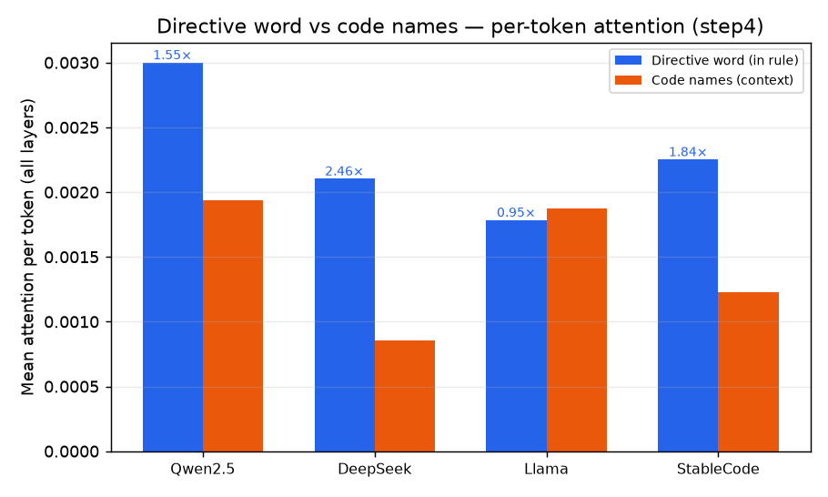
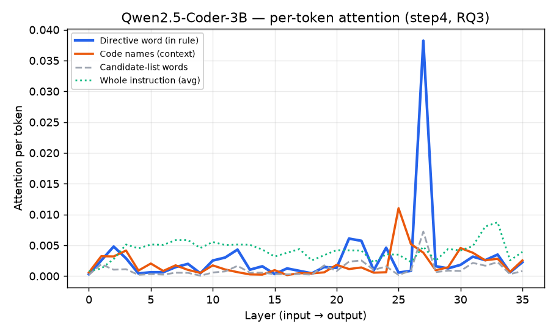
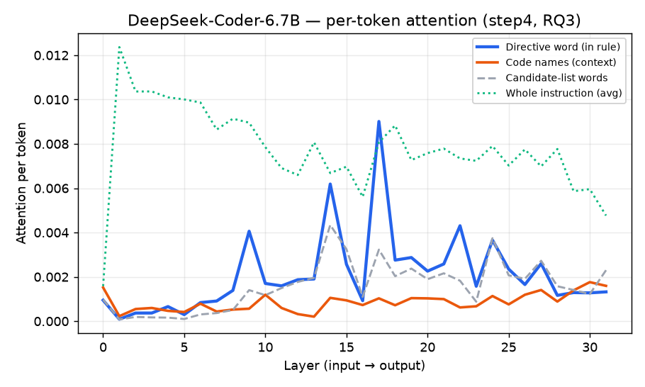
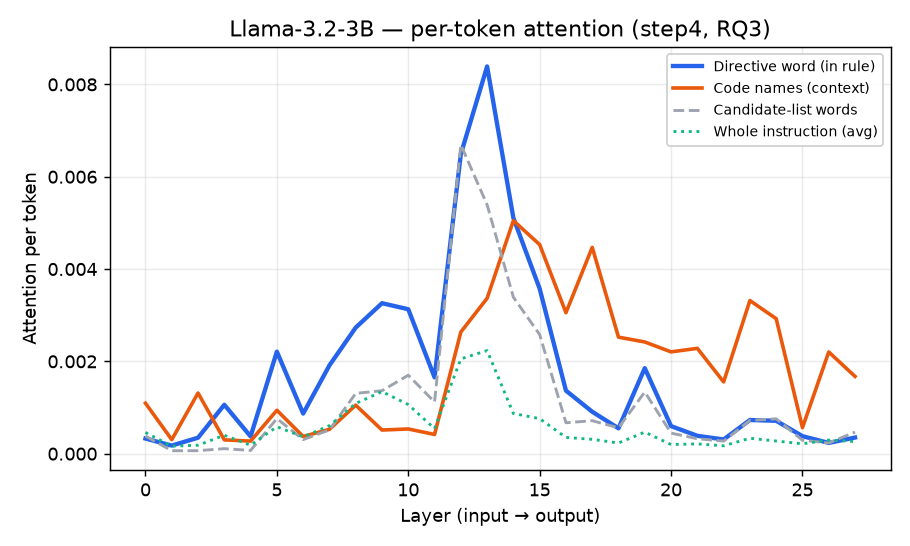
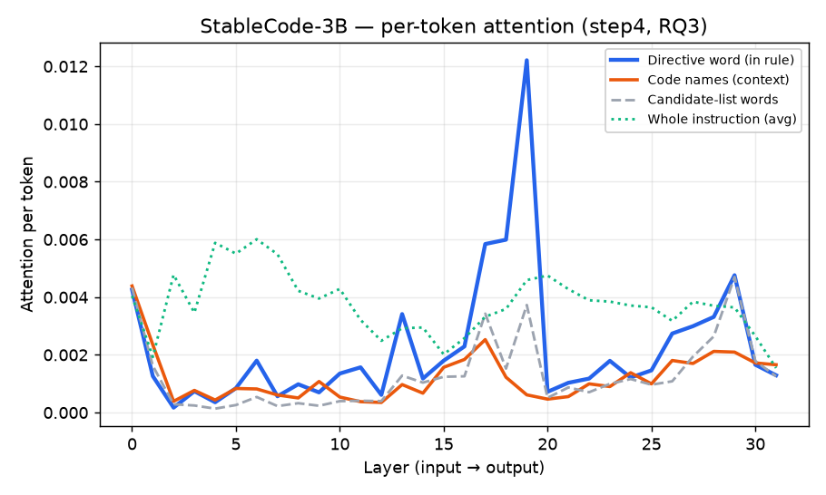

# step4 — 지침 지시어 관측 결과 (RQ3, 관측)

> ---
> ### ⚠️ 이 문서는 **재집계 전** 기록이다
> 아래 수치·해석 중 일부는 이후 재집계로 정정됐다(재실험 없이 같은 결과 파일을 다시 센 것).
> **먼저 읽을 것: [`결과_재집계.md`](결과_재집계.md)**
> 정정된 항목은 본문에 `[정정]`으로 표시했다. 원문은 기록으로 남긴다(§6).
> ---

> **스텝:** step4 (지침 관측) · **RQ:** RQ3 (관측) · **브랜치:** `step4/instr-observe`
> **무엇을 봤나:** 모델이 새 함수 이름을 쓰려는 그 순간, **지침 속 표기 지시어 단어**("camelCase"/"snake_case")를
> **얼마나 보는가(어텐션)** 를 층별로 재고, **코드 이름 어텐션과 비교**한다.
> 이 스텝은 **관측**이다. "지침을 바꾸면 행동이 바뀌는가, 그게 어텐션 통로인가 내용(Value) 통로인가"의
> **인과 판정은 step5** 에서 한다.

- 모델 4개 × 묶음 42개 × 지침 방향 2종(camel/snake) = **파일 336개**(모델당 84개), 시드 42, 값 치환 없음(순수 관측).
- 지침 문장은 표기어를 **두 곳**에서 언급한다 → **규칙문 지시어**와 **후보열거**를 나눠서 잰다(§1).
- 비교는 **토큰당 평균 어텐션**으로 한다(§1의 "왜 토큰당인가").

---

## 1. 무엇을·어떻게 쟀나

### 1-1. 지침 문장의 구조 — 표기어가 두 번 나온다

지침(system 문장)은 이렇게 생겼다(camel 지침 예시):

```
You are helping extend an existing Python module.
In this project we generally write function names in camelCase.        ← 규칙문: 진짜 지시("이걸로 써")
Every function name uses one of two styles only: camelCase or snake_case.  ← 후보열거: 선택지 나열(둘 다 1번씩)
```

- **요구 표기어**(camel 지침의 `camelCase`)는 규칙문 + 후보열거 = **2회** 등장한다.
- **반대 표기어**(camel 지침의 `snake_case`)는 후보열거 = **1회**뿐이다.

그래서 표기어 등장을 **그냥 합쳐 재면**, 요구어가 "많이 나와서" 부풀려지는 **불공정 비교**가 된다.
이를 피하려고 두 역할을 **별도 구간**으로 나눠 잰다:

| 구간 | 무엇 | 등장 |
|---|---|---|
| **규칙문 지시어**(`instr_rule_word`) | 규칙문의 지시어 = **진짜 명령** | 1회 |
| 후보열거 camel(`instr_cand_camel`) | 후보열거의 `camelCase` | 1회 |
| 후보열거 snake(`instr_cand_snake`) | 후보열거의 `snake_case` | 1회 |
| 지침 전체(`instruction`) | 지침 문장 전체(평균) | — |
| 코드 이름(`code_camel`/`code_snake`) | 문맥의 함수 이름들(비교 기준) | — |

> 검증: 예전에 합쳐 재던 값(`instr_target_word`)이 정확히 **규칙문 지시어 + 후보열거 camel**로 쪼개진다
> (qwen 예: 0.0076 = 0.0063 + 0.0013). 분리가 산술적으로 정확하다는 뜻.

### 1-2. 왜 "토큰당 평균"으로 비교하나

어텐션 원값(`attention_weight`)은 **그 구간 토큰들의 합**이다. 코드 이름 구간은 이름 6개(토큰 여럿)이고
지시어는 단어 1개(토큰 2개)라, 합으로 비교하면 코드가 당연히 커 보인다. 그래서 **구간 토큰 수로 나눈
"토큰 하나당 평균 어텐션"** 으로 맞춰 비교한다 = "**토큰 한 개를 평균 얼마나 쳐다보나**".

---

## 2. 결과 그래프

가로축 = 층 번호(왼쪽 입력 → 오른쪽 출력), 세로축 = **토큰당 평균 어텐션**.
- **파란선 = 규칙문 지시어**(진짜 명령), **주황선 = 코드 이름**(경쟁 신호),
  회색 점선 = 후보열거 단어, 초록 점선 = 지침 전체 평균.
- 파란선이 주황선 위로 올라가면 = **지시어를 코드 이름보다 (토큰당) 더 본다**.

### 2-1. 요약 — 규칙문 지시어 vs 코드 이름 (전 층 평균)



- **네 모델 중 셋(qwen·deepseek·stable)** 에서 규칙문 지시어를 코드 이름보다 **토큰당 더 본다**
  (qwen 1.55배, deepseek 2.46배, stable 1.84배).
- **범용 모델 llama**만 **거의 대등**(0.95배). 그래도 "덜 본다"고 할 수준은 아니다.
- 이 결과는 **지침 방향(camel/snake) 양쪽에서 모두** 성립한다(강건성 확인).

### 2-2. Qwen2.5-Coder-3B



- 대부분 층에서 지시어와 코드가 엇비슷하다가, **L27에서 지시어가 코드의 약 10배로 급솟는다**
  (지시어 0.038 vs 코드 0.004). "이름을 쓰기 직전, 특정 후반 층에서 지침 지시어를 강하게 참조"하는 뚜렷한 봉우리.

### 2-3. DeepSeek-Coder-6.7B



- **L8 이후 거의 모든 층에서 지시어(파랑)가 코드(주황) 위**에 있고, **L17에서 봉우리**(코드의 약 9배).
- 초록(지침 전체)도 내내 가장 높다 → deepseek은 **지침 영역 전반을 크게** 본다. "덜 본다"와 정반대.

### 2-4. Llama-3.2-3B



- 중반(**L12~13**)에 지시어가 봉우리(0.008, 코드의 2.5배)를 이루며 코드를 앞선다. 후반 층에선 코드가 다시 올라와
  전 층 평균은 대등(0.95배)해진다. 범용 모델도 **지시어를 안 보는 게 아니라, 보는 층이 더 이르다**.

### 2-5. StableCode-3B



- **L19에서 지시어가 급솟아**(0.012) 코드의 약 20배가 된다. qwen과 같은 "후반 단일 봉우리" 모양.

### 2-6. 봉우리 층 요약

| 모델 | 층수 | 지시어 봉우리 층 | 깊이 | 지시어/코드(전층평균) | 지시어>코드 층 |
|---|---|---|---|---|---|
| Qwen2.5-Coder-3B | 36 | L27 | 77% | **1.55배** | 19/36 |
| DeepSeek-Coder-6.7B | 32 | L17 | 55% | **2.46배** | 24/32 |
| Llama-3.2-3B | 28 | L13 | 48% | 0.95배 | 12/28 |
| StableCode-3B | 32 | L19 | 61% | **1.84배** | 22/32 |

공통점: **네 모델 모두 중후반(48~77%)에 지시어 어텐션이 코드 위로 솟는 봉우리가 있다.**

> 부수 관측: **후보열거 단어(회색)는 규칙문 지시어(파랑)보다 낮다.** 모델이 "명령"과 "단순 나열"을
> 구분한다는 뜻 — 규칙문 지시어를 따로 떼 잰 것이 옳았음을 보여준다.

---

## 3. 해석

**두 가지 관측 사실:**

1. **모델은 지침 지시어를 "충분히" 본다.** 토큰당으로 재면 규칙문 지시어 어텐션이 코드 이름과
   **대등하거나 더 크다**(0.95~2.46배). 심지어 네 모델 모두 **특정 중후반 층에서 코드 위로 솟는 봉우리**가 있다.
2. **이 결과는 방향·모델에 걸쳐 재현된다.** camel 지침이든 snake 지침이든, 코드전용이든 범용이든 성립.

**이것이 뜻하는 것:**

- **"지침을 덜 봐서 못 지킨다"는 설명은 관측 단계에서 이미 반박된다.** 모델은 이름을 쓰기 직전
  `camelCase`라는 단어를 코드 이름만큼(또는 그 이상) 쳐다본다. 어텐션이 부족한 게 문제가 아니다.
  → 어텐션을 더 키우자는 접근(Spotlight)이 겨눈 곳이 문제의 원인이 아닐 가능성이 높다.
- 그런데 **모델은 그렇게 잘 보면서도 규약을 어긴다**(step1/RQ1의 준수율 저하). "보는데도 안 지킨다"면,
  문제는 **"얼마나 보나(어텐션)"가 아니라 "본 것을 행동으로 옮기는 통로(내용/Value)"** 에 있다는 우리 주장과 맞아떨어진다.

**이것이 뜻하지 **않는** 것 (관측의 한계):**

- 관측은 "본다"까지만 보여준다. **"봐도 왜 안 통하는가"** 는 못 보여준다. 지침의 영향력이 실제로
  **내용(Value) 통로**인지, 아니면 어텐션인지는 **바꿔치기(인과) 실험**이라야 갈린다.
- 따라서 이 스텝은 **"지침은 충분히 읽힌다 → 문제는 어텐션이 아니다"** 라는 **첫 단서**까지다.
  **최종 판정은 step5(지침 인과)** — 지침 지시어의 속(Value)을 반대 지침 것으로 바꿔치기해서,
  **무엇을 바꿔야 행동이 바뀌는지**로 확정한다.

**판정 가능성:** 네 모델 모두 지시어를 유의미하게 보므로(어텐션 0 아님), **네 모델 모두 step5 대상으로 적격**.
단, step5(인과)에서는 "지침이 그 모델에서 행동을 실제로 바꾸는가(영향력)"를 먼저 확인하고,
영향력이 0에 가까운 모델은 "판정 불가"로 분리한다.

---

## 4. 다음 단계

- **step5 (지침 인과, `step5/instr-cause`):** 지침 지시어 단어의 속(KV의 Value)을 반대 지침 것으로
  **평균 덮어쓰기**해, 어텐션만 / 내용만 / 둘 다 바꿨을 때 행동이 어느 쪽으로 얼마나 되돌아오는지 층별로 측정.
  → 여기서 "지침도 코드와 같은 **내용(Value) 통로**, 후반 특정 층" 주장을 확정하거나 반증한다.
- step2(코드 관측)와 합치면: **코드 신호도, 지침 신호도** 어텐션이 아니라 내용/후반층이라는 그림이 완성된다.

> 결과물(`results/`)은 불변. 이 문서의 수치·그래프는 위 336개 JSON에서 재생성 가능(`docs/step4/figures/`).
