# step4 결과 — 모델은 지침을 본다 (RQ3 관측)

> **스텝:** step4 · **RQ:** RQ3 (지침을 얼마나 참조하는가 — 관측)
> **결과:** `results/step4_instr-observe/` 336개 · **재현:** `python scripts/observe_per_token.py results/step4_instr-observe`

---

## 1. 결과 JSON 읽는 법

> 파일 하나 = **조건 하나**(모델 × 이름 묶음 × 지침 방향). 경로는
> `results/step4_instr-observe/<슬러그>.json`.
> 공통 뼈대(`step`·`rq`·`condition`·`meta`)는 [`../코드_하네스공통.md`](../코드_하네스공통.md) §5~6,
> 이 값을 만드는 코드는 [`code.md`](code.md) §6.

### 1-1. 먼저 — 각 필드가 무엇을 말하는가

**밑바탕 개념** (관측 장치는 step2와 같다 → [`../step2/results.md`](../step2/results.md) §1-1)

| 말 | 정의 |
|---|---|
| **관측 시점** | 프롬프트 끝에 `"def "`를 붙여 만든 **새 이름 자리**. 그 자리 query의 어텐션 **한 줄**만 쓴다 |
| **구간(span)** | 그 한 줄에서 합칠 토큰 자리들. step4는 **지시어를 역할별로 쪼갠 것**이 핵심이다 |
| **a (어텐션)** | 그 자리에서 어떤 토큰을 얼마나 보는가. 한 줄의 합이 1이라 구간 값은 곧 비중 |
| **v (Value)** | 그 토큰이 실어 나르는 **내용 벡터**, `‖v‖`는 그 크기 |
| **‖a·v‖** | 어텐션 × 내용 크기 = 기여 **상한** 대리치(출력 사영 이전, 상쇄 무시) |

**구간 이름이 각각 무엇인가** — 이 스텝에서 가장 중요한 구분이다.

| 구간 키 | 프롬프트의 어디 | 무엇인가 |
|---|---|---|
| `instr_rule_word` | 규칙문 `In this project we generally write function names in camelCase.` | **진짜 명령의 지시어.** 해석에 쓰는 키 |
| `instr_cand_camel` | 후보열거 `… camelCase or snake_case.` 의 `camelCase` | **역할 대칭 통제** |
| `instr_cand_snake` | 후보열거의 `snake_case` | 위와 짝 |
| `instr_target_word` | 프롬프트 **전체**에서 요구 표기어를 전부 | **초판 키.** 규칙문+후보열거가 합쳐져 2회로 부풀려진다 → 해석에 쓰지 않는다(→ §3) |
| `instr_viol_word` | 프롬프트 전체에서 반대 표기어를 전부 | 초판 키(1회만 등장) |
| `instruction` | system 메시지 | 지침 **문장 전체** |
| `code_camel` / `code_snake` | user 코드 블록 | camel/snake 이름 6개씩의 **이름 부분만** |

**per_layer** — 키는 층 번호(문자열), 값은 `<구간>__<지표>`.

| 필드 | 무슨 값인가 | 합인가 평균인가 |
|---|---|---|
| `<구간>__attention_weight` | 그 구간에 준 어텐션(query head 평균 후 **구간 합**) | **합** |
| `<구간>__av_norm` | Σ_j (a_j·‖v_j‖) — 기여 상한 대리치 | **합** |
| `<구간>__v_norm` | 구간 토큰 ‖v‖의 **토큰당 평균** | **평균** |

> ⚠️ 앞의 둘은 **합**이라 구간이 길수록 커진다. 이 스텝은 지시어(2~4토큰)와
> 코드 이름 묶음(12~23토큰)을 견주므로 **정규화 없이는 결론이 뒤집힌다**(→ §3).

**extra**

| 필드 | 무슨 값인가 |
|---|---|
| `mode` | `"observe"` — 관측만. 개입은 step5 |
| `target` | 지침이 요구한 표기(`"camel"`/`"snake"`). step4는 **양방향을 다 돌았다** |
| `instruction_form` | 지침 형태(`"positive"`) |
| `span_token_counts` | **구간별 토큰 수.** 토큰당 환산의 분모. 없으면 비교 불가 |
| `group_names` | 코드 구간에 들어간 실제 이름 목록 |
| `gqa` | `num_attention_heads`(Hq) · `num_key_value_heads`(Hkv) · `group_size`(=Hq÷Hkv). a는 query head별, v는 KV head별이라 곱할 때 필요한 매핑 |
| `seq_len` | 프롬프트 전체 토큰 수 |
| `token_detail` | 코드 두 구간의 토큰별 상세(`tokens` = {`t`: 번호, `text`: 글자}, `per_layer["<층>"]` = 그 토큰들의 `a`·`av`·`v` 배열) |

### 1-2. 실제 파일 모양

```jsonc
"metrics": {
  "per_layer": {
    "27": {
      "instr_rule_word__attention_weight":  0.0121,   // 규칙문 지시어 ← 핵심
      "instr_rule_word__av_norm":           0.28,
      "instr_cand_camel__attention_weight": 0.0043,   // 후보열거 camel  ┐ 역할 대칭
      "instr_cand_snake__attention_weight": 0.0041,   // 후보열거 snake  ┘ (토큰 수는 모델별로 다름)
      "instr_target_word__attention_weight":0.0164,   // 초판(합침) — 참고용
      "instr_viol_word__attention_weight":  0.0041,
      "instruction__attention_weight":      0.0312,   // 지침 문장 전체
      "code_camel__attention_weight":       0.0184,
      "code_snake__attention_weight":       0.0231
    }, …
  },
  "extra": {
    "mode": "observe", "instruction_form": "positive", "target": "camel",
    "span_token_counts": {"code_camel": 12, "code_snake": 12, "instruction": 37,
                          "instr_target_word": 4, "instr_viol_word": 2,
                          "instr_rule_word": 2, "instr_cand_camel": 2,
                          "instr_cand_snake": 2},        // ★ 없으면 비교 불가
    "group_names": {...}, "gqa": {...}, "seq_len": 188, "token_detail": {...}
  }
}
```

### 1-3. 읽는 순서

1. `span_token_counts`를 **먼저** 본다. 토큰 수가 다르면 합끼리 비교하지 않는다.
2. **`instr_rule_word`를 쓴다.** `instr_target_word`는 초판 키다(2회 등장으로 부풀려짐).
3. 후보열거 두 키(`instr_cand_*`)는 **역할 대칭 통제**다. 토큰 수까지 같은 모델(Qwen·Llama)에서만
   순수한 대칭이고, DeepSeek·StableCode는 토큰 수가 달라 토큰당으로 봐야 한다.
4. 표 재생성: `python scripts/observe_per_token.py results/step4_instr-observe`

---

## 2. 무엇을 어떻게 쟀나

지침 문장은 표기어를 두 곳에서 언급한다.

```
규칙문   : In this project we generally write function names in camelCase.
후보열거 : Every function name uses one of two styles only: camelCase or snake_case.
```

실제 명령은 **규칙문의 지시어 하나**다. 이것을 후보열거와 분리해 잡고,
**새 이름을 쓰기 직전 시점**에 지시어와 코드 이름을 각각 얼마나 참조하는지 층별로 관측한다.

**관측 장치는 step2와 완전히 같다** — 프롬프트 끝에 `"def "`를 붙여 이름이 올 자리를 만들고,
그 **마지막 위치의 query 한 줄**만 층별로 꺼낸다. 자세한 절차는
[`../step2/results.md`](../step2/results.md) §2-2~2-4. 다른 것은 **어느 열을 합치느냐**뿐이다.

**이 스텝의 구간 5종** (토큰 수는 Qwen 기준)

| 구간 | 프롬프트의 어디 | 정확히 무엇 | 토큰 |
|---|---|---|---|
| `instr_rule_word` | system 둘째 줄 | **규칙문의 지시어** — 진짜 명령 | 2 |
| `instr_cand_camel` | system 셋째 줄 | 후보열거의 `camelCase` | 2 |
| `instr_cand_snake` | system 셋째 줄 | 후보열거의 `snake_case` | 2 |
| `code_camel` | user 코드 블록 | camel 이름 6개의 **이름 부분만** | 12 |
| `code_snake` | user 코드 블록 | snake 이름 6개의 **이름 부분만** | 12 |

> 초판 키 `instr_target_word`·`instr_viol_word`도 함께 저장돼 있으나, 규칙문과 후보열거를
> **합쳐** 세므로 요구 표기어가 2회로 부풀려진다. **해석에는 `instr_rule_word`를 쓴다.**

- 모델 4개 × 묶음 42개 × 지침 방향 2종 = 336개. 시드 42.
- **토큰 수로 나눈 값을 쓴다.** 규칙문 지시어는 2~4토큰, 코드 이름 6개는 12~23토큰으로
  길이가 몇 배 다르다. 합끼리 비교하면 긴 쪽이 무조건 이긴다.
  단, **합과 토큰당 평균은 서로 다른 것을 재는 지표**다(→ §4 해석 주의).

---

## 3. 결과

### 3-0. 그림이 네 묶음이다 — 어느 그림이 무엇인가

같은 관측 하나(336개 파일)를 **네 가지로 잘라 그린 것**이다. 새 실험이 아니다.
**네 묶음 전부 가로축이 "몇 번째 층인가"**이고, 다른 것은 **세로축과 그리는 선**뿐이다.

| 그림 묶음 | 몇 장 | 세로축 | 그리는 선 | 답하는 질문 |
|---|---|---|---|---|
| `spans_<모델>` | 4 | 토큰당 어텐션 | **역할별 구간 5종** | 지침의 **어느 역할**을 보나 |
| `initial_vs_split_<모델>` | 4 | 토큰당 어텐션 | 초판 키 2 + 분리 키 1 | **역할 분리가 왜 필요했나** |
| `ratio_<모델>` | 4 | 지시어 ÷ 코드 **비율**(로그) | 토큰당(실선) · 합(파선) | **정규화가 결론을 뒤집나** |
| `layer_alignment_<모델>` | 4 | 토큰당 어텐션 | 지시어 · 코드 + 인과 층 표시 | **논문용.** 관측 층 = 인과 층인가 |

> **모든 그림이 지침 방향 두 조건(camel·snake)을 평균한 값이다.** 규칙문 지시어는 방향에 따라
> 실제 단어가 바뀌지만 **역할이 같아서**(그 조건이 요구하는 표기어) 평균할 수 있다.

#### 방향을 평균하는 것이 곧 자리 통제다

step2에서 표기 배치가 시드로 고정돼 **"위반을 본다"와 "앞자리를 본다"가 겹쳤던 문제**
(→ [`../step2/results.md`](../step2/results.md) §3-6)가 이 스텝에도 해당되는지 점검했다.

후보열거 문장은 336조건 **전부 순서가 고정**이다:

```
Every function name uses one of two styles only: camelCase or snake_case.
                                                  ↑1번        ↑2번   ← 늘 이 순서
```

방향이 바뀌면 **단어의 자리는 그대로고 역할만 뒤집힌다.**

| 방향 | `camelCase`(1번) | `snake_case`(2번) |
|---|---|---|
| camel | **목표** | 위반 |
| snake | 위반 | **목표** |

→ 두 방향을 평균하면 자리가 소거된다. step2의 시드 뒤집기와 같은 장치이고,
**이 스텝은 처음부터 양방향을 돌렸으므로 추가 실행 없이 통제된다.**

**① 주 지표는 자리 교란이 아니다** — `규칙문 지시어 ÷ 코드 이름`(토큰당 배율), 봉우리 층:

| 모델 | 봉우리층 | 방향=camel | 방향=snake | 두 방향 평균 | 부호 유지 |
|---|---|---|---|---|---|
| qwen | L27 | 11.47배 | 8.86배 | 10.16배 | ✅ |
| deepseek | L13 | 12.45배 | 6.74배 | 9.60배 | ✅ |
| llama | L9 | 7.20배 | 5.70배 | 6.45배 | ✅ |
| stability | L19 | 21.21배 | 19.66배 | 20.43배 | ✅ |

**두 방향 모두 1보다 압도적으로 크다.** 방향을 바꿔도 결론이 같다 — step2와 달리 뒤집히지 않는다.
규칙문 지시어는 **역할 기반이고 자리(규칙문 끝)가 방향과 무관하게 같기** 때문이다.

**② 후보열거 안의 비교는 못 쓴다** — `camelCase − snake_case`(단어 기준, 자리 고정):

| 모델 | 봉우리층 | 방향=camel | 방향=snake | 두 방향 평균 |
|---|---|---|---|---|
| qwen | L27 | −0.00472 | **+0.00434** | −0.00019±0.00015 |
| llama | L12 | −0.00763 | **+0.00226** | −0.00269±0.00010 |
| deepseek | L24 | +0.00268 | +0.00301 | +0.00285±0.00021 |
| stability | L28 | −0.00485 | −0.00129 | −0.00307±0.00015 |

**방향과 층에 따라 부호가 갈린다.** 여기서는 아무 주장도 세울 수 없다.
원래부터 후보열거는 **대칭 나열**이라 해석에 쓰지 않았지만(진짜 명령은 규칙문),
**"후보 camel을 더 본다" 같은 문장은 쓸 수 없다**는 뜻이므로 명시해 둔다.

> ⚠️ **뒤집을 수 없는 자리 이점 하나는 남는다.** 지침은 언제나 system 메시지 맨 앞이고
> 코드는 그 뒤다. ①의 "10배 더 본다"에서 **자리 몫이 얼마인지는 이 설계로 가를 수 없다**
> (지침을 코드 뒤로 옮기는 조건을 돌리지 않았다). §5 한계에 적는다.

---

### 3-1. 지침의 어느 역할을 보나 — `spans_<모델>` 4장

| 항목 | 이 그림에서 |
|---|---|
| **무엇을 재나** | 새 이름을 쓰려는 순간, 주의가 지침의 **어느 역할**과 코드의 **어느 무리**에 가 있나 |
| **가로축** | **몇 번째 층인가** |
| **세로축** | **토큰당 어텐션** — 구간이 받은 주의 ÷ 구간 토큰 수. 정규화가 필수인 이유는 §2 |
| **`rule word`** | **규칙문의 지시어 — 진짜 명령.** 이 스텝의 핵심 신호 |
| **`cand: camelCase` / `cand: snake_case`** | 후보열거의 두 표기어. **역할이 서로 대칭이라 통제 구실**을 한다 |
| **`code: camel` / `code: snake`** | 선행 코드의 두 무리 (step2와 같은 구간) |
| **음영** | 42묶음 95% 신뢰구간 |
| **읽는 법** | **규칙문 지시어가 코드 선들보다 위인가**를 본다. 후보열거 두 선은 서로 비슷해야 정상이다 |
| **결과** | 규칙문 지시어가 후반 특정 층에서 코드의 **10~20배**로 솟는다 |
| **뜻** | 준수 실패는 **"지침을 안 봐서"가 아니다** |

이 스텝의 기여는 **표기어를 역할별로 나눈 것**인데, 그동안 그림은 `instr_rule_word` vs
`code_camel` 두 선만 그렸다. 저장된 8개 구간을 역할별로 다 그리면 이렇게 된다.

| Qwen2.5-Coder-3B | DeepSeek-Coder-6.7B |
|---|---|
| 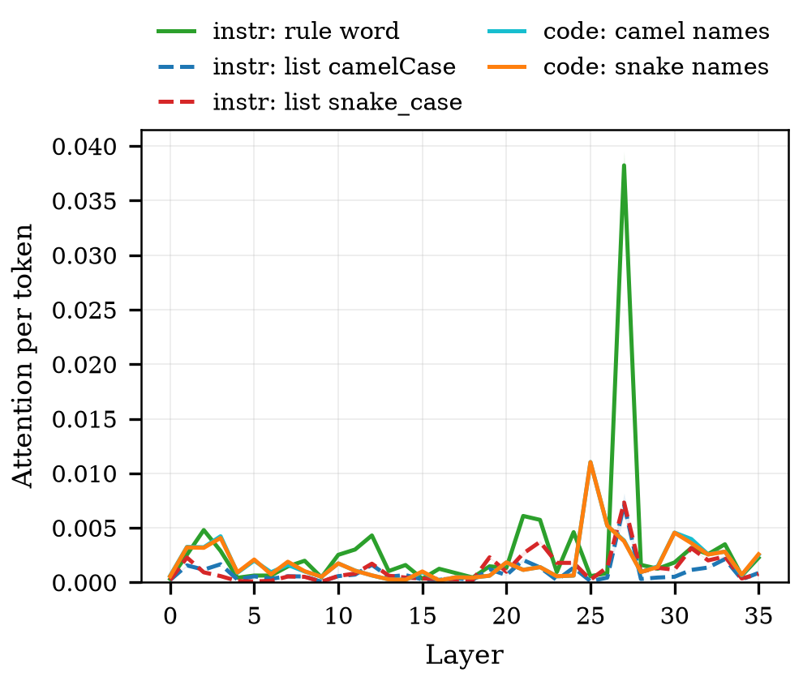 | 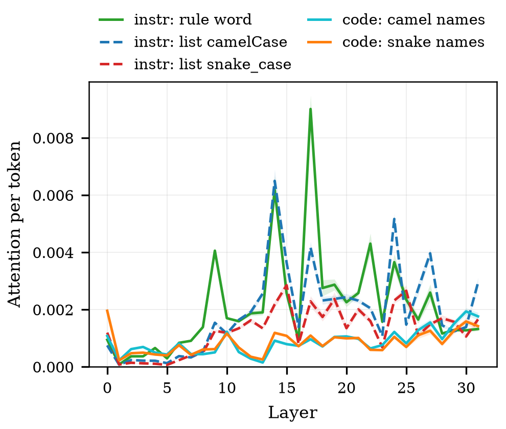 |
| **Llama-3.2-3B (범용)** | **StableCode-3B** |
| 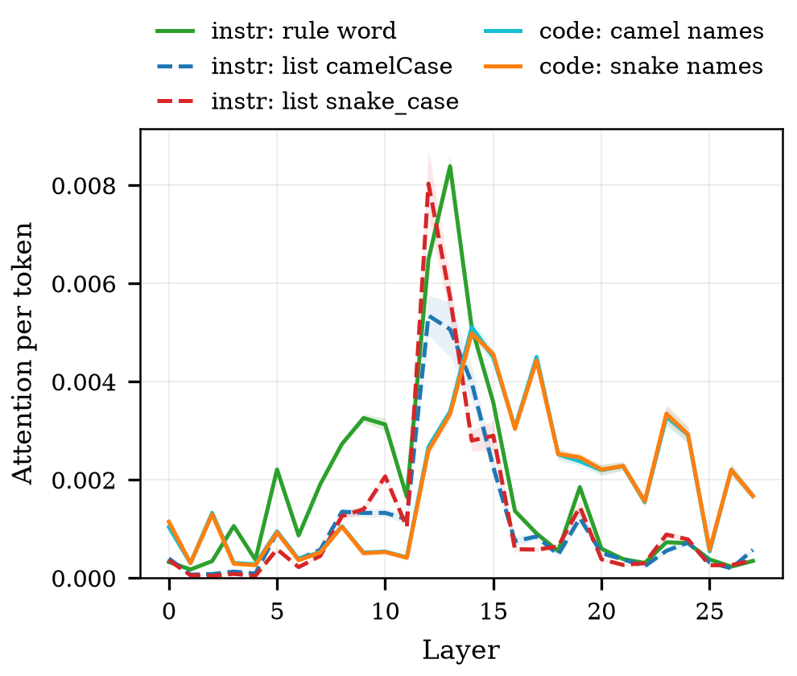 | 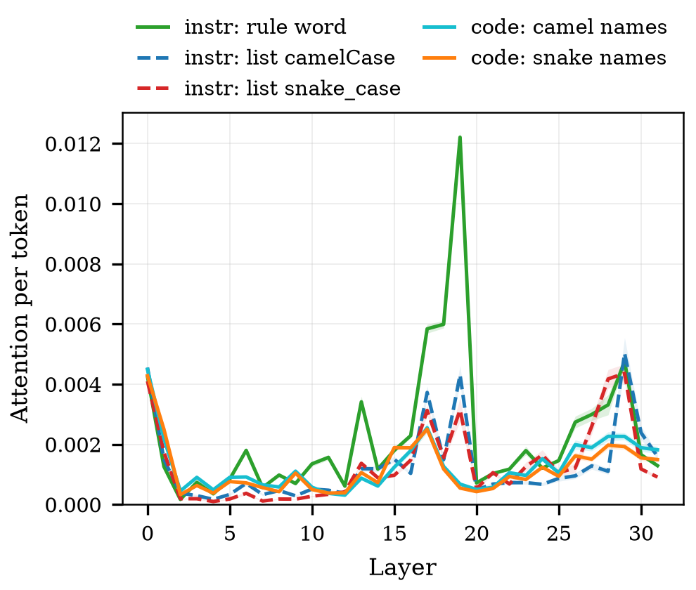 |

### 「초판 키」가 무엇이고 왜 버렸나

**처음 step4를 돌릴 때는** 지침의 표기어를 이렇게 쟀다 — *프롬프트 전체에서 그 단어가
나오는 곳을 전부 찾아 합친다.* 그렇게 만든 두 구간을 **초판 키**라 부른다.

```
[system]
You are helping extend an existing Python module.
In this project we generally write function names in camelCase.            ← ①
Every function name uses one of two styles only: camelCase or snake_case.  ← ② ③
                                                 └───①과 같은 단어───┘
```

| 초판 키 | 무엇을 합쳤나 | 등장 횟수 |
|---|---|---|
| `instr_target_word` (요구 표기어) | ① 규칙문의 `camelCase` **+** ② 후보열거의 `camelCase` | **2회** |
| `instr_viol_word` (반대 표기어) | ③ 후보열거의 `snake_case` 만 | **1회** |

**여기서 문제가 생긴다.** 이 두 값을 비교해 "모델이 요구 표기어를 더 본다"는 결론을 냈는데,
요구 표기어는 **애초에 두 번 나온다.** 많이 봐서인지 많이 나와서인지 가릴 수 없다.

그래서 앵커(`one of two styles only:`)를 기준으로 문장을 잘라 **역할별로 나눴다**:

| 분리 키 | 무엇 | 등장 | 역할 |
|---|---|---|---|
| `instr_rule_word` | ①만 | 1회 | **진짜 명령** ← 해석에 쓰는 값 |
| `instr_cand_camel` | ②만 | 1회 | 후보 나열 ┐ 역할이 같은 |
| `instr_cand_snake` | ③만 | 1회 | 후보 나열 ┘ **대칭 통제** |

토큰 수로 검산하면 정확히 맞는다(8개 조건 전부):

```
instr_target_word = instr_rule_word + 후보열거 쪽    Qwen 4 = 2 + 2 · DeepSeek 6 = 3 + 3
instr_viol_word   = 반대쪽 후보열거만                Qwen 2 = 2   · DeepSeek 4 = 4
```

**그림에서 `(2 occ.)` · `(1 occ.)`의 `occ.`는 occurrence, 즉 등장 횟수다.**

#### 3-2. `initial_vs_split_<모델>` 4장

| 항목 | 이 그림에서 |
|---|---|
| **무엇을 재나** | **같은 관측을 초판 키로 잰 것과 역할 분리 키로 잰 것을 겹쳐** 놓아, 분리가 무엇을 바꿨는지 보인다 |
| **가로축 · 세로축** | 층 / 토큰당 어텐션 (§3-1과 같다) |
| **회색 파선** `initial: required word (2 occ.)` | **초판 키** — 규칙문 + 후보열거를 **합쳐** 잰 요구 표기어 |
| **회색 점선** `initial: opposite word (1 occ.)` | **초판 키** — 반대 표기어(후보열거만) |
| **초록 실선** `split: rule word (1 occ.)` | **분리 키** — 규칙문 지시어만. **이걸 쓴다** |
| **읽는 법** | 초록이 회색 파선보다 **위**면, 합산이 신호를 **희석**했다는 뜻이다(후보열거가 평균을 끌어내렸다) |
| **결과** | 봉우리 층에서 초록(0.038)이 회색 파선(0.022)보다 확실히 높다 |
| **뜻** | 초판 키는 지시어 신호를 **부풀린 게 아니라 오히려 묻었다.** 그래도 못 쓰는 이유는 등장 횟수가 섞여 **가릴 수 없기** 때문이다 |

| Qwen2.5-Coder-3B | DeepSeek-Coder-6.7B |
|---|---|
| 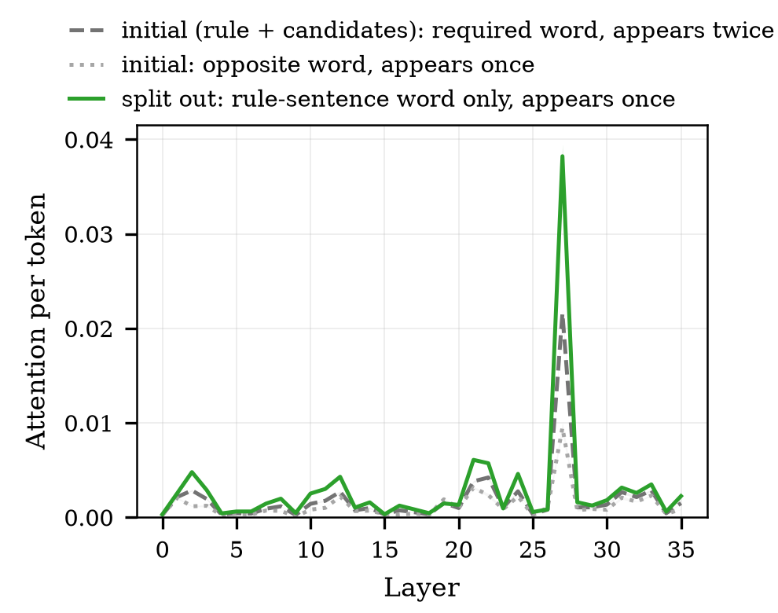 | 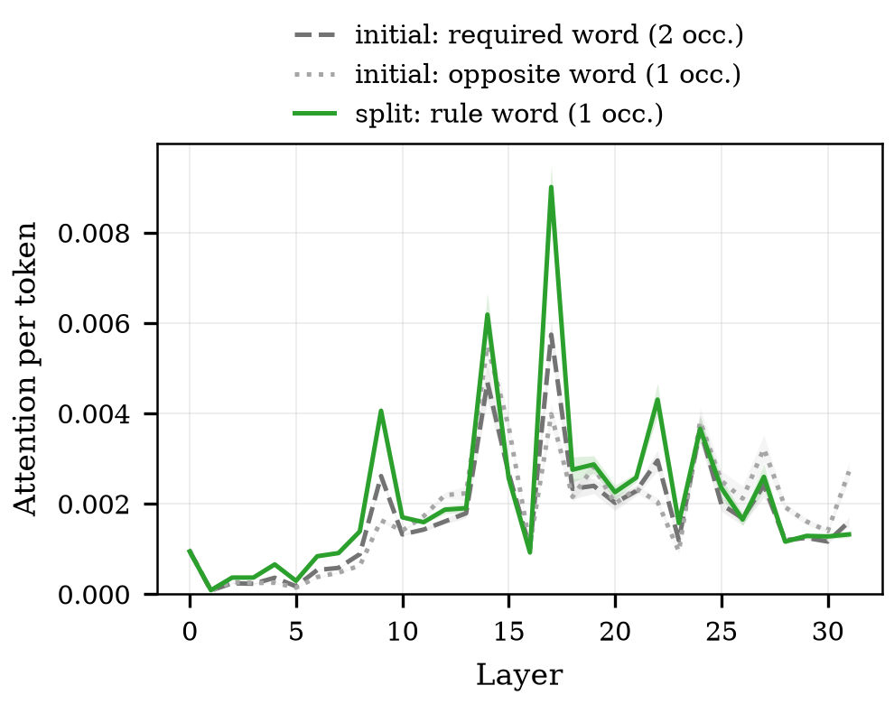 |
| **Llama-3.2-3B (범용)** | **StableCode-3B** |
| 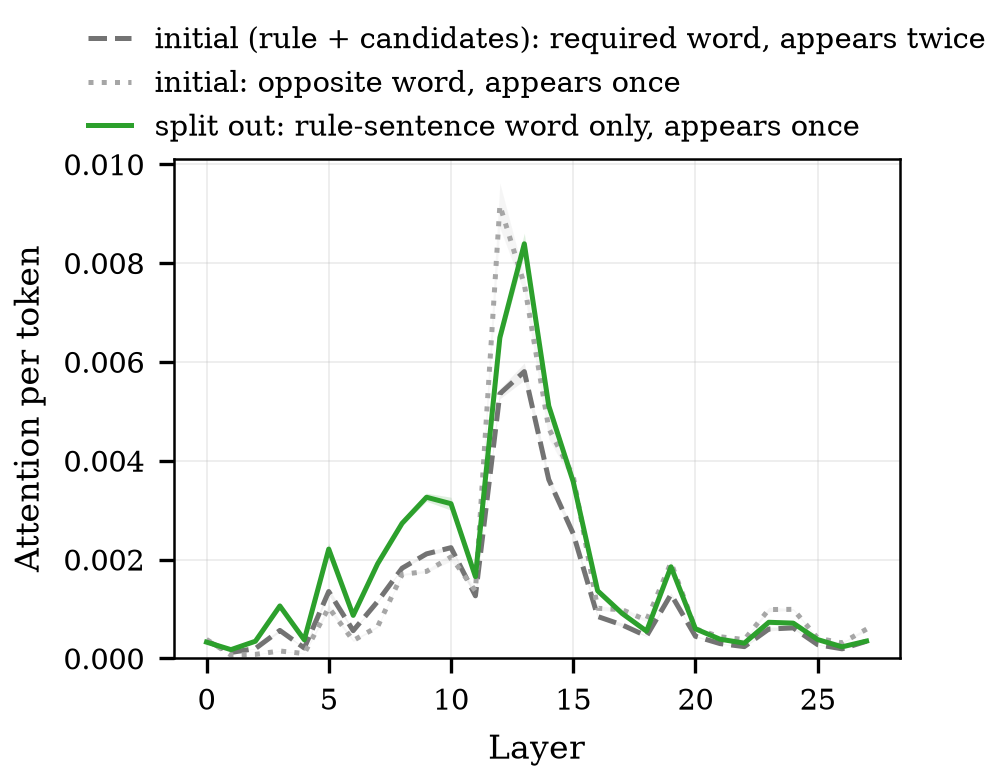 | 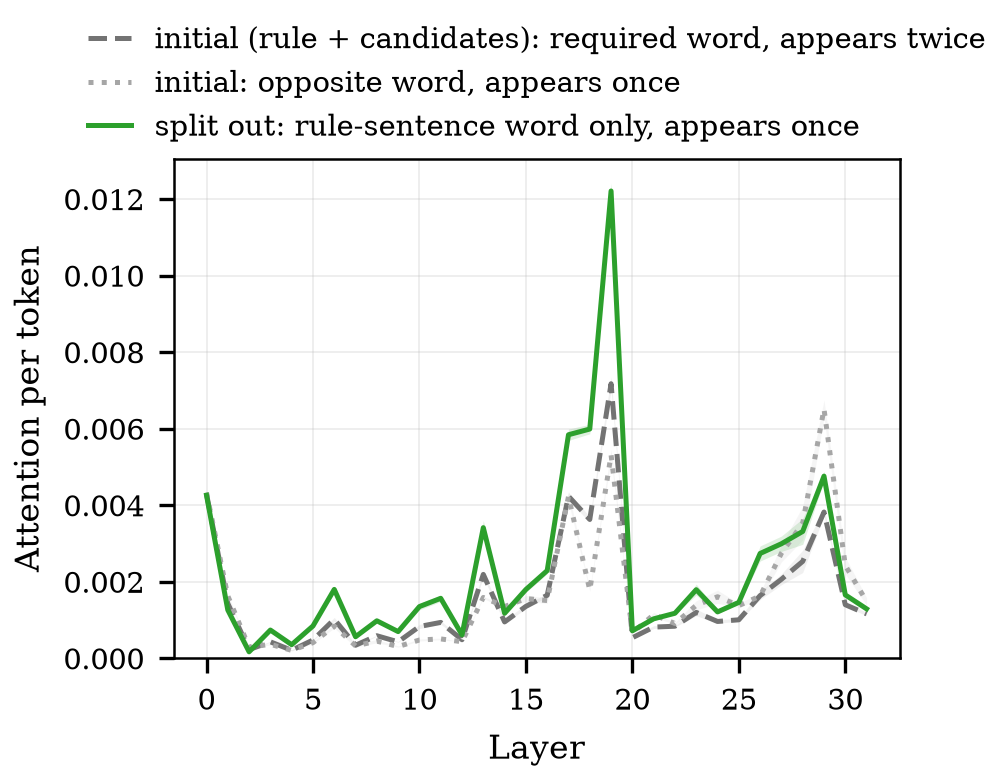 |

**그림 읽는 법** — 세 선을 겹쳐 놓았다.

| 선 | 무엇 |
|---|---|
| 회색 파선 `initial: required word (2 occ.)` | 초판 키. 규칙문+후보열거 **합쳐서** 잰 것 |
| 회색 점선 `initial: opposite word (1 occ.)` | 초판 키. 반대 표기어(후보열거만) |
| **초록 실선** `split: rule word (1 occ.)` | **분리 키. 규칙문 지시어만** ← 우리가 쓰는 값 |

초록 실선이 회색 파선보다 **높은 층**에서는, 초판 키가 후보열거(주목도가 낮은 쪽)를
섞는 바람에 규칙문의 신호를 **희석**했다는 뜻이다. 반대로 회색이 높은 층에서는
등장이 잦아 **부풀려졌다**는 뜻이다. 어느 쪽이든 **초판 키로는 "규칙문을 얼마나 보나"를
잴 수 없다.**

> 초판 키는 결과 파일에 그대로 남아 있다(§6 불변 규약). 지웠으면 이 비교 자체가 불가능했다.

---

### ★ 정규화가 이 스텝의 결론을 뒤집는다

`ratio_*`는 **"지시어를 코드 이름보다 얼마나 더 보나"** 를 층마다 하나의 수로 만든 것이다.

```
                규칙문 지시어의 참조량
      비율 = ─────────────────────────
                코드 camel 이름의 참조량
```

**세로축이 로그 눈금**이라 위아래가 대칭으로 보인다. 가로선 **1.0**이 기준이다.

| 값 | 뜻 |
|---|---|
| **1.0 위** | 지시어를 코드보다 **더** 본다 |
| 1.0 | 똑같이 본다 |
| **1.0 아래** | 코드를 더 본다 |

같은 층에서 **두 기준으로 각각** 계산해 겹쳐 그렸다.

| 선 | 어떻게 계산 |
|---|---|
| **초록 실선** `per token (used)` | (지시어 합 ÷ 지시어 토큰 수) ÷ (코드 합 ÷ 코드 토큰 수) |
| 회색 파선 `span sum` | 지시어 합 ÷ 코드 합 — 토큰 수를 무시 |

**두 선이 1.0을 사이에 두고 갈리면, 정규화 여부가 결론을 바꾼다는 뜻이다.**

#### 3-3. `ratio_<모델>` 4장 — 한눈 요약

| 항목 | 이 그림에서 |
|---|---|
| **무엇을 재나** | 두 선의 **비율 하나**를, **토큰 수로 나눈 값**과 **나누지 않은 값** 두 방식으로 |
| **가로축** | 층 |
| **세로축** | **지시어 ÷ 코드 비율. 로그 눈금이다** — 눈금 한 칸이 10배다 |
| **가로 실선(1.0)** | 두 구간을 똑같이 보는 지점. **위 = 지시어를 더 봄 · 아래 = 코드를 더 봄** |
| **초록 실선 / 회색 파선** | 토큰당 / 합 (계산식은 바로 위 표) |
| **읽는 법** | 두 선이 **1.0선을 사이에 두고 갈리는지**만 본다. 갈리면 정규화가 결론을 뒤집는다 |
| **결과** | 네 모델 모두 갈린다 — 초록은 대체로 1.0 위, 회색은 대체로 1.0 아래 |
| **⚠️ 주의** | 어느 쪽이 "옳은" 게 아니다. 서로 다른 것을 재는 지표다(아래 경고 상자) |

| Qwen2.5-Coder-3B | DeepSeek-Coder-6.7B |
|---|---|
| 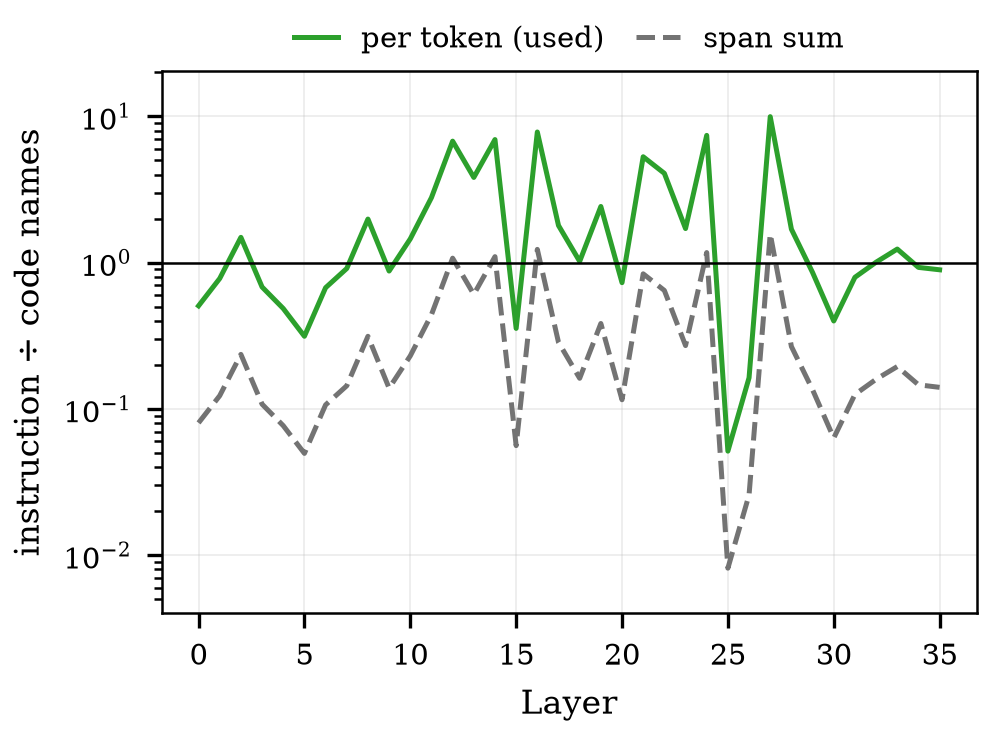 | 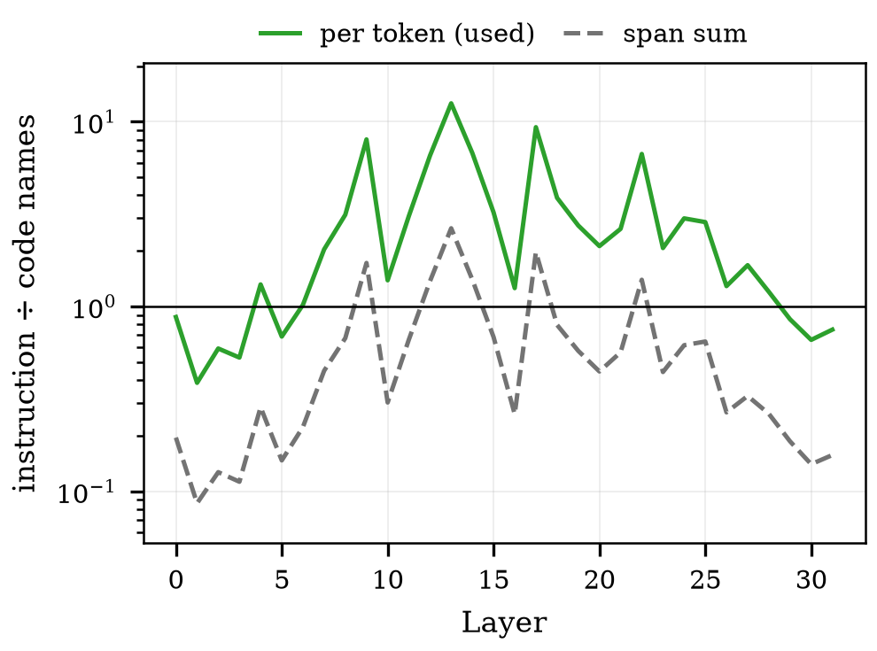 |
| **Llama-3.2-3B (범용)** | **StableCode-3B** |
| 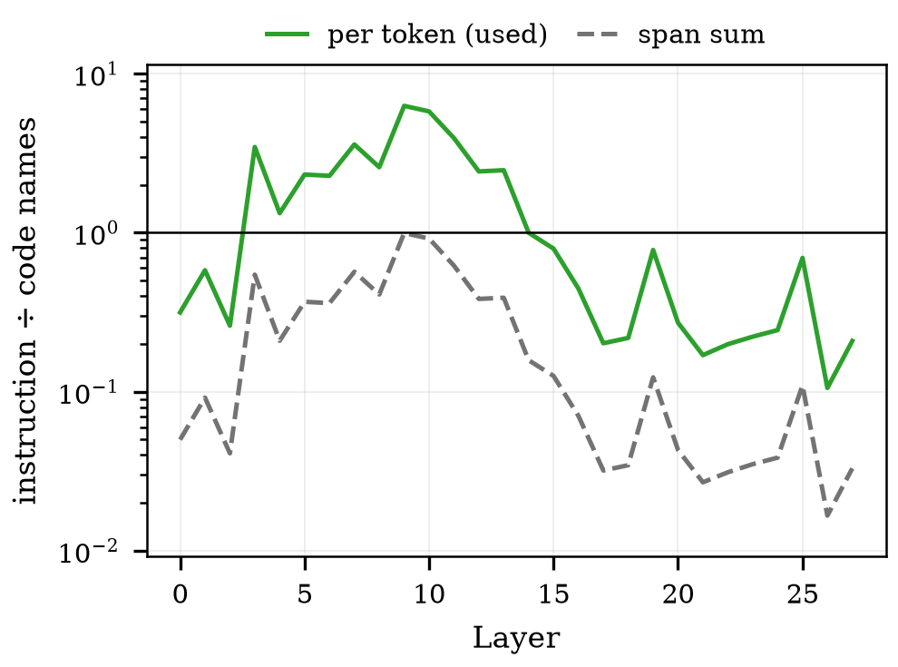 | 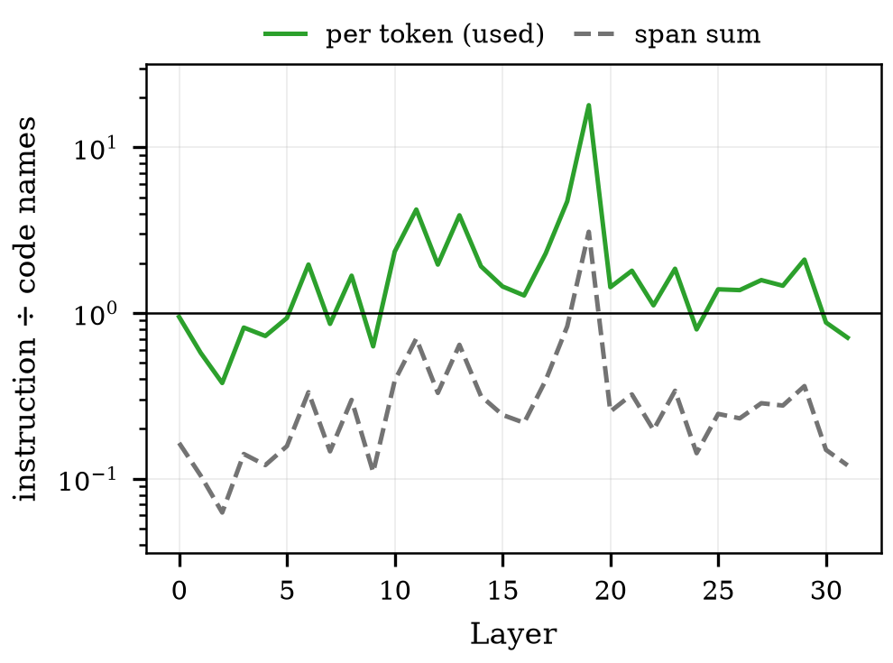 |

| 모델 | 1.0 넘는 층 (토큰당) | 1.0 넘는 층 (합) | 전 층 평균(토큰당) | 전 층 평균(합) |
|---|---|---|---|---|
| Qwen | **19 / 36** | 5 / 36 | 2.39 | 0.38 |
| DeepSeek | **24 / 32** | 6 / 32 | 3.25 | 0.68 |
| StableCode | **21 / 32** | 1 / 32 | 2.34 | 0.40 |
| Llama (범용) | **12 / 28** | 1 / 28 | 1.59 | 0.25 |

**두 기준이 1.0을 사이에 두고 갈린다.** 토큰당으로 보면 지시어를 더 보고,
합으로 보면 코드를 더 본다. 네 모델 모두 그렇다.

> ⚠️ **어느 쪽이 "옳은" 것이 아니다.** 둘은 서로 다른 것을 재는 지표다.
>
> | 지표 | 답하는 질문 |
> |---|---|
> | 구간 **합** | 지침 구간 **전체**가 받은 어텐션 질량은 얼마인가 |
> | **토큰당** 평균 | 지침 토큰 **하나**가 코드 토큰 하나보다 강하게 참조되는가 |
>
> 우리 주장("모델이 지침을 거의 안 봐서 어긴다는 설명은 성립하지 않는다")에는
> **토큰당**이 맞는 자다 — 지시어는 2~4토큰, 코드 이름은 12~22토큰이라
> 합끼리 비교하면 길이가 결과를 지배한다.
>
> **다만 이것만으로 "문제는 어텐션이 아니다"까지 갈 수 없다.** 그 판단은 관측이 아니라
> **step5의 인과 개입**이 한다. 이 절은 "덜 본다는 설명이 성립하지 않는다"까지만 주장한다.

#### 3-4. 논문용 — `layer_alignment_<모델>` 4장

| 항목 | 이 그림에서 |
|---|---|
| **무엇을 재나** | **관측(step4)에서 지침을 가장 강하게 보는 층**과 **개입(step5)이 실제로 작동하는 층**이 같은가 |
| **가로축** | 층 |
| **세로축** | 토큰당 어텐션 (§3-1과 같다) |
| **파란 선** `Instruction word` | **규칙문 지시어**(`instr_rule_word`) — 분리 키 |
| **주황 선** `Code names` | 선행 코드의 camel 이름(`code_camel`) |
| **빨간 세로 파선** `causal L27` | **step4가 아니라 step5의 값이다** — 지침 개입의 되돌림이 가장 큰 층. 이 그림의 유일한 외부 정보 |
| **읽는 법** | **파란 봉우리가 빨간 선 위에 서 있는가.** 서 있으면 관측 층 = 인과 층 |
| **결과** | Qwen L27 · DeepSeek L17 · StableCode L19에서 정확히 겹친다. **Llama만 어긋난다**(L13 vs L24) |
| **뜻** | 판정 가능한 세 모델에서 **가장 강하게 보는 층이 곧 실제로 작동하는 층**이다. Llama는 step5가 판정 불가라 어긋남을 해석하지 않는다 |

**토큰당 참조량 — 붉은 점선이 step5의 인과 봉우리 층**

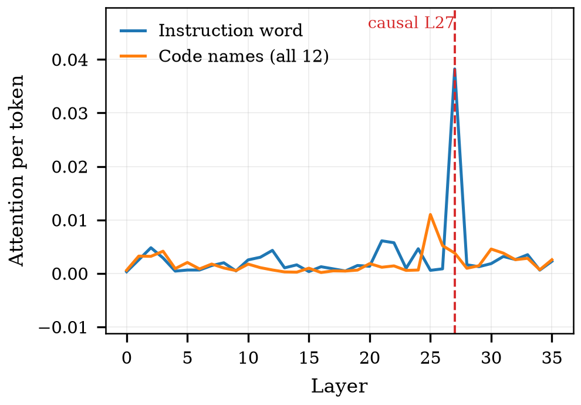
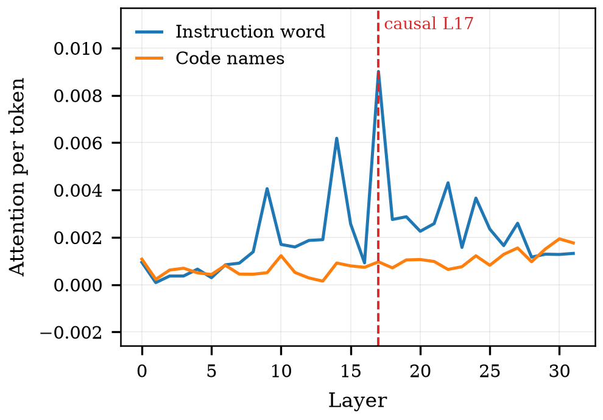
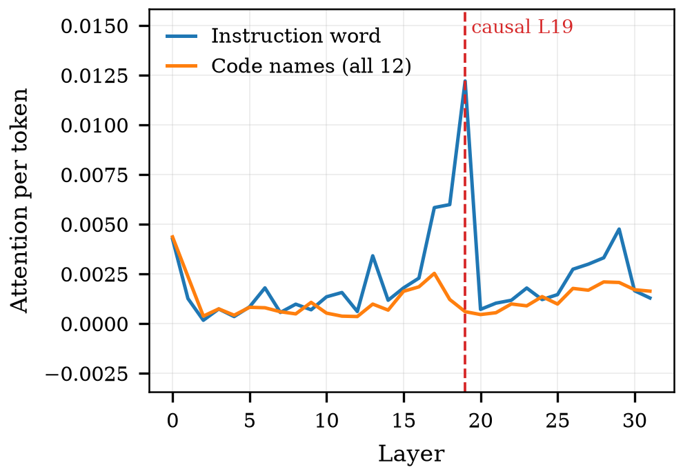
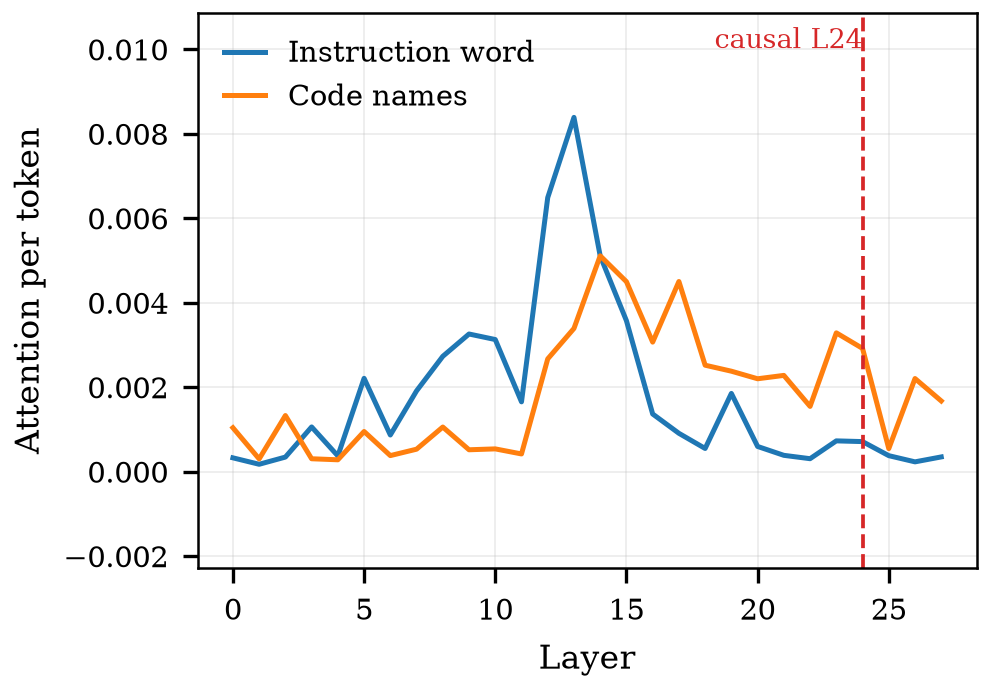

**전 층 평균, 규칙문 지시어 ÷ 코드 이름**

| 모델 | 배수 | 봉우리 층 | 그 층에서 |
|---|---|---|---|
| Qwen2.5-Coder-3B | **1.55배** | **L27** | 코드의 약 10배 |
| DeepSeek-Coder-6.7B | **2.46배** | **L17** | 코드의 약 9배 |
| StableCode-3B | **1.84배** | **L19** | 코드의 약 20배 |
| Llama-3.2-3B | 0.95배 | L12~13 | 코드의 2.5배 |

**코드 특화 3모델은 지침 지시어를 코드 이름보다 토큰당 더 본다.** 범용 모델 Llama만 대등한데,
중반 층(L12~13)에서는 지시어가 앞서고 후반에서 코드가 올라와 전 층 평균이 상쇄된 결과다.
**어느 모델도 "지침을 덜 본다"고 할 수준이 아니다.**

이 결과는 **지침 방향 양쪽(camel·snake)에서 모두** 성립한다.

### 관측 층과 인과 층이 일치한다

| 모델 | 관측 봉우리(step4) | 인과 봉우리(step5) |
|---|---|---|
| Qwen | L27 | **L27** |
| DeepSeek | L17 | **L17** |
| StableCode | L19 | **L19** |
| Llama | L13 | L24 (판정 불가) |

판정 가능한 세 모델에서 **지침을 가장 강하게 참조하는 층과 지침 개입이 실제로 작동하는 층이
정확히 같다.**

---

## 4. 해석

**(1) 준수 실패는 "지침을 안 봐서"가 아니다.**
모델은 지침 지시어를 코드 이름보다 토큰당 더 참조하면서도 지침을 어긴다.
**어텐션을 키우는 처방(Spotlight 계열)은 이미 충족된 조건을 더 채우는 셈이다.**

**(2) 지침 참조는 특정 후반 층에 몰린다.**
Qwen L27, StableCode L19처럼 한 층에서 코드의 10~20배로 솟는다.
"이름을 쓰기 직전 특정 처리 단계에서 지침을 강하게 참조"하는 구조다.

**(3) 범용 모델은 보는 층이 더 이르다.**
Llama는 중반에 지시어를 보고 후반에는 코드로 돌아간다.

---

## 5. 이 스텝이 다루지 않는 것

- **인과가 아니다.** 참조량 관측이다. 그 참조가 행동을 바꾸는지는 step5의 몫이다.
- 요구 표기어는 규칙문과 후보열거에서 2회, 반대 표기어는 1회 나온다.
  **두 등장을 합친 값은 구조적으로 2:1이라 쓰지 않는다.** 규칙문 지시어만 쓴다.
- **후보열거 안의 두 지시어를 비교할 수 없다.** 자리가 고정(1번 camel / 2번 snake)이라
  방향·층에 따라 부호가 갈린다(§3-0 ②). 대칭 나열이라 원래 해석에 안 썼지만,
  **"후보 camel을 더 본다" 같은 문장은 금지**다.
- **지침이 프롬프트 맨 앞이라는 자리 이점은 뒤집을 수 없다.** §3-0 ①의 "코드보다 5.7~21배
  더 본다"에서 **자리 몫이 얼마인지 이 설계로는 못 가른다** — 지침을 코드 뒤에 두는 조건을
  돌리지 않았다. 방향 평균은 *후보열거 안의* 자리만 지운다.
  → 그러므로 **"지침을 충분히 본다"까지가 안전하고, "덜 봐서 어기는 게 아니다"의 결정적
  근거는 step6(어텐션을 실제로 키워도 준수가 안 돌아온다)에 둔다.**
- **~~코드 구간끼리의 비교는 step2 결과를 인용한다~~ → 인용할 수 없다.**
  step2의 코드 구간 비교("위반을 더 본다")는 **자리 효과로 밝혀져 철회됐다**
  (→ [`../step2/results.md`](../step2/results.md) §3-6). 이 스텝의 `code_camel`·`code_snake`도
  같은 교란을 받는다 — 코드 배치가 시드 42로 고정이라 336조건 전부 같은 배치다.
  **이 스텝에서 코드 두 무리를 비교하지 않는다.** 코드는 지침과의 비율(①)에서 **분모로만** 쓴다.
