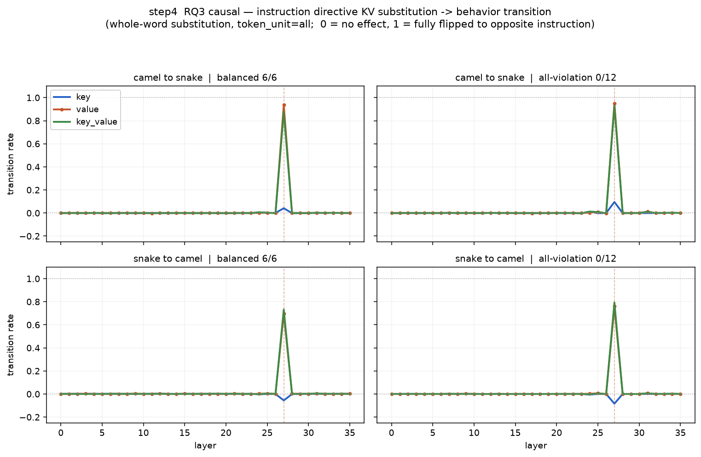
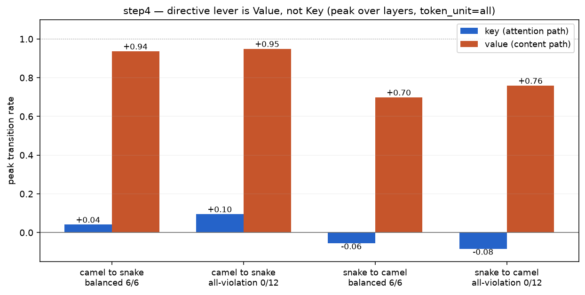
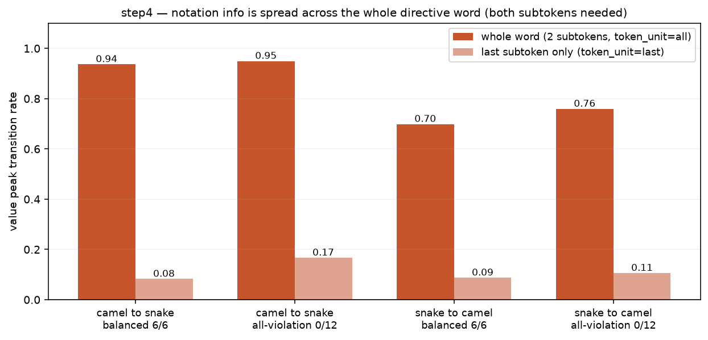

# step 4 결과 — RQ3 인과: 지침 지시어는 **Value로만** 작동한다 (Spotlight 반박)

**대응:** RQ3 **인과** (directive-token = RQ3 관측 → step4 = RQ3 인과).
**설계·예측:** `docs/step4/plan.md`. **원자료(불변, §6):** `results/step4_results/` (40개 json).
**모델:** Qwen2.5-Coder-3B-Instruct (36층). 조건: 방향 2 × 선행 2 × 정렬단위 2 × seed 5.

---

## 한 줄 결론

지침의 표기 지시어 토큰(`camelCase`/`snake_case`)의 **Value를 반대 지침 값으로 바꾸면 모델 행동이
최대 94%까지 반대로 넘어간다. 그런데 Key(어텐션)를 바꾸면 0%다.** → 지침은 **읽히는 진짜 레버**지만
그 경로는 **Value(내용)**이고 **Key(어텐션)가 아니다.** 코드 신호(stepC)와 **정확히 같은 결론.**
어텐션을 키우는 **Spotlight은 잘못된 손잡이를 당긴다.**

---

## 무엇을 했나 (1줄 복습)

지침에 "함수 이름을 camelCase로 써"라고 적혀 있는 상태에서, 텍스트는 그대로 두고 **모델 내부가 읽는
`camelCase`라는 단어의 KV만 `snake_case`(반대 지침을 렌더한 별도 forward)의 값으로 치환**했다.
경로 3종(Key만/Value만/Key+Value) × 전 층 스윕. 행동이 반대 지침 쪽으로 얼마나 넘어가나 =
**전이율 = (S_int − S_base)/(S_clean − S_base)** (0 = 무반응, 1 = 반대 지침을 준 것과 동일).

---

## 결과 1 — 전이는 **Value 경로 · 단일 층(L27)**에서만 일어난다

네 칸(방향 2 × 선행 2) 모두 같은 모양이다. **전 층에서 전이율이 정확히 0인데, L27에서만 Value 곡선이
수직으로 튄다.** Key 곡선(파랑)은 어느 층에서도 바닥에 붙어 있다.

- L27은 36층 중 상대 위치 **0.77** — directive-token **관측**에서 지시어가 읽히던 그 층(코드 L25 뒤)과
  일치한다. 관측(읽힘)과 인과(작동)가 **같은 층**을 가리킨다.
- 국소성: L27 하나에서만 반응 = 표기 지시어의 인과 효과가 특정 후반 층에 응축돼 있다.

---

## 결과 2 — Key ≠ Value. **Value만 일한다**

| 방향 | 선행 | S_base | S_clean | 레버 틈(gap) | **Value 전이** | **Key 전이** |
|---|---|---:|---:|---:|---:|---:|
| camel→snake | 균형 6/6 | +0.33 | −4.10 | −4.43 | **+0.94** | +0.04 |
| camel→snake | 전부위반 0/12 | −2.79 | −7.64 | −4.85 | **+0.95** | +0.10 |
| snake→camel | 균형 6/6 | +3.89 | −0.27 | −4.15 | **+0.70** | −0.06 |
| snake→camel | 전부위반 0/12 | +2.21 | −3.69 | −5.90 | **+0.76** | −0.08 |

- **Value 전이 0.70–0.95** vs **Key 전이 −0.08 ~ +0.10(≈0)**. 두 경로는 같지 않다 — Value 혼자 다 한다.
- `key_value`(둘 다 치환)는 0.73–0.93으로 **Value와 거의 같다.** Key가 0이므로 `key+value ≈ value`.
  즉 "세 경로가 비슷"한 게 아니라 **Value 하나만 신호를 나른다.**
- **레버 틈(gap)이 네 칸 모두 −4 이상**으로 크다. 지침을 반대로 주면 S가 실제로 크게 벌어진다는 뜻 —
  전이율을 잴 바탕이 있다(plan §전제조건 1 충족).

### 선행 2칸 대조 — "그 조건에서만" 반박을 닫는다

균형 6/6(지침이 표기를 정하는 유일 신호)뿐 아니라 **전부위반 0/12(선행이 반대로 미는 상황)에서도**
Value 전이가 0.95/0.76으로 유지된다. → 지침 레버는 **선행이 반대로 밀어도 살아 있다.** 특정 조건의
우연이 아니다. 양방향(camel↔snake) 대칭도 확인 — 방향을 뒤집어도 같은 Value-경로 결과.

---

## 결과 3 — 표기 정보는 **지시어 단어 전체**에 퍼져 있다

`camelCase`·`snake_case`는 Qwen에서 **각각 2 서브토큰**으로 쪼개진다(치환 수 확인: `all`=2, `last`=1).

- **전체 단어(2 서브토큰) 치환** → Value 전이 **0.70–0.95** (결과 1·2).
- **마지막 서브토큰만(1개) 치환** → Value 전이 **0.08–0.17**로 급락.

즉 표기를 가르는 정보가 마지막 조각 하나가 아니라 **단어를 이루는 두 서브토큰에 걸쳐** 실려 있다.
부분만 바꾸면 부분만 넘어간다. (정렬 스킵은 0 — 두 지시어가 같은 토큰 수라 `all`에서도 온전히 치환됨.)

---

## 해석 — Spotlight 최종 판정 (plan 분기표 대조)

plan의 결과 분기표:

| 관측 | 지침 레버 | Spotlight | **step4 실측** |
|---|---|---|---|
| Value 치환에 전이 O | 내용(Value) | ❌ Key 증폭은 구조적 실패 | ✅ **여기에 해당** (0.70–0.95) |
| Key 치환에 전이 O | 어텐션(Key) | ✅ 유효 여지 | ✗ (Key ≈ 0) |
| 둘 다 무반응 | 불활성 | ❌ 없는 걸 키우는 꼴 | ✗ (Value가 강하게 반응) |

directive-token(**읽힘**) + step4(**Value로 작동**)를 합치면:

- 지침은 **읽히고, 인과적으로 작동한다** — "attended but inert(읽히는데 죽음)"는 **기각**.
- 단 작동 경로가 **Value(내용)**다. **Spotlight은 지침 어텐션(=Key 경로)을 동적으로 키우는 방법인데,
  실제 레버는 Key가 아니라 Value다.** → Spotlight은 **작동하는 손잡이가 아닌 쪽을 당긴다**(구조적 헛다리).
- 코드 신호(stepC/step1: Value, L25)와 지침 신호(step4: Value, L27)가 **같은 경로(Value)**에 실려 있다.
  방법론이 하나의 개입점(Value)으로 둘 다 다룰 수 있다는 근거.

---

## 다음으로 (연결)

RQ3 인과의 답 = **"지침은 Value 경로 레버(L27), Key 아님."** →
**step5 방법론**: 어텐션(Key) 증폭이 아니라 **Value 경로 선택적 스티어링**. 코드·지침 두 신호가 같은
Value 경로에 모이므로, 위반 방향 Value를 준수 방향으로 미는 단일 개입으로 설계한다(Spotlight 반대 방향).
qna Q2·Q6와 정합.

> **§4 정직 기록:** 예측은 "코드가 Value였으니 지침도 Value일 것"이었고 방향은 맞았으나, **효과가
> 이 정도로 크고(0.95) 단일 층(L27)에 응축**될 줄은 예측보다 강했다. Key가 완전히 0인 것도 예측보다
> 깨끗하다. 조건을 바꿔 맞추지 않고 그대로 기록한다.
