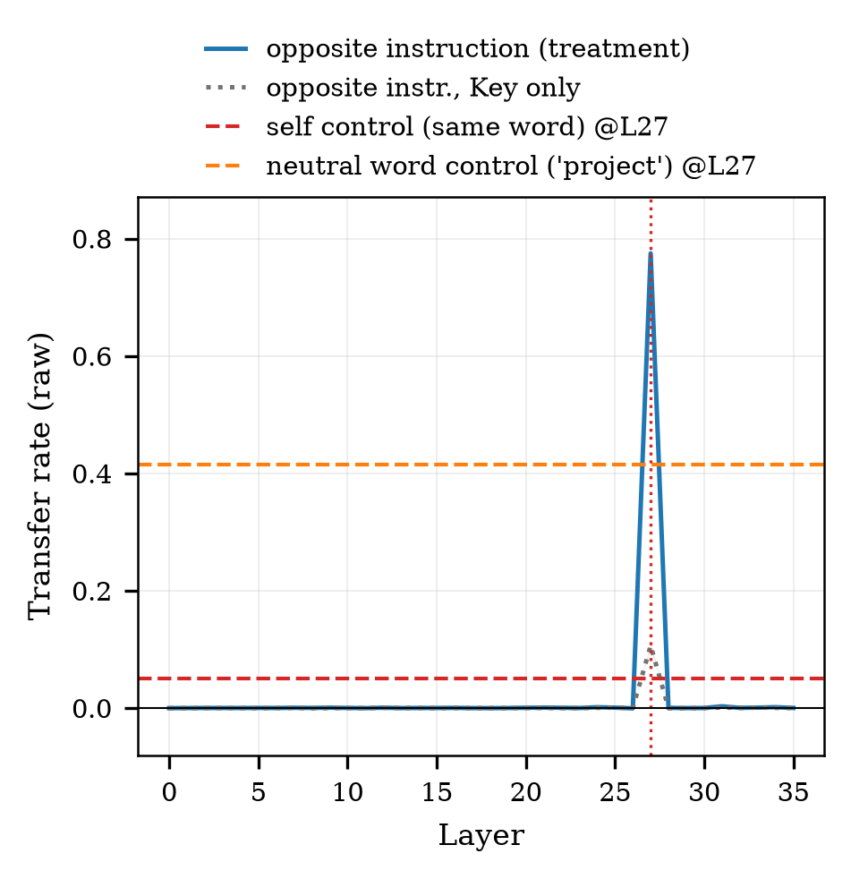
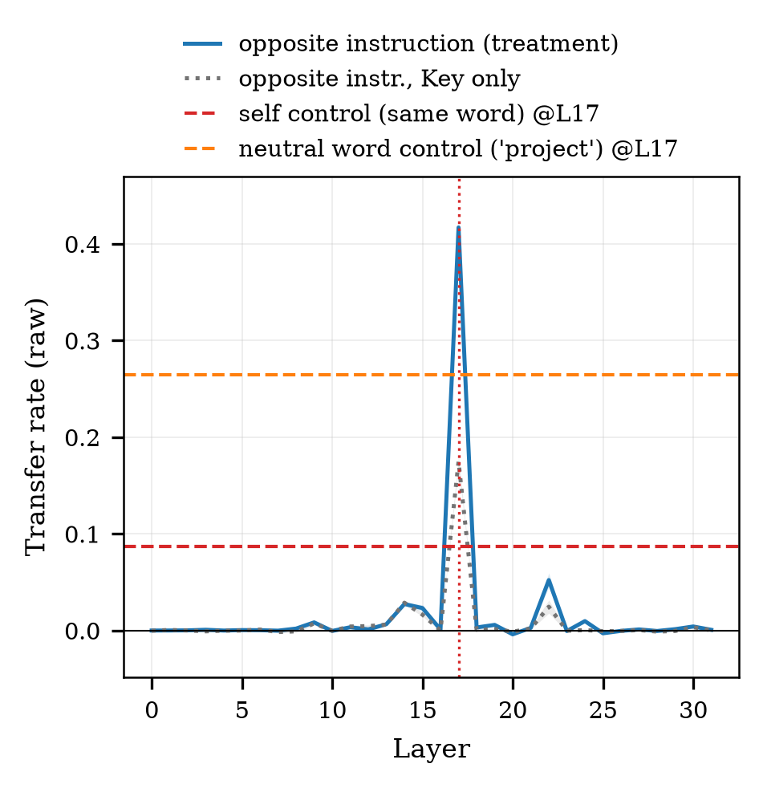
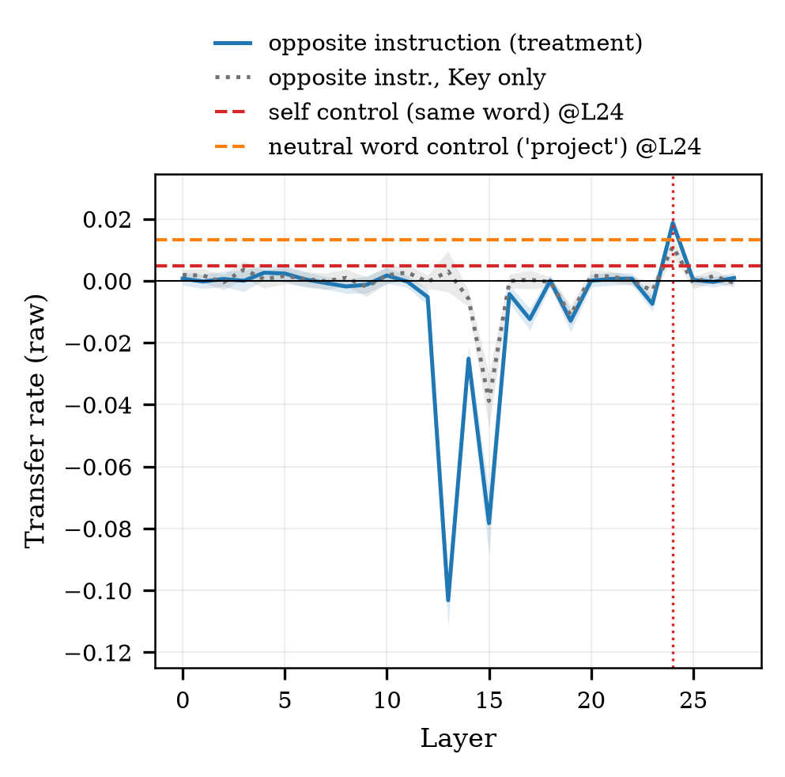
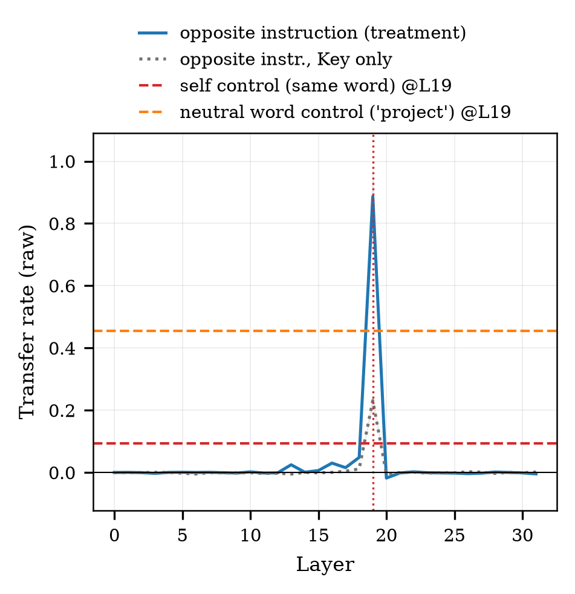
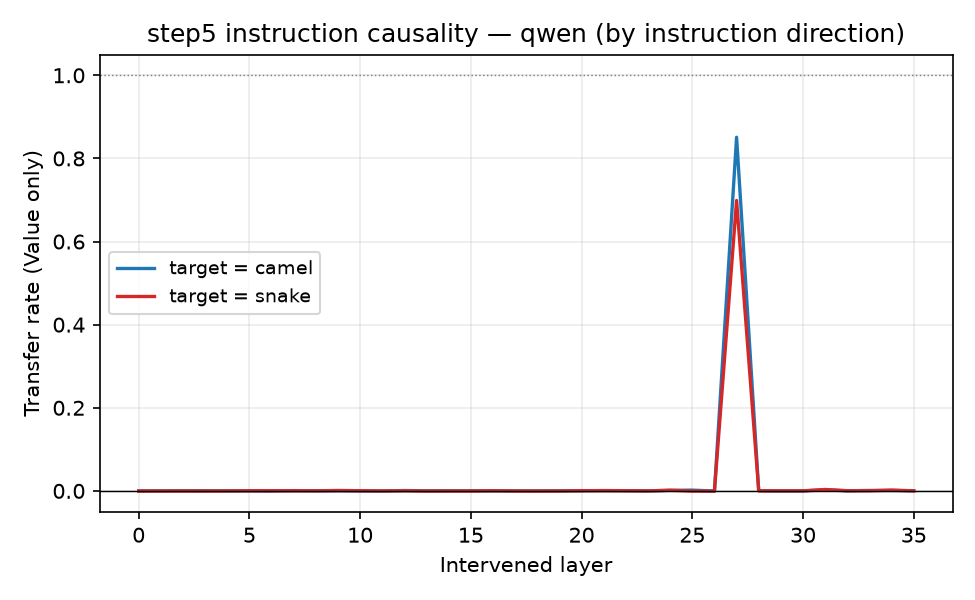
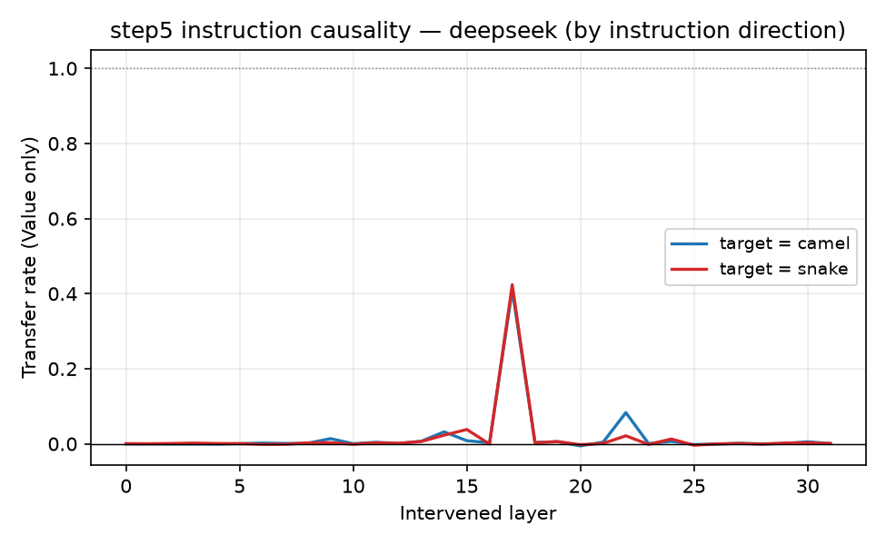
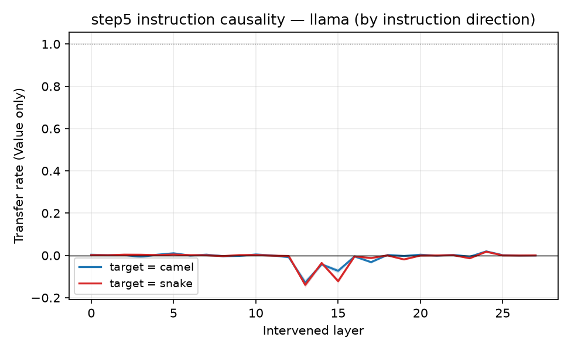
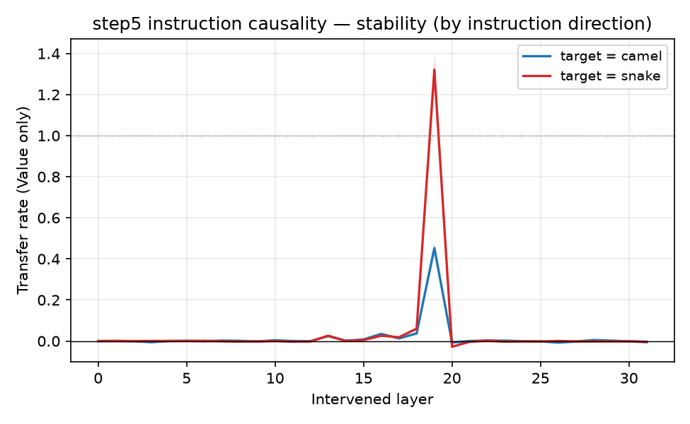
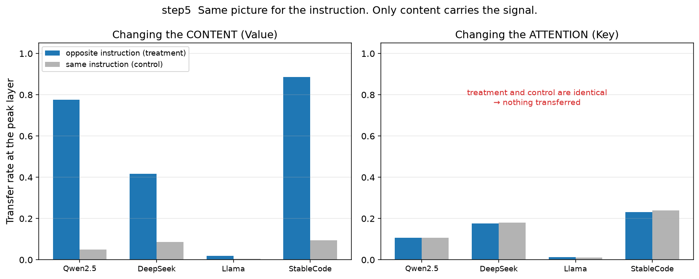
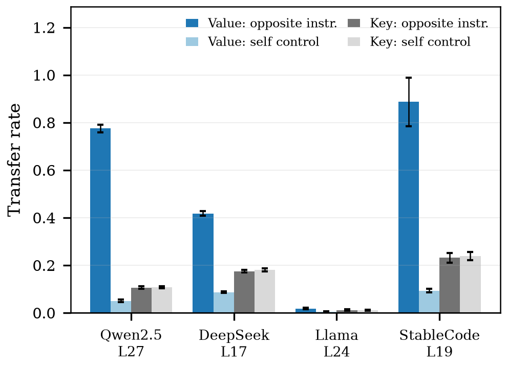

# step5 결과 — 지침 신호도 내용에 실린다 (RQ3 인과)

> **스텝:** step5 · **RQ:** RQ3 (인과) · **결과:** `results/step5_instr-cause/` 336개
> **재현:** `python scripts/step5_reaggregate.py results/step5_instr-cause --figs docs/step5/figures`
> **순효과 짝지음 신뢰구간:** `python scripts/step5_net_effect.py`

---

## 1. 무엇을 어떻게 쟀나

지침 규칙문의 **지시어 단어**(`camelCase`)에 대해 모델이 남긴 내부 표현을
**반대 지침(`snake_case`)의 것으로 바꿔치기**하고, 행동이 반대 지침 쪽으로 넘어가는지를 잰다.
글자는 그대로 두고 내부 표현만 바꾼다.

- **넘어감(전이율) = (S_개입 − S_기준) / (S_반대지침 − S_기준)**,
  **S = logP(지침 목표 표기 이름) − logP(반대 표기 이름)**.
  목표 표기가 조건마다 다르므로 이 정의를 그대로 써야 두 방향을 함께 다룰 수 있다.
- 바꾸는 방식 3가지: 어텐션만 / 내용만 / 둘다. 층은 전 층 스윕.
- 모델 4개 × 묶음 42개 × 지침 방향 2종 = 336개. 시드 42, 평균 덮어쓰기.
- 바꾸는 대상은 **규칙문 지시어의 첫 등장 하나**다(후보열거의 같은 단어는 그대로 둔다).
- 지침이 행동을 흔들지 못한 조건(|S_반대 − S_기준| < 1.0)은 **판정 불가로 분리**한다.

### 통제 — 무엇을 덮어넣는가

바꿔치기는 두 가지 일을 동시에 한다: **원래 표현을 지우고**, **새 표현을 넣는다.**
지우기만으로도 점수가 움직이므로, 공여를 세 종류로 두어 그 몫을 분리한다.

| 공여 | 지시어 자리에 넣는 것 | 표기 정보 |
|---|---|---|
| **반대 지침**(처치) | 반대 지침의 지시어(`snake_case`) | 들어감 |
| **자기 통제** | **같은 지침의 같은 지시어** | **안 들어감** — 덮어쓰는 행위만 남는다 |
| **지시어 절제** | 같은 지침의 무관한 단어(`project`) | 안 들어감 — 지시어가 지워진다 |

**순효과 = 처치 − 자기 통제.** 자기 통제는 내용이 그대로이므로 순수하게 "덮어쓰기 자체"의 몫이다.
절제 조건은 통제가 아니라 **"지시어를 없애면 어떻게 되나"를 따로 보는 실험**이다(§3-4).

---

## 2. 결과

### 층 스윕 — 처치는 전 층, 통제는 봉우리 층 한 곳

> **용어**(→ [`../개념_트랜스포머와_개입.md`](../개념_트랜스포머와_개입.md) §0)
> **처치** = 반대 지침의 지시어를 덮는다 · **자기 통제** = 같은 지시어를 덮는다
> (새 정보 0) · **음성 통제** = 무관한 단어 `project`를 덮는다

| Qwen2.5-Coder-3B | DeepSeek-Coder-6.7B |
|---|---|
|  |  |
| **Llama-3.2-3B (범용)** | **StableCode-3B** |
|  |  |

⚠️ **통제는 봉우리 층에서만 돌았다**(처치는 28~36층 전부). 그래서 통제는 곡선이 아니라
**수평선**으로 그렸고, **층별 순효과 곡선은 만들 수 없다.** step3에는 있는 것이
step5에는 없는 비대칭이다.

⚠️⚠️ 통제 폴더에는 조건에 `[14,15,…,20]`처럼 **층 목록**이 적힌 실행분이 672개 있는데,
그때 하네스는 목록을 받아도 **첫 층만 돌고 나머지를 조용히 버렸다**
(`extra.layer`가 전부 목록의 첫 값 — DeepSeek 14 · Qwen 24). 즉 **봉우리−3층 단일 측정**이고
층 국소성 확인에 쓸 수 없다. 지금은 `runner.py:138`이 예외를 던져 같은 사고를 막는다.

---

**지침 방향별 전이율 — 층별**

| Qwen2.5-Coder-3B | DeepSeek-Coder-6.7B |
|---|---|
|  |  |
| **Llama-3.2-3B (범용, 대부분 판정 불가)** | **StableCode-3B (방향 비대칭 3배)** |
|  |  |

**봉우리 층, 방식별 — 처치와 통제** (42묶음 × 방향 2 = 168조건, ±95%)

### 한눈에 보기

step3와 **같은 그림**이 나온다 — 코드든 지침이든 통로는 내용 쪽이다.

### 논문용 그림

| 모델 | 방식 | 처치(반대 지침) | 자기 통제 | **순효과 ±95%(짝지음)** | 0을 무나 |
|---|---|---|---|---|---|
| **Qwen** L27 | 내용만 | 0.775 | 0.050 | **0.725±0.022** | 아니오 |
| | 어텐션만 | 0.106 | 0.107 | **−0.001±0.008** | **예** |
| | 둘다 | 0.723 | 0.107 | 0.617±0.015 | 아니오 |
| **DeepSeek** L17 | 내용만 | 0.417 | 0.087 | **0.330±0.009** | 아니오 |
| | 어텐션만 | 0.175 | 0.181 | **−0.006±0.004** | 아니오(**음수**) |
| | 둘다 | 0.342 | 0.181 | 0.161±0.005 | 아니오 |
| **StableCode** L19 | 내용만 | 0.887 | 0.093 | **0.793±0.104** | 아니오 |
| | 어텐션만 | 0.231 | 0.239 | **−0.008±0.006** | 아니오(**음수**) |
| | 둘다 | 0.599 | 0.239 | 0.360±0.028 | 아니오 |
| Llama L24 | 내용만 | 0.019 | 0.005 | 0.014±0.004 | 아니오 |
| | 어텐션만 | 0.011 | 0.011 | **−0.000±0.004** | **예** |

n = 84(Llama 32 — 판정 불가 제외). 짝짓기 키는 (모델, 이름 묶음, 지침 방향).

**어텐션 순효과는 네 모델 모두 0 아니면 음수다.** Qwen·Llama는 신뢰구간이 0을 물고,
DeepSeek·StableCode는 0을 배제하지만 **부호가 음수**다 — 반대 지침 공여가 자기 풀링 교란보다
**오히려 덜** 옮긴다. 어느 쪽도 "어텐션 경로로 표기 정보가 옮겨진다"의 근거가 되지 못한다.

**음성 통제(무관어) 기준으로 보면 어텐션 순효과가 −0.10 ~ −0.34로 더 크게 음수다.**
무관어를 덮는 교란(0.28~0.44)이 반대 지침 지시어를 덮는 것보다 크기 때문이다.

Llama는 168조건 중 **104개가 판정 불가**(지침이 행동을 흔들지 못함).

**지침 방향별** (내용만, 처치 기준)

| 모델 | camel 방향 | snake 방향 | 전이율>1 |
|---|---|---|---|
| Qwen | 0.85 | 0.70 | 0/84 |
| DeepSeek | 0.41 | 0.42 | 0/84 |
| **StableCode** | **0.45** | **1.32** | **38/84** |
| Llama | 0.02 | 0.02 | 0/84 |

StableCode는 방향에 따라 3배 차이가 난다. 평균 0.89 / 중앙값 0.76.
**이 모델은 크기를 보고하지 않고 층과 방식 대비만 쓴다.**

**판정 기준선 민감도** — 기준을 0.5 / 1.0 / 2.0 어디에 두어도 전이율은 바뀌지 않는다.
Llama는 남는 조건이 78 → 34 → 2로 줄지만 값은 세 기준 모두 0.02다.

---

## 3. 해석

**(1) 어텐션 경로로는 지침 정보가 옮겨지지 않는다.**
어텐션만 바꾼 조건은 **반대 지침을 넣든 자기 자신을 넣든 값이 같다**
(Qwen 0.106 vs 0.107 · DeepSeek 0.175 vs 0.181 · StableCode 0.231 vs 0.239).
짝지음 순효과는 **−0.008 ~ −0.000**이고, 부호가 0 아니면 **음수**다.
원값 0.11~0.23은 전부 "평균 내어 덮어쓰는 행위 자체"의 몫이다.

> **범위:** 자기 통제는 항등 개입이 아니다(`token_unit="mean"`이라 (k₁,k₂)→(평균,평균)).
> 그래서 말할 수 있는 것은 **"반대 표기 공여가 평균 풀링 교란을 넘는 추가 효과를 만들지
> 못했다"** 이고, "native Key 경로에 표기 정보가 없다"가 아니다.

**(2) 지침 신호는 내용(Value)에 실린다.**
내용만 바꾸면 순효과가 0.33~0.79 남는다. 거품(자기 통제)은 0.05~0.09로 작다.
step3(코드)에서 얻은 것과 **같은 구조**다 — 코드도 지침도 통로는 내용 쪽이다.

**(3) 지침이 작동하는 층은 지침을 보는 층과 같다.**
Qwen L27, DeepSeek L17, StableCode L19 — 세 모델 모두 step4의 관측 봉우리와 일치한다.
**지침이 안 먹히는 이유는 층이 어긋나서가 아니다.**

**(4) 지시어 한 단어를 지우면 지침의 절반이 무력해진다.**
지시어 자리에 무관한 단어(`project`)를 덮는 절제 조건에서 전이율이 0.27~0.45 나온다.
지침 문장은 그대로 있고 **표기어 하나만** 사라졌는데도 행동이 크게 움직인다.
지침의 힘이 그 한 단어에 집중돼 있다는 뜻이다.
(이 조건은 정보가 들어가지 않으므로 방식 간 차이도 없다 — 내용만 0.415 vs 어텐션만 0.443.)

**(5) 범용 모델에는 지침 레버가 없다.**
Llama는 168조건 중 104개가 판정 불가고, 남은 조건에서도 순효과 0.014다.
**"지침이 안 통하는" 것이 아니라 "지침 축 자체가 약하다".**

## 4. 이 스텝이 다루지 않는 것

- 자기 통제는 **완전한 항등이 아니다.** 같은 지시어의 조각들을 평균 내 다시 넣으므로
  약한 평탄화가 일어난다. 내용 쪽 0.05~0.09가 그 크기다.
- **규칙문 지시어 한 곳만** 바꾼다. 후보열거에 같은 단어가 남아 있어 효과가 희석될 수 있다.
- 긍정형·약한 어조 고정. 측정 대상은 고정된 함수 이름 한 쌍이다.
- step3(코드)와 봉우리 층을 직접 비교하지 않는다 — step3는 camel 한 방향,
  step5는 양방향이라 조건 집합이 다르다.
