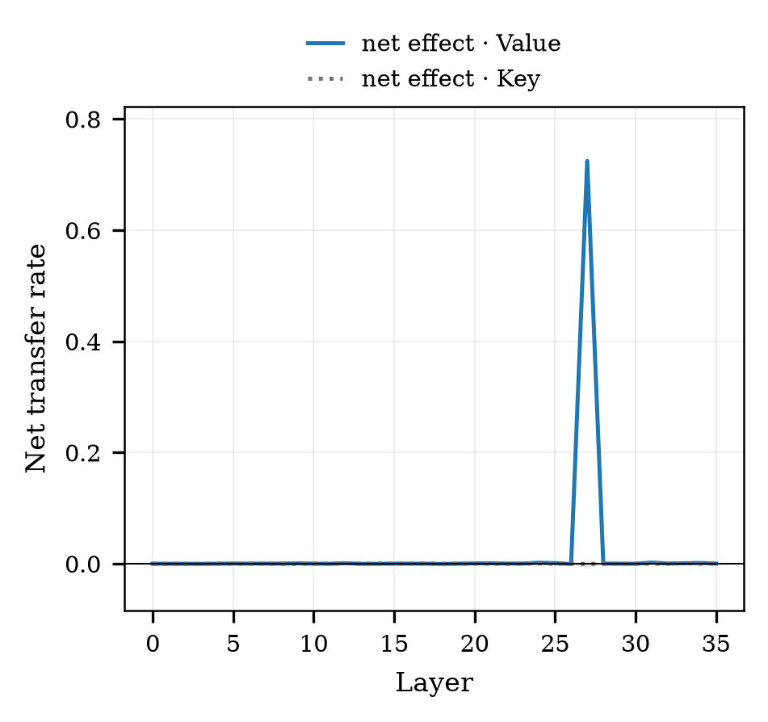
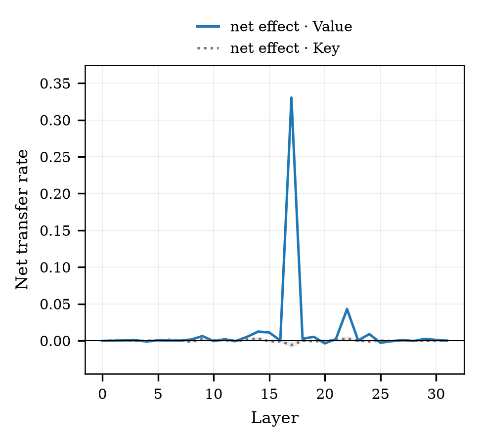
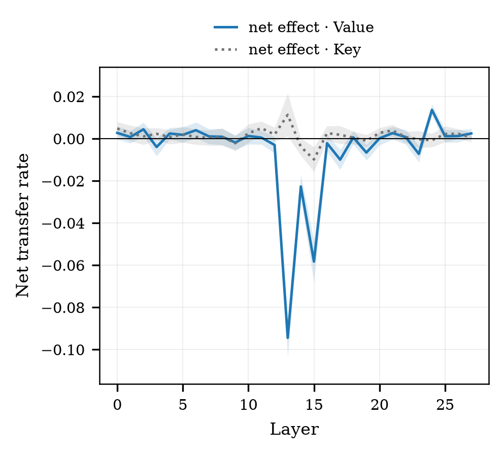
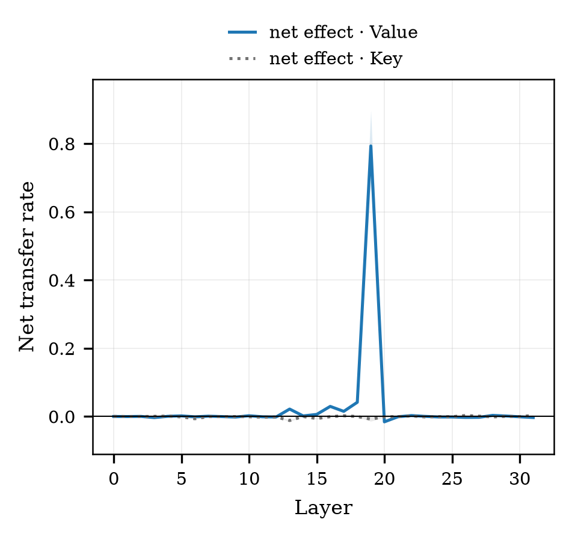

# step5 결과 — 지침 신호도 내용에 실린다 (RQ3 인과)

> **스텝:** step5 · **RQ:** RQ3 (인과)
> **결과:** `results/step5_instr-cause/` 336개 · `results/step5_control_sweep_<모델>/` 672개
> **재현:** `python scripts/step5_reaggregate.py results/step5_instr-cause --figs docs/step5/figures`
> **지침 몫 짝지음 신뢰구간:** `python scripts/step5_net_effect.py`
> **층별 곡선:** `python scripts/step5_figures.py`

---

## 1. 결과 JSON 읽는 법

> 이 스텝의 결과는 **폴더가 셋**이다.
> `results/step5_instr-cause/` — 반대 지침 지시어를 덮은 실행분, 전 층, 336개
> `results/step5_control_sweep_<모델>/` — 덮기 몫을 재는 실행분, **전 층**, 모델당 168개 (합 672)
> `results/step5_instr-cause-control/` — 같은 것을 **층 하나에서만** 잰 옛 실행분, 2016개.
> 지금 보고 값은 **위 두 폴더**로 낸다. 세 번째는 남겨 두되 쓰지 않는다
> (같은 조건이 층 구성만 달리 들어 있어, 한 폴더처럼 섞어 읽으면 조용히 덮인다).
> 공통 뼈대(`step`·`rq`·`condition`·`meta`)는 [`../코드_하네스공통.md`](../코드_하네스공통.md) §5~6,
> 이 값을 만드는 코드는 [`code.md`](code.md) §7.

### 1-1. 먼저 — 각 필드가 무엇을 말하는가

**S가 무엇인가**

프롬프트 끝에 `"def "`를 붙여 **이름 자리**를 만들고, 거기 올 후보 두 개
(같은 함수의 camel판·snake판)의 로그확률을 각각 잰 뒤 뺀다.

> **S = logP(그 조건의 지침이 요구한 표기 후보) − logP(반대 표기 후보)**  (단위: nat)

목표 표기가 조건마다 다르므로(step5는 양방향을 돌았다) **"지침이 요구한 쪽 − 반대쪽"** 이라는
정의를 그대로 써야 두 방향을 한 자로 잴 수 있다. 양수 = 지침대로 쓰려는 상태.

**S의 세 상태** — step3과 이름은 같지만 **가리키는 것이 다르다.**

| 필드 | 어떤 상태의 점수인가 |
|---|---|
| `S_base` | **조건 지침 그대로**의 프롬프트(예: "camelCase로 써라"). 개입 전 출발점 |
| `S_clean` | **지침만 반대로 바꾼**(예: "snake_case로 써라") 프롬프트. 지시어를 통째로 갈아끼웠을 때 도달하는 **반대편 끝** |
| `S_int` | `S_base`와 **글자가 똑같은** 프롬프트에서, 규칙문 지시어 자리의 내부 표현만 공여 값으로 덮은 뒤 |

> ⚠️ **여기서 `S_clean`은 "깨끗한 상태"가 아니라 "반대 지침 상태"다.** 지침이 실제로
> 작동하는 모델이라면 `S_clean < S_base`가 되어 **회복률의 분모가 음수**다. 비율이라
> 공식은 그대로 성립하지만, `S` 값 자체를 그림에 그릴 때는 방향을 반드시 밝힌다.

**넘어감(전이율)** — 필드 이름은 step3과 같은 `recovery`다.

> **`recovery` = (S_int − S_base) / (S_clean − S_base)**

| 값 | 뜻 |
|---|---|
| `0` | 지시어를 덮어도 행동이 그대로 — 아무것도 안 넘어갔다 |
| `1` | 지침을 통째로 반대로 바꾼 것과 같은 데까지 넘어갔다 |
| >1 | 그보다 더 넘어갔다(StableCode에서 실제로 나온다) |
| 음수 | 오히려 원래 지침 쪽으로 더 밀렸다 |

**영향력 `gap` = \|S_clean − S_base\|** — 회복률의 **분모 크기** = 지침이 애초에 행동을
얼마나 흔들었나. `gap < 1.0`이면 `undecidable: true` = **판정 불가**(그 조건의 전이율은
해석하지 않는다). 기준값은 `undecidable_gap_min`에 함께 저장된다. Llama는 168조건 중
104개가 여기 걸린다.

**개입 종류(kind)** — `key`(어텐션 경로만) / `value`(내용만) / `key_value`(둘 다).

**공여(donor)** — 지시어 자리에 **무엇을 덮어넣었나**. 이 필드가 조건의 성격을 가른다.

| `donor` 값 | 덮어넣은 것 | 무엇을 재는 조건인가 |
|---|---|---|
| `opposite_instruction` | 반대 지침의 지시어(`snake_case`) | 표기 정보가 **들어가는** 조건 |
| `control_self` | **같은 지침의 같은 지시어**(`camelCase`) | 새 정보 0 — 남는 값은 전부 **덮기 몫** |
| `control_unrelated_word` | 같은 지침의 무관한 단어(`project`) | 지시어를 **지웠을 때** 무슨 일이 생기나(→ §4-4) |

`donor_names`를 보면 어떤 조건인지 즉시 알 수 있다:
`["snake_case"]`=반대 지침 넣기 · `["camelCase"]`=덮기 몫 재기 · `["project"]`=지시어 지우기.

**나머지 extra**

| 필드 | 무슨 값인가 |
|---|---|
| `mode` | `"intervene_sweep"`(전 층) / `"intervene"`(층 하나) |
| `intervention_target` | `"instruction"` — 덮은 자리가 **지침의 지시어**라는 뜻(step3은 `"code"`) |
| `target` | 그 조건의 지침이 요구한 표기 |
| `viol_names` | 덮인 단어(보통 `["camelCase"]` 하나) |
| `n_substituted_tokens` | 실제로 덮은 자리 수. **지시어는 보통 2조각**이다(step3은 20~30). 이 절대값을 "지침이 코드보다 약하다"로 읽으면 안 된다 |
| `skipped_names` | 자리를 못 찾아 빠진 이름 번호. 비어 있어야 정상 |
| `layer` · `kind` · `S_int` · `recovery` | **단일 층 실행분에만 있다**(`mode="intervene"`) |
| `kinds` | 스윕 실행분에 있다 — 이 파일이 담은 개입 종류 목록 |

### 1-2. 실제 파일 모양

**전 층 스윕(`step5_instr-cause` · `step5_control_sweep_<모델>`)** — 층별 값은 `per_layer` 안에 있다.

```jsonc
"metrics": {
  "per_layer": {"17": {"value__S_int": …, "value__recovery": 0.31,
                       "key__S_int": …,   "key__recovery": 0.11, …}, …},
  "extra": {
    "mode": "intervene_sweep",
    "intervention_target": "instruction",       // ← step3과 구분되는 지점
    "donor": "opposite_instruction",
    "target": "camel",
    "S_clean": …, "S_base": …,
    "viol_names": ["camelCase"],                // 덮인 단어
    "donor_names": ["snake_case"],              // 덮어넣은 단어
    "n_substituted_tokens": 2,                  // 지시어는 보통 2조각
    "kinds": ["key", "value", "key_value"]
  }
}
```

**옛 단일 층(`step5_instr-cause-control`, 지금은 쓰지 않는다)** — 값이 `extra`에 바로 있고 `per_layer`는 비어 있다.

```jsonc
"extra": {
  "mode": "intervene",
  "donor": "control_self",                      // 또는 control_unrelated_word
  "layer": 17, "kind": "value",
  "S_clean": …, "S_base": …, "S_int": …,
  "recovery": 0.107,                            // ← 여기 있다 (스윕에는 없다)
  "gap": 3.2, "undecidable": false, "undecidable_gap_min": 1.0,
  "viol_names": ["camelCase"], "donor_names": ["camelCase"]   // self = 같은 단어
}
```

> ⚠️ 옛 폴더에는 `mode="intervene_sweep"`인데 `per_layer`에 **층이 하나뿐인** 파일이 672개 있다.
> 조건에 층 **목록**(`L16-22` 등)이 적혔지만 그때 하네스가 첫 층만 돌고 나머지를 조용히 버린
> 실행분이다(→ §3). 층 국소성 근거로 쓸 수 없다.

### 1-3. 읽는 순서

1. `extra.donor`(와 `donor_names`)를 본다 — **표기 정보가 들어간 조건인가, 덮기만 한 조건인가.**
2. `gap`·`undecidable`을 본다. `true`면 그 조건의 전이율은 **해석하지 않는다.**
3. 값을 꺼낸다 — 스윕이면 `per_layer["<층>"]["<종류>__recovery"]`, 단일 층이면 `extra.recovery`.
   **찾는 자리가 모드마다 다르다**(이 차이를 놓쳐 빈 표를 출력한 적이 있다).
4. **보고 값은 (반대 지침 넣기) − (같은 지시어 덮기) = 지침 몫**이고, **반드시 짝지어
   계산한다.** 두 조건은 같은 42묶음·같은 방향에서 돌았으므로 묶음마다 먼저 빼면 묶음
   난이도가 상쇄된다. 평균끼리 빼면 차이의 신뢰구간을 얻을 수 없다.
   - `python scripts/step5_reaggregate.py results/step5_instr-cause` (방향 분리·중앙값·임계 민감도)
   - `python scripts/step5_net_effect.py` (순효과 + 짝지음 95% 신뢰구간)
5. **방향(camel↔snake)을 분리해 본다.** 두 방향은 난이도가 달라, 합쳐 평균 내면 한쪽이
   천장에 닿아 있는 것이 가려진다.

---

## 2. 무엇을 어떻게 쟀나

### 2-0. 이 문서에서 쓰는 말

| 말 | 무엇을 가리키나 |
|---|---|
| **덮어쓰기** | 프롬프트 글자는 그대로 두고, 모델이 그 자리에 대해 내부에 저장해 둔 값만 바꿔치기하는 것 |
| **지시어** | 규칙문에 있는 표기어 한 단어. `In this project we generally write function names in `**`camelCase`**`.` 의 굵은 부분 |
| **어텐션 쪽 / 내용 쪽** | 저장된 값의 두 갈래. 어텐션 쪽(Key)은 "그 자리를 얼마나 보는가", 내용 쪽(Value)은 "볼 때 무엇이 실려 오는가" |
| **점수 S** | 이름 자리에 올 두 후보의 로그확률 차이. **지침이 요구한 표기 − 반대 표기**. 양수면 지침대로 쓰려는 상태 |
| **넘어감** | 덮어쓴 뒤 점수가 반대 지침 쪽으로 얼마나 갔나. 0=제자리, 1=지침을 통째로 반대로 바꾼 것과 같음 |
| **덮기 몫** | **새 정보가 없는 값으로 덮어도 나오는 넘어감.** 정보가 옮겨간 것이 아니라 덮는 행위 자체가 만든 값 |
| **지침 몫** | 넘어감에서 덮기 몫을 뺀 나머지. **보고하는 값은 항상 이것이다** |
| **묶음** | 함수 이름 12개 한 세트. 42묶음. 같은 묶음끼리 짝지어 빼야 묶음 난이도가 상쇄된다 |
| **판정 불가** | 지침이 애초에 점수를 거의 못 흔든 조건(\|반대지침 − 기준\| < 1.0). 나눗셈의 분모가 너무 작아 해석하지 않는다 |

### 2-1. 무엇을 바꿔치기했나

규칙문 지시어 `camelCase` 한 단어에 대해 모델이 내부에 저장해 둔 값을 덮고, 행동이
반대 지침 쪽으로 넘어가는지를 잰다. **화면의 글자·길이·토큰 수는 하나도 건드리지 않는다.**

> **프롬프트가 몇 개 만들어지고 그중 어느 것을 채점하는지**가 헷갈리면
> [`방법론.md` §2-1·2-2](방법론.md)를 먼저 본다 — 프롬프트 원문과 측정 절차가 실측값과 함께 있다.
> 특히 `camelCase`는 지침에 **두 번** 나오는데 **규칙문의 첫 번째만** 덮는다는 점,
> 여기서는 **기준점이 반대 지침이라** 넘어감이 커질수록 S가 내려간다는 점을 놓치기 쉽다.

- 넘어감 = (덮은 뒤 − 기준) / (반대 지침 − 기준), S = logP(요구 표기) − logP(반대 표기)
- 덮는 갈래 3가지: 어텐션 쪽만 / 내용 쪽만 / 둘 다. 층은 전 층을 하나씩 훑는다
- 모델 4개 × 묶음 42개 × 지침 방향 2종 = 336조건. 시드 42, 평균 덮어쓰기
- 덮는 대상은 **규칙문 지시어의 첫 등장 하나**(후보열거의 같은 단어는 그대로 둔다)

### 2-2. 덮어넣는 값을 셋으로 둔 이유

덮어쓰기는 한 번에 두 가지 일을 한다: **원래 값을 지우고**, **새 값을 넣는다.**
지우기만으로도 점수가 움직이므로, 넣는 값을 셋으로 두어 가른다.

| 무엇을 넣나 | 지시어 자리에 들어가는 것 | 표기 정보 | 이 조건이 답하는 것 |
|---|---|---|---|
| **반대 지침의 지시어** | `snake_case` | 들어간다 | 지우기 + 넣기 |
| **같은 지침의 같은 지시어** | `camelCase` (원래 있던 그 단어) | **안 들어간다** | **지우기만** — 이것이 덮기 몫 |
| 지침 속 무관한 단어 | `project` | 안 들어간다 | 지시어를 **없앴을 때** 무슨 일이 생기나 |

> **지침 몫 = (반대 지침 지시어) − (같은 지시어)**
> 같은 묶음·같은 방향끼리 먼저 빼고, 그 차이 84개의 평균과 신뢰구간을 낸다.

셋째 줄은 뺄 값이 아니다. 지시어가 사라진 상태를 따로 보는 **별개의 실험**이다(→ §4-4).

### 2-3. 이번에 달라진 것 — 덮기 몫을 전 층에서 쟀다

전에는 덮기 몫을 **봉우리 층 한 곳**에서만 쟀다. 그래서 뺄 수 있는 층이 한 곳뿐이었고,
층별 곡선을 만들 수 없었으며, 그 층이 진짜 봉우리인지도 확인할 수 없었다.

이번에 같은 조건을 **전 층에서** 다시 쟀다(모델당 168조건, 합 672). 바뀐 것은
`layers='sweep'` 하나뿐이고 프롬프트·넣는 값·시드는 그대로다. 그 결과 step3과 같은 자로
층별 곡선을 그릴 수 있게 됐다.

---

## 3. 결과

### 3-0. 그림이 다섯 묶음이다 — 어느 그림이 무엇인가

같은 실험(처치 336 + 통제 672)을 **다섯 가지로 잘라 그린 것**이다.
**곡선 세 묶음은 전부 가로축이 "몇 번째 층을 덮었나"**이고, 다른 것은 **세로축과 선**뿐이다.

| 그림 묶음 | 몇 장 | 세로축 | **뺐나** | 그리는 선 | 왜 있나 |
|---|---|---|---|---|---|
| `explain_control` | 1 (4모델) | 봉우리 층의 넘어감 | 둘 다 보임 | 처치 vs 자기 통제 | **이해용.** 결론을 한 장으로 |
| `net_<모델>` | 4 | 넘어감 | **뺐음** | 내용 쪽 · 어텐션 쪽 | **논문용.** 층별 지침 몫 |
| `sweep_<모델>` | 4 | 넘어감 | **안 뺌**(raw) | 처치 + 통제 2종 | 그 값이 **어떻게 깎여 나왔나** |
| `direction_<모델>` | 4 | 넘어감 | **안 뺌**(raw) | camel 요구 · snake 요구 | 지침 방향에 따라 다른가 |
| `control` | 1 (4모델) | 봉우리 층의 넘어감 | 둘 다 보임 | 처치·통제 × 내용·어텐션 | 봉우리 층 막대 요약 |

> ⚠️ **그림과 바로 아래 표의 숫자가 다를 수 있다.** `sweep_*`·`direction_*`은 **빼기 전(raw)**
> 값을 그리는데, 표는 **뺀 값(지침 몫)** 을 싣는다. 예: Qwen L27 camel 요구는
> 그림에서 **0.851**(raw)이고 표에서 **0.826**(지침 몫)이다. 섞어 읽지 않는다.

---

### 한눈에 보기 (이해용) — `explain_control`

| 항목 | 이 그림에서 |
|---|---|
| **무엇을 재나** | 봉우리 층 **한 점**에서, 덮어넣는 값에 표기 정보가 **있을 때와 없을 때** |
| **가로축** | 모델 4개 (층은 각 모델의 봉우리 층으로 고정) |
| **세로축** | 넘어감 — 0 = 제자리, 1 = 지침을 통째로 반대로 바꾼 것과 같음 |
| **왼쪽 판 / 오른쪽 판** | **내용 쪽(Value)** 을 덮었을 때 / **어텐션 쪽(Key)** 을 덮었을 때 |
| **파란 막대** | 반대 지침의 지시어(`snake_case`)를 덮음 = 처치 |
| **회색 막대** | **같은 지침의 같은 지시어**(`camelCase`)를 덮음 = 덮기 몫 |
| **결과** | 왼쪽은 두 막대가 크게 벌어지고, 오른쪽은 **같은 높이** |
| **뜻** | 내용 쪽으로는 지침 정보가 넘어간다. 어텐션 쪽으로는 **아무것도 안 넘어간다** |


---

### 3-1. 층별 지침 몫 — 봉우리가 한 층에 서 있다 (`net_<모델>` 4장, 논문용)

| 항목 | 이 그림에서 |
|---|---|
| **무엇을 재나** | 지시어의 어느 갈래를, 어느 층에서 덮어야 행동이 반대 지침 쪽으로 넘어가나 |
| **가로축** | **몇 번째 층을 덮었나**. 층 하나 덮고 재고 **원상 복구** 후 다음 층 — 누적이 아니다 |
| **세로축** | `Net transfer rate` = **지침 몫**. 덮기 몫을 **이미 뺀** 값이다 |
| **파란 실선** `net effect · Value` | 내용 쪽만 덮었을 때 |
| **회색 점선** `net effect · Key` | 어텐션 쪽만 덮었을 때 |
| **음영** | 84조건(42묶음 × 방향 2) 짝지음 95% 신뢰구간 |
| **읽는 법** | 파랑이 **한 층에서만** 솟는가 · 회색이 0에 붙어 있는가 |
| **결과** | 파랑은 봉우리 하나, 회색은 전 층에서 0에 붙어 **점선이 안 보인다** |
| **뜻** | 지침 신호는 **내용 쪽에, 특정 한 층에** 있다. step3(코드 쪽)과 같은 그림이다 |

| Qwen2.5-Coder-3B | DeepSeek-Coder-6.7B |
|---|---|
|  |  |
| **Llama-3.2-3B (범용)** | **StableCode-3B** |
|  |  |

파랑 = 내용 쪽, 점선 = 어텐션 쪽. 둘 다 덮기 몫을 뺀 값이다.

**봉우리가 층 하나에 갇혀 있다.** 봉우리의 절반이라도 넘는 층이 **네 모델 모두 정확히 1개**이고,
바로 옆 층은 사실상 0이다.

| 모델 | 층 수 | 봉우리 | 깊이 | 봉우리 값 | 절반 넘는 층 | 바로 앞 층 | 바로 뒤 층 |
|---|---|---|---|---|---|---|---|
| Qwen2.5-Coder-3B | 36 | **L27** | 77% | **0.725±0.022** | 1개 | −0.001 | 0.000 |
| DeepSeek-Coder-6.7B | 32 | **L17** | 55% | **0.330±0.009** | 1개 | 0.000 | 0.003 |
| Llama-3.2-3B | 28 | L24 | 89% | 0.014±0.003 | 1개 | −0.007 | 0.001 |
| StableCode-3B | 32 | **L19** | 61% | **0.793±0.104** | 1개 | 0.042 | −0.016 |

### 3-2. 전에 보고한 값이 그대로 맞았다

전에는 덮기 몫이 있는 층이 하나뿐이라 그 층을 **고른 것이 아니라 유일한 후보**로 썼다.
이제 전 층에서 재 보니 **네 모델 모두 그 층이 실제 봉우리**였다.

| 모델 | 전에 덮기 몫을 쟀던 층 | 전 층에서 잰 봉우리 | 같나 |
|---|---|---|---|
| Qwen2.5-Coder-3B | L27 | L27 | **예** |
| DeepSeek-Coder-6.7B | L17 | L17 | **예** |
| Llama-3.2-3B | L24 | L24 | **예** |
| StableCode-3B | L19 | L19 | **예** |

step3에서 "원래 값의 봉우리 = 지침 몫의 봉우리"였던 것을 근거로 세웠던 가정이
**직접 확인됐다.** 이 스텝의 한계 하나가 없어졌다.

### 3-3. 봉우리 층에서 갈래별로

(42묶음 × 방향 2 = 84조건 짝지음, ±95%)

| 모델 | 층 | 덮은 값 | 덮기 몫 | **지침 몫** | 0을 무나 |
|---|---|---|---|---|---|
| **Qwen** L27 | 내용 쪽 | 0.775 | 0.050 | **0.725±0.022** | 아니오 |
| | 어텐션 쪽 | 0.106 | 0.107 | **−0.001±0.008** | **예** |
| | 둘 다 | 0.723 | 0.107 | 0.617±0.015 | 아니오 |
| **DeepSeek** L17 | 내용 쪽 | 0.417 | 0.087 | **0.330±0.009** | 아니오 |
| | 어텐션 쪽 | 0.175 | 0.181 | **−0.006±0.004** | 아니오(**음수**) |
| | 둘 다 | 0.342 | 0.181 | 0.161±0.005 | 아니오 |
| **StableCode** L19 | 내용 쪽 | 0.887 | 0.093 | **0.793±0.104** | 아니오 |
| | 어텐션 쪽 | 0.231 | 0.239 | **−0.008±0.006** | 아니오(**음수**) |
| | 둘 다 | 0.599 | 0.239 | 0.360±0.028 | 아니오 |
| Llama L24 | 내용 쪽 | 0.019 | 0.004 | 0.014±0.003 | 아니오 |
| | 어텐션 쪽 | 0.011 | 0.012 | **−0.001±0.003** | **예** |

**어텐션 쪽 지침 몫은 네 모델 모두 0 아니면 음수다.** 원래 값 0.11~0.23은 전부 덮기 몫이었다.

위 표를 그림으로 옮긴 것이 `control`이다.

| 항목 | 이 그림에서 |
|---|---|
| **무엇을 재나** | 봉우리 층에서 **처치와 덮기 몫을 갈래별로** 나란히 |
| **가로축** | 모델 4개. 아래 `L27`·`L17`·`L24`·`L19`는 그 모델의 **봉우리 층 번호** |
| **세로축** | 넘어감 — **빼기 전(raw)** 값. 막대 두 개의 **간격**이 지침 몫이다 |
| **진한 파랑 / 연한 파랑** | 내용 쪽: 처치(반대 지침) / 자기 통제(같은 지시어) |
| **진한 회색 / 연한 회색** | 어텐션 쪽: 처치 / 자기 통제 |
| **오차 막대** | 84조건 95% 신뢰구간 |
| **읽는 법** | **막대 쌍의 간격만** 본다. 높이가 아니다 |
| **결과** | 파란 쌍은 크게 벌어지고, **회색 쌍은 붙어 있다** — 네 모델 전부 |
| **뜻** | 어텐션 쪽 원래 값 0.11~0.23은 **전부 덮기 몫**이다 |


### 3-4. 층 스윕 — 넣는 값 세 종류를 한 장에 (`sweep_<모델>` 4장)

| 항목 | 이 그림에서 |
|---|---|
| **무엇을 재나** | §3-1의 값이 나오기까지, 층마다 **원래 값이 얼마였고 그중 얼마가 덮기 몫이었나** |
| **가로축** | 몇 번째 층을 덮었나 |
| **세로축** | `Transfer rate (raw)` — **아무것도 빼지 않은 값**. §3-1과 다른 자다 |
| **파란 실선** `opposite instruction (treatment)` | 반대 지침 지시어를 **내용 쪽**에 덮음 = 처치 |
| **회색 점선** `opposite instr., Key only` | 같은 처치를 **어텐션 쪽**에 |
| **빨간 파선** `self control (same word)` | **같은 지시어**를 덮음 = **덮기 몫** ← 이걸 뺀다 |
| **주황 파선** `neutral word control ('project')` | 지시어를 **지웠을 때**. **뺄 값이 아니다**(→ §3-5) |
| **읽는 법** | 파랑과 빨강의 **간격**이 §3-1의 파란 선이다. 주황은 별개 실험이라 빼지 않는다 |
| **결과** | 봉우리 층에서 파랑 0.775 · 빨강 0.050 · 회색 0.106 · 주황 0.415 (Qwen) |
| **뜻** | 어텐션 쪽(회색 0.106)은 덮기 몫(빨강 기준)과 사실상 같아 **간격이 안 생긴다** |

| Qwen2.5-Coder-3B | DeepSeek-Coder-6.7B |
|---|---|
|  |  |
| **Llama-3.2-3B (범용)** | **StableCode-3B** |
|  |  |

덮기 몫도 이제 **곡선**이다(전에는 점 하나라 수평선으로 그렸다).

### 3-5. 지시어를 없앴을 때 — 뺄 값이 아니라 별개 실험

지시어 자리에 무관한 단어(`project`)를 넣으면, 표기 정보가 하나도 안 들어가는데도
넘어감이 크게 나온다. 이 값을 기준으로 빼면 어텐션 쪽이 **크게 음수**가 된다.

| 모델 | 층 | 내용 쪽 | 어텐션 쪽 |
|---|---|---|---|
| Qwen | L27 | 0.360±0.011 | **−0.337±0.010** |
| DeepSeek | L17 | 0.153±0.006 | **−0.103±0.012** |
| Llama | L24 | 0.005±0.003 | −0.003±0.004 |
| StableCode | L19 | 0.433±0.063 | **−0.199±0.008** |

음수가 큰 이유는 간단하다 — **지시어를 지워 버리는 쪽이 반대 지침 지시어로 바꾸는 쪽보다
행동을 더 크게 움직인다.** 그래서 이 조건은 뺄 값(덮기 몫)이 아니라 §4-4의 별개 결과로 읽는다.

### 3-6. 지침 방향별 (`direction_<모델>` 4장)

| 항목 | 이 그림에서 |
|---|---|
| **무엇을 재나** | **camel을 요구한 조건과 snake를 요구한 조건이 다르게 움직이나.** 두 방향을 합쳐 평균 내면 한쪽이 천장에 닿은 것이 가려진다 |
| **가로축** | `Intervened layer` — 몇 번째 층을 덮었나 |
| **세로축** | `Transfer rate (Value only)` — **내용 쪽만**, **빼기 전(raw)** 값 |
| **파란 선 / 빨간 선** | 지침이 **camel을 요구** / **snake를 요구**한 조건 |
| **회색 점선(1.0)** | 지침을 통째로 반대로 바꾼 것과 같은 수준. **넘으면 그보다 더 넘어간 것** |
| **음영** | 42묶음 95% 신뢰구간 (방향마다 따로) |
| **⚠️ 아래 표와 다른 자** | **그림은 raw, 표는 지침 몫(뺀 값)이다.** Qwen L27 camel은 그림 0.851 / 표 0.826 |
| **결과** | 대부분 두 선이 겹치는데, **StableCode만 크게 갈리고 snake 쪽이 1.0을 넘는다** |
| **뜻** | 방향은 대체로 결론을 안 바꾼다. **StableCode는 예외라 크기를 보고하지 않는다** |

| Qwen2.5-Coder-3B | DeepSeek-Coder-6.7B |
|---|---|
|  |  |
| **Llama-3.2-3B (대부분 판정 불가)** | **StableCode-3B (방향 비대칭 3.6배)** |
|  |  |

봉우리 층, 내용 쪽 **지침 몫**(그림의 raw와 다르다):

| 모델 | camel 요구 | snake 요구 | 짝 수 |
|---|---|---|---|
| Qwen | 0.826±0.006 | 0.623±0.006 | 42 / 42 |
| DeepSeek | 0.311±0.013 | 0.350±0.010 | 42 / 42 |
| Llama | 0.014±0.005 | 0.013±0.003 | 11 / 18 |
| **StableCode** | **0.346±0.021** | **1.240±0.077** | 42 / 42 |

StableCode는 방향에 따라 **3.6배** 차이가 나고 snake 요구에서 1을 넘는다(반대 지침을
실제로 준 것보다 더 넘어갔다는 뜻). **이 모델은 크기를 보고하지 않고 층·갈래 대비만 쓴다.**

### 3-7. 판정 불가

| 모델 | 반대 지침 덮기 | 같은 지시어 덮기 | 짝이 남는 수 |
|---|---|---|---|
| Qwen · DeepSeek · StableCode | 0 / 84 | 0 / 84 | 84 |
| **Llama** | **50 / 84** | **55 / 84** | **29** |

Llama는 지침이 애초에 점수를 거의 흔들지 못해 절반 이상이 빠진다.

### 3-8. 재현성 — 옛 실행분과 대조

새 스윕이 봉우리 층에서 내는 값을, 몇 달 전 다른 세션에서 돌린 옛 단일 층 실행분과
값 하나하나 비교했다.

| | 겹치는 값 | 소수점까지 동일 |
|---|---|---|
| Qwen · DeepSeek · StableCode | 1,512 | **1,512 (전부)** |
| **Llama** | 504 | **11** |

세 모델은 **완전히 재현된다.** Llama만 다르고, 개입 전 점수(`S_clean`·`S_base`)부터
어긋난다(예: 0.7031 vs 0.6719). 개입이 아니라 **모델을 그냥 돌린 값이 세션마다 다르다**는
뜻이다. float16 연산 순서 차이로 보이지만 원인을 특정하지는 못했다. 어긋난 493개 중
301개는 어차피 판정 불가 조건이고, 판정 가능한 것들의 최대 차이는 0.032다.

**Llama 수치는 이 사실을 붙여서 읽어야 한다.**

---

## 4. 해석

**(1) 지침 신호는 내용 쪽에 실린다.**
내용 쪽만 바꾸면 지침 몫이 0.33~0.79 남는다. 덮기 몫은 0.05~0.09로 작다.
step3(코드)에서 얻은 것과 **같은 구조**다 — 코드든 지침이든 통로는 내용 쪽이다.

**(2) 어텐션 쪽으로는 지침 정보가 옮겨지지 않는다.**
어텐션 쪽만 바꾼 조건은 **반대 지침을 넣든 같은 말을 넣든 값이 같다**
(Qwen 0.106 vs 0.107 · DeepSeek 0.175 vs 0.181 · StableCode 0.231 vs 0.239).
짝지음 지침 몫은 −0.008 ~ −0.001이고 부호가 0 아니면 음수다.

> **범위:** 같은 지시어를 덮는 것은 항등 개입이 아니다(`token_unit="mean"`이라
> 조각들을 평균 내 다시 넣는다). 그래서 말할 수 있는 것은 **"반대 표기를 넣어도 평균
> 덮어쓰기 교란을 넘는 추가 효과가 없었다"** 이고, "어텐션 경로에 표기 정보가 없다"가 아니다.

**(3) 지침이 작동하는 곳은 층 하나다 — 이번에 확인됐다.**
봉우리의 절반이라도 넘는 층이 **네 모델 모두 1개**이고 이웃 층은 사실상 0이다.
전에는 뺄 수 있는 층이 하나뿐이라 이 말을 할 수 없었다. 층별 곡선이 생기면서
**국소성이 가정이 아니라 관측**이 됐다.

깊이는 55~89%로 뒤쪽이고, step3에서 코드 신호가 실린 층과 가깝다
(Qwen L25→L27, DeepSeek L20→L17, StableCode L18→L19). 다만 Llama만 L15→L24로 멀고,
두 스텝은 조건 집합이 달라(step3은 camel 한 방향) **정렬을 주장하지는 않는다.**

**(4) 지시어 한 단어를 지우면 지침의 절반이 무력해진다.**
지시어 자리에 무관한 단어를 넣으면 넘어감이 0.27~0.45 나온다. 지침 문장은 그대로 있고
**표기어 하나만** 사라졌는데 행동이 크게 움직인다. 지침의 힘이 그 한 단어에 몰려 있다.
그리고 이 조건은 정보가 안 들어가므로 갈래 간 차이도 없다(내용 쪽 0.415 vs 어텐션 쪽 0.443).

**(5) 범용 모델에는 지침 레버가 없다.**
Llama는 84조건 중 50개가 판정 불가고, 남은 조건에서도 지침 몫이 0.014다.
**"지침이 안 통하는" 것이 아니라 "지침 축 자체가 약하다".**

---

## 5. 이 스텝이 다루지 않는 것

- 같은 지시어를 덮는 조건은 **완전한 항등이 아니다.** 조각들을 평균 내 다시 넣으므로
  약한 평탄화가 일어난다. 내용 쪽 0.05~0.09가 그 크기다.
- **규칙문 지시어 한 곳만** 바꾼다. 후보열거에 같은 단어가 남아 있어 효과가 희석될 수 있다.
- 긍정형·약한 어조 고정. 측정 대상은 고정된 함수 이름 한 쌍이다. 파이썬만.
- step3(코드)와 봉우리 층을 **정렬한다고 주장하지 않는다** — step3는 camel 한 방향,
  step5는 양방향이라 조건 집합이 다르다.
- **Llama는 세션 간 재현이 안 된다**(§3-8). 개입 전 점수부터 어긋나므로,
  이 모델의 수치는 크기가 아니라 "지침 축이 약하다"는 정성적 사실로만 쓴다.
- 층 단위까지다. 어텐션 head 단위 국소화는 주장하지 않는다(KV group 전체를 바꿨다).
