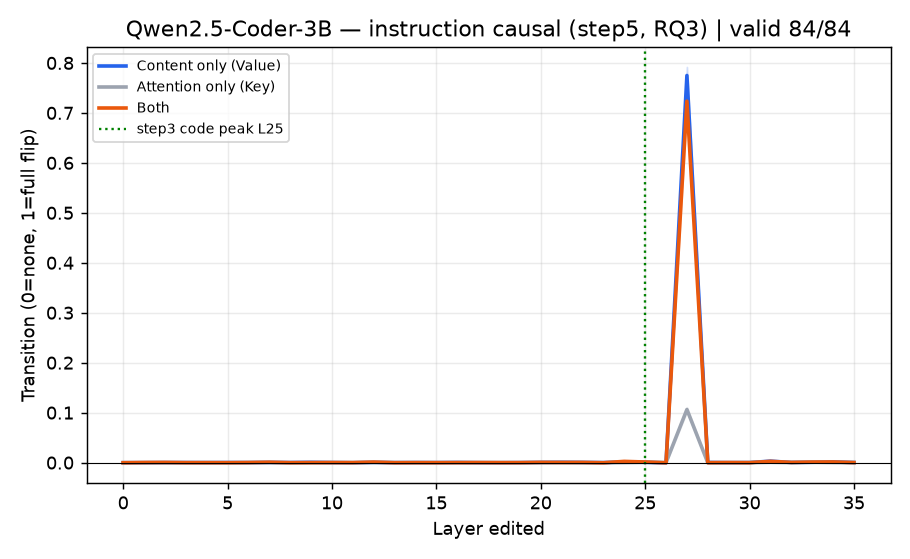
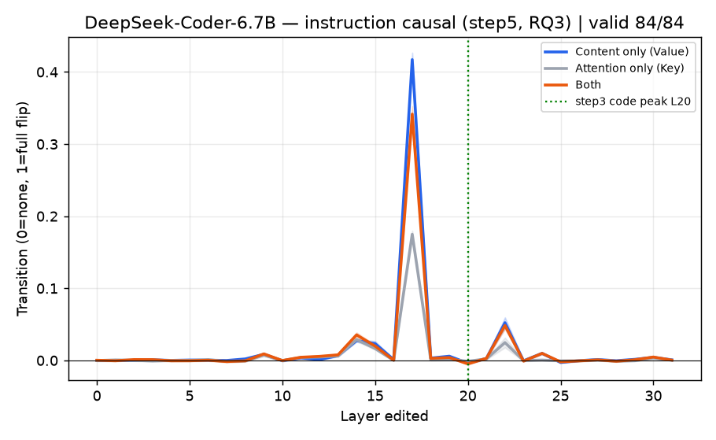
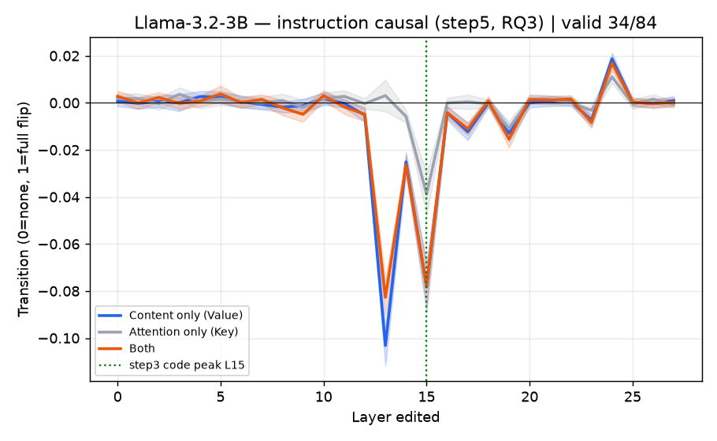
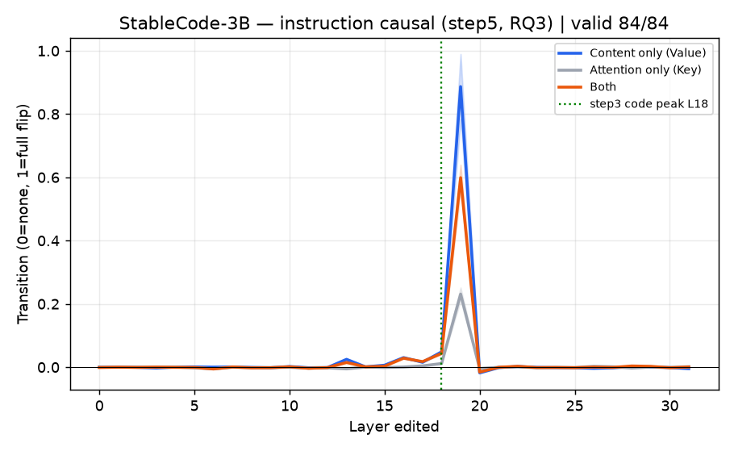

# step5 — 지침 신호 인과 결과 (RQ3, 인과 확정)

> ---
> ### ⚠️ 이 문서는 **재집계 전** 기록이다
> 아래 수치·해석 중 일부는 이후 재집계로 정정됐다(재실험 없이 같은 결과 파일을 다시 센 것).
> **먼저 읽을 것: [`결과_재집계.md`](결과_재집계.md)**
> 정정된 항목은 본문에 `[정정]`으로 표시했다. 원문은 기록으로 남긴다(§6).
> ---

> **스텝:** step5 (지침 인과) · **RQ:** RQ3 (인과) · **브랜치:** `step5/instr-cause`
> **무엇을 했나:** 지침의 지시어 단어(규칙문의 `camelCase`)의 속(KV)을 **반대 지침(`snake_case`)**으로
> 바꿔치기해, 행동이 **반대 지침 쪽으로 넘어가는지**를 **어텐션만 / 내용만 / 둘다**로 나눠 전 층 스윕으로 측정.
> step4(관측)가 "지침을 보긴 본다"까지였다면, 여기서 **"지침도 내용(Value) 통로냐, 어느 층이냐"를 인과로** 가른다.
>
> **코드·방법론 심층 해설:** [`코드와_방법론.md`](코드와_방법론.md) — 어디서 K·V를 뽑아 어떻게 치환하는지,
> 트랜스포머 개념(Query/Key/Value·head·GQA·FFN·KV 캐시·RoPE)과 코드 흐름을 함수 단위로 정리.

- 모델 4개 × 묶음 42개 × 지침 방향 2종(camel/snake) = **파일 336개**(모델당 84개), 시드 42, 평균 덮어쓰기.
- **텍스트는 안 바꾼다.** "camelCase 써라" 글자는 그대로 두고 **그 지시어 단어의 KV만** 반대 지침 것으로 갈아끼운다.
- **바꾸는 건 규칙문 지시어 첫 등장 하나**(후보열거의 같은 단어는 안 건드림 — step4에서 나눈 그 규칙문).
- **모든 곡선은 42묶음 평균 ± 95% 신뢰구간.** 깨끗−base 차 < 1.0(지침 레버 약함)인 묶음은 **판정불가로 분리.**

---

## 1. 무엇을·어떻게 재는지

- **넘어감(전이율) = (S_개입 − S_base) / (S_반대지침 − S_base).** 0 = 안 넘어감, 1 = 반대 지침만큼 완전히 넘어감.
- **S = logP(지침 목표 표기 이름) − logP(반대 표기 이름)** (step3과 같은 후보 채점, 생성 안 함).
  `[정정]` 예전 서술은 "logP(camel) − logP(snake)"였는데, **snake 목표 조건에서 부호가 뒤집힌다.**
  step5는 두 방향을 함께 평균하므로 이 정의로 계산해야 재현된다
  (실데이터: snake 조건 168개 중 148개가 `S_base > 0` — 목표 표기 선호가 맞다).
- 세 상태: base(조건 지침 그대로) / 반대지침(천장) / 개입(base인데 지시어 KV만 반대 것으로).
- 바꾸는 방식: 어텐션만(Key) / 내용만(Value) / 둘다. 층은 0~마지막 전부.

> step3(코드)은 위반→깨끗 **되돌림**, step5(지침)는 base→반대지침 **넘어감**. 방향만 다르고 공식 같음.

---

## 2. 결과 그래프

가로축 = 개입한 층, 세로축 = 넘어감. 음영 = 95% 신뢰구간. **초록 점선 = step3의 코드 봉우리 층**(층 비교용).

> **파랑 = 내용만(Value)**, 회색 = 어텐션만(Key), 주황 = 둘다.

- **코드전용 3모델(qwen·deepseek·stable):** 특정 후반 층에서 **내용만(파랑)이 크게 솟고**, 어텐션만(회색)은 바닥.
  **둘다(주황) ≈ 내용만** — 어텐션 얹어도 안 늘어남.
- **llama(범용):** 넘어감이 사실상 0(봉우리 없음). 게다가 **84 중 50개가 판정불가**(지침 레버 약함).

### 2-1. 봉우리 층·통계 (봉우리 층 기준, ±95% 신뢰구간)

| 모델 | 봉우리 층 | 내용만(Value) | 어텐션만(Key) | 내용−어텐션 | 유효/판정불가 |
|---|---|---|---|---|---|
| Qwen2.5-Coder-3B | L27 | 0.77±0.02 | 0.11±0.00 | **+0.67±0.01** | 84/0 |
| DeepSeek-Coder-6.7B | L17 | 0.42±0.01 | 0.17±0.00 | **+0.24±0.01** | 84/0 |
| StableCode-3B | L19 | 0.89±0.10 | 0.23±0.02 | **+0.66±0.09** | 84/0 |
| Llama-3.2-3B | (L24) | 0.02±0.00 | 0.01±0.00 | +0.01 | **34/50** |

- **내용−어텐션이 코드전용 3모델 모두 크게 +**(+0.24~+0.67), 신뢰구간이 0을 한참 넘음 → **내용이 어텐션보다 압도적으로 더 넘긴다.** step3보다 **훨씬 깨끗**(지시어 단어 1개만 바꿔 어텐션 왜곡이 작음).
- **llama는 넘어감 ≈ 0 + 판정불가 다수** → 지침 인과 **판정 불가**.

### 2-2. step3(코드) vs step5(지침) 봉우리 층 비교

| 모델 | step3 코드 봉우리 | step5 지침 봉우리 | 차이 |
|---|---|---|---|
| Qwen | L25 | L27 | 2 |
| DeepSeek | L20 | L17 | 3 |
| StableCode | L18 | L19 | 1 |
| Llama | L15 | (판정불가) | — |

→ ~~**코드와 지침의 인과 층이 1~3층 차이로 거의 겹친다**~~
  `[정정]` **이 비교는 성립하지 않는다.** step3는 `positive/camel/weak` **한 방향만**(504개 전부),
  step5는 camel+snake **양방향 평균**이다. 조건 집합이 다른 두 봉우리를 맞댄 것이다.
  대신 **step4(관측)와 step5(인과)의 층 일치**는 성립한다 — 토큰당 정규화 후 판정 가능한 3모델 전부
  (Qwen L27=L27, StableCode L19=L19, DeepSeek L17=L17). `docs/step4/결과_재집계.md` 참조.

---

## 3. 해석

**확정된 것:**

1. **지침도 내용(Value) 통로다.** 지시어 단어의 Value만 반대 것으로 바꾸면 행동이 반대 지침 쪽으로 넘어가고
   (코드전용 0.42~0.89), **어텐션만 바꾸면 거의 안 넘어간다**(0.11~0.23). **둘다 ≈ 내용만** → 내용이 충분, 어텐션 잉여.
   step3(코드)과 **같은 결론**, 그리고 여기선 **value≫key가 훨씬 뚜렷**하다.
2. **코드 층 ≈ 지침 층.** step5 봉우리가 step3 봉우리와 **1~3층 차이**로 겹친다(같은 후반 층 영역).
3. **범용 모델(llama)은 지침 레버가 약해 판정불가.** step4에서 llama만 지시어를 코드만큼만 봤던 것과 일관 —
   지침이 행동을 거의 안 흔들어(판정불가 50/84), 인과를 물을 대상이 못 된다. **결과 그대로 기록.**

**이것이 뜻하는 것 (논문 펀치라인):**

- step2·3(코드 = Value/후반층) + step4·5(지침 = Value/같은 후반층)가 합쳐져 →
  **"코드도 지침도 문제·손잡이가 어텐션이 아니라 내용(Value), 후반 특정 층에 있다"** 가 인과로 완성.
- 따라서 **어텐션을 키우는 접근(Spotlight)은 겨눈 부품이 틀렸다** — 지침 어텐션은 이미 충분하고(step4),
  어텐션을 바꿔도 행동이 안 넘어간다(step5의 key≈0). **고쳐야 할 곳은 그 후반 층의 Value.**

**앞서 나온 "층 어긋남" 가설 판정:**
- "코드 작동 층 ≠ 지침 작동 층이라 지침이 코드를 못 덮는 것 아니냐"는 가설 → **반박.**
- 두 인과 층이 **거의 같다**(1~3층). 지침이 안 먹히는 건 층이 어긋나서가 아니라, **같은 층에서 지침 Value의
  힘이 (코드 대비, 또는 절대적으로) 약하기 때문**으로 봐야 한다. (llama처럼 아예 레버가 없는 경우는 별개.)

**정직하게 남는 한계:**
- 넘어감이 **부분적**(deepseek 0.42 등) — 한 층만 고쳐선 완전히 안 넘어감(§step3과 같은 성격 + 후보열거 잔여 신호).
- **llama는 판정 자체가 불가** — RQ3 결론은 **코드전용 3모델에 한정.** 범용 모델 일반화는 미해결(한계로 명시).
- stable은 신뢰구간이 상대적으로 넓다(±0.10) — 봉우리 크기는 묶음별 편차가 있음.

---

## 4. 다음 단계

- **step1 (준수율 절벽):** RQ1 전제(문맥 위반이 준수율을 떨어뜨림) 확정.
- **step6 (처방, CAA):** 여기서 특정한 **후반 층의 Value**에 표기 조향 벡터를 더해 실제 준수율을 올리고,
  **어텐션 증폭(Spotlight)보다 낫다**를 보인다. step5가 "고칠 곳 = 지침 Value/그 층"을 인과로 지목했으므로 처방의 근거.

> 결과물(`results/`)은 불변. 수치·그래프는 위 336개 JSON에서 재생성 가능(`docs/step5/figures/`).
