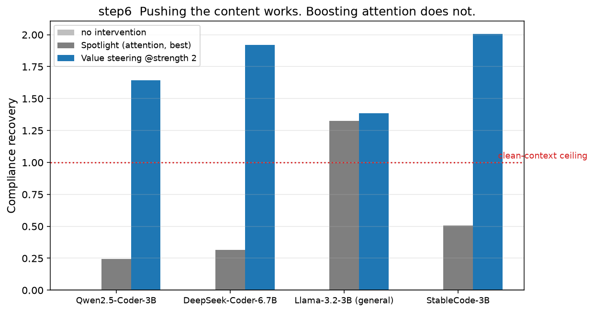
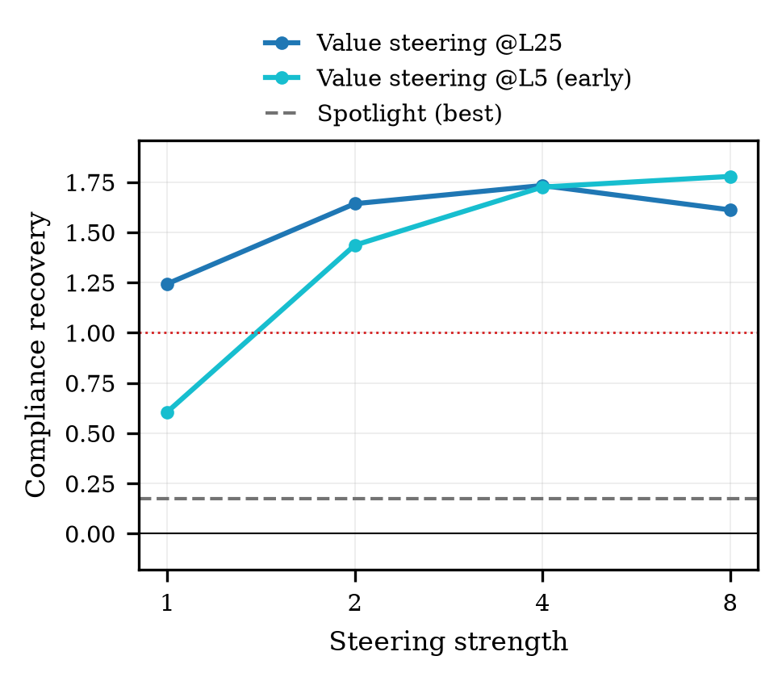
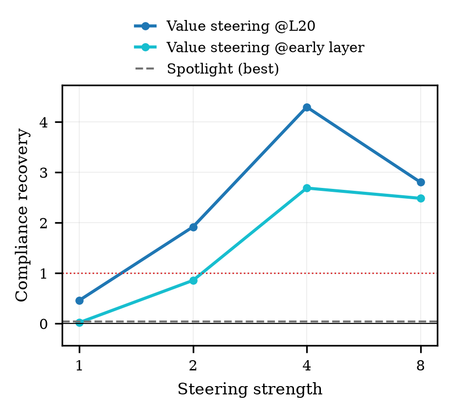
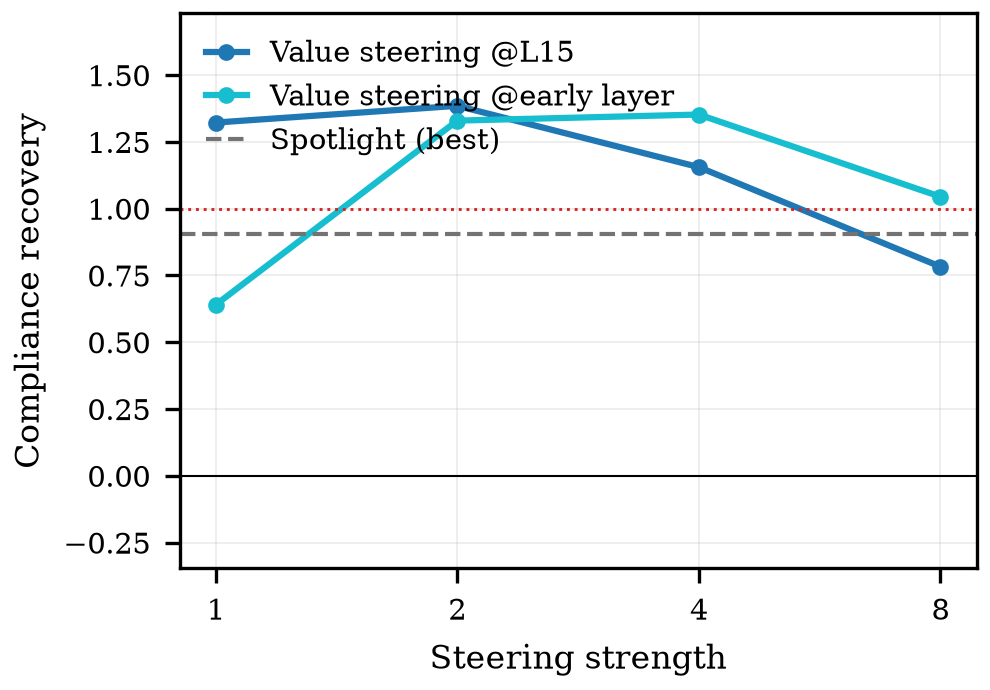
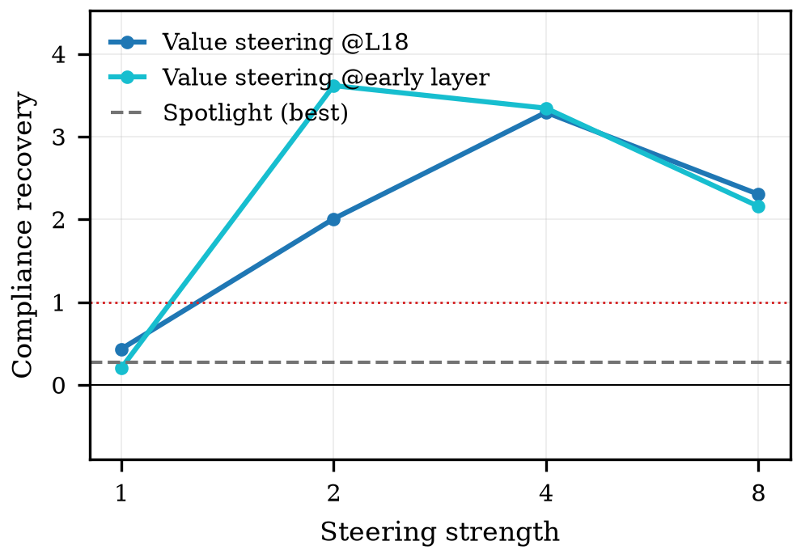
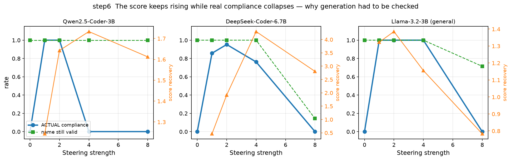
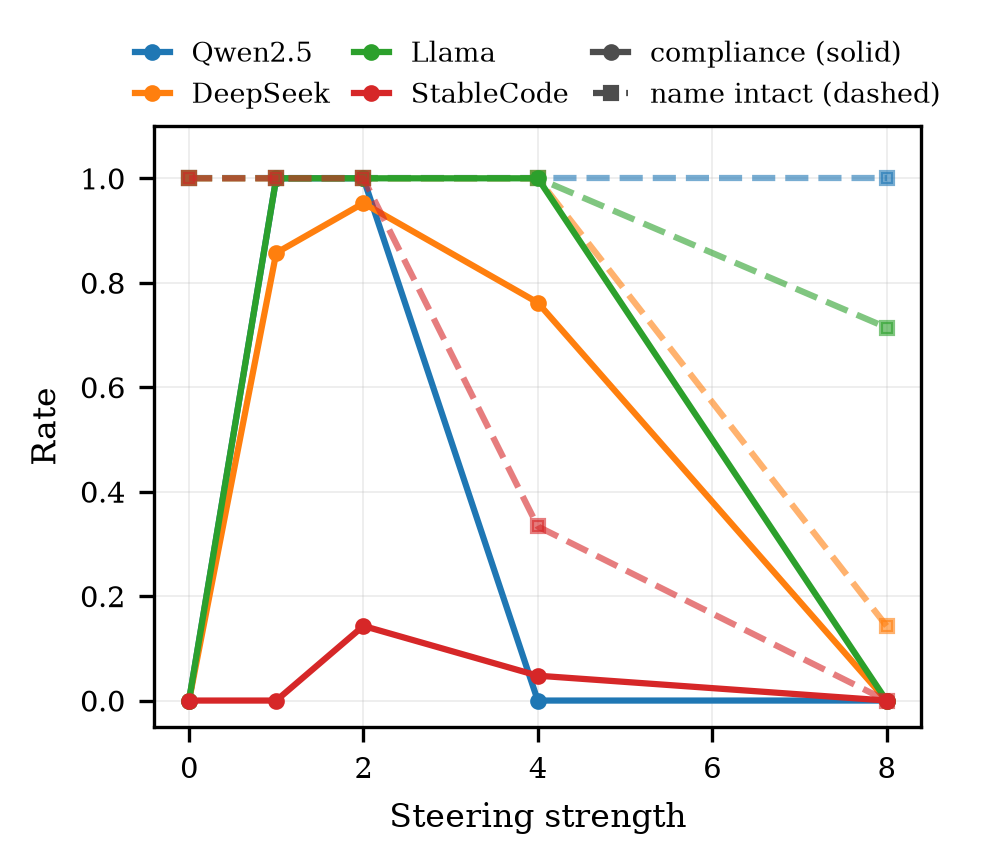

# step6 결과 — 처방: 값 조향 vs Spotlight

> **스텝:** step6(처방) · **결과:** `results/step6_steer/` 2184개 · `step6_steer-generate/` 420개 ·
> `step6_steer-crosslayer/` 336개
> **재현:** `python scripts/step6_summary.py --figs docs/step6/figures`

---

## 1. 결과 JSON 읽는 법

> 이 스텝의 결과는 **폴더가 셋**이다.
> `results/step6_steer/`(점수 회복, 2184개) · `step6_steer-generate/`(실제 생성 검증, 420개) ·
> `step6_steer-crosslayer/`(층 교차 주입, 336개).
> 공통 뼈대(`step`·`rq`·`condition`·`meta`)는 [`../코드_하네스공통.md`](../코드_하네스공통.md) §5~6,
> 이 값을 만드는 코드는 [`code.md`](code.md) §7.

### 1-1. 먼저 — 각 필드가 무엇을 말하는가

**S와 회복률** — 자는 step3·step5와 같다.

프롬프트 끝에 `"def "`를 붙여 **이름 자리**를 만들고, 그 자리에 올 후보 두 개
(`removeDuplicates` ↔ `remove_duplicates`)의 로그확률을 재서 뺀다.

> **S = logP(준수 표기 후보) − logP(위반 표기 후보)**  (단위: nat, 양수 = 준수 선호)

| 필드 | 어떤 상태의 점수인가 |
|---|---|
| `S_base` | **절벽 바닥** — 지침은 camel인데 앞 코드 12개가 전부 snake. 개입 없음 |
| `S_clean` | 앞 코드가 **전부 준수**인 상태. 문맥 오염이 없을 때의 **천장** |
| `S_int` | 절벽 바닥에 **처방을 건 채로** 잰 점수 |

metrics 최상위의 `compliance_preference`에는 `S_int`가 그대로 한 번 더 들어간다(같은 값).

> **`recovery` = (S_int − S_base) / (S_clean − S_base)** — 0 = 바닥 그대로, 1 = 천장 복귀,
> **>1 = 천장을 지나쳤다.** 이 스텝에서 1을 넘는 값이 흔한데, **되살아난 것이 아니라
> 지나친 것**이다(→ §4-3). `gap`·`undecidable`·`undecidable_gap_min`의 뜻은 step3·5와 같다
> (분모 크기 \|S_clean − S_base\|, 1.0 미만이면 판정 불가). step6은 **판정 불가 0개**.

**처방 두 가지가 각각 무엇인가**

| 값 | 무엇을 하는 처방인가 |
|---|---|
| `method: "value_add"` | **값 조향(우리 것).** 지정한 층의 잔차에 `strength × (camel−snake 방향)`을 더한다 |
| `method: "attn_amplify"` | **Spotlight(기존 접근 재구현).** 전 층·전 헤드에서 지침 스팬의 어텐션 비중을 `psi_target`까지 끌어올린다 |
| `method: "none"` | 무개입 — 하한선 |

> `method`는 **조건에 적힌 이름**이고, `kind`는 **실행 코드가 쓴 이름**이다
> (`attn_amplify` ↔ `kind: "spotlight"`). 값이 다를 뿐 같은 것을 가리킨다.

**공통 extra**

| 필드 | 무슨 값인가 |
|---|---|
| `mode` | `"steer"`(점수) / `"steer_generate"`(실제 생성) |
| `n_compliant` | 앞 코드 12개 중 준수한 개수. step6은 **전부 0**(절벽 바닥) |
| `target` | 지침이 요구한 표기(`"camel"`) |
| `tag` | 실행 묶음 라벨(`"cliff"`) |
| `layer` | **처방을 주입한 층.** Spotlight는 전 층에 걸리므로 `null` |

**값 조향(`value_add`)에만 있는 필드**

| 필드 | 무슨 값인가 |
|---|---|
| `strength` | 방향을 몇 배로 더했나(1·2·4·8). **세기가 셀수록 좋은 게 아니다** — §4-3 |
| `steer_source` | 방향을 무엇으로 만들었나. `"code_contrast"` = 코드 이름 자리의 camel 잔차 평균 − snake 잔차 평균 |
| `steer_vector` | 그 방향의 이력 — `n_samples`(쓴 표본 수) · `n_skipped`(이름 자리를 못 찾아 버린 수) · `vec_norm`(방향 벡터의 길이) · `layer`(뽑은 층). **무엇으로 만든 방향인지 파일만 보고 알 수 있게** 남긴다 |
| `hook_calls` | 잔차에 더하는 훅이 실제로 불린 횟수. **0이면 처방이 안 걸린 것** |
| `steer_from_layer` · `steer_layer` | **방향을 뽑은 층**(교차 주입 폴더에만 있다). `layer`와 같으면 "맞는 층 → 맞는 층", 다르면 **엉뚱한 층에 주입**한 조건(→ §3-4) |

**Spotlight(`attn_amplify`)에만 있는 필드**

| 필드 | 무슨 값인가 |
|---|---|
| `psi_target` | 지침 스팬이 차지하게 만들 **목표 어텐션 비중** ψ(0.1 · 0.3) |
| `span` | 어디를 밀어 올렸나. `"rule_word"`(규칙문 지시어만 — step5에서 값을 바꾼 자리와 정확히 같다) / `"instruction"`(지침 문장 전체 — 원 논문 정의) |
| `n_span_tokens` | 그 스팬의 토큰 수 |
| `attn_span_before` | **개입 전** 그 스팬의 어텐션 비중(이름을 쓰는 마지막 query 행 기준) |
| `attn_span_after` | **개입 후** 비중. 목표 ψ에 정확히 도달하지 않는 것은 원문 식(5)의 언더슛으로 **정상** |
| `attn_calls` | 갈아끼운 어텐션 함수가 불린 횟수. **0이면 예외로 죽는다** — 즉 저장된 파일은 전부 실제로 걸렸다는 뜻이고, 이것이 "구현 실패로 진 것 아니냐"는 반박을 막는 기록이다(→ §3-2) |

**생성 검증(`step6_steer-generate`)에만 있는 필드**

| 필드 | 무슨 값인가 |
|---|---|
| `compliance_rate`(metrics 최상위) | 생성된 이름이 목표 표기면 1.0 |
| `generated_text` | 조향을 건 채로 실제 생성한 원문 |
| `name` | 거기서 뽑아낸 함수 이름 |
| `notation` | 그 이름의 표기 판정(`camel`/`snake`/**`other`**). `RemoveDuplicates`(PascalCase)는 `other`다 |
| `compliant` | `notation == target` |
| `name_ok` | **이름이 멀쩡한가** — 식별자 형식 · 길이 2~40 · 같은 조각 반복 없음(`removeDuplicatesDuplicates`)을 모두 통과했나 |
| `name_reason` | 안 멀쩡하면 어디서 걸렸는지 |
| `name_length` | 이름 길이 |

### 1-2. 실제 파일 모양

**점수 회복 (`step6_steer`)**

```jsonc
"extra": {
  "mode": "steer", "method": "attn_amplify",     // none | value_add | attn_amplify
  "span": "rule_word", "psi_target": 0.1,        // Spotlight 전용
  "strength": null, "steer_source": null,        // 값 조향 전용
  "layer": null, "kind": "spotlight",
  "S_clean": 3.929, "S_base": -1.556, "S_int": -3.327,
  "recovery": -0.323,                            // ← 헤드라인
  "gap": 5.485, "undecidable": false,
  "attn_span_before": 0.00080,                   // ★ 개입이 실제로 걸렸는지
  "attn_span_after":  0.09053,
  "attn_calls": 64,                              // 0이면 예외였다
  "n_span_tokens": 3,
  "n_compliant": 0, "target": "camel", "tag": "cliff"
}
```

값 조향이면 `"method": "value_add"`, `"strength": 2`, `"layer": 25`,
`"hook_calls": …`, `"steer_vector": {"n_samples": 8, "n_skipped": 0, "vec_norm": …}`.

**생성 검증 (`step6_steer-generate`)**

```jsonc
"metrics": {
  "compliance_rate": 0.0,
  "extra": {
    "mode": "steer_generate", "method": "value_add", "strength": 4, "layer": 25,
    "generated_text": "def RemoveDuplicates(items):\n    …",
    "name": "RemoveDuplicates",
    "notation": "other",          // ← camel이 아니다!
    "compliant": false,
    "name_ok": true, "name_reason": "", "name_length": 16
  }
}
```

### 1-3. 읽는 순서

1. `method`(와 `strength` / `psi_target`)로 **어떤 처방의 어떤 세기**인지 확인한다.
2. **개입이 실제로 걸렸는지 먼저 본다** — Spotlight는 `attn_calls`·`attn_span_before/after`,
   값 조향은 `hook_calls`. 이 기록이 없으면 "효과 없음"과 "실험 안 됨"을 구분할 수 없다.
3. `recovery`를 본다. **단, 이 값만으로 처방의 성공을 말하지 않는다.**
4. **반드시 `step6_steer-generate`의 `compliant`·`notation`·`name_ok`와 함께 본다.**
   점수가 가장 높은 세기에서 실제 준수율이 0인 구간이 있다(→ §4-3). 점수는 위가 막혀
   있지 않아 세게 밀수록 계속 오르지만, 그 지점에서 모델은 이미 `RemoveDuplicates`처럼
   다른 표기로 넘어가 있다.
5. 집계: `python scripts/step6_summary.py --figs docs/step6/figures`

---

## 2. 무엇을 어떻게 쟀나

출발점은 **절벽 바닥** — 지침은 camelCase인데 앞 코드 12개가 전부 snake다(step1에서 준수율 0).
여기에 세 가지를 걸고 되살아나는 정도를 잰다.

| 방법 | 무엇을 하나 |
|---|---|
| **값 조향** | 그 층 잔차에 `세기 × (camel−snake 방향)` 더하기 [CAA·ITI] |
| **Spotlight** | 전 층·전 헤드에서 지침 스팬의 어텐션 비중을 ψ까지 끌어올림 |
| 무개입 | 하한선 |

- **준수 회복** = `(S_개입 − S_기준)/(S_깨끗 − S_기준)`. 1 = 문맥이 깨끗한 상태.
- 조향 방향은 **모델마다 자체 유도**한다(camel 이름 자리의 잔차 평균 − snake 자리 평균).
- Spotlight 스팬은 **두 종류**로 돌린다: 규칙문 지시어만 / 지침 문장 전체(원 논문 정의).
- 4모델 × 42묶음 × 13조건 = 2184개. 시드 42.
- **보조 측정:** 조향을 건 채로 실제 이름을 생성해 표기와 건전성을 본다(21묶음).

---

## 3. 결과

### 3-0. 그림이 네 묶음이다 — 어느 그림이 무엇인가

**두 종류의 실험이 섞여 있다는 것이 이 스텝 그림의 열쇠다.**

| 그림 묶음 | 몇 장 | 무엇으로 잰 값인가 | 세로축 | 왜 있나 |
|---|---|---|---|---|
| `explain_headline` | 1 (4모델) | **점수**(`steer`) | 회복률 | **이해용.** 값 조향 vs Spotlight 한 장 |
| `strength_<모델>` | 4 | **점수**(`steer`) | 회복률 | **논문용.** 세기·층별 |
| `explain_score_vs_real` | 1 (3모델) | **점수 + 실제 생성** 둘 다 | 좌: 비율 · 우: 회복률 | **이해용.** 둘이 어긋난다 |
| `name_health` | 1 (4모델) | **실제 생성**(`steer_generate`) | 비율 | **논문용.** 준수율 + 이름 건전성 |

> ⚠️ **`회복률`과 `준수율`은 다른 자다. 섞어 읽으면 결론이 정반대가 된다.**
>
> | | 무엇 | 범위 | 어디서 |
> |---|---|---|---|
> | **회복률**(score recovery) | 두 후보 이름의 **로그확률 차이**가 바닥에서 천장 쪽으로 간 정도 | **1을 넘을 수 있다** | `step6_steer/` |
> | **준수율**(compliance) | 실제로 **생성된 이름**이 지침 표기였던 비율 | 0~1 | `step6_steer-generate/` |
>
> 이 스텝의 결론은 **둘이 어긋난다**는 것이다 — 세기 4에서 회복률은 최고, 준수율은 0.

---

### 3-1. 처방 비교 (준수 회복)

### 한눈에 보기 (이해용) — `explain_headline`

| 항목 | 이 그림에서 |
|---|---|
| **무엇을 재나** | 절벽 바닥에서 **값 조향**과 **Spotlight** 중 무엇이 점수를 되살리나 |
| **가로축** | 모델 4개 |
| **세로축** | **회복률** — 0 = 바닥 그대로, 1 = 깨끗한 문맥 수준, **1 초과 = 지나침** |
| **연회색 막대** `no intervention` | 무개입 = 정확히 0이라 **막대가 안 보인다**(하한선) |
| **진회색 막대** `Spotlight (attention, best)` | Spotlight 전체에서 **가장 높게 나온 값 하나** (아래 ⚠️) |
| **파란 막대** `Value steering @strength 2` | 값 조향, 세기 2, **맞는 층**(step3 봉우리). 42묶음 **평균** |
| **빨간 점선** `clean-context ceiling` | 회복률 1.0 = 깨끗한 문맥 수준 |
| **결과** | 파랑이 네 모델 모두 1.0을 넘고, 회색은 0.24~0.51 (Llama만 1.33으로 예외) |
| **뜻** | **값을 밀면 되고 어텐션을 키우면 안 된다.** 단 범용 모델(Llama)에서는 Spotlight도 작동한다 |

> ⚠️ **두 막대의 통계가 다르다 — 그래서 아래 표의 숫자와 회색 막대가 안 맞는다.**
> 파랑은 **42묶음 평균**이고, 회색은 `max(...)`로 뽑은 **개별 실행 최대값 하나**다
> (`make_explain_figures.py:217`). Spotlight를 유리하게 봐준 것이라 **우리 주장에는
> 보수적**이지만, 두 막대를 같은 자로 잰 값으로 읽으면 안 된다.
>
> | 모델 | 회색 막대(개별 최대) | 아래 표의 조건별 평균 최대 |
> |---|---|---|
> | Qwen | 0.244 | 0.175 |
> | DeepSeek | 0.316 | 0.040 |
> | Llama | 1.325 | 0.904 |
> | StableCode | 0.507 | 0.274 |
>
> **논문에 인용할 값은 아래 표(조건별 평균)** 이고, 이 그림은 이해용이다.



### 논문용 그림 — `strength_<모델>` 4장

| 항목 | 이 그림에서 |
|---|---|
| **무엇을 재나** | 조향을 **얼마나 세게**, **어느 층에** 걸어야 하나 |
| **가로축** | **조향 세기** α (1·2·4·8). 눈금 간격이 균등하지만 값은 2배씩 뛴다 |
| **세로축** | 회복률 (위와 같은 자) |
| **진한 파란 선** `Value steering @L25` | **맞는 층**(step3에서 찾은 봉우리 층)에 주입 |
| **하늘색 선** `Value steering @early layer` | **엉뚱한 층**(초반)에 주입 — 대조 |
| **회색 파선** `Spotlight (best)` | Spotlight 최고값. 세기 축이 없어 **수평선**이다 |
| **빨간 점선** | 회복률 1.0 |
| **읽는 법** | 파랑이 회색 위인가(처방이 이기나) · **두 파란 선이 갈리나**(층이 중요한가) |
| **결과** | 파랑이 회색을 크게 넘는다. **그런데 두 파란 선이 세기 4~8에서 만난다** |
| **뜻** | 값을 미는 것은 통한다. **그러나 "맞는 층"이라는 우리 주장은 이 그림에서 지지되지 않는다**(→ §3-4·§4) |

**조향 세기별 회복 — 층별 대조 포함**

| Qwen2.5-Coder-3B | DeepSeek-Coder-6.7B |
|---|---|
|  |  |
| **Llama-3.2-3B (범용 — Spotlight도 작동)** | **StableCode-3B** |
|  |  |

| 방법 | Qwen | DeepSeek | Llama | StableCode |
|---|---|---|---|---|
| 무개입 | 0.000 | 0.000 | 0.000 | 0.000 |
| 값 조향 세기1 | **1.243** | 0.462 | **1.322** | 0.433 |
| 값 조향 세기2 | **1.643** | **1.920** | **1.385** | 2.006 |
| 값 조향 세기4 | 1.733 | 4.298 | 1.156 | 3.293 |
| 값 조향 세기8 | 1.612 | 2.805 | 0.783 | 2.303 |
| Spotlight 지시어 ψ0.1 | 0.002 | −0.366 | 0.424 | −0.232 |
| Spotlight 지시어 ψ0.3 | −0.125 | −0.051 | **0.904** | 0.274 |
| Spotlight 지침전체 ψ0.1 | 0.027 | 0.040 | 0.170 | 0.033 |
| Spotlight 지침전체 ψ0.3 | 0.175 | −0.174 | 0.077 | 0.038 |

판정 불가 0개(4모델 전부).

### 3-2. Spotlight는 실제로 걸렸다

"구현을 못해서 진 것"이라는 반박을 막기 위해 개입 전·후 어텐션 비중을 기록했다.

| 모델 | 조건 | 개입 전 | 개입 후 |
|---|---|---|---|
| Qwen | 지시어 ψ0.3 | 0.002 | **0.231** |
| DeepSeek | 지시어 ψ0.3 | 0.001 | **0.230** |
| Llama | 지시어 ψ0.3 | 0.001 | **0.231** |
| StableCode | 지시어 ψ0.3 | 0.002 | **0.231** |

**16개 조건 전부 비중이 올랐다.** 지시어 스팬은 100배 이상 올랐다(0.002 → 0.23).
목표치에 정확히 도달하지 않는 것은 원문 식(5)의 언더슛으로 정상이다.

### 3-3. 실제로 생성된 이름 — 점수와 어긋난다

| 모델 | 세기 | 준수율 | 멀쩡한 이름 | 나온 이름 예시 |
|---|---|---|---|---|
| **Qwen** | 0 | 0.000 | 1.000 | `remove_duplicates` |
| | **1** | **1.000** | 1.000 | `removeDuplicates` |
| | **2** | **1.000** | 1.000 | `removeDuplicates` |
| | 4 | **0.000** | 1.000 | `RemoveDuplicates` ← 대문자 시작 |
| | 8 | 0.000 | 1.000 | `RemoveDuplicates` |
| **DeepSeek** | **1** | **0.857** | 1.000 | `removeDuplicates` |
| | **2** | **0.952** | 1.000 | `removeDuplicates` |
| | 4 | 0.762 | 1.000 | `removeDuplicates` / `udpate` |
| | 8 | 0.000 | **0.143** | 이름 없음 |
| **Llama** | **1~4** | **1.000** | 1.000 | `removeDuplicates` |
| | 8 | 0.000 | 0.714 | 이름 없음 |
| **StableCode** | 0~8 | ≤ 0.143 | 0.000~1.000 | `xt_remove_duplicates`, `ize`, 없음 |

### 한눈에 보기 (이해용) — `explain_score_vs_real`

| 항목 | 이 그림에서 |
|---|---|
| **무엇을 재나** | **같은 조건에서 점수와 실제 생성이 어긋나는가.** 이 스텝의 핵심 발견 |
| **가로축** | 조향 세기 (0·1·2·4·8) |
| **왼쪽 세로축** `rate` | 0~1 비율 — 파란 선과 초록 선이 쓴다 |
| **오른쪽 세로축** `score recovery` (주황) | **회복률. 눈금이 모델마다 다르다** — 높이를 모델끼리 비교하면 안 된다 |
| **파란 실선** `ACTUAL compliance` | **실제로 생성된 이름**의 준수율 ← 진짜 성적표 |
| **초록 파선** `name still valid` | 이름이 **깨지지 않았나**(식별자 형식·길이 2~40·같은 조각 반복 없음) |
| **주황 선** `preference-score recovery` | **점수** 회복률 (오른쪽 축) |
| **판이 3개인 이유** | StableCode는 준수율이 처음부터 ≤0.14라 대비가 안 보여 뺐다 |
| **읽는 법** | **파랑과 주황이 같은 방향으로 움직이나**를 본다 |
| **결과** | 세기 4에서 **주황은 최고인데 파랑은 0으로 무너진다**(Qwen) |
| **뜻** | **점수만 보면 처방이 성공한 것처럼 보이는 구간이 있다.** 그래서 생성을 따로 확인해야 한다 |



파랑(실제 준수율)이 세기 4에서 무너지는데 주황(선호 점수 회복)은 그때 최고다.
**점수만 보면 처방이 성공한 것처럼 보이는 구간이 있다.**

### 논문용 그림 — `name_health`

| 항목 | 이 그림에서 |
|---|---|
| **무엇을 재나** | 위 그림에서 **점수를 빼고**, 실제 생성만 4모델 한 장에 |
| **가로축** | 조향 세기 (0·1·2·4·8). **눈금이 실제 값 간격**이라 4와 8 사이가 넓다 |
| **세로축** | 비율 0~1 (한 자만 쓴다 — 오른쪽 축이 없다) |
| **실선** `compliance (solid)` | 실제 생성 이름의 **준수율** |
| **파선** `name intact (dashed)` | **이름이 안 깨진 비율** |
| **색** | Qwen(파랑) · DeepSeek(주황) · Llama(초록) · StableCode(빨강) |
| **읽는 법** | **실선과 파선이 벌어지는 곳**을 본다 — 벌어지면 "이름은 멀쩡한데 표기를 안 지킨" 것이다 |
| **결과** | 세기 1~2에서 실선이 천장(Qwen·Llama 1.00 · DeepSeek 0.95). **세기 4~8에서 무너진다.** Qwen은 세기 4에서 파선이 1.00인데 실선만 0 |
| **뜻** | 처방에는 **작동 구간이 있다**(세기 1~2). Qwen 세기 4의 실패는 이름이 깨져서가 아니라 `RemoveDuplicates`처럼 **camel도 snake도 아닌 표기**가 돼서다 |



### 3-4. 방향은 층을 가리지 않는다

맞는 층에서 뽑은 방향을 엉뚱한 층(초반)에 넣어 봤다.

| 모델 | 세기 | 맞는층→맞는층 | 엉뚱층→엉뚱층 | 맞는층→엉뚱층 |
|---|---|---|---|---|
| Qwen | 2 | 1.643 | 1.436 | **1.827** |
| DeepSeek | 4 | 4.298 | 2.690 | 2.475 |
| Llama | 2 | 1.385 | 1.330 | 1.251 |
| StableCode | 1 | 0.433 | 0.201 | **3.845** |

**어느 조합도 일관되게 우세하지 않다.** 교차 주입이 더 높은 경우도 많다.

---

## 4. 해석

**(1) 어텐션을 키우는 접근은 준수를 되살리지 못한다.**
Spotlight는 지시어 비중을 100배 이상 끌어올렸는데도 회복이 −0.37~0.27이다(Llama 제외).
**비중이 실제로 올랐음을 기록으로 보였으므로 "구현 실패"로 돌릴 수 없다.**
step4에서 모델이 이미 지침을 충분히 보고 있음을 관측했고, 여기서 더 보게 만들어도 소용없음을 확인했다.

**(2) 값을 밀면 준수가 되살아난다 — 단 적절한 세기에서.**
세기 1~2에서 Qwen 1.000, DeepSeek 0.952, Llama 1.000의 **실제 준수율**을 얻는다.
절벽 바닥(0.000)에서 출발했음을 감안하면 완전 회복이다.

**(3) 선호 점수는 준수율을 대변하지 않는다 — 이 스텝의 방법론적 발견.**
Qwen 세기4에서 회복률은 1.733로 가장 높은데 **실제 준수율은 0.000**이다.
나온 이름이 `RemoveDuplicates` — 대문자로 시작하는 PascalCase다.
camel 방향을 과하게 밀어 **첫 글자까지 대문자로 넘어간 것**이고, 우리 분류기는 이를 `other`로 센다.

> **점수 회복률만 보고 처방의 성공을 주장하면 안 된다.** 선호 점수는 위가 막혀 있지 않아
> 세게 밀수록 계속 오르지만, 그 지점에서 모델은 이미 다른 표기로 넘어가 있다.
> 회복률이 1을 넘는 구간은 **되살아난 것이 아니라 지나친 것**이다.

세기 8에서는 DeepSeek·Llama가 이름 자체를 못 만든다(멀쩡한 이름 0.14 / 0.71).

**(4) 방향은 층 특이적이지 않다.**
초반 층에 밀어도, 맞는 층 방향을 초반 층에 넣어도 비슷하게 작동한다.
잔차 스트림은 층을 타고 누적되므로 앞쪽에 더한 성분이 뒤까지 전달되는 것이 자연스럽다.
**step3의 "표기 정보가 특정 층에 국소화된다"는 관측 결과와 별개**이며, 처방 단계에서는
층 선택이 결정적이지 않다.

**(5) StableCode는 이 실험에서 처방이 성립하지 않는다.**
준수율이 어느 세기에서도 0.143을 넘지 않는다. 다만 **무개입에서도 `xt_remove_duplicates`처럼
접두사가 붙은 이름이 나온다.** 교사강제 접두 `"def "`와 이 모델 토크나이저의 조합에서
생성이 어긋나는 것으로 보인다 — 조향의 실패라기보다 **측정 장치의 문제**일 가능성이 크다.
이 모델의 생성 결과는 해석하지 않는다.

**(6) Llama에서는 Spotlight도 부분적으로 작동한다.**
지시어 ψ0.3에서 0.904로, 같은 모델의 값 조향(0.78~1.39)에 필적한다.
Llama는 step5에서 지침 개입이 판정 불가였던 모델이다.
**"어텐션 접근은 언제나 무익하다"가 아니라 "코드 특화 모델에서 무익하다"로 좁혀야 한다.**

---

## 5. 이 스텝이 다루지 않는 것

- **한 이름 한 쌍**에 대한 처방이다. `removeDuplicates` vs `remove_duplicates` 고정.
- **절벽 바닥 한 지점**에서만 잰다(위반 12/12). 중간 지점은 다루지 않는다.
- 조향 방향은 **step3와 같은 데이터**에서 유도했다. 독립 표본에서의 일반화는 확인하지 않았다.
- Spotlight의 자유도(전 쿼리 위치 적용·헤드별 독립 ψ)는 원문에 명시가 없어 우리가 정했다.
- StableCode의 생성 경로 이상(§4-5)은 원인을 규명하지 않았다.
- 세기 격자가 성기다(1·2·4·8). 최적점이 1과 2 사이일 수 있다.
