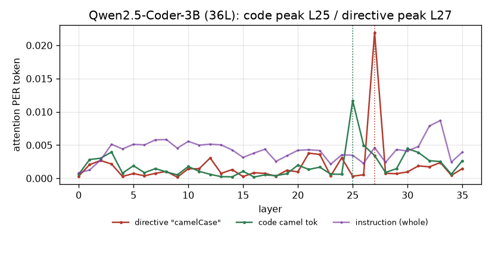
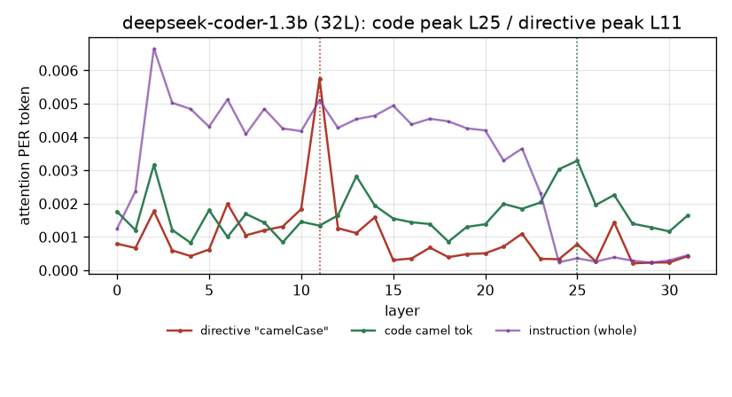
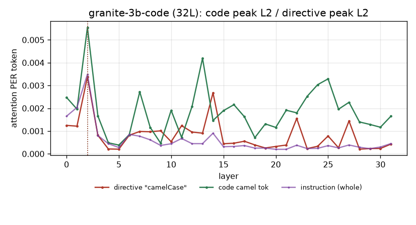
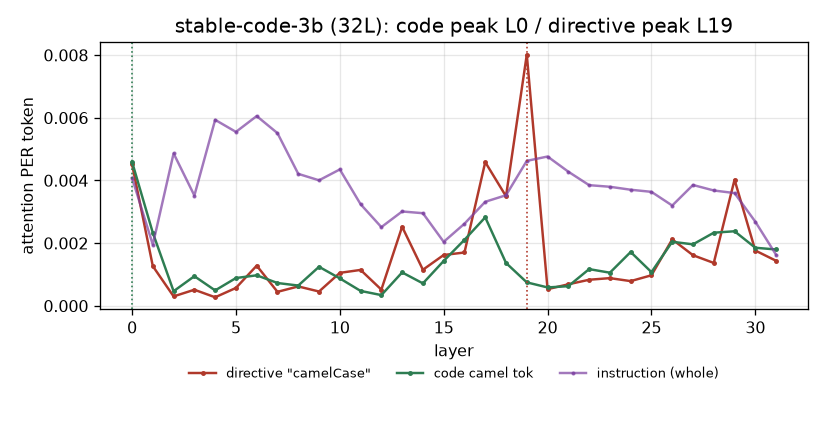
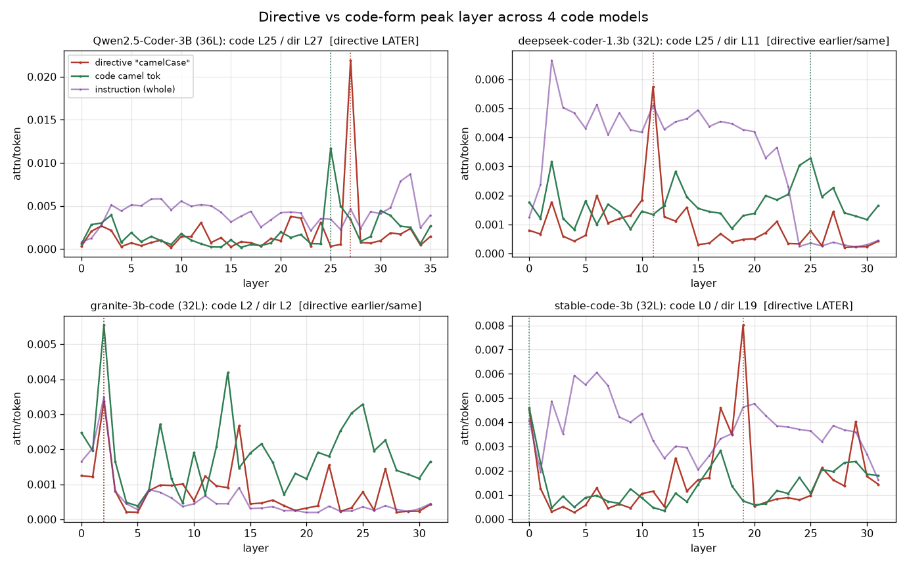

# step B — directive-token 모델 패밀리 (지시어 vs 코드 형태, 층 순서 일반화?)

**대응 RQ:** RQ3 관측(지침 쪽). Qwen에서 본 "지시어(camelCase)는 코드 형태(L25)보다 늦은 L27에서 피크"가 **다른 코드 모델에서도 재현되나**를 본다.

**설정.** 4개 코드 모델 · per-token 어텐션(=span 어텐션 합/토큰수) · 지침=camel·균형 6/6(View1). 각 모델 자기 층에서 피크 자동 탐색.

| 모델 | family | 층 | 관측 조건수 |
|---|---|---|---|
| Qwen2.5-Coder-3B | qwen | 36 | 10 |
| deepseek-coder-1.3b | deepseek | 32 | 20 |
| granite-3b-code | granite | 32 | 10 |
| stable-code-3b | stability | 32 | 10 |

---

## 1. 모델별 결과

### ① Qwen2.5-Coder-3B — **깨끗한 층 순서** ✅

코드 형태(초록) **L25** 급등 → 지시어(빨강) **L27** 급등(0.022, 최고). **코드 먼저, 지시어 2층 뒤.** 원래 발견 그대로.

### ② deepseek-coder-1.3b — **공동 급등(순서 없음)** ❌

코드와 지시어가 **L11에서 함께** 급등한다. 지시어가 코드 *뒤*가 아니라 **같은 층에서 동시에** 읽힌다(argmax는 코드 L25를 잡지만 그건 2차 봉우리, 주 급등은 L11 공동). 지침 전체(보라)는 초반에 높다 감소.

### ③ granite-3b-code — **초반 공동 급등, 지시어 늦은 봉우리 없음** ❌

코드·지시어가 **L2에서 함께** 튄다(초반, 어텐션 sink 영향 가능). 이후 코드(초록)는 중반(L10~25)에 활동이 있으나 **지시어는 뚜렷한 후반 봉우리가 없다.** Qwen식 "코드→지시어" 순서 아님.

### ④ stable-code-3b — **지시어 후반 급등(부분 재현)** ✅(부분)

지시어(빨강) **L19에서 강하게** 급등(0.008, 최고). 코드 argmax는 L0(첫 토큰 sink 아티팩트)라 순서 판정이 오염되지만, 실제 코드 활동은 중반이고 **지시어가 후반에 늦게** 튀는 건 Qwen과 결이 같다.

---

## 2. 4종 종합

| 모델 | 코드 피크 | 지시어 피크 | 지시어가 코드보다 늦나 |
|---|---|---|---|
| qwen | L25 (0.69) | **L27 (0.75)** | ✅ 늦음 (+2) |
| deepseek | L25* | L11 (0.34) | ❌ 동시(L11 공동 급등) |
| granite | L2* | L2 (0.06) | ❌ 초반 공동 |
| stability | L0* | **L19 (0.59)** | ✅ 늦음 (코드 sink 제외 시) |

(*초반/sink 아티팩트로 argmax 오염 — 곡선 형태로 판단)

---

## 3. 총 해석 (정직하게, §4)

### 재현 안 되는 것: "지시어가 코드보다 **늦다**"는 층 순서
- **Qwen만 깨끗**하고, stability가 부분적. **deepseek·granite는 코드와 지시어가 같은 층에서 동시** 급등.
- → **"코드가 먼저 굳고 지시어가 too late"라는 층 순서 가설은 Qwen 특유**에 가깝다. **일반 현상으로 팔면 안 된다.** (예상과 달라도 그대로 기록.)

### 재현 되는 것: 지시어는 **어느 모델에서든 뚜렷이 읽힌다** ✅
- 4개 모델 **전부** 지시어가 특정 층에서 **또렷한 급등**(코드와 비슷하거나 더 큼)을 보인다. **어디서도 "지침을 안 봄(미주목)"이 아니다.**
- → **Spotlight의 크기 전제("지침 어텐션 부족")는 4모델에서 모두 실패.** 이게 패밀리 일반화되는 핵심.

### 종합
> **패밀리 일반화되는 것 = "지침 지시어는 미주목이 아니다"(→ Spotlight 크기 증폭 무의미).**
> **패밀리 일반화 안 되는 것 = "코드→지시어 층 순서"(Qwen 특유).**

즉 방금까지 밀던 "**too late(층 순서)**" 스토리는 **한 모델 아티팩트 위험**이 커서, 논문에선 **"지침은 읽히지만 실패한다 → 문제는 어텐션 크기가 아니다"**(견고) 쪽을 주장하고, 층 순서는 **Qwen 사례로만** 조심스럽게 제시해야 한다.

### 다음 (→ step4)
어느 쪽이든 결국 **인과**가 답한다: 지침 지시어의 **Key/Value 치환(step4)**으로 "읽히는 지시어가 행동에 실제 기여하나"를 4모델에서 확인. 관측(어텐션)만으론 층 순서의 의미를 못 정한다.

---

## caveat (§4)
- **층 순서(코드→지시어)는 Qwen 특유** — deepseek/granite는 공동 급등. 일반화 주장 금지.
- granite/stability의 L0~L2 "피크"는 **어텐션 sink 아티팩트**일 수 있음(첫 토큰 쏠림). argmax보다 곡선 형태로 판단.
- deepseek는 블록 20(140조건), 나머지 10(70). 조건수 차이는 평균에 영향 적음.
- **견고한 결론은 "지시어 미주목 아님"뿐** — 층 순서는 모델 의존.
