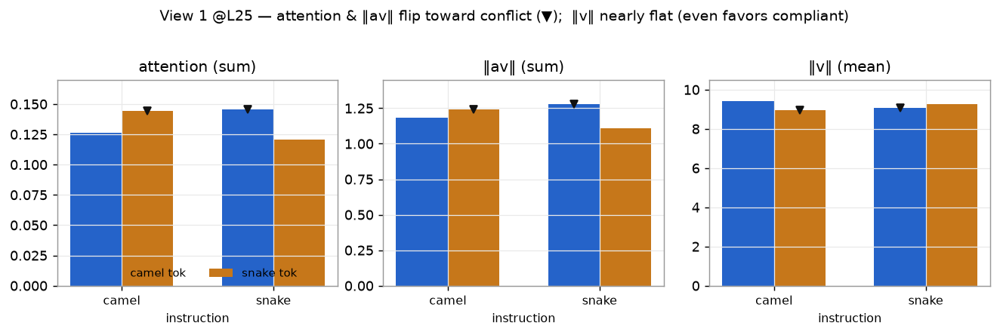
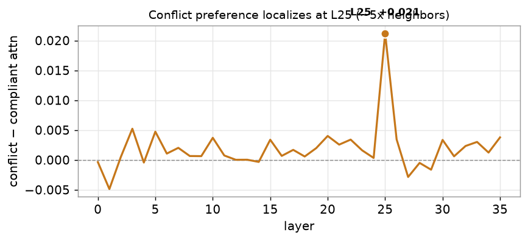
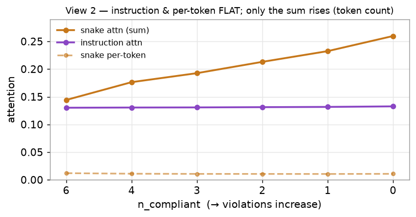

# step B 결과 — RQ2 관측 (A2 생성, 1차 실행)

**대응 RQ:** RQ2 — 준수 실패를 매개하는 신호가 코드의 **형태**인가, 어느 층에 있는가(관측). 인과는 step C.

**설정.** `Qwen/Qwen2.5-Coder-3B-Instruct` (fp16, 36층, GQA 16 Q / 2 KV / group 8, eager). 140 조건 = 7 spec × 20 seed. 기준 층 **L25**(≈ 36의 70%).

---

## 0. 무엇을 어디서 재는가 — 구간(그룹) 정의

측정 시점은 새 함수 **이름을 예측하는 디코딩 query 한 행**(`def ` teacher-forcing 직후). 그 query가 **세 구간**을 각각 얼마나·무엇으로 보는지 잰다. 구간은 다음과 같이 **정확히** 정한다.

```
[system] In this project we generally write function names in camelCase.       ┐
         Every function name uses one of two styles only: camelCase or          │ = instruction 구간
         snake_case.                                                            ┘ (문장 전체. 이 안의
                                                                                    "camelCase"·"snake_case"
[user]   def formatMatrix(value):  return value      ← 이름 formatMatrix ┐          단어도 여기 포함, 분리 안 함)
         def validate_stream(value): return value    ← 이름 validate_stream
         ... (선행 12개: camel 6 + snake 6)
         Add a function that removes duplicate items ...
                          def ▮   ← 이 query에서 관측
```

| 구간 | 정확히 무엇 | 예 |
|---|---|---|
| `instruction` | **지침 문장 전체**의 토큰. 문장 안의 `camelCase`/`snake_case` 단어도 이 구간에 통째로 들어가며 **따로 떼지 않는다.** | "In this project … snake_case." 전부 |
| `code_camel` | **선행 코드의 camel 함수 6개의 이름 토큰** (`def`와 `(` 사이). `def`·괄호·본문·공백 제외. | `formatMatrix`, `validateCursor`, … |
| `code_snake` | **선행 코드의 snake 함수 6개의 이름 토큰** | `validate_stream`, `decode_node`, … |

**중요:** `code_camel`은 **지침 안의 camelCase 단어가 아니라 선행 코드의 camel 이름**이다. 그 이름은 다시 **하위 토큰**으로 쪼개진다 — `formatMatrix → [' format', 'Matrix']`, `validate_stream → [' validate', '_stream']`. 어느 글자에 어텐션이 가는지는 §4 per-token에서 토큰 단위로 볼 수 있다.

### 표본 — 이름 풀과 추출

- **풀 80쌍:** 동사 20개 × 명사 20개. 동사 `v[i]`를 명사 `n[(i+shift)%20]`과 짝지어(shift 0·1·2·3) → **20 × 4 = 80** 고유 (동사,명사) 쌍. 전 항목 본문 동일(`return value`)이라 변하는 건 이름 표기뿐.
- **조건당 추출:** `random.Random(seed).sample(80, 12)`로 **서로 다른 12쌍**을 뽑아 6 camel + 6 snake로 배치. seed마다 다른 12쌍.
- **커버리지:** 조건 140 × 12 = 1680 배치. 고유 동사 20종·명사 20종이 **전부** 등장하며, 토큰마다 등장 횟수(아래 표의 `n`)는 37~96회로 다르다(shift·sample 무작위성 때문).

### 집계 규칙 (합인가 평균인가)

한 토큰 `j`의 값(단일 조건):

- `a_j` = **16개 query head 평균** of 어텐션 `a[h,j]`
- `av_j` = **16개 head 평균** of `a[h,j] · ‖v[h÷8, j]‖`  (GQA 방법 A: query head를 KV head에 매핑)
- `v_j` = **2개 KV head 평균** of `‖v[kv, j]‖`

한 구간의 값(단일 조건):

- **어텐션 = Σ_j a_j** (구간 토큰 **합** — 그 query가 구간에 준 총 어텐션 질량, 0~1)
- **‖av‖ = Σ_j av_j** (구간 토큰 **합** — 구간이 잔차에 기여한 총량)
- **‖v‖ = mean_j v_j** (구간 토큰 **평균** — 크기 지표라 합이 아니라 토큰당 평균)

아래 표의 최종 숫자 = 위 구간 값을 해당 조건군의 **seed(및 6/6 조건) 평균**낸 값.

---

## 1. 측정값 전체 — 세 지표 × 세 구간 (View 1, 선행 6/6 @L25)

| 지침 | 구간 | 어텐션(Σ) | ‖av‖(Σ) | ‖v‖(mean) |
|---|---|---|---|---|
| **camelCase** | `code_camel` (준수) | 0.1263 | 1.185 | 9.398 |
| | `code_snake` **(충돌)** | **0.1442** | **1.240** | 8.956 |
| | `instruction` | 0.1302 | 0.2085 | 9.133 |
| **snakeCase** | `code_camel` **(충돌)** | **0.1454** | **1.277** | 9.086 |
| | `code_snake` (준수) | 0.1210 | 1.110 | 9.256 |
| | `instruction` | 0.1316 | 0.2086 | 9.162 |



- **어텐션·‖av‖는 충돌 쪽으로 뒤집힌다(▼).** 우세가 지침 따라 뒤집히므로 신호는 "snake라는 글자"(prior)가 아니라 **지침 위반 형태**.
- **‖v‖는 평탄, 오히려 준수 쪽이 미세하게 크다** (camel 지침에서 camel_v 9.40 > snake_v 8.96). `‖av‖=어텐션×‖v‖`인데 av가 충돌로 기운 건 **순전히 어텐션 때문**(축 A). 신호가 크기(축 B)가 아님을 직접 보여준다.
- **지침 구간은 두 조건 거의 동일** (어텐션 0.130 vs 0.132, ‖av‖ 0.2085 vs 0.2086). 실패가 "지침을 덜 봐서"가 아니다.

✓ **예측대로** — 충돌 우세 + 지침 평탄 + ‖v‖ 평탄.

### 분포 (n = 20 seed, @L25)

평균만이 아니라 **분포 전체**. (위 §1 표는 아래 `mean` 열이다.)

| 지침 | 구간 | 지표 | mean | std | min | median | max |
|---|---|---|---|---|---|---|---|
| camel | code_camel | attn | 0.1263 | 0.0162 | 0.0991 | 0.1251 | 0.1588 |
| camel | code_snake **(충돌)** | attn | 0.1442 | 0.0165 | 0.1175 | 0.1445 | 0.1743 |
| camel | instruction | attn | 0.1302 | **0.0025** | 0.1266 | 0.1296 | 0.1352 |
| camel | code_camel | av | 1.185 | 0.120 | 0.964 | 1.190 | 1.428 |
| camel | code_snake **(충돌)** | av | 1.240 | 0.113 | 1.058 | 1.223 | 1.472 |
| camel | code_camel | v | 9.398 | 0.285 | 8.814 | 9.342 | 10.107 |
| camel | code_snake | v | 8.956 | 0.323 | 8.598 | 8.864 | 9.944 |
| camel | instruction | v | 9.133 | **0.000** | — | 9.133 | — |
| snake | code_camel **(충돌)** | attn | 0.1454 | 0.0182 | 0.1145 | 0.1454 | 0.1754 |
| snake | code_snake | attn | 0.1210 | 0.0155 | 0.1000 | 0.1181 | 0.1518 |
| snake | instruction | attn | 0.1316 | **0.0027** | 0.1275 | 0.1308 | 0.1376 |
| snake | code_camel **(충돌)** | av | 1.277 | 0.124 | 1.075 | 1.263 | 1.491 |
| snake | code_snake | av | 1.110 | 0.113 | 0.964 | 1.092 | 1.348 |
| snake | instruction | v | 9.162 | **0.000** | — | 9.162 | — |


- **지침 구간은 std가 아주 작다**(attn 0.0025, v **정확히 0**). 지침 문장이 모든 조건에서 동일하니 당연하며, 관측 경로가 정상 작동한다는 sanity check도 된다.
- **code 그룹은 std가 크고(~0.016) 분포가 겹친다** — 충돌 우세는 분포가 갈라진 게 아니라 **중앙값이 밀린** 것. 그래서 seed‑paired 비교(72%)가 판정 근거다.

---

## 2. 어느 층인가 — L25 상세



충돌 우세(충돌−준수 어텐션)를 전 36층에서. 대부분 ±0.005인데 **L25 한 층만 +0.0212로 급등**.

| 층 | L23 | L24 | **L25** | L26 | L27 |
|---|---|---|---|---|---|
| 충돌 우세 | +0.0016 | +0.0003 | **+0.0212** | +0.0034 | −0.0029 |

L24 대비 **약 70배**, 그다음 큰 층의 4배. **단일 층에 국소화.**

1. **위치의 의미.** L25 = 전체 36층의 **약 70%(후반부)**. 계획서 §2.5 — 초기=어휘, 중간=구문, **후반=출력 결정** — 에서 L25는 **출력 결정 단계**. 해석: **표기 형태 선택이 출력 직전에 굳는다**(step 8 로짓 렌즈로 실증 예정).
2. **국소화가 방법론 근거.** 특정 층에 뭉쳐 있어야 방법론이 **전 층이 아니라 L25만** 개입한다는 설계가 정당화(계획서 §4).
3. **강건성.** L25에서 충돌>준수 seed **29/40 = 72%**. 예비(A2)의 L25와 일치.

**한계:** 이 관측만으론 L25가 *인과*라 못 함(→ step C KV 치환). 왜 25층·K/V 어느 경로인지 미결(→ step 1 스윕·분해). 모델마다 같은 층인지 미확인(→ step 2).

---

## 3. View 2 — 위반이 쌓여도 지침을 덜 보나 (스윕, 지침=camel @L25)

| n_compliant | 지침 어텐션(Σ) | snake 어텐션(Σ) | snake 토큰당(Σ/n) | snake ‖av‖(Σ) | snake 토큰수 |
|---|---|---|---|---|---|
| 6 | 0.1302 | 0.1442 | 0.01202 | 1.240 | 12 |
| 4 | 0.1306 | 0.1764 | 0.01103 | 1.506 | 16 |
| 3 | 0.1308 | 0.1927 | 0.01070 | 1.642 | 18 |
| 2 | 0.1313 | 0.2131 | 0.01065 | 1.806 | 20 |
| 1 | 0.1317 | 0.2325 | 0.01057 | 1.966 | 22 |
| 0 | 0.1327 | 0.2598 | 0.01082 | 2.196 | 24 |



- **지침 어텐션 완전 평탄**(0.130→0.133). 위반 최대여도 지침을 덜 보지 않음 → **실패는 "지침 결핍"이 아니다** (균질 증폭 기법 전제와 충돌).
- **충돌 어텐션 합은 늘지만 토큰당은 평탄**(~0.011). 총 충돌 질량 증가는 순전히 **위반 토큰 개수** 때문. stepA 절벽과 연결.

---

## 4. per-token 상세 — 이름의 어느 글자를 보는가

같은 조건 하나(지침=camel, n=6, **seed 0**)의 실제 토큰별 값 @L25. 이름이 **[동사(앞 공백) · 명사(앞 밑줄/대문자)]** 두 하위 토큰으로 쪼개진다.

**`code_snake` (준수 지침이라 이쪽이 충돌):**

| 이름 | 토큰 | a | av | v |
|---|---|---|---|---|
| validate_stream | `' validate'` | 0.02545 | 0.1904 | 7.80 |
| | `'_stream'` | 0.01447 | 0.1539 | 10.11 |
| decode_node | `' decode'` | 0.01544 | 0.1214 | 7.94 |
| | `'_node'` | 0.00736 | 0.0636 | 8.64 |
| split_session | `' split'` | 0.01086 | 0.0918 | 8.43 |
| | `'_session'` | 0.00909 | 0.0996 | 11.00 |
| … (6개 이름 = 12토큰) | | | | |
| **그룹** | Σ a=**0.1244** | | Σ av=**1.097** | mean v=**9.11** |

**토큰 텍스트별 av 분포 (전 140조건) — 20 동사 · 20 명사 전부:**


`code_snake` 토큰은 `[' 동사', '_명사']` 두 종류다. **20종씩 모두** (av mean·std, 등장수 n):

| 첫 단어(동사) | n | av mean | av std | | 둘째 단어(_명사) | n | av mean | av std |
|---|---|---|---|---|---|---|---|---|
| `' validate'` | 80 | 0.1521 | 0.073 | | `'_index'` | 51 | 0.1033 | 0.038 |
| `' expand'` | 63 | 0.1447 | 0.074 | | `'_segment'` | 29 | 0.0931 | 0.065 |
| `' collect'` | 69 | 0.1310 | 0.071 | | `'_token'` | 54 | 0.0898 | 0.043 |
| `' resolve'` | 70 | 0.1283 | 0.043 | | `'_cursor'` | 60 | 0.0854 | 0.045 |
| `' normalize'` | 53 | 0.1242 | 0.042 | | `'_stream'` | 61 | 0.0853 | 0.029 |
| `' decode'` | 52 | 0.1130 | 0.049 | | `'_matrix'` | 58 | 0.0849 | 0.041 |
| `' extract'` | 50 | 0.1129 | 0.042 | | `'_session'` | 71 | 0.0825 | 0.044 |
| `' serialize'` | 50 | 0.1111 | 0.050 | | `'_buffer'` | 59 | 0.0801 | 0.058 |
| `' compress'` | 73 | 0.1108 | 0.061 | | `'_packet'` | 86 | 0.0788 | 0.043 |
| `' flatten'` | 82 | 0.1096 | 0.039 | | `'_payload'` | 91 | 0.0745 | 0.043 |
| `' split'` | 96 | 0.1046 | 0.047 | | `'_handle'` | 71 | 0.0741 | 0.029 |
| `' append'` | 23 | 0.1032 | 0.019 | | `'_column'` | 53 | 0.0724 | 0.040 |
| `' render'` | 37 | 0.1026 | 0.038 | | `'_vector'` | 65 | 0.0719 | 0.034 |
| `' build'` | 66 | 0.1002 | 0.049 | | `'_frame'` | 55 | 0.0687 | 0.040 |
| `' format'` | 64 | 0.0981 | 0.055 | | `'_request'` | 83 | 0.0673 | 0.038 |
| `' compute'` | 49 | 0.0974 | 0.048 | | `'_node'` | 59 | 0.0662 | 0.035 |
| `' filter'` | 47 | 0.0956 | 0.033 | | `'_config'` | 67 | 0.0662 | 0.046 |
| `' fetch'` | 54 | 0.0929 | 0.025 | | `'_record'` | 87 | 0.0619 | 0.035 |
| `' parse'` | 79 | 0.0817 | 0.053 | | `'_entry'` | 43 | 0.0570 | 0.026 |
| `' encode'` | 83 | 0.0778 | 0.034 | | `'_header'` | 37 | 0.0400 | 0.014 |
| **동사 평균** | | **0.110** | | | **명사 평균** | | **0.075** | |

- **20 동사 전부가 명사보다 위쪽**에 몰린다: 첫 단어(동사) av 평균 **0.110** [0.078–0.152] vs 둘째 단어(밑줄+명사) **0.075** [0.040–0.103]. 분포가 조금 겹치지만(최고 명사 `_index` 0.103 &gt; 최저 동사 `encode` 0.078) 전반적으로 **query는 이름의 앞 동사 토큰을 더 본다**(위치·품사 효과).

### 밑줄이 형태 신호인가 — 판정 보류

원래 snake의 `_`가 어근보다 av가 큰지 보려 했으나:

- **Qwen 토크나이저가 `_`를 다음 단어에 붙인다**: `validate_stream → [' validate', '_stream']`. **독립 `_` 토큰이 0개.**
- 그래서 "밑줄 토큰"이 곧 "둘째 단어(명사)"이고, 위에서 보듯 **둘째 단어는 원래 av가 낮다.** 즉 "밑줄 vs 어근"이 "명사 vs 동사"·"둘째 vs 첫째 단어" 효과와 뒤엉켜 **밑줄 자체를 격리할 수 없다.** (camel은 반대로 대문자=둘째 단어가 약간 큼 → 방향 상충.)
- **한계로 기록.** 밑줄이 신호인지는 경계 토큰 격리 또는 step 8 로짓 렌즈로 이관.

---

## 5. 예측 대비

| 예측 | 결과 |
|---|---|
| 충돌 표기 토큰을 더 봄 (flip) | **맞음** (L25에서 뚜렷, 72% seed) |
| 지침 어텐션 평탄 | **맞음** (flip·스윕 양쪽) |
| ‖v‖ 평탄 | **맞음** — 오히려 준수 v 미세 우위(신호=순수 어텐션) |
| (암묵) 충돌 토큰을 토큰당 더 봄 | **아님** — per-token 평탄, 총량은 개수 효과 |
| (설계) 밑줄이 형태 신호 | **판정 불가** — `_`가 둘째 단어에 융합, 위치 효과와 뒤엉킴 |

---

## 6. RQ2 관측 답과 다음

**답.** 준수 실패의 경쟁 신호는 코드의 **지침 위반 표기 형태**다(내용·prior 아님). 지침을 뒤집으면 우세가 따라 뒤집히고, 지침 어텐션은 위반이 쌓여도 평탄하다. 이 신호는 **크기(‖v‖)가 아니라 어텐션 배분(축 A)**에서 드러나며, **L25에 국소화**된다.

**다음.**
- **step C (인과):** L25에서 선행 KV를 준수 값으로 치환(방법 B, KV group 단위)해 준수 선호 회복되는지.
- **step 1:** 전 층 스윕 + Key/Value 분해 + v 코사인 궤적.
- **형태 마커:** 토큰화 한계로 step 8 로짓 렌즈로 이관.

*(그래프 원본: `docs/stepB/figs/`.)*
