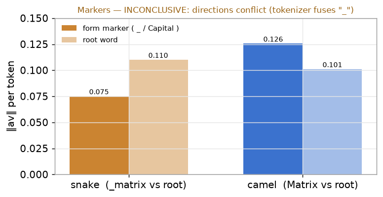

# step B 결과 — RQ2 관측 (A2 생성, 1차 실행)

**대응 RQ:** RQ2 — 준수 실패를 매개하는 신호가 코드의 **형태**인가, 어느 층에 있는가(관측). 인과는 step C.

**설정.** `Qwen/Qwen2.5-Coder-3B-Instruct` (fp16, 36층, GQA 16 Q / 2 KV / group 8, eager). 140 조건 = 7 spec × 20 seed. 기준 층 **L25**(= 36의 약 70%). 이름 생성 시점 query 한 행의 **구간별** 어텐션 합·‖av‖·‖v‖(GQA 방법 A). 구간 = 지침 / camel 이름 토큰 / snake 이름 토큰.

> **실행 전 예측:** View1 충돌 표기 토큰을 더 봄(camel지침→snake, snake지침→camel), ‖v‖ 평탄. View2 위반이 늘어도 지침 어텐션 평탄.

---

## 1. 측정값 전체 — 세 지표 × 세 구간 (View 1, 선행 6/6 @L25)

우리가 관측한 것은 결국 **(어텐션, ‖v‖, ‖av‖) × (지침 / camel / snake) × 지침 2종**이다. 전부:

| 지침 | 구간 | 어텐션(합) | ‖av‖(합) | ‖v‖(평균) |
|---|---|---|---|---|
| **camelCase** | camel 토큰 (준수) | 0.1263 | 1.185 | 9.398 |
| | snake 토큰 **(충돌)** | **0.1442** | **1.240** | 8.956 |
| | 지침 구간 | 0.1302 | 0.2085 | 9.133 |
| **snakeCase** | camel 토큰 **(충돌)** | **0.1454** | **1.277** | 9.086 |
| | snake 토큰 (준수) | 0.1210 | 1.110 | 9.256 |
| | 지침 구간 | 0.1316 | 0.2086 | 9.162 |

**읽는 법 — 세 지표가 서로 다른 이야기를 한다:**

- **어텐션·‖av‖: 충돌 쪽으로 뒤집힌다(▼).** camel 지침이면 snake 토큰이, snake 지침이면 camel 토큰이 더 높다. **더 보는 쪽이 지침 따라 뒤집히므로** 신호는 "snake라는 글자"(prior)가 아니라 **지침 위반 형태**다.
- **‖v‖: 평탄, 오히려 준수 쪽이 미세하게 크다**(camel 지침에서 camel_v 9.40 > snake_v 8.96). 즉 value **크기**는 충돌을 편들지 않는다. `‖av‖ = 어텐션 × ‖v‖`인데 av가 충돌로 기운 건 **순전히 어텐션 때문**이다(축 A). → 신호가 크기(축 B)가 아님을 직접 보여준다. 방향(코사인)은 step 1.
- **지침 구간: 두 조건에서 거의 동일**(어텐션 0.130 vs 0.132, ‖av‖ 0.2085 vs 0.2086). 실패가 "지침을 덜 봐서"가 아니다.

✓ **예측대로.** 충돌 표기 우세 + 지침 평탄 + ‖v‖ 평탄, 셋 다 맞음.

---

## 2. 어느 층인가 — **L25**에 대한 상세

충돌 우세(충돌−준수 어텐션)를 **전 36층**에서 재면, 대부분 0 근처(±0.005)인데 **L25 한 층에서만 +0.0212로 급등**한다. 바로 이웃과 비교하면:

| 층 | L23 | L24 | **L25** | L26 | L27 |
|---|---|---|---|---|---|
| 충돌 우세 | +0.0016 | +0.0003 | **+0.0212** | +0.0034 | −0.0029 |

L24 대비 **약 70배**, 그다음 큰 층(L3의 +0.0052)의 **4배**. 즉 신호가 전 층에 퍼진 게 아니라 **단일 층에 뭉쳐** 있다.

**왜 이게 중요한가.**

1. **위치의 의미.** L25는 전체 36층의 **약 70% 지점(후반부)**이다. 계획서 §2.5의 층별 성격 — 초기층=어휘·토큰, 중간층=구문 구조, **후반층=출력 결정에 가까운 표현** — 에 대면, L25는 **출력 결정 단계**에 해당한다. 해석: **표기 형태의 선택이 출력 직전 단계에서 굳는다.** (이 해석을 층별 표기 확률로 실증하는 것이 step 8 로짓 렌즈.)
2. **국소화 자체가 RQ2의 알맹이.** "신호가 어느 한 층에 국소화된다"가 성립해야 방법론(형태 인식 선택적 스티어링)이 **전 층이 아니라 특정 층만** 개입한다는 설계가 정당화된다(계획서 §4 설계결정 2). 전 층에 퍼져 있었다면 층 선택이 임의적으로 보였을 것이다.
3. **강건성.** L25에서 충돌>준수인 seed 비율 **29/40 = 72%** — 평균이 소수 seed의 우연이 아니라 다수에서 일관된 방향. 그리고 **예비(A2)에서 확인된 L25와 일치**한다.

**아직 못 하는 말 (한계).**

- **이 관측만으로 "L25가 인과"라고 못 한다.** L25가 표기 결정을 *유발*하는지는 → **step C**에서 L25의 선행 KV를 준수 값으로 치환해 준수 선호가 회복되는지로 확인.
- **왜 하필 25층인지**, Key 경로인지 Value 경로인지는 단일 층 관측으로 알 수 없다 → **step 1**(전 층 스윕 + K/V 분해 + v 코사인 궤적).
- **모델마다 같은 층일 필요는 없다.** step 2에서 다른 패밀리를 돌려 "위치는 달라도 국소화 자체는 공통"인지 확인한다. 그게 성립하면 방법론은 모델별 1회 스윕으로 층을 고른다.

---

## 3. View 2 — 위반이 쌓여도 지침을 덜 보나 (스윕, 지침=camel @L25)

선행 camel 개수를 6→0으로 줄이며(위반↑, stepA와 동일 격자) 관측.

| n_compliant | 지침 어텐션 | snake 어텐션(합) | snake 토큰당 | snake ‖av‖ | snake 토큰수 |
|---|---|---|---|---|---|
| 6 | 0.1302 | 0.1442 | 0.01202 | 1.240 | 12 |
| 4 | 0.1306 | 0.1764 | 0.01103 | 1.506 | 16 |
| 3 | 0.1308 | 0.1927 | 0.01070 | 1.642 | 18 |
| 2 | 0.1313 | 0.2131 | 0.01065 | 1.806 | 20 |
| 1 | 0.1317 | 0.2325 | 0.01057 | 1.966 | 22 |
| 0 | 0.1327 | 0.2598 | 0.01082 | 2.196 | 24 |

- **지침 어텐션 완전 평탄**(0.130→0.133). 위반이 최대여도 모델은 지침을 덜 보지 않는다 → **실패는 "지침 결핍"이 아니다.** 지침 구간을 균질 증폭하는 기존 기법(Spotlight)의 전제와 정면 충돌.
- **충돌 어텐션 *합*은 늘지만 토큰당은 평탄**(~0.011). 총 충돌 질량 증가는 순전히 **위반 토큰 개수** 때문이지 토큰당 더 봐서가 아니다. → stepA 절벽과 연결: 준수 예시가 사라지고 위반 토큰이 쌓일수록, 지침은 그대로인데 잔차에 실리는 충돌 질량만 커진다.

✓ **예측대로 + 뉘앙스** — 지침 평탄 확인, 충돌 증가는 개수 효과.

---

## 4. per-token — 밑줄이 신호인가 (판정 보류 @L25)

per-token 상세로 snake의 `_`, camel의 대문자 토큰이 어근보다 ‖av‖가 큰지 확인.

| 구간 | 마커 토큰 | 어텐션(a) | ‖av‖ | 어근 토큰 | 어텐션(a) | ‖av‖ |
|---|---|---|---|---|---|---|
| snake | `_matrix` 등 | 0.00827 | 0.075 | `format` 등 | 0.01333 | 0.110 |
| camel | `Matrix` 등 | 0.01165 | 0.126 | `format` 등 | 0.01215 | 0.101 |

**판정 불가 (한계).** Qwen 토크나이저가 `_`를 다음 단어에 붙여 쪼갠다: `format_matrix → [' format', '_matrix']`, **독립 `_` 토큰이 0개**. 그래서 "마커 vs 어근"이 사실상 **"둘째 단어 vs 첫째 단어"**가 된다. 결과도 상충 — snake는 어근(첫 단어) av가 크고(0.110 > 0.075), camel은 대문자(둘째 단어) av가 크다(0.126 > 0.101). 방향이 반대라 형태 마커 신호로 해석할 수 없다. **한계로 기록**하고, 밑줄 자체가 신호인지는 step 8(로짓 렌즈)로 이관.

---

## 5. 예측 대비

| 예측 | 결과 |
|---|---|
| 충돌 표기 토큰을 더 봄 (flip) | **맞음** (L25에서 뚜렷, 72% seed) |
| 지침 어텐션 평탄 | **맞음** (flip·스윕 양쪽) |
| ‖v‖ 평탄 | **맞음** — 대칭, 오히려 준수 v가 미세 우위(신호=순수 어텐션) |
| (암묵) 충돌 토큰을 토큰당 더 봄 | **아님** — per-token 평탄, 총량은 개수 효과 |
| (설계) 밑줄이 형태 신호 | **판정 불가** — 토큰화가 `_`를 독립 분리 안 함 |

---

## 6. RQ2 관측 답과 다음

**답.** 준수 실패의 경쟁 신호는 코드의 **지침 위반 표기 형태**다(내용·prior 아님). 지침을 뒤집으면 우세가 따라 뒤집히고, 지침 어텐션은 위반이 쌓여도 평탄하다. 이 신호는 **크기(‖v‖)가 아니라 어텐션 배분(축 A)**에서 드러나며, **L25에 국소화**된다.

**다음.**
- **step C (인과):** L25에서 선행 KV를 준수 값으로 치환(방법 B, KV group 단위)해 준수 선호가 회복되는지 = 관측이 인과인지.
- **step 1:** 전 층 스윕 + Key/Value 분해 + v 코사인 궤적 — L25가 왜 그 층인지, 회복이 어느 경로인지.
- **형태 마커:** 밑줄 판정은 토큰화 한계로 step 8 로짓 렌즈로 이관.

*(그래프 원본: `docs/stepB/figs/`. 대화형 요약 페이지도 있음.)*
