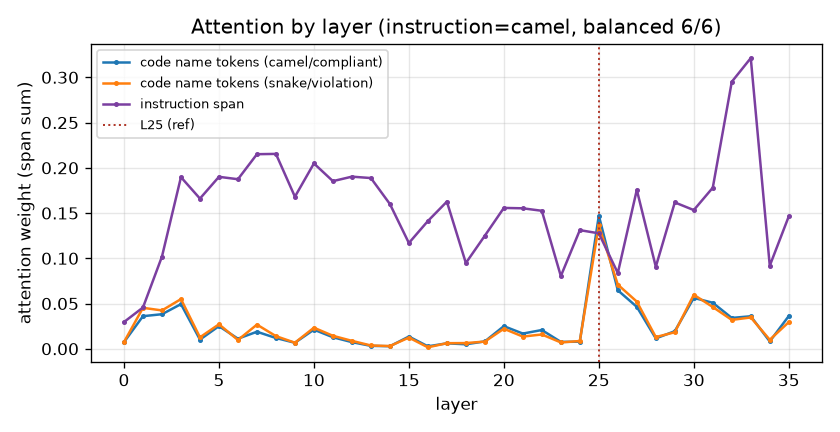
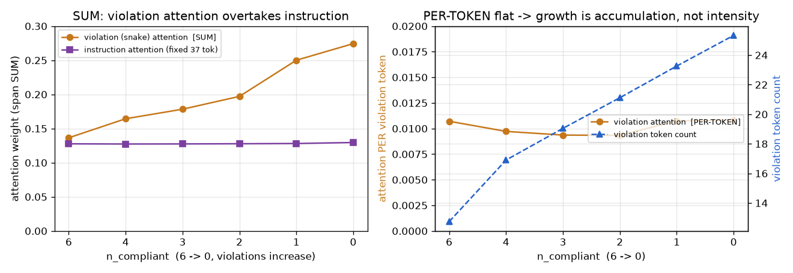
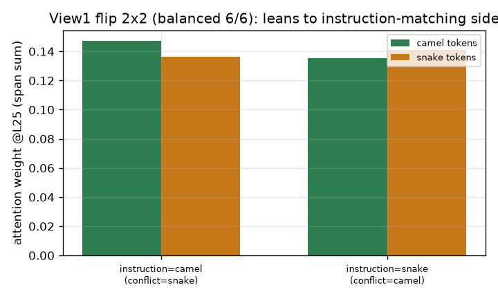

# step B 결과 — pool-500 (RQ2 관측, 500 이름 확대)

**대응 RQ:** RQ2 — 준수 실패를 매개하는 신호가 코드의 **형태**인가, 어느 층에 있는가(관측). 인과는 stepC.

**설정.** `Qwen/Qwen2.5-Coder-3B-Instruct` (fp16, 36층, GQA 16 Q / 2 KV / group 8, eager).
**294 조건 = 7 spec × 42 block × 1 seed.** 기준 층 **L25**(≈ 36의 0.69). 파일럿(80풀·seed표집)의 확대판 — 이름을 **50×50 풀의 블록**으로 서로 다른 500+개 커버. 파일럿 결과는 `results/stepB/` 불변 보존(§6).

> **왜 294개인가.** 7 spec = View1 flip `(camel,6)·(snake,6)` + View2 스윕 `(camel, 4/3/2/1/0)`. 각 spec을 42블록(=504÷12)에 걸쳐 돌려 서로 다른 이름 500+개를 덮는다. seed는 블록이 다양성을 주므로 1로 충분.

---

## 요약 (한눈에)

| # | 발견 | 상태 |
|---|---|---|
| ① | 코드 이름 토큰 어텐션이 **L25에서 급등**(국소화) | ✅ 강함 |
| ② | 지침 어텐션은 **조건(flip·위반수) 간 평탄** | ✅ 강함 |
| ③ | **토큰당** 코드 이름 토큰 > 지침 토큰 (≈3배) | ✅ |
| ④ | 경쟁 신호 증가는 **강도 아닌 "누적"** (정정) | ⚠️ 중요 |
| ⑤ | View1 flip은 예측(충돌 더 봄)과 **반대·약함** | ⚠️ §4 |
| ⑥ | ‖v‖는 평탄 (크기는 신호 아님) | → step1 코사인 |

**핵심 서술:** 실패는 *"지침을 덜 봐서"*가 아니다(②). 지침 어텐션은 고정된 채, **위반 형태 토큰이 L25에서(①) 누적되어(④) 지침을 물량으로 넘어선다.** 매개 신호는 형태이고 후반 단일 층에 국소한다.

---

## ① L25 국소화 — 코드 이름 토큰을 어디서 읽나

코드 이름 토큰 어텐션(파랑/주황)은 L0~L24에서 거의 바닥(~0.007)이다가 **L25에서 0.14로 급등**하고 이후 잦아든다. 모델이 코드 이름 토큰을 **바로 L25에서 집중해 읽는다**는 뜻. stepC가 개입 층으로 L25를 고른 근거가 **500개 이름에서도** 재현된다.

(지침 구간(보라)은 층별로 높고 변동이 크다 — 단 이는 지침 토큰이 37개로 많아 **합**이 큰 것. 아래 ②·③에서 조건 간 비교·토큰당 비교로 분리한다.)

---

## ② 지침 어텐션은 조건 간 평탄 — 실패는 지침 결핍이 아니다

기준 층 L25에서 지침 구간 어텐션은 조건이 바뀌어도 거의 고정:

| 조건 | 지침 어텐션 @L25 |
|---|---|
| 지침 flip: camel | 0.1276 |
| 지침 flip: snake | 0.1293 |
| 위반 스윕 n=6 → 0 | 0.1276 → 0.1295 (평탄) |

지침 텍스트·토큰수(37)는 조건과 무관하게 동일하므로 이 합은 정규화 없이 비교된다. → **모델은 지침을 "덜 보는" 게 아니다.** "지침 어텐션을 증폭하라" 류 해법의 전제와 충돌.

---

## ③ 토큰당으로 보면 코드 이름 토큰이 지침 토큰보다 세다

L25 per-token 어텐션: **코드 이름 ≈ 0.0107 vs 지침 0.128/37 ≈ 0.0034** → 코드 형태 토큰 하나가 지침 토큰 하나보다 **약 3배** 강한 신호.

---

## ④ 경쟁 신호는 "강도"가 아니라 "누적"으로 커진다 (정정 ⚠️)

지침 camel 고정, 위반(snake) 개수를 늘리면(n_compliant 6→0):

| n_compliant | 위반 어텐션 **합** | 위반 토큰수 | **토큰당** |
|---|---|---|---|
| 6 | 0.136 | 12.7 | 0.0107 |
| 4 | 0.164 | 16.9 | 0.0097 |
| 2 | 0.197 | 21.1 | 0.0093 |
| 0 | 0.274 | 25.3 | 0.0108 |

- **합**은 0.136→0.274로 2배 커지며 **고정된 지침(0.128)을 추월**(왼쪽 그림).
- 그러나 **토큰당**은 ~0.010으로 **평탄**(오른쪽 그림) — 커진 이유는 **위반 토큰 수가 늘어서**지, 각 토큰을 더 봐서가 아니다.

**정정의 의미.** 파일럿의 순진한 그림("위반이 늘면 각 위반을 더 뚫어지게 본다" = 강도 상승)은 성립하지 않는다. 실제 기제는 **위반 형태 토큰의 누적 물량**이 고정된 지침을 **넘어서는 것**. 지침을 무시하는 것도, 개별 위반이 세지는 것도 아니다.

**해법 방향에 직결.** ⓐ 지침 어텐션 키우기 → 이미 평탄(②), 소용없음. ⓑ 개별 위반 어텐션 누르기 → 이미 per-token 낮고 평탄, 핀트 안 맞음. → 어텐션(보는 양)이 아니라 **Value 경로(내용·방향)** 를 바꿔야 한다는 **step5 설계 근거**.

---

## ⑤ View1 flip 2×2 — 예측과 반대·약함 (§4 그대로 기록)

균형 6/6에서 파일럿 예측은 "**충돌 표기를 더 본다**"였으나, 실제는 **지침과 일치하는 쪽을 약하게 더 본다**:

| 지침 | camel 토큰 @L25 | snake 토큰 @L25 | 더 본 쪽 | 블록 일관성 |
|---|---|---|---|---|
| camel | **0.1472** | 0.1364 | camel(일치) | 28/42 (67%) |
| snake | 0.1353 | **0.1413** | snake(일치) | 26/42 (62%) |

"더 본 쪽"이 지침 따라 뒤집히긴 하나(어텐션이 지침에 민감함은 성립), 방향은 **충돌이 아니라 준수 쪽**이고 62~67%의 약한 다수다. → 강한 효과는 flip이 아니라 **누적 스윕(④)**. 예측과 다른 이 결과는 조건을 바꿔 맞추지 않고 그대로 남긴다(§4).

---

## ⑥ ‖v‖ 평탄 — 크기는 신호가 아니다

L25에서 camel/snake 토큰 ‖v‖는 8.8~9.0으로 거의 동일. 크기 지표로는 두 형태가 안 갈린다. → "무엇이 실리나"는 크기가 아니라 **방향** 문제. **step1의 v 코사인 궤적**이 이 방향을 잰다.

---

## 종합 — RQ2의 어떤 답인가, 어디로 이어지나

- **매개 신호는 형태이고 후반 단일 층(L25)에 국소**한다(①).
- **지침은 무시되지 않는다**(②, 평탄). 실패는 **위반 형태 토큰이 L25에서 누적되어 고정 지침을 물량으로 압도**하는 것(③④).
- 파일럿의 "충돌을 더 본다"는 균형점에선 성립하지 않으며(⑤), 더 정확한 기제는 **"위반 누적 vs 고정 지침"** 이다.
- 크기(‖v‖)는 신호가 아니므로(⑥) "무엇이 실리나"는 **방향·Value 경로**로 넘어간다.

→ **다음:** stepC(같은 L25에서 Value를 준수로 치환해 **인과** 확인), step1(전 층 스윕으로 **피크 층·경로**, v 코사인으로 **방향**). ④의 "어텐션 물량이 아니라 내용을 바꿔야 한다"가 step5(Value 경로 스티어링) 설계의 직접 근거.

---

## 정직하게 남긴 caveat (§4)

- **④ 합 vs 토큰당:** `attention_weight`는 구간 **합**이라 위반 토큰수에 비례해 커진다. 토큰당 정규화로 "누적 효과"임을 분리했다. 합만 보면 "위반 집착"으로 과장될 수 있어 명시.
- **⑤ flip 반대:** 균형점 어텐션은 충돌이 아니라 준수 쪽으로 약하게 기움. 예측과 다르나 그대로 기록.
- **② 층 vs 조건:** "평탄"은 **조건(flip·위반수) 간** 평탄이다. 층별로는 지침 어텐션이 크게 변동한다(①의 궤적) — 서로 다른 축이니 혼동 주의.
